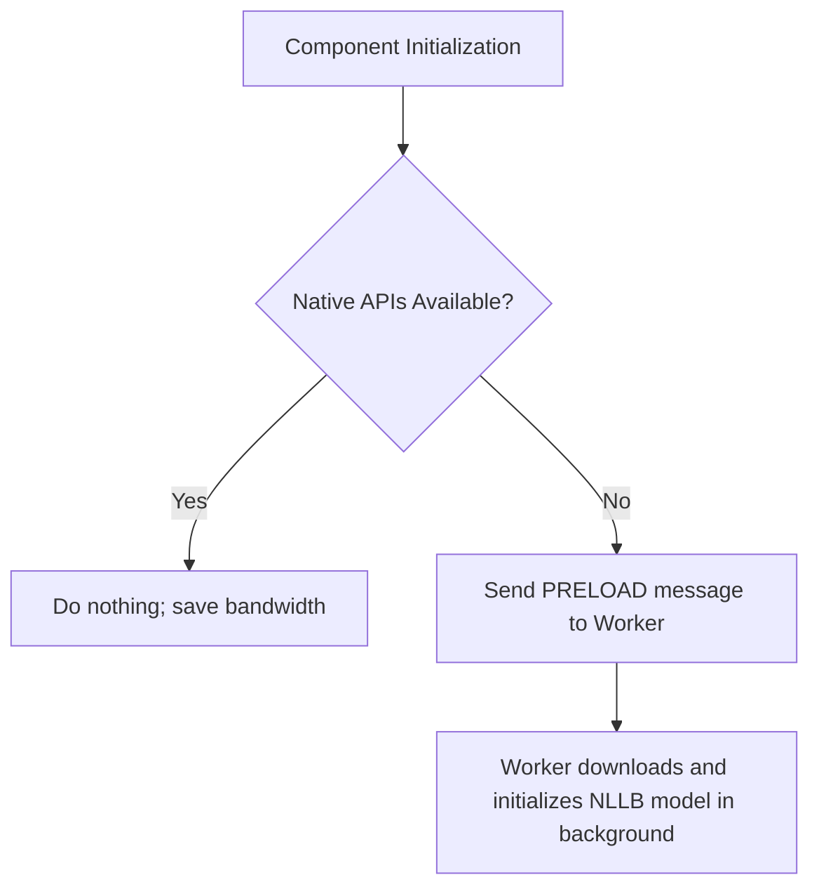

One of the hardest parts of building AI-powered web applications is finding ideas that work well in a client-side environment.

This post demonstrates how to implement a client-side translation system that leverages the built-in Chrome Translation API for better performance and falls back to a Web Worker running [transformers.js](https://huggingface.co/docs/transformers.js/en/index) when the native APIs are not supported.

## Overview

This solution integrates and runs a hybrid, client-side translation system.

Chrome 138 is the first Chrome version with public AI translation support through the built-in Translation API.

The translation system supports all listed target languages, but the processing path differs. Languages supported by Chrome use the built-in [Chrome Translation API](https://developer.chrome.com/docs/ai/translator-api). Languages available only in NLLB use the Web Worker fallback powered by transformers.js and the [Xenova/nllb-200-distilled-600M](https://huggingface.co/Xenova/nllb-200-distilled-600M) model.

The component uses the Chrome Translation API for languages it supports. Languages available only in NLLB are processed by the Web Worker. Users can also choose **Force fallback** to use the NLLB worker for any listed language.

The frontend is a custom element that targets external elements using a standard CSS selector and modifies their contents directly in the DOM.

## Architectural design

This solution divides the translation tasks between two execution environments to maintain a responsive user interface:

* **The Main Thread (Custom Element)**: Handles the user interface, DOM interactions, and native API verification. If the browser supports the native Translator and LanguageDetector APIs, the component performs translation directly on the main thread for optimal performance.
* **The Worker Thread (Web Worker)**: Handles the fallback translation path. Loading and running a 600-million-parameter neural network in JavaScript is computationally expensive. Running the model inside a Web Worker prevents CPU-intensive initialization and inference tasks from freezing the main user interface.

### Conditional preloading flow

To maximize efficiency and minimize bandwidth consumption, the system uses a conditional preloading strategy:



This ensures that users with native browser support do not download the multi-megabyte fallback model unless necessary, while users on unsupported browsers benefit from background initialization before they click the translate button.

## Implementation

The standalone project is structured as follows:

```text
project-root/
├── index.html
├── language-translator.js
└── js/
    └── translator-worker.js
```

There's one caveat. The fallback model provides languages that are not part of the native browser translation capabilities. For those languages, users with access to the native APIs will still need to rely on the fallback model for translation.

### The custom element (`language-translator.js`)

The `language-translator` custom element manages the translation process, handles the interaction with the worker and provides a user interface for selecting the target language and triggering translations.

The element has two responsibilities that are deliberately kept together. Its shadow root owns the controls, so the page that embeds the element does not need to provide markup or styles for the language selector, button, or fallback checkbox. The `content-selector` attribute is the boundary in the other direction: it tells the element which page element it may read and update, while leaving that content outside the shadow root.

The browser calls `connectedCallback()` when the element is added to the document. This is where the controls are rendered and the native API check runs. If the native APIs are unavailable, the element sends a `PRELOAD` message to the worker. Preloading is intentionally conditional because model initialization can download a large amount of data. The worker is still created in the constructor so it is ready to receive that message as soon as the element connects.

When the user starts a translation, the element stores the first version of the content in `data-original-text`. Later translations use that value instead of translating an already translated result. The element then chooses one of two paths:

* The native path detects the source language, creates a browser-managed translator, and appends chunks from `translateStreaming()` as they arrive.
* The fallback path sends the original text and language choices to the worker. The worker returns status messages and the final text through the `message` event handler.

This design also explains an important limitation of the example: the element updates one element selected by `content-selector`, and it replaces that element's `textContent`. It does not preserve child markup, translate multiple elements, or translate incrementally by paragraph. Those behaviors would require a different content model and a way to keep translated output separate from the original DOM structure.

```ts
class LanguageTranslator extends HTMLElement {
  constructor() {
    super();
    this.attachShadow({ mode: 'open' });

    try {
      this.worker = new Worker('./js/translator-worker.js', { type: 'module' });

      this.worker.onmessage = (event) => {
        const { status, translatedText, message } = event.data;
        const contentSelector = this.getAttribute('content-selector');
        const elementToTranslate = document.querySelector(contentSelector);
        if (!elementToTranslate) return;

        if (status === 'loading-model') {
          elementToTranslate.textContent = 'Loading fallback model (this may take a while)...';
        } else if (status === 'translating') {
          elementToTranslate.textContent = 'Translating with fallback model...';
        } else if (status === 'success') {
          elementToTranslate.textContent = translatedText;
          console.timeEnd('Fallback Translation Performance');
        } else if (status === 'error') {
          console.error('Worker translation failed:', message);
          elementToTranslate.textContent = '[Translation Error]';
          console.timeEnd('Fallback Translation Performance');
        }
      };
    } catch (error) {
      console.error('Failed to initialize the background translation worker:', error);
      this.worker = null;
    }
  }

  connectedCallback() {
    this.render();

    // Check if Chrome built-in APIs are available
    const isNativeApiAvailable = 'Translator' in self && 'LanguageDetector' in self;
    if (!isNativeApiAvailable && this.worker) {
      console.log('Native API not found. Preloading fallback model...');
      this.worker.postMessage({ type: 'PRELOAD' });
    }

    if (!this.worker) {
      console.warn('Fallback worker is not loaded. Ensure path correctness.');
    }
  }

  async translate() {
    const contentSelector = this.getAttribute('content-selector');
    if (!contentSelector) {
      console.error("The 'content-selector' attribute is missing on <language-translator>.");
      return;
    }

    const elementToTranslate = document.querySelector(contentSelector);
    if (!elementToTranslate || !elementToTranslate.textContent) return;

    // Cache the original text in the dataset to permit re-translations
    if (!elementToTranslate.dataset.originalText) {
      elementToTranslate.dataset.originalText = elementToTranslate.textContent;
    }
    const originalText = elementToTranslate.dataset.originalText;

    const selectElement = this.shadowRoot.querySelector('#language-select');
    const targetLanguage = selectElement.value;
    const forceFallback = this.shadowRoot.querySelector('#force-fallback').checked;

    const hasNativeApis = 'Translator' in self && 'LanguageDetector' in self;

    if (!forceFallback && hasNativeApis) {
      elementToTranslate.textContent = 'Detecting language...';
      try {
        const detector = await LanguageDetector.create();
        const detectionResults = await detector.detect(originalText);

        if (!detectionResults || detectionResults.length === 0 || !detectionResults[0].detectedLanguage) {
          throw new Error('Language detection failed.');
        }

        const sourceLanguage = detectionResults[0].detectedLanguage;
        elementToTranslate.textContent = 'Preparing native model...';

        const translator = await Translator.create({
          sourceLanguage,
          targetLanguage,
          monitor(m) {
            m.addEventListener('downloadprogress', (e) => {
              const percentage = (e.loaded / e.total) * 100;
              elementToTranslate.textContent = `Downloading: ${percentage.toFixed(0)}%`;
            });
          },
        });

        elementToTranslate.textContent = ''; // Clear prior to stream
        const stream = translator.translateStreaming(originalText);
        for await (const chunk of stream) {
          elementToTranslate.textContent += chunk;
        }

      } catch (error) {
        console.warn('Native translation failed. Redirecting to fallback worker:', error);

        // Re-detect language for worker context
        let sourceLanguage = null;
        try {
          const detector = await LanguageDetector.create();
          const detectionResults = await detector.detect(originalText);
          sourceLanguage = detectionResults[0].detectedLanguage;
        } catch (detectErr) {
          console.warn('Language detection failed during fallback route:', detectErr);
        }

        this.fallbackTranslateWithWorker(originalText, sourceLanguage, targetLanguage);
      }
    } else {
      console.log('Routing directly to the fallback translator.');
      this.fallbackTranslateWithWorker(originalText, null, targetLanguage);
    }
  }

  fallbackTranslateWithWorker(text, sourceLanguage, targetLanguage) {
    if (!this.worker) {
      console.error('Fallback worker is not available.');
      const elementToTranslate = document.querySelector(this.getAttribute('content-selector'));
      if (elementToTranslate) {
        elementToTranslate.textContent = '[Translation Error: Fallback worker unavailable]';
      }
      return;
    }

    const elementToTranslate = document.querySelector(this.getAttribute('content-selector'));
    if (elementToTranslate) {
      elementToTranslate.textContent = 'Initializing fallback...';
    }

    console.time('Fallback Translation Performance');
    this.worker.postMessage({
      type: 'TRANSLATE',
      text,
      sourceLanguage,
      targetLanguage
    });
  }

  render() {
    const languages = [
      { code: 'es', name: 'Spanish' },
      { code: 'fr', name: 'French' },
      { code: 'de', name: 'German' },
      { code: 'ja', name: 'Japanese' },
      { code: 'uk', name: 'Ukrainian', fallbackOnly: true },
      { code: 'hi', name: 'Hindi', fallbackOnly: true },
    ];

    const optionsHTML = languages.map(lang =>
      `<option value="${lang.code}">
        ${lang.name}${lang.fallbackOnly ? '*' : ''}
      </option>`
    ).join('');

    this.shadowRoot.innerHTML = `
      <style>
        :host { 
          display: inline-flex; 
          align-items: center; 
          gap: 12px; 
          font-family: system-ui, -apple-system, BlinkMacSystemFont, 'Segoe UI', Roboto, sans-serif;
          border: 1px solid #e0e0e0;
          padding: 8px 12px;
          border-radius: 8px;
          background-color: #fafafa;
        }
        select, button { 
          padding: 6px 12px; 
          border-radius: 6px; 
          border: 1px solid #ccc; 
          background-color: #fff;
          font-size: 14px;
        }
        button { 
          border: none; 
          background-color: #007bff; 
          color: white; 
          cursor: pointer; 
          font-weight: 500;
          transition: background-color 0.2s ease;
        }
        button:hover { 
          background-color: #0056b3; 
        }
        .fallback-option { 
          display: flex; 
          align-items: center; 
          gap: 6px; 
          font-size: 13px;
          color: #495057;
          cursor: pointer;
          user-select: none;
        }
        .fallback-option input {
          margin: 0;
          cursor: pointer;
        }
      </style>
      
      <select id="language-select" aria-label="Select Target Language">
        ${optionsHTML}
      </select>
      
      <button id="translate-btn">Translate</button>
      
      <label class="fallback-option">
        <input type="checkbox" id="force-fallback">
        <span>Force fallback</span>
      </label>
    `;

    this.shadowRoot.querySelector('#translate-btn').addEventListener('click', () => this.translate());
  }
}

customElements.define('language-translator', LanguageTranslator);
```

#### Custom element data flow

The custom element uses a small message protocol rather than calling worker functions directly. The element sends `PRELOAD` when it wants background initialization and `TRANSLATE` when it needs a result. The worker sends `loading-model`, `translating`, `success`, or `error` statuses in return. Keeping those statuses explicit lets the element update the page while a model is downloading or inference is running, and gives it a single place to handle worker failures.

There are two practical consequences. First, the selector is an external DOM dependency, so a missing or invalid selector can prevent the result from being displayed even when translation succeeds. Production code should validate the selector and report that configuration error near the control. Second, the example permits another click while a translation is in progress. A production component should disable the button or associate each response with a request ID so an older response cannot overwrite a newer translation.

### The web worker (`js/translator-worker.js`)

This background script handles the lifecycle of the transformers.js pipeline.

It maps web-standard language codes (such as es) to the specific language-script tags required by the NLLB model (such as spa_Latn), defaults to English if the detector cannot determine the source language, and reports model-loading and translation status back to the main thread.

The worker is a separate JavaScript execution context. It cannot access the page DOM, the custom element's shadow root, or the element's attributes, so the main thread must send every value the worker needs. That restriction is useful here: model loading and inference can consume substantial CPU time without blocking DOM updates and input handling on the main thread. The cost is that communication is message-based, and the worker must send progress and errors back explicitly.

`loadModel()` caches the promise returned by `pipeline()` rather than only caching the resolved pipeline. This matters because model loading is asynchronous. A PRELOAD message and a later TRANSLATE message can call loadModel() while initialization is still running. Both calls receive the same promise, so the worker does not start two downloads or create two model instances. However, because the PRELOAD handler does not await or catch that promise, preload failures are not surfaced until a translation is requested.

After the promise resolves, subsequent translations reuse the initialized pipeline.

The language map is an adapter between two naming systems. The control uses short language identifiers such as `es`, while NLLB expects language-and-script identifiers such as `spa_Latn`. When detection fails, the worker does not know the source language and assumes English. This is a quality-risk fallback, not a successful source-language resolution. The target language must be mapped because silently choosing a target language could produce an unexpected result. The map must therefore stay synchronized with the languages exposed by the custom element.

```ts
import { pipeline } from 'https://cdn.jsdelivr.net/npm/@huggingface/transformers@3.7.5/dist/transformers.min.js';

let translatorPromise;

// Initializes the translation pipeline and stores the promise.
// Subsequent calls resolve instantly to the cached pipeline instance.
function loadModel() {
  if (!translatorPromise) {
    console.log('Fallback model is loading in the background...');
    translatorPromise = pipeline('translation', 'Xenova/nllb-200-distilled-600M');
    translatorPromise.then(() => console.log('Fallback model loading complete.'));
  }
  return translatorPromise;
}

// Map standard BCP 47 language codes to NLLB-200 target language-script codes
const langCodeMap = {
  en: 'eng_Latn',
  es: 'spa_Latn',
  fr: 'fra_Latn',
  de: 'deu_Latn',
  ja: 'jpn_Jpan',
  uk: 'ukr_Cyrl',
  hi: 'hin_Deva',
};

self.onmessage = async (event) => {
  const { type, text, sourceLanguage, targetLanguage } = event.data;

  switch (type) {
    case 'PRELOAD':
      loadModel();
      break;

    case 'TRANSLATE':
      try {
        self.postMessage({ status: 'loading-model' });
        const translator = await loadModel();

        self.postMessage({ status: 'translating' });

        // Resolve source and target language codes
        const modelSourceLang = langCodeMap[sourceLanguage] || 'eng_Latn';
        const modelTargetLang = langCodeMap[targetLanguage];

        if (!modelTargetLang) {
          throw new Error(`The target language "${targetLanguage}" is not mapped in the fallback configuration.`);
        }

        const [result] = await translator(text, {
          src_lang: modelSourceLang,
          tgt_lang: modelTargetLang,
        });

        self.postMessage({
          status: 'success',
          translatedText: result.translation_text,
        });
      } catch (error) {
        self.postMessage({
          status: 'error',
          message: error.message,
        });
      }
      break;
  }
};
```

#### Worker failure and resource behavior

The worker reports errors as data instead of throwing them on the main thread. The custom element can then replace the target content with an error state and log the original message for debugging. This keeps a model failure from becoming an uncaught exception in the page, but it does not make the failure invisible: callers should decide whether to preserve the original text, offer a retry, or show a more useful explanation than the placeholder used in this example.

The fallback also has a different resource profile from the native path. The model may require a large initial download, browser storage, memory for model weights, and CPU time during inference. Conditional preloading avoids that cost for browsers with native support, but unsupported browsers may still pay it before the user requests a translation. A production implementation should make that tradeoff visible, handle cancellation or navigation, and consider whether a server-side or smaller-model fallback better fits the application's privacy, performance, and bandwidth requirements.

### The integration (index.html)

The integration example is a partial web page that shows the content to translate, a control panel showing the custom element (along with a note about fallback-only languages) and the script tag to load the web component.

```html
<div class="content-box">
  <p id="target-content">Artificial intelligence is transforming how web developers design client-side architectures. By using local, on-device models, applications can run processing operations without sending private user information over the network. This paragraph represents content residing outside the translator control interface.</p>
</div>

<div class="control-panel">
  <!-- Points to the paragraph above using its CSS selector -->
  <language-translator content-selector="#target-content"></language-translator>
  <div class="note">* Asterisks indicate languages that are fallback-only in Chrome setups.</div>
</div>

<!-- Load the Web Component -->
<script type="module" src="./language-translator.js"></script>
```
