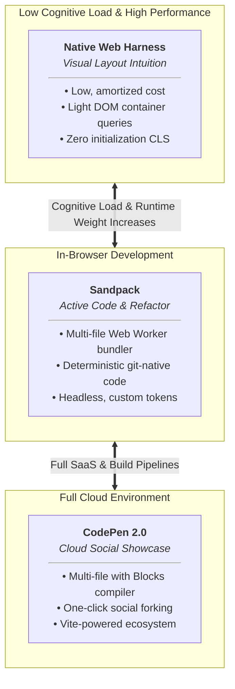

This guide outlines how to build high-performance, lightweight interactive layout playgrounds in technical articles (similar to Ahmad Shadeed and Josh Comeau’s blogs) using standard browser primitives: light DOM custom elements, native CSS container queries, and the browser's native CSS resize engine.

While this pattern can be authored directly in static HTML, 11ty, Next.js, or Astro, the core harness has zero dependencies on any framework or client-side runtime library.

## Pedagogical paradigms: Harness vs. Sandpack vs. CodePen 2.0

Technical writing and documentation typically demand one of three interaction models depending on the learning objective:

| Dimension | Custom Element Harness<br>(`<example-harness>`) | In-Browser Bundler (Sandpack) | Cloud SaaS Platform (CodePen 2.0) |
| --- | --- | --- | --- |
| **Pedagogical Objective** | **Visual Intuition & Constraint Manipulation**: Readers manipulate sliders, toggles, and layout options to test spatial boundaries and mental models without getting bogged down in syntax. | **Active Coding & Architecture**: Readers write, refactor, and compile real multi-file code, import npm modules, and master component logic offline or in situ. | **"Fork & Hack" Cloud Sandbox**: Readers experiment with multi-file web projects, chain processor Blocks (Tailwind, PostCSS, Sass, Vue), and fork code directly into the CodePen social ecosystem. |
| **Cognitive Load** | **Low**: Keeps the reader immersed in the article prose. No syntax debugging, compilation errors, or editor interface noise. | **High**: Demands typing, parsing compilation/syntax errors, and navigating a multi-file editor pane. | **High**: Full IDE experience; exposes file trees, Block processor pipelines, and external SaaS navigation. |
| **Runtime Environment** | **Host Document Light DOM**: Executes directly within the main page DOM. Inherits host styling, typography, and container contexts. | **In-Browser Bundler `<iframe>`**: Isolated runtime powered by local Web Workers and an in-memory compiler executing inside the browser. | **Third-Party Hosted `<iframe>`**: Sandboxed document hosted on CodePen's infrastructure, compiled through its Vite-backed Blocks engine. |
| **Performance Cost** | **Low, amortized cost:** The browser loads the shared harness script and styles once, regardless of the number of demo instances. Each server-rendered demo also reserves its initial dimensions before the custom element is registered, reducing layout shift. Per-demo DOM, observation, layout, and paint costs still depend on the complexity of the example. | **Heavy (~300 KB – 800 KB+)**: Pulls in an editor (CodeMirror), AST parser, packager runtime, and npm dependencies. | **Heavy (~500 KB – 1.5 MB+)**: Downloads third-party iframe chrome, asset pipelines, and remote script bundles per embed. |
| **Asset Ownership & Archival** | **100% Git-Native**: Markup and styles live directly in your article repository. Zero third-party dependency. | **100% Git-Native**: Code files live in your repository as code strings or co-located source files. | **Third-Party Cloud Dependent**: Demos reside on CodePen's servers. Subject to link rot, account shifts, or corporate ad-blockers. |
| **SSR / Layout Shift** | **Zero Initialization CLS**: Server-rendered Light DOM and baseline CSS establish each demo's dimensions during initial layout, so registering the custom element does not shift surrounding content. CSS resize handles work even if JavaScript fails. | **Hydration Required**: Mounts a placeholder skeleton until the client-side bundler initializes. | **Asynchronous Iframe Loading**: Mounts an empty placeholder or loading spinner until the external iframe resolves. |
| **Modern CSS / Container Queries** | **Native Direct Support**: Unhindered support for emerging specs (`flex-wrap: balance`, currently available only in Chromium browsers; `@container`; and subgrid) relative to host containers. | **Requires Internal Anchors**: Container queries must be established inside the sandbox document; isolated from host container queries. | **Requires Internal Anchors**: Container queries must be established inside the sandbox document; isolated from host container queries. |
| **File Tree & Pipeline** | Single component/layout under test. | Multi-file virtual project (package.json, local modules). | Multi-file project tree; configured via composable Blocks (Sass, TS, Lightning CSS, Markdown, etc.). |

### Decision rules: Choosing the right interactive tool

* **Choose the Custom Element Harness** when:
  * Teaching responsive layouts, container queries, wrapping boundaries, or CSS property mechanics.
  * You need multiple demos (3–10+) across a single article without causing client performance degradation or battery drain.
  * You want readers to stay focused on the narrative flow rather than typing code.
  * You want zero Cumulative Layout Shift (CLS) and progressive enhancement without hydration lag.
* **Choose Sandpack** when:
  * Teaching JavaScript/TypeScript APIs, framework component lifecycles (React, Svelte, Vue), or complex state management.
  * You require git-versioned, deterministic sandboxes. To run without third-party network requests or SaaS dependencies, pin package versions, self-host the Sandpack bundler and runtime assets, and prebundle dependencies or serve them from a controlled cache.
  * You need embedded, headless coding challenges that integrate directly with your site's custom theme tokens.
* **Choose CodePen 2.0** when:
  * Showcasing creative web experiments or full multi-file projects intended for community exposure and social sharing.
  * Taking advantage of CodePen's Blocks compiler (e.g., auto-processing SCSS, PostCSS plugins, TypeScript, or inline block processing) without configuring local build steps.
  * Providing readers with an immediate "Fork on CodePen" workflow to continue hacking on their personal accounts.

## Style encapsulation decision: Light DOM vs. Shadow DOM

Using Light DOM simplifies workflows involving CSS `@container` queries, cascading theme variables, and server-rendered content that minimizes layout shift. However, it introduces the risk of style bleed in two directions:

* **Outward Bleed**: Demo utility classes or element rules altering the article's typography, margins, or headers.
* **Inward Bleed**: Article-level typography resets (e.g., article ul, p a) trampling the layout elements under test.

| Dimension | Shadow DOM Encapsulation | Light DOM + Modern CSS Boundaries |
| --- | --- | --- |
| **Isolation Level** | Hard Wall | Declarative Boundaries |
| Container Queries (@container) | Shadow descendants can query eligible flat-tree ancestors, but external CSS cannot directly target shadow-internal elements without an exposed styling API. | Native: Child layouts query outer harness containers (example-viewport) transparently. |
| **CSS Variable Inheritance** | Cascades inward, but exporting internal token changes outward is constrained. | Seamless bidirectional variable inheritance and cascade across the document tree. |
| **Global Theme / Dark Mode** | Inherited properties and CSS custom properties cross the shadow boundary through the host. Direct page-level styling of shadow-internal elements requires an exposed styling API such as `::part()`. | Automatically inherits site themes, dark-mode tokens, and typographic stacks. |
| **SSR & Cumulative Layout Shift** | Requires Declarative Shadow DOM (`<template shadowrootmode>`). | Standard static HTML delivery with zero hydration lag. |

### Decision rule: Encapsulation strategy

* **Use Light DOM with Scoping Boundaries** for interactive CSS layout demos where container queries, custom properties, and page typography must interoperate naturally.
* **Use Shadow DOM** for self-contained UI components that require DOM and style encapsulation from the host page.

## Style containment patterns for Light DOM

Prefixing classes (like BEM or component prefixes) solves outward bleed, but it leaves you vulnerable to inward bleed from global site styles unless an explicit containment strategy is used.

### Strategy A: Native CSS scoping (@scope)

Modern CSS allows declaring strict styling perimeters. Rules inside @scope will never bleed outside the target component, and nested boundaries prevent inner subcomponents from being altered. `@scope` constrains selectors defined inside the rule, but it does not prevent unscoped host-page selectors or inherited values from affecting elements within the scope.

```css
@scope (nav-demo) to (.nested-demo) {
  :scope {
    display: block;
    width: 100%;
  }

  /* Scoped selectors will not bleed outward to the parent page */
  .demo-nav-list {
    display: flex;
    list-style: none;
    padding: 0;
    margin: 0;
    gap: 0.5rem;
  }

  .item {
    padding: 0.5rem 0.75rem;
  }
}
```

### Strategy B: Cascade layers (@layer) caveat

Cascade layers provide clean specificity ordering, provided all site typography and resets are also wrapped in layers.

<custom-admonition type="info" title="Important Rule of Cascade Layers">
  <p>For normal declarations, unlayered styles always beat layered styles. If you put your demo styles inside @layer demo-overrides but your site's global typography (article ul) is unlayered, the unlayered site styles will win, completely nullifying the layer.</p>
</custom-admonition>

```css
/* Must wrap both site styles AND demos for this to function */
@layer site-base, site-content, demo-overrides;

@layer site-content {
  article ul {
    margin-block: 1.5rem;
    padding-left: 1.5rem;
  }
}

@layer demo-overrides {
  nav-demo ul {
    margin: 0;
    padding: 0;
    list-style: none;
  }
}
```

If your host site does not wrap its global styles in @layer, avoid relying on @layer for your demos; use Strategy A (@scope) or Strategy C (Tag Qualification + Reset).

### Strategy C: Custom element tag qualification + focused reset

If you write plain CSS without a build step or unlayered global styles, namespace all internal selectors with the custom element's mandatory hyphenated tag and apply an explicit inward reset:

```css
/* 1. Establish host component block */
nav-demo {
  display: block;
}

/* 2. Inward Reset: Neutralize article-level tags (ul, ol, a, button) */
nav-demo ul,
nav-demo ol {
  margin: 0;
  padding: 0;
  list-style: none;
}

nav-demo a {
  text-decoration: none;
  color: inherit;
}

/* 3. Outward protection: Qualified class names */
nav-demo .nav-demo__list {
  display: flex;
  gap: 0.75rem;
}
```

## Single element vs. multiple elements strategy

A common question when structuring interactive technical articles is whether each layout alternative requires its own dedicated custom element (`<demo-sol-one>`, `<demo-sol-two>`).

**Best Practice: Define one custom element per topic/component family.**

Creating a separate custom element for every layout iteration leads to script bloat and redundant lifecycle registrations. Instead, handle alternatives through one of two patterns:

### Pattern 1: Same markup, different CSS layout rules (attribute-driven)

If the HTML elements under test remain uniform (e.g., the same list of cards or navigation links) and only the CSS layout model changes, use a single custom element and key styles off the data-solution attribute propagated by the harness.

```html
<!-- One custom element handling multiple layout solutions -->
<nav-demo data-solution="container-queries">
  <ul class="nav-list">
    <li><a href="#">Overview</a></li>
    <li><a href="#">Features</a></li>
    <li><a href="#">Pricing</a></li>
  </ul>
</nav-demo>
```

```css
@scope (nav-demo) {
  .nav-list {
    display: flex;
    justify-content: center;
    gap: 0.5rem;
  }

  /* Solution 1: Default wrapping */
  :scope[data-solution="baseline"] .nav-list {
    flex-wrap: wrap;
  }

  /* Solution 2: Container query constraint */
  :scope[data-solution="container-queries"] .nav-list {
    flex-wrap: wrap;
    @container example-viewport (width < 500px) {
      max-width: 340px;
    }
  }

  /* Solution 3: Native flex-wrap balance */
  :scope[data-solution="balance"] .nav-list {
    flex-wrap: wrap;
    flex-wrap: balance;
  }
}
```

### Pattern 2: Different DOM structures (view / panel switcher)

When different solutions require fundamentally different DOM trees, author both DOM structures inside a single custom element and toggle visibility via attributes:

```html
<nav-demo data-solution="grouped">
  <!-- View A: Flat Structure -->
  <div data-variant="flat" class="view-panel">
    <ul class="flat-list">
      <li>Overview</li>
      <li>Features</li>
    </ul>
  </div>

  <!-- View B: Grouped Structure -->
  <div data-variant="grouped" class="view-panel" hidden>
    <div class="group-primary"><span>Overview</span></div>
    <div class="group-secondary"><span>Features</span></div>
  </div>
</nav-demo>
```

```ts
export class NavDemoElement extends HTMLElement {
  static get observedAttributes(): string[] {
    return ['data-solution'];
  }

  attributeChangedCallback(name: string, oldValue: string | null, newValue: string | null): void {
    if (name === 'data-solution' && oldValue !== newValue && newValue) {
      this.switchPanel(newValue);
    }
  }

  private switchPanel(activeSolution: string): void {
    const panels = this.querySelectorAll<HTMLElement>('[data-variant]');
    panels.forEach((panel) => {
      panel.hidden = panel.getAttribute('data-variant') !== activeSolution;
    });
  }
}
```

## Child element architecture contract

To ensure that any custom element can be slotted cleanly into the demo harness without collisions or race conditions, child elements should adhere to the following contract.

### The 5 rules of child elements

* **Light DOM by Default**: Avoid `attachShadow()`. Using the Light DOM allows `@container` queries, CSS custom properties, and parent styling to cascade without barrier piercing. Contain styles via `@scope` or Tag Qualification + Reset.
* **Fluid Layout Bounds**: Root elements must default to `display: block; width: 100%; box-sizing: border-box;`. Never declare rigid pixel widths on the custom element host.
* **Container-Relative Sizing**: Layout styles must evaluate `@container` boundaries (e.g., using `cqw`, `cqh` units or `@container (min-width: ...)`) rather than viewport media queries (`@media`), so they adapt to the harness's viewport container.
* **Idempotent Lifecycle Methods**: Bind listeners inside `connectedCallback()` and detach them cleanly in `disconnectedCallback()`. Wrap element definitions with `if (!customElements.get('element-name'))`.
* **State Communication via Attributes**: Read harness settings (such as active solution or layout state) via observed attributes (`data-solution`, `data-count`) and propagate internal state to CSS variables.

## The web standard core implementation

Here is the complete, framework-free implementation using vanilla TypeScript and CSS.

The examples use Vite's `vanilla-ts` template for authoring and compilation. Vite compiles `example-harness.ts` to browser-ready JavaScript; the harness itself has no framework or runtime-library dependency.

### example-harness.ts

```ts
export class ExampleHarness extends HTMLElement {
  private widthSlider: HTMLInputElement | null = null;
  private heightSlider: HTMLInputElement | null = null;
  private viewport: HTMLElement | null = null;
  private widthLabel: HTMLOutputElement | null = null;
  private heightLabel: HTMLOutputElement | null = null;
  private solutionSelect: HTMLSelectElement | null = null;
  private resetBtn: HTMLButtonElement | null = null;
  private observer: ResizeObserver | null = null;

  private initialWidth: string = '780';
  private initialHeight: string = '360';
  private resizeMode: string = 'horizontal';

  connectedCallback(): void {
    this.resizeMode = this.getAttribute('data-resize-mode') ?? 'horizontal';
    this.initialWidth = this.getAttribute('data-initial-width') ?? '780';
    this.initialHeight = this.getAttribute('data-initial-height') ?? '360';

    this.widthSlider = this.querySelector<HTMLInputElement>('[data-slider-width]');
    this.heightSlider = this.querySelector<HTMLInputElement>('[data-slider-height]');
    this.viewport = this.querySelector<HTMLElement>('[data-viewport]');
    this.widthLabel = this.querySelector<HTMLOutputElement>('[data-width-label]');
    this.heightLabel = this.querySelector<HTMLOutputElement>('[data-height-label]');
    this.solutionSelect = this.querySelector<HTMLSelectElement>('[data-solution-select]');
    this.resetBtn = this.querySelector<HTMLButtonElement>('[data-reset-btn]');

    this.setupObservers();
    this.bindListeners();

    const initialSolution = this.getAttribute('data-solution');
    if (initialSolution) {
      this.applySolution(initialSolution);
    }
  }

  disconnectedCallback(): void {
    this.observer?.disconnect();
    this.widthSlider?.removeEventListener('input', this.handleWidthSlider);
    this.heightSlider?.removeEventListener('input', this.handleHeightSlider);
    this.solutionSelect?.removeEventListener('change', this.handleSolutionChange);
    this.resetBtn?.removeEventListener('click', this.handleReset);
  }

  private setupObservers(): void {
    if (!this.viewport) return;

    // Two-way sync: Observe native drag resize changes
    this.observer = new ResizeObserver((entries: ResizeObserverEntry[]) => {
      for (const entry of entries) {
        const width = Math.round(
          entry.borderBoxSize?.[0]?.inlineSize ?? entry.contentRect.width
        );
        const height = Math.round(
          entry.borderBoxSize?.[0]?.blockSize ?? entry.contentRect.height
        );

        if (this.widthSlider && this.widthSlider.value !== String(width)) {
          this.widthSlider.value = String(width);
        }
        if (this.widthLabel) {
          this.widthLabel.textContent = `${width}px`;
        }

        if (this.heightSlider && this.heightSlider.value !== String(height)) {
          this.heightSlider.value = String(height);
        }
        if (this.heightLabel) {
          this.heightLabel.textContent = `${height}px`;
        }
      }
    });

    this.observer.observe(this.viewport);
  }

  private bindListeners(): void {
    this.widthSlider?.addEventListener('input', this.handleWidthSlider);
    this.heightSlider?.addEventListener('input', this.handleHeightSlider);
    this.solutionSelect?.addEventListener('change', this.handleSolutionChange);
    this.resetBtn?.addEventListener('click', this.handleReset);
  }

  private handleWidthSlider = (e: Event): void => {
    const val = (e.target as HTMLInputElement).value;
    this.applyDimension('width', `${val}px`, this.widthLabel);
  };

  private handleHeightSlider = (e: Event): void => {
    const val = (e.target as HTMLInputElement).value;
    this.applyDimension('height', `${val}px`, this.heightLabel);
  };

  private handleReset = (): void => {
    if (this.resizeMode === 'horizontal' || this.resizeMode === 'both') {
      this.applyDimension('width', `${this.initialWidth}px`, this.widthLabel);
      if (this.widthSlider) this.widthSlider.value = this.initialWidth;
    }
    if (this.resizeMode === 'vertical' || this.resizeMode === 'both') {
      this.applyDimension('height', `${this.initialHeight}px`, this.heightLabel);
      if (this.heightSlider) this.heightSlider.value = this.initialHeight;
    }
  };

  private applyDimension(prop: 'width' | 'height', val: string, label: HTMLOutputElement | null): void {
    if (this.viewport) {
      this.viewport.style[prop] = val;
    }
    if (label) {
      label.textContent = val;
    }
  }

  private handleSolutionChange = (e: Event): void => {
    const solution = (e.target as HTMLSelectElement).value;
    this.setAttribute('data-solution', solution);
    this.applySolution(solution);
  };

  private applySolution(solution: string): void {
    // Notify the nested demo element of the active solution
    const childCustomElement = this.viewport?.querySelector('.harness-content > :first-child');
    if (childCustomElement) {
      childCustomElement.setAttribute('data-solution', solution);
    }
  }
}

if (!customElements.get('example-harness')) {
  customElements.define('example-harness', ExampleHarness);
}
```

### example-harness.css

```css
example-harness {
  display: block;
  margin-block: 2.5rem;
  border: 1px solid var(--harness-border, #cbd5e1);
  border-radius: 8px;
  background: var(--harness-bg, #f8fafc);
  box-shadow: 0 1px 3px 0 rgba(0, 0, 0, 0.05);
  overflow: hidden;
}

.harness-bar {
  display: flex;
  flex-wrap: wrap;
  align-items: center;
  justify-content: space-between;
  gap: 0.75rem;
  padding: 0.75rem 1rem;
  background: var(--harness-bar-bg, #ffffff);
  border-bottom: 1px solid var(--harness-border, #cbd5e1);
  font-family: system-ui, -apple-system, sans-serif;
  font-size: 0.875rem;
}

.harness-meta {
  display: flex;
  align-items: center;
  gap: 1rem;
}

.harness-title {
  font-weight: 600;
  color: var(--harness-text-title, #0f172a);
}

.harness-readouts {
  display: flex;
  gap: 0.75rem;
}

.harness-readout {
  color: var(--harness-text-muted, #64748b);
  font-variant-numeric: tabular-nums;
}

.harness-controls {
  display: flex;
  flex-wrap: wrap;
  align-items: center;
  gap: 0.75rem;
}

.control-group {
  display: flex;
  align-items: center;
  gap: 0.35rem;
}

.control-prefix {
  font-size: 0.75rem;
  font-weight: 600;
  color: var(--harness-text-muted, #64748b);
}

/* Viewport & Container Query Contexts */
.harness-viewport {
  overflow: auto;
  margin: 1.5rem auto;
  max-width: 100%;
  background: var(--harness-canvas-bg, #ffffff);
  border: 1px dashed var(--harness-boundary, #94a3b8);
  border-radius: 4px;
  box-sizing: border-box;
  container-name: example-viewport;
}

.harness-viewport.resize-horizontal {
  resize: horizontal;
  container-type: inline-size;
}

.harness-viewport.resize-vertical {
  resize: vertical;
  container-type: size;
}

.harness-viewport.resize-both {
  resize: both;
  container-type: size;
}

.harness-viewport.resize-none {
  resize: none;
  container-type: inline-size;
}

.harness-content {
  width: 100%;
  box-sizing: border-box;
}

.harness-btn {
  appearance: none;
  background: transparent;
  border: 1px solid var(--harness-border, #cbd5e1);
  padding: 0.25rem 0.6rem;
  border-radius: 4px;
  font-size: 0.75rem;
  cursor: pointer;
}

.harness-btn:hover {
  background: var(--harness-hover-bg, #e2e8f0);
}
```

## Reference implementation: A complete child component (`card-grid-demo`)

To illustrate how child components connect to `<example-harness>`, here is a complete, self-contained demonstration component: `<card-grid-demo>`.

It showcases:

* **Light DOM containment** using CSS `@scope` and focused inward resets.
* **Container queries** checking `@container example-viewport (width > ...)`.
* **Dynamic switching** across three layout strategies driven by the `data-solution` attribute:
  * **`baseline` (Unconstrained Wrap)**: Basic flex wrapping without boundary awareness.
  * **`cq` (Container-Query Adaptive Layout)**: Cards stack vertically when narrow and transform into multi-column rows with internal layout shifts when the viewport widens.
  * **`autofit` (CSS Grid Autofit)**: Modern `repeat(auto-fit, minmax(180px, 1fr))` grid distribution.

### card-grid-demo.ts

```ts
export class CardGridDemo extends HTMLElement {
  static get observedAttributes(): string[] {
    return ['data-solution'];
  }

  attributeChangedCallback(name: string, oldValue: string | null, newValue: string | null): void {
    if (name === 'data-solution' && oldValue !== newValue && newValue) {
      // Attribute is read directly by CSS selectors (:scope[data-solution="..."])
      // We can also dispatch custom events or update internal ARIA states here if needed.
    }
  }

  connectedCallback(): void {
    if (!this.hasAttribute('data-solution')) {
      this.setAttribute('data-solution', 'baseline');
    }
  }
}

if (!customElements.get('card-grid-demo')) {
  customElements.define('card-grid-demo', CardGridDemo);
}
```

### card-grid-demo.css

```css
@scope (card-grid-demo) {
  :scope {
    display: block;
    width: 100%;
    box-sizing: border-box;
    padding: 1rem;
    font-family: system-ui, -apple-system, sans-serif;
  }

  /* 1. Inward Reset: Shield against global article typography */
  h3, p, div, article {
    margin: 0;
    padding: 0;
    box-sizing: border-box;
  }

  .grid-container {
    display: flex;
    flex-wrap: wrap;
    gap: 1rem;
  }

  .card-item {
    background: var(--card-bg, #ffffff);
    border: 1px solid var(--card-border, #e2e8f0);
    border-radius: 8px;
    padding: 1rem;
    display: flex;
    gap: 0.75rem;
    align-items: center;
    box-shadow: 0 1px 2px rgba(0, 0, 0, 0.05);
    flex: 1 1 240px;
  }

  .card-badge {
    display: grid;
    place-items: center;
    width: 42px;
    height: 42px;
    border-radius: 6px;
    background: var(--card-badge-bg, #f1f5f9);
    font-size: 1.25rem;
    flex-shrink: 0;
  }

  .card-title {
    font-size: 0.95rem;
    font-weight: 600;
    color: var(--card-text, #0f172a);
    margin-bottom: 0.25rem;
  }

  .card-meta {
    font-size: 0.8rem;
    color: var(--card-meta, #64748b);
  }

  /* Solution 1: Baseline (Plain Flex Wrap) */
  :scope[data-solution="baseline"] .grid-container {
    display: flex;
    flex-wrap: wrap;
  }

  /* Solution 2: Container-Query Adaptive Layout */
  :scope[data-solution="cq"] .grid-container {
    display: flex;
    flex-direction: column;

    /* When the harness container exceeds 520px, pivot to a 2-column flex row */
    @container example-viewport (width >= 520px) {
      flex-direction: row;
      flex-wrap: wrap;

      .card-item {
        flex: 1 1 calc(50% - 0.5rem);
      }
    }

    /* When the harness container exceeds 720px, pivot to 3 columns with stacked card content */
    @container example-viewport (width >= 720px) {
      .card-item {
        flex: 1 1 calc(33.333% - 0.67rem);
        flex-direction: column;
        align-items: flex-start;
        padding: 1.25rem;
      }

      .card-badge {
        margin-bottom: 0.5rem;
      }
    }
  }

  /* Solution 3: Modern Auto-Fit CSS Grid */
  :scope[data-solution="autofit"] .grid-container {
    display: grid;
    grid-template-columns: repeat(auto-fit, minmax(190px, 1fr));
  }
}
```

### Usage inside HTML / MDX

```html
<example-harness
  data-resize-mode="horizontal"
  data-initial-width="720"
  data-solution="cq"
>
  <header class="harness-bar">
    <div class="harness-meta">
      <span class="harness-title">Adaptive Card Grid Demo</span>
      <output for="card-grid-width" data-width-label>720px</output>
    </div>
    <div class="harness-controls">
      <label class="control-group" for="card-grid-width">
        <span class="control-prefix">Width</span>
        <input
          id="card-grid-width"
          type="range"
          min="320"
          max="960"
          value="720"
          data-slider-width
        />
      </label>
      <label class="control-group" for="card-grid-solution">
        <span class="control-prefix">Layout</span>
        <select id="card-grid-solution" data-solution-select>
          <option value="baseline">1. Baseline Flex Wrap</option>
          <option value="cq" selected>2. Container Query Shift</option>
          <option value="autofit">3. Grid Auto-Fit</option>
        </select>
      </label>
      <button type="button" data-reset-btn class="harness-btn">Reset</button>
    </div>
  </header>

  <div class="harness-viewport resize-horizontal" data-viewport style="width: 720px;">
    <div class="harness-content">
      <card-grid-demo data-solution="cq">
        <div class="grid-container">
          <article class="card-item">
            <span class="card-badge">⚡</span>
            <div>
              <h3 class="card-title">Performance</h3>
              <p class="card-meta">Low, amortized cost and zero initialization CLS</p>
            </div>
          </article>
          <article class="card-item">
            <span class="card-badge">📐</span>
            <div>
              <h3 class="card-title">Container Units</h3>
              <p class="card-meta">Responds to immediate parent width</p>
            </div>
          </article>
          <article class="card-item">
            <span class="card-badge">🛡️</span>
            <div>
              <h3 class="card-title">Scoped Isolation</h3>
              <p class="card-meta">Protected from inward article CSS bleed by scoped styles and focused resets</p>
            </div>
          </article>
        </div>
      </card-grid-demo>
    </div>
  </div>
</example-harness>
```

### Bundler vs. static resolution: How CSS enters the markup

A useful rule for modern bundlers (like Vite in Astro, SvelteKit, or Nuxt):

**Import component-owned CSS through the module graph instead of manually writing `<link rel="stylesheet" href="/path/to/demo.css">`.** This keeps the component self-contained, reduces integration work for developers, and lets the bundler deduplicate and fingerprint the stylesheet.

Using a `<link>` remains valid for a stylesheet intentionally served as a public static asset. If you write `<link rel="stylesheet" href="/css/card-grid-demo.css">`, Vite expects that file to physically exist as an unbundled static asset in your public/css/ directory. If it is located in your src/ folder, Vite displays build-time warnings: *"... doesn't exist at build time, it will remain unchanged to be resolved at runtime"*.

When using Vite, Vite automatically injects the bundled, hashed `<link>` into the generated HTML `<head>` at build time when it processes the JavaScript/TypeScript import.

## Delivery adapters

Because the core harness is pure HTML, CSS, and an autonomous custom element, wrapping it into any site generator or web framework is straightforward.

### Adapter A: Vanilla HTML / 11ty / Hugo

In static HTML or template engines like Nunjucks or Liquid, render the HTML structure directly and link the stylesheet and module:

```html
<link rel="stylesheet" href="/css/example-harness.css" />
<script type="module" src="/js/example-harness.js"></script>

<example-harness data-resize-mode="horizontal" data-initial-width="720">
  <header class="harness-bar">
    <div class="harness-meta">
      <span class="harness-title">Card Grid Wrap</span>
      <output for="layout-demo-width" data-width-label>720px</output>
    </div>
    <div class="harness-controls">
      <label class="control-group" for="layout-demo-width">
        <span class="control-prefix">Width</span>
        <input
          id="layout-demo-width"
          type="range"
          min="320"
          max="960"
          value="720"
          data-slider-width
        />
      </label>
      <button type="button" data-reset-btn class="harness-btn">Reset</button>
    </div>
  </header>

  <div class="harness-viewport resize-horizontal" data-viewport style="width: 720px;">
    <div class="harness-content">
      <my-layout-demo>...</my-layout-demo>
    </div>
  </div>
</example-harness>
```

### Adapter B: Astro component wrapper (GenericExample.astro)

In Astro, you can package the HTML and link the script inside an .astro component so Vite deduplicates the runtime script automatically:

```tsx
---
export type ResizeMode = 'horizontal' | 'vertical' | 'both' | 'none';

interface SolutionOption {
  id: string;
  label: string;
}

interface Props {
  title?: string;
  resize?: ResizeMode;
  initialWidth?: number;
  minWidth?: number;
  maxWidth?: number;
  initialHeight?: number;
  minHeight?: number;
  maxHeight?: number;
  solutions?: SolutionOption[];
  activeSolution?: string;
  class?: string;
}

const {
  title,
  resize = 'horizontal',
  initialWidth = 780,
  minWidth = 320,
  maxWidth = 960,
  initialHeight = 360,
  minHeight = 180,
  maxHeight = 700,
  solutions = [],
  activeSolution = solutions[0]?.id ?? '',
  class: className = '',
} = Astro.props;

const hasHorizontal = resize === 'horizontal' || resize === 'both';
const hasVertical = resize === 'vertical' || resize === 'both';
---

<example-harness
  class:list={['harness-root', className]}
  data-resize-mode={resize}
  data-initial-width={initialWidth}
  data-min-width={minWidth}
  data-max-width={maxWidth}
  data-initial-height={initialHeight}
  data-min-height={minHeight}
  data-max-height={maxHeight}
  data-solution={activeSolution}
>
  <header class="harness-bar">
    <div class="harness-meta">
      {title && <span class="harness-title">{title}</span>}
      <div class="harness-readouts">
        {hasHorizontal && (
          <label class="harness-readout">
            W: <output data-width-label>{initialWidth}px</output>
          </label>
        )}
        {hasVertical && (
          <label class="harness-readout">
            H: <output data-height-label>{initialHeight}px</output>
          </label>
        )}
      </div>
    </div>

    <div class="harness-controls">
      {hasHorizontal && (
        <div class="control-group">
          <span class="control-prefix">W</span>
          <input
            type="range"
            min={minWidth}
            max={maxWidth}
            value={initialWidth}
            data-slider-width
            aria-label="Adjust container width"
          />
        </div>
      )}

      {hasVertical && (
        <div class="control-group">
          <span class="control-prefix">H</span>
          <input
            type="range"
            min={minHeight}
            max={maxHeight}
            value={initialHeight}
            data-slider-height
            aria-label="Adjust container height"
          />
        </div>
      )}

      {solutions.length > 0 && (
        <select data-solution-select aria-label="Select layout solution">
          {solutions.map((item) => (
            <option value={item.id} selected={item.id === activeSolution}>
              {item.label}
            </option>
          ))}
        </select>
      )}

      <button type="button" data-reset-btn class="harness-btn" title="Reset layout dimensions">
        Reset
      </button>
    </div>
  </header>

  <div
    class:list={['harness-viewport', `resize-${resize}`]}
    data-viewport
    style={`
      width: ${hasHorizontal ? `${initialWidth}px` : '100%'};
      min-width: ${hasHorizontal ? `${minWidth}px` : 'auto'};
      max-width: 100%;
      height: ${hasVertical ? `${initialHeight}px` : 'auto'};
      min-height: ${hasVertical ? `${minHeight}px` : 'auto'};
      max-height: ${hasVertical ? `${maxHeight}px` : 'none'};
    `}
  >
    <div class="harness-content">
      <slot />
    </div>
  </div>
</example-harness>

<script>
  import './example-harness.ts';
</script>
<style>
  @import './example-harness.css';
</style>
```

### Adapter C: React / Next.js wrapper

In React or Next.js, import the harness styles, render the custom element, and register it in a `useEffect`. The `'use client'` directive is required when this component is used with the Next.js App Router:

```tsx
'use client';

import { useEffect, useId, type ReactNode } from 'react';
import './example-harness.css';

interface Props {
  title?: string;
  initialWidth?: number;
  minWidth?: number;
  maxWidth?: number;
  initialHeight?: number;
  minHeight?: number;
  maxHeight?: number;
  resize?: 'horizontal' | 'vertical' | 'both' | 'none';
  children: ReactNode;
}

export function GenericExample({
  title,
  initialWidth = 780,
  minWidth = 320,
  maxWidth = 960,
  initialHeight = 360,
  minHeight = 180,
  maxHeight = 700,
  resize = 'horizontal',
  children,
}: Props) {
  const widthInputId = useId();
  const heightInputId = useId();
  const hasHorizontal = resize === 'horizontal' || resize === 'both';
  const hasVertical = resize === 'vertical' || resize === 'both';

  useEffect(() => {
    void import('./example-harness');
  }, []);

  return (
    // @ts-expect-error - Custom element tag
    <example-harness
      data-resize-mode={resize}
      data-initial-width={initialWidth}
      data-initial-height={initialHeight}
    >
      <header className="harness-bar">
        <div className="harness-meta">
          {title && <span className="harness-title">{title}</span>}
          <div className="harness-readouts">
            {hasHorizontal && (
              <output htmlFor={widthInputId} data-width-label>
                {initialWidth}px
              </output>
            )}
            {hasVertical && (
              <output htmlFor={heightInputId} data-height-label>
                {initialHeight}px
              </output>
            )}
          </div>
        </div>

        <div className="harness-controls">
          {hasHorizontal && (
            <label className="control-group" htmlFor={widthInputId}>
              <span className="control-prefix">Width</span>
              <input
                id={widthInputId}
                type="range"
                min={minWidth}
                max={maxWidth}
                defaultValue={initialWidth}
                data-slider-width
              />
            </label>
          )}
          {hasVertical && (
            <label className="control-group" htmlFor={heightInputId}>
              <span className="control-prefix">Height</span>
              <input
                id={heightInputId}
                type="range"
                min={minHeight}
                max={maxHeight}
                defaultValue={initialHeight}
                data-slider-height
              />
            </label>
          )}
          <button type="button" data-reset-btn className="harness-btn">
            Reset
          </button>
        </div>
      </header>

      <div
        className={`harness-viewport resize-${resize}`}
        data-viewport
        style={{
          width: hasHorizontal ? initialWidth : '100%',
          minWidth: hasHorizontal ? minWidth : undefined,
          maxWidth: '100%',
          height: hasVertical ? initialHeight : undefined,
          minHeight: hasVertical ? minHeight : undefined,
          maxHeight: hasVertical ? maxHeight : undefined,
        }}
      >
        <div className="harness-content">{children}</div>
      </div>
    </example-harness>
  );
}
```

## Conclusion: The unified technical writing architecture

Designing an interactive technical publication is fundamentally an exercise in matching pedagogical intent with runtime architecture. No single tool solves every educational scenario, and forcing one pattern into every article creates friction for both author and reader.

### The pedagogical spectrum



* **Deploy the Native Harness (`<example-harness>`)** when teaching spatial mechanics: wrapping boundaries, fluid typography, container queries, or experimental CSS properties (like `flex-wrap: balance`, which is currently available only in Chromium browsers). It keeps the reader inside the article's narrative flow, eliminates editor noise, has a low, amortized cost, and provides server-rendered dimensions with zero initialization CLS.
* **Deploy Sandpack** when the code is the lesson: multi-file component lifecycles, TypeScript types, npm library integrations, or interactive refactoring exercises. For network-independent operation, pin package versions, self-host the Sandpack bundler and runtime assets, and prebundle dependencies or serve them from a controlled cache. If these requirements are not met, Sandpack relies on external dependencies that require network access.
* **Deploy CodePen 2.0** when leveraging its modern Blocks architecture (instant processing of Sass, Tailwind 4, TypeScript, Vue, or Svelte) and when inviting readers to fork projects into an active social community.

### The golden rules of the native harness

When building visual layout playgrounds with the native harness, keep four architectural principles at the center:

* **Light DOM Simplifies Container-Query Integration**: Light DOM keeps the harness and demo in one styling context, allowing `@container` queries, CSS custom properties, and theme tokens to work together without an explicit styling API.
* **Contain Styles in Both Directions**: Prefixing element classes stops outward bleed, but you must prevent inward bleed from global site typography by employing native CSS @scope or tag qualification paired with an explicit inward reset (all: revert or resetting ul/ol/a tags).
* **One Custom Element Per Topic**: Avoid generating separate custom elements for every layout iteration. Structure your article around a single custom element that toggles CSS strategies via data-solution attributes or switches DOM panels via data-variant.
* **Decouple the Core Harness from Framework Wrappers**: Build the `<example-harness>` on pure web standards (HTMLElement, ResizeObserver, CSS resize, container queries). Whether you deliver it via an Astro component, a React wrapper, or vanilla static HTML in 11ty, your interactive demos remain durable, future-proof, and independent of any framework lifecycle.
