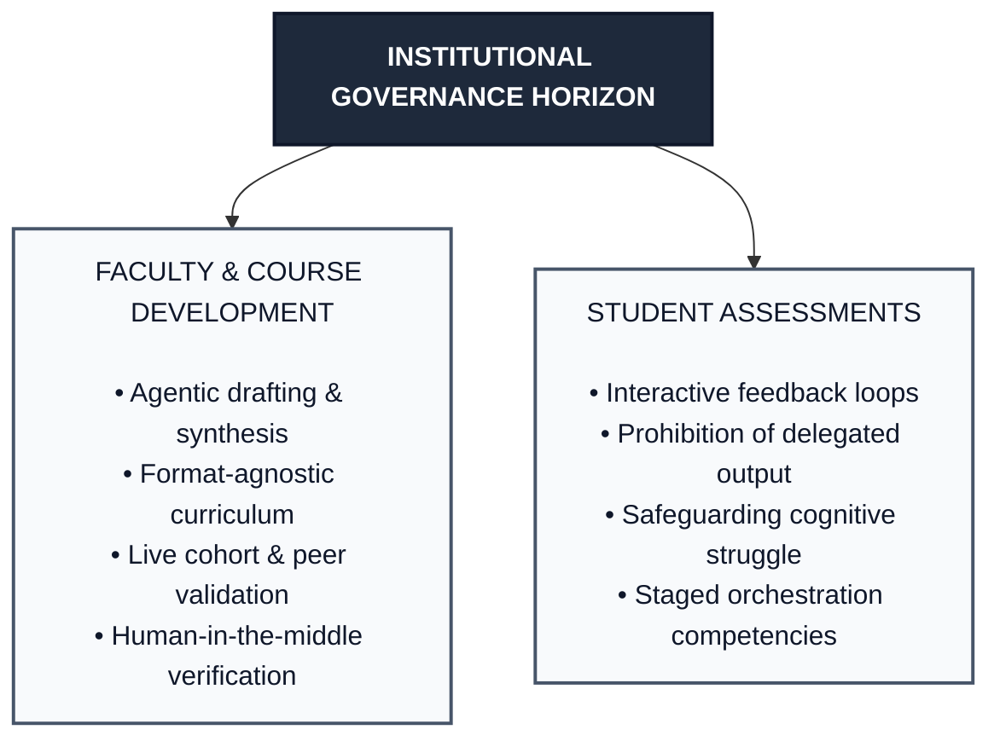

When working with artificial intelligence, early academic discourse focused almost exclusively on conversational, turn-based prompting, jumping into platforms like ChatGPT or Claude to generate text or code through direct question-and-answer exchanges. However, AI workflows have rapidly expanded into multi-step agentic systems capable of autonomous planning, dynamic tool use, iterative self-correction, and direct environment execution.

This document establishes an operational, cross-campus governance framework calibrated for this new technological reality. Rather than relying on blanket prohibitions or unenforceable algorithmic detection tools, this guide outlines an intentional model of operational asymmetry. It equips department chairs, curriculum committees, and instructional teams with modular Acceptable Use Policies (AUPs), syllabus statements informed by legal and regulatory considerations, and institutional implementation safeguards tailored across educational levels.

## The evolution from prompts to agents: governing operational asymmetry

As artificial intelligence shifts from passive text generation to autonomous execution, traditional institutional policies built around isolated prompts are no longer sufficient. When systems can independently plan, call external tools, and complete multi-stage objectives, governance cannot rely on blanket prohibitions or uniform mandates; it must adapt to how different campus constituents interact with this capability.

This technological evolution demands an intentional operational asymmetry across institutional roles:

* **Faculty and instructional teams**: Deploy agentic workflows as editorial, organizational, and curricular drafting assistants. Automating high-friction administrative tasks (such as cross-referencing accreditation requirements, scaffolding modular syllabi, or structuring lab practicals) frees faculty to focus on mentorship and teaching. In every instance, instructional teams remain active curators and auditors prior to student distribution.
* **Students and guided learners**: Engage AI through active cognitive loops (either via turn-based inquiry prompts or structured, execution-capable feedback partners like diagnostic test runners, logic checkers, or Socratic tutors). The governance boundary distinguishes between interactive feedback (which deepens conceptual reflection) and delegated execution (surrogate work completion that eliminates productive cognitive struggle).
* **Advanced cohorts and technical disciplines**: Approach agent orchestration, tool creation, and autonomous system auditing as direct disciplinary competencies, learning to construct operational boundaries and evaluate errors or behavioral regressions in AI-generated outputs.

### Modes of interaction across learning workflows

| Dimension | Prompt-based inquiry | Agentic feedback partner | Delegated autonomous execution |
| --- | --- | --- | --- |
| Primary user and context | Foundational learners; conceptual exploration. | Guided learners; automated testing, diagnostic tutoring, and iterative critique. | Faculty curriculum drafting; advanced capstone orchestration. |
| Interaction pattern | Turn-by-turn: Human initiates each query and synthesizes output. | Interactive loop: Agent executes diagnostics or questions; human revises work. | Goal-directed: Agent loops autonomously through sub-tasks to generate an asset. |
| Cognitive locus | Student synthesizes responses into their own work. | Student interprets diagnostic findings and manually refactors their work. | Offloaded to agent during execution; human serves as final auditor. |
| Pedagogical function | Scaffolding, conceptual clarification, and brainstorming. | Formative critique, diagnostic debugging, and logic stress-testing. | High-volume synthesis, administrative drafting, and systems auditing. |

### Human-in-the-middle governance in course design

When instructional teams use agentic systems to assist with course development, governance must guarantee that automation never supplants professional pedagogical judgment:

* **Format-agnostic curriculum**: Curricular design extends beyond digital learning platforms to include face-to-face seminars, printed course packs, studio workshops, and physical lab practicals. Governance applies to the substance of the materials rather than assuming a digital delivery pipeline.
* **Live validation over synthetic simulation**: The pedagogical validity of newly drafted curricula cannot be judged by automated persona simulations. Real validation requires departmental peer review and live instructional pilot runs with actual student cohorts.
* **Mandatory human-in-the-middle curation**: Because agents can generate multi-week syllabi and comprehensive assignment banks in a single loop, conceptual errors and biased perspectives can compound rapidly. Faculty must serve as active editors, conducting line-by-line verification of all reading lists, lab safety protocols, and rubrics.

### Feedback partners vs. delegated execution in student learning

The central governance challenge for students is not tool access, but preserving cognitive agency and active reasoning:

* **Interactive feedback loops**: When structured with clear boundaries, execution-capable agents (such as automated unit test harnesses, localized linting agents, or Socratic dialogue tutors) act as formative learning partners. The agent flags edge-case failures, questions weak assertions, or diagnoses logic gaps, requiring the student to reflect, revise their draft, and re-test manually.
* **Prohibition of surrogate execution**: If an agent is tasked with diagnosing the bug, rewriting the underlying logic, and verifying the fix without intermediate human intervention, the student becomes a passive bystander. The cognitive struggle necessary to internalize concepts is bypassed.
* **Clear syllabus boundaries**: Course policies must explicitly distinguish between pedagogical collaboration (using agents to test, critique, and audit student-authored work) and unauthorized delegation (directing an agent to produce or repair deliverables).

### Staged AI learning progression

Academic programs can calibrate student AI interaction across three developmental milestones:

* **Foundational stages (core mechanics and concept mastery)**: Focus on unassisted problem solving and composition in monitored environments. AI tools are restricted or configured as read-only diagnostic coaches to safeguard baseline cognitive growth.
* **Intermediate stages (applied analysis and structured feedback)**: Students author original work and submit it to execution-capable feedback partners for diagnostic critique, executing all revisions manually.
* **Advanced and capstone stages (orchestration, synthesis, and auditing)**: Students design agent boundaries, formulate verification protocols, inspect logs, and audit synthetic outputs for errors, hallucinations, and security flaws.

## Operational policy templates

<custom-admonition type="warning" no-icon title="Institutional advisory and customization warning">

The policies, syllabus statements, and operational workflows presented in this document are model templates and baseline starting points. They are not intended as universal, drop-in mandates for direct institutional adoption.

Because institutions vary significantly by academic mission, collective bargaining agreements, faculty senate bylaws, student honor codes, disciplinary norms, and regional legal frameworks, these policies must undergo deliberate adaptation. Curriculum committees, academic standard boards, and institutional legal counsel should use these templates as modular starting scaffolds, tailoring specific clauses, definitions, and enforcement mechanisms to their local governance requirements.

</custom-admonition>

### Architectural rationale: why these policies are structured as they are

These three policy instruments, the Faculty Course Design AUP, the Student Academic Integrity Syllabus Statement, and the Engineering Teams AUP, are constructed around three core design choices:

* **Role-based separation**: Rather than attempting to govern an entire campus through a singular, uniform decree, the framework establishes distinct operational standards calibrated to the actual workflow of each role: faculty designing curriculum, students navigating assessment, and technical teams maintaining shared infrastructure.
* **Observable behaviors over internal motivations**: Policies designed around policing student intent or relying on unreliable algorithmic detection tools produce high rates of false accusations and administrative friction. These templates focus on observable, verifiable practices (such as maintaining version-controlled process histories, documenting disclosures, conducting oral reviews, and ensuring human-in-the-middle verification of deliverables).
* **Cognitive preservation over blanket prohibition**: Rather than attempting to block access to tools, the student-facing policies draw a functional boundary between formative feedback (which enriches critical thinking through diagnostic prompts and interactive test suites) and delegated surrogate output (which short-circuits learning by offloading the actual completion of work).

## Acceptable Use Policy (AUP): faculty and instructional teams collaborating with AI in course design

### Purpose and scope

This policy establishes operational standards for instructors, instructional designers, teaching assistants, and curriculum developers using Generative AI (GenAI) and agentic workflows to research, draft, structure, and revise course materials.

### Core guiding principles

* **Human-in-the-middle primacy**: AI systems serve solely as assistive drafting instruments. The instructor of record retains sole accountability for all course content, syllabi, learning objectives, assessments, and pedagogical decisions.
* **Format-agnostic design**: Curricular assistance applies across all delivery formats (including face-to-face seminars, print course packs, studio workshops, and lab practicals), not just digital course shells.
* **Live validation over automated simulation**: Course effectiveness is validated primarily through departmental peer review and live student pilot runs, as synthetic student simulations cannot substitute for how actual cohorts interact with curriculum.
* **Pedagogical alignment and equity**: All AI-assisted course assets must align with accredited learning standards, universal design for learning (UDL) principles, and accessibility baselines, while being audited for cultural and systemic bias.

### Permissible uses

* **Curriculum and syllabus scaffolding**: Drafting modular course schedules, topic sequences, and learning outcomes aligned with Bloom’s Taxonomy.
* **Assessment design and rubrics**: Synthesizing diverse problem sets, multi-tiered grading rubrics, active learning scenarios, and discussion prompts.
* **Differentiation and accessibility adaptation**: Adapting reading levels, formulating linguistic scaffolding for multilingual learners, and developing multi-modal representations of abstract concepts.

### Prohibited uses

* **Exposure of protected records (FERPA and GDPR)**: Uploading non-directory student data, grades, writing samples, or identifiable academic submissions to non-enterprise AI systems without previous school or district vetting.
* **Unverified material distribution**: Distributing AI-generated lecture notes, assignments, lab guides, or answer keys without line-by-line human verification of all facts, formulas, citations, and URLs.
* **Autonomous evaluation and grading**: Directing AI tools to assign grades or official evaluations without direct, documented human review.
* **Third-party intellectual property infringement**: Inputting copyrighted textbooks, proprietary manuscripts, or restricted academic papers into external tools without authorization.

### Documentation and faculty policy clause

Instructional design repositories must maintain a brief log documenting models used, prompt strategies, and modifications made.

> **Faculty policy clause: human-in-the-middle curricular review**
>
> "Faculty and instructional staff using generative or agentic AI systems to assist in developing curricular materials retain sole responsibility for the pedagogical validity and factual accuracy of those materials.
>
> Under no circumstances may AI-generated course content be distributed to students without direct, line-by-line review and approval by the instructor of record. Curricular designs must be validated through standard departmental processes or live instructional pilots, ensuring that all materials satisfy institutional standards for rigor, accessibility, and inclusivity."

## Artificial intelligence and academic integrity policy (course syllabus statement)

### Policy stance and educational philosophy

Generative AI systems and interactive testing agents are treated as assistive cognitive tools (akin to a symbolic calculator in mathematics or a linter in software engineering). They are permitted to support inquiry and offer formative feedback, not to bypass critical reasoning.

### Permitted uses

* **Ideation and brainstorming**: Exploring prospective project topics, thesis questions, or alternative conceptual angles to overcome creative blocks. All final arguments, project structures, and solutions must be independently selected, expanded, and defended by the student.
* **Concept clarification and tutoring**: Requesting alternative explanations, step-by-step deconstructions of difficult proofs, or analogies for abstract models. Interactions serve strictly as study aids; synthetic explanations cannot be copied verbatim into submissions.
* **Diagnostic debugging and feedback loops**: Submitting student-authored drafts or code to automated test harnesses or Socratic tutors to identify logic gaps, edge-case failures, or runtime errors. Students must author the underlying draft or logic, interpret the diagnostics, and make all revisions manually.
* **Formative editorial review**: Soliciting feedback on clarity, paragraph transitions, tone consistency, or argument coherence. Revisions must be reviewed and implemented by the student rather than processed via automated whole-text rewrites.

### Prohibited uses

* **Delegated autonomous execution**: Directing an AI system or autonomous agent to author, repair, solve, or assemble assignment deliverables on your behalf, which bypasses the productive cognitive struggle required to master the subject matter.
* **Direct prompt submission and output masquerading**: Submitting raw or lightly edited synthetic outputs as original intellectual contributions, which misrepresents authorship and violates institutional honesty standards.
* **Unauthorized in-assessment assistance**: Using generative tools in any capacity during timed quizzes, lab practicals, or exams without explicit written permission, compromising baseline competence measures.
* **Surrogate milestone completion**: Tasking an agent with completing core project milestones, forming analytical conclusions, or making architectural decisions that form the basis of individual or collaborative grading.

### Syllabus clause: formative feedback vs. delegated output

> "In this course, generative tools and agentic environments are welcomed when used as formative feedback and review partners (such as critiquing student drafts, testing student-written code against diagnostic scripts, or exploring counterarguments).
>
> However, delegated autonomous execution is strictly prohibited. You may not instruct an AI system or autonomous agent to author, repair, or assemble assignment deliverables on your behalf. Every line of text, code, or design submitted must be your own work, shaped by your own cognitive choices. Submitting deliverables generated by assigning task completion to an autonomous agent without explicit instructor authorization violates the academic integrity code."

### Mandatory disclosure protocol

Submissions using AI tools must include an AI disclosure statement detailing:

* **Tool and model**: Specific platform and version (e.g., Claude 3.7 Sonnet, ChatGPT GPT-4o).
* **Prompts and purpose**: Primary prompts submitted and the pedagogical intent of the session.
* **Verification summary**: A 1–2 sentence statement explaining how the output was tested, verified, or modified.

*Example: "I used Claude 3.7 as an interactive test partner to evaluate edge cases for my parser. The tool flagged two unhandled null assertions, which I diagnosed and resolved in my source code manually."*

### Verification via oral defense and live review

The instructional team reserves the right to conduct an in-person or synchronous live review (oral defense) for any coursework. If a student cannot explain the internal logic, justify architectural decisions, or reconstruct functional segments of the work unassisted, the submission will be referred for an academic integrity review.

### Stepped enforcement and sanctions

* **First infraction (unattributed or prohibited usage)**: Zero grade on the assignment, mandatory conference with the instructor, and an official academic integrity warning filed in institutional records.
* **Second infraction**: Automatic course failure ('F') and immediate referral to the academic honor council for formal disciplinary proceedings.
* **72-hour regret clause**: If you submit work containing uncredited or improper AI assistance, you may notify the instructor in writing within 72 hours of submission (and before grades are released). The submission will receive a standard 25% late penalty, and you may resubmit without triggering an academic misconduct inquiry.

## Acceptable Use Policy (AUP): programming and engineering teams

<custom-admonition type="info" title="Scope advisory: Why technical and engineering teams are included" no-icon>
  
While the primary focus of this framework is educational governance and pedagogical policy, academic institutions do not operate solely through narrative composition and traditional coursework. University IT departments, campus research labs, computer science capstones, student developer organizations, and educational technology teams manage shared codebase infrastructure. Including a dedicated Acceptable Use Policy for technical teams ensures that institutional AI governance seamlessly bridges classroom pedagogy with technical development, shared repositories, and software infrastructure.

</custom-admonition>

### Purpose and scope

This policy governs software development teams, project collaborators, and engineering contributors using AI programming assistants and agent workflows within shared repositories, codebases, and technical deliverables.

### Core tenet: attribution and collective team accountability

> The development team maintains total operational accountability for every merged line of code. Team members share collective responsibility to ensure that coding standards, licensing rules, and security protocols are obeyed. If a repository fails a continuous integration build, violates open-source licenses, leaks confidential credentials, compromises system stability, or introduces security vulnerabilities, the entire team shares in the responsibility, regardless of whether the code was manually authored or generated by an AI assistant.

### Permissible uses

* **Architecture and design exploration**: Evaluating architectural patterns, contrasting data structure trade-offs, and reviewing reference system designs.
* **Boilerplate and syntax scaffolding**: Scaffolding repetitive class boilerplate, drafting standard regular expressions, generating interface type definitions, and creating mock test fixtures.
* **Debugging and root-cause analysis**: Deconstructing stack traces, interpreting build errors, diagnosing memory leak profiles, and locating performance bottlenecks.
* **Documentation and quality assurance**: Generating docstrings, drafting API specifications (e.g., OpenAPI, JSDoc/TSDoc), assembling boundary-condition unit tests, and maintaining changelogs.
* **Agent boundary design and workflow automation**: Configuring containerized sandbox environments, building test harnesses, and executing scripted verification checks under defined constraints.

### Prohibited uses

* **Unchecked shell and system execution**: Executing AI-suggested terminal commands, infrastructure scripts, or migrations that alter host environments, firewall configurations, or deployment keys without line-by-line manual verification.
* **Credential and secret exposure**: Inputting private API keys, cryptographic secrets, database connection strings, or proprietary source code into external AI interfaces or unvetted agent prompts.
* **Unreviewed code ingestion**: Merging pull requests, approving code reviews, or committing AI-generated logic without active peer review verifying security, accessibility, performance, and architectural fit.
* **Test fabrication and evasion**: Authoring unit tests designed merely to pass flawed AI-generated logic rather than asserting valid edge cases and failure modes.
* **Unsandboxed autonomous agent execution**: Granting autonomous agents unrestricted write, delete, or deployment permissions in production or uncontained staging environments without human approval gates.

### Team version control and review workflow

**Commit message attestation**: Commits containing substantial AI assistance must document the model using standard Git trailers:

<custom-admonition plain>

feat: implement Dijkstra pathfinding algorithm 
Co-authored-by: Claude 3.7 Sonnet &lt;ai-assist@anthropic.com&gt;

</custom-admonition>

* **License contamination checks**: Teams must verify that code completion models do not introduce copyleft (GPL, MPL) fragments into codebases requiring permissive (MIT, Apache 2.0) or proprietary licenses.
* **Peer review standards**: Pull requests cannot be merged solely because automated tests pass; AI-generated contributions require the same human peer review as manual code.

## Implementation guide: modular foundations, institutional gaps, and educational levels

### Framework purpose and implementation philosophy

These policies and syllabus statements provide modular, foundational templates rather than rigid administrative mandates. Because academic missions, legal jurisdictions, student developmental stages, and campus governance structures vary, institutional leaders and curriculum committees must adapt these templates to their local contexts.

### Institutional policy gaps requiring local customization

Campuses must address five operational and legal gaps before adoption:

* **Enterprise tool vetting and data protection agreements (DPAs)**: Campuses must maintain an active catalog of approved platforms backed by enterprise Data Protection Agreements (DPAs), or Business Associate Agreements (BAAs) when handling health-related data, that enforce zero-data retention, prohibit model training on user submissions, and comply with institutional security baselines.
* **Statutory and regulatory alignment (COPPA, FERPA, GDPR)**: Institutions serving minors must ensure strict compliance with COPPA and state student privacy laws. Higher education institutions must define whether processing de-identified student work through external models constitutes an educational records disclosure under FERPA, as simply stripping a student's name from a submission before pasting it into an external AI model does not automatically satisfy FERPA if unique contextual details, indirect identifiers, or stylometric patterns remain that could re-identify the student.
* **Adjudication, due process, and honor code integration**: Course syllabi cannot supersede institutional due process. Disciplinary sanctions must align with faculty senate bylaws, collective bargaining agreements, and campus conduct codes to preserve formal student appeal rights. Relying on commercial AI text detectors as the primary justification for misconduct claims introduces severe institutional liability due to high false-positive rates, empirical bias against non-native and multilingual English writers, and lack of transparent due process.

<custom-admonition type="info" title="Detector reliance and procedural liability" no-icon>
  
In Kato v. Palo Alto Unified School District (N.D. Cal., 2026), a school district faced a 14-count federal civil rights lawsuit alleging Title VI national origin discrimination, Title IX, and due process violations after an English essay was flagged as 76% AI-generated by Turnitin. Rather than adhering to an established, objective evidentiary process, the situation escalated through an ad-hoc in-class handwritten rewrite, subsequent grade penalties, and roughly 1,200 pages of disputed Google Doc revision histories.

  
Although the suit was voluntarily dismissed without monetary settlement or grade alterations, the dispute illustrates the operational hazards institutions face when instructors rely on unverified algorithmic scores and improvised sanctions rather than codified due process, transparent evidentiary standards, and authenticated oral reviews.

</custom-admonition>

<custom-admonition type="info" title="Detector output as non-evidence (UK Perspective)" no-icon>
  
Analyzing the Kato case from an international regulatory vantage point, UK education commentary (e.g., NeuralClass, 2026) contrasts US detector-driven discipline with UK regulatory standards. Under Joint Council for Qualifications (JCQ) guidance (<em>AI Use in Assessments</em>), AI detection metrics cannot serve as standalone proof of malpractice; software flags merely signal where an assessor might begin an inquiry, while formal allegations require authentic teacher evaluation, comparative analysis of student voice, and direct dialogue. UK commentators note that treating statistical confidence scores as actionable evidence converts ambiguous probability outputs into high-stakes civil liability, creating acute discrimination risks for multilingual learners whose lower linguistic perplexity frequently triggers false-positive alerts.

</custom-admonition>

* **Digital equity, access, and financial disparities**: Commercial tiers create inequities between free, rate-limited tools and advanced subscription tiers. If AI workflows are permitted or required, departments must ensure universal access via campus licenses, local open-weights deployments, or assignments structured for free tiers.
* **Assignment-level policy overrides**: Syllabi should explicitly note that individual assignment briefs, project prompts, and lab instructions can establish narrower or broader permissions to serve specific learning outcomes.

### Comparative framework across educational levels

| Dimension | K–12 education (elementary and secondary) | 2-year community and technical colleges | 4-year universities and graduate programs |
| --- | --- | --- | --- |
| Primary pedagogical focus | Core literacy, arithmetic, foundational reasoning, and digital citizenship. | Applied technical skills, workforce readiness, industry certifications, and transfer preparation. | Critical synthesis, theoretical inquiry, advanced research methodology, and novel scholarship. |
| Permissibility posture | Restricted / walled garden: Teacher-directed exploration that protects foundational cognitive struggle. | Pragmatic / industry-aligned: Guided adoption reflecting professional workplace workflows. | Tiered autonomy: Broad latitude for inquiry paired with strict attribution and defense standards. |
| Data privacy and legal mandates | Strict compliance with COPPA, FERPA, and state student privacy laws; no unvetted commercial accounts. | Standard FERPA compliance with low-friction tool adoption for adult and non-traditional learners. | FERPA, institutional review boards (IRB), export controls, and intellectual property/patent protocols. |
| Foundational skill governance | Prohibited for basic reading, writing, and numeracy tasks requiring unassisted mastery. | Assistance with basic mechanics permitted in non-remedial courses to accelerate vocational output. | Encouraged for advanced research, theoretical synthesis, and novel scholarship, with appropriate attribution and defense standards. |
| Integrity and verification | Pen-and-paper check-ins, monitored lab sessions, iterative process portfolios, and oral conferences. | Competency demonstrations, hands-on lab practicals, industry rubrics, and project portfolios. | Oral defenses (viva voce), version-controlled repositories, peer seminars, and thesis defenses. |
| Access and equity strategy | District-funded enterprise tools with centralized content and safety filters. | Campus computer labs, software subsidies, and assignments tailored to open/free tiers. | Institutional site licenses, high-performance computing clusters, and departmental allocations. |

## Strategic conclusion: moving from reactive governance to institutional agency

The emergence of autonomous and agentic workflows marks a decisive break from the era of conversational chatbots. Attempting to govern this environment through blanket prohibitions, intrusive surveillance software, or statistical text detectors creates an adversarial campus culture while heightening legal and procedural vulnerabilities.

As institutions transition from initial policy experimentation to mature governance, sustainable adoption rests on three core commitments:

* **Safeguarding cognitive friction as a core pedagogical asset**: Academic programs must actively protect the formative struggle required to internalize foundational reasoning. Policy must clearly distinguish between interactive feedback partners that cultivate reflection and delegated execution that substitutes automated output for genuine student mastery.
* **Empowering educators as autonomous curators**: Faculty should be supported in leveraging agentic tools to reduce administrative friction and scaffold innovative curricular formats. However, this efficiency must remain anchored by human-in-the-middle validation, departmental peer review, and authentic cohort pilots.
* **Anchoring integrity in authentic evaluation and procedural equity**: Moving away from probabilistic detection algorithms requires institutions to ground academic integrity in observable behaviors (such as process logs, multi-stage milestone submissions, and synchronous oral defenses or live reviews). Above all, governance frameworks must uphold formal due process, ensuring equitable treatment across diverse learner populations and international linguistic backgrounds.

By codifying operational asymmetry into transparent policies, educational institutions can move beyond technological panic, ensuring that AI systems serve to amplify human agency, critical intellect, and pedagogical inquiry rather than erode them.

## References

### Course design and faculty AUP foundations

Office of Educational Technology. (2023). Artificial intelligence and the future of teaching and learning: Insights and recommendations. U.S. Department of Education. https://tech.ed.gov/ai-future-of-teaching-and-learning/

* **Contribution to policy**: Codifies the core principle that AI should support teachers rather than automate core educational decisions, reinforcing the prohibition against unmonitored automated student assessment and emphasizing human-in-the-loop oversight.

Russell Group. (2023). Russell Group principles on the use of generative AI in education. The Russell Group of Universities. https://russellgroup.ac.uk/media/6137/rg_updated_principles_on_the_use_of_generative_ai_in_education.pdf

* **Contribution to policy**: Provides the institutional foundation for faculty AI literacy, course design transparency, and ethical assessment creation adopted across 24 leading research institutions.

TeachAI. (2024). AI guidance for schools toolkit. Code.org, Consortium for School Networking, Digital Promise, European EdTech Alliance, & Policy Analysis for California Education. https://www.teachai.org/toolkit

* **Contribution to policy**: Direct source for the permissible and prohibited operational taxonomy for educators, providing sample frameworks for institutional administrative controls, syllabus scaffolding, and staff documentation standards.

United Nations Educational, Scientific and Cultural Organization. (2023). Guidance for generative AI in education and research. UNESCO. https://doi.org/10.54675/KORX8154

* **Contribution to policy**: Establishes international governance benchmarks on preserving human agency, maintaining human-in-the-loop validation for curricular materials, protecting learner data privacy, and auditing generative outputs for algorithmic and regional bias.

United Nations Educational, Scientific and Cultural Organization. (2024). AI competency framework for teachers. UNESCO. https://doi.org/10.54675/GSBW9727

* **Contribution to policy**: Informs the standards on pedagogical alignment and differentiation, articulating clear educator competencies in curriculum design, ethics, and universal design principles when utilizing assistive AI systems.

### Syllabus statement and academic integrity enforcement foundations

International Center for Academic Integrity. (2021). The fundamental values of academic integrity (3rd ed.). https://academicintegrity.org/resources/fundamental-values

* **Contribution to policy**: Guides the philosophical basis of the academic integrity policy, aligning AI disclosure rules with the foundational pillars of Honesty, Trust, Fairness, Respect, Responsibility, and Courage.

Malan, D. J. (2023). Academic honesty and artificial intelligence policy. CS50, Harvard University. https://cs50.harvard.edu/x/honesty/

* **Contribution to policy**: Serves as the direct precedent for the cognitive calculator analogy, the qualitative breakdown of permissible versus prohibited practices, and the 72-Hour Regret Clause mechanism to encourage ethical disclosure over concealment.

MLA-CCCC Joint Task Force on Writing and AI. (2023). MLA-CCCC Joint Task Force on Writing and AI working paper: Overview of the issues, statement of principles, and recommendations. Modern Language Association & Conference on College Composition and Communication. https://aiandwriting.hcommons.org/working-paper-1/

* **Contribution to policy**: Informs the boundary distinction between formative editorial feedback (permissible) and wholesale ghost-drafting (prohibited) in written communication and analytical reasoning.

Benini, S., Kennedy, M.-C., McGrath, F., & Cole, R. (2026, August 3). Live review as a safeguard for academic integrity. International Center for Academic Integrity. https://www.academicintegrity.org/aws/ICAI/pt/sd/news_article/631829/_PARENT/layout_details/false

* **Contribution to policy**: Provides the methodological grounding for oral defense ("live review") as an authentic, process-focused mechanism to verify student authorship and reasoning without relying on inaccurate algorithmic AI detectors.

Joint Council for Qualifications. (2025). AI use in assessments: Protecting the integrity of qualifications (Guidance for teachers and assessors). JCQ CIC. https://www.jcq.org.uk/wp-content/uploads/sites/2/2025/09/JCQ-AI-information-sheet-for-teachers-1.pdf

* **Contribution to policy**: Establishes the regulatory benchmark that AI detection metrics cannot serve as standalone proof of academic malpractice, requiring holistic teacher evaluation, process evidence, and candidate dialogue.

Quill. (2026, July 25). The Palo Alto lawsuit: A detector score becomes a civil rights case. NeuralClass. https://neuralclass.uk/articles/palo-alto-ai-detector-lawsuit-civil-rights

* **Contribution to policy**: Offers an international perspective on the Kato case, contrasting US detector-driven discipline with UK Joint Council for Qualifications (JCQ) regulatory benchmarks that disqualify detector metrics as standalone proof of academic malpractice.

Stanford University, Center for Teaching and Learning. (2023). Teaching with AI: Sample syllabus statements and assignment design considerations. https://teachingcommons.stanford.edu/news/artificial-intelligence-ai

* **Contribution to policy**: Directly informs the three-part Mandatory Disclosure Protocol (tool, prompt/purpose, verification statement) and tiered permissibility model.

### Programming and engineering teams AUP foundations

Association for Computing Machinery. (2018). ACM code of ethics and professional conduct. https://www.acm.org/code-of-ethics

* **Contribution to policy**: Informs the core tenet of team accountability. Sections 1.4 (Fairness and Non-discrimination), 2.5 (Thorough Evaluations of Computer Systems and Their Impacts), and 2.9 (Robust and Usable Security) underpin the principle that engineers remain legally and ethically accountable for all committed code, synthetic or human.

IEEE Computer Society. (2021). IEEE standard for software reviews and audits (IEEE Std 1028-2021). Institute of Electrical and Electronics Engineers. https://standards.ieee.org/ieee/1028/

* **Contribution to policy**: Establishes standard peer-review criteria, ensuring that automated tests alone are insufficient for pull request approval and that code provenance and traceability (Git attribution) are preserved.

National Institute of Standards and Technology. (2023). Artificial intelligence risk management framework (AI RMF 1.0) (NIST AI 100-1). U.S. Department of Commerce. https://doi.org/10.6028/NIST.AI.100-1

* **Contribution to policy**: Provides the Govern, Map, Measure, and Manage functions adapted to mitigate code supply-chain risks, vulnerability surfaces, third-party intellectual property infringement, and data leakage.

Open Source Initiative. (n.d.). The open source definition and approved licenses. https://opensource.org/licenses

* **Contribution to policy**: Serves as the basis for license contamination and intellectual property checks, specifically mitigating inadvertent copyleft licensing breaches resulting from unmonitored code generation models.

### Comparative framework across educational levels foundations

American Association of Community Colleges & Instructional Technology Council. (2026, February). Fostering student AI fluency for career readiness. *Community College Daily* / ITC Resource Repository. https://www.ccdaily.com/2026/02/fostering-student-ai-fluency-for-career-readiness/

* **Contribution to policy**: Grounds the workforce-aligned, pragmatic permissibility posture for two-year community and technical colleges, integrating career-ready AI competencies into vocational and non-credit curricula.

Association of American Colleges and Universities. (2024–2026). Institute on AI, pedagogy, and the curriculum. AAC&U. https://www.aacu.org/trending-topics/ai

* **Contribution to policy**: Informs digital equity benchmarks, Open Educational Resources (OER) integration, and campus computer lab access models to mitigate subscription paywall disparities across institutions.

California Department of Education. (2024). Learning with AI, learning about AI: Guidance for transitional kindergarten through grade 12. CDE. https://www.cde.ca.gov/ci/pl/aiincalifornia.asp

* **Contribution to policy**: Informs K–12 guidance emphasizing human-centered educator relationships, in-person check-ins, and safeguarding foundational cognitive development against premature automation.

Federal Trade Commission. (2020). Children’s online privacy protection rule (COPPA) guidance for EdTech companies and schools. 16 C.F.R. Part 312. U.S. Federal Trade Commission. https://www.ftc.gov/business-guidance/blog/2020/04/coppa-guidance-ed-tech-companies-schools-during-coronavirus

* **Contribution to policy**: Establishes the statutory framework under which schools grant surrogate consent on behalf of parents for educational software under age 13, requiring district vetting of vendor data retention policies.

League for Innovation in the Community College. (2024). Education and generative AI roundup: A deep dive on AI policy. League for Innovation. https://www.league.org/

* **Contribution to policy**: Grounds practical competency demonstrations, hands-on lab practicals, project portfolios, and adaptable policies for adult and non-traditional technical learners.

U.S. Department of Education, Student Privacy Policy Office. (2021). Protecting student privacy while using online educational services. U.S. Department of Education. https://studentprivacy.ed.gov/

* **Contribution to policy**: Clarifies Family Educational Rights and Privacy Act (FERPA) obligations, school official vendor contract exceptions, and student data privacy compliance for third-party educational software.