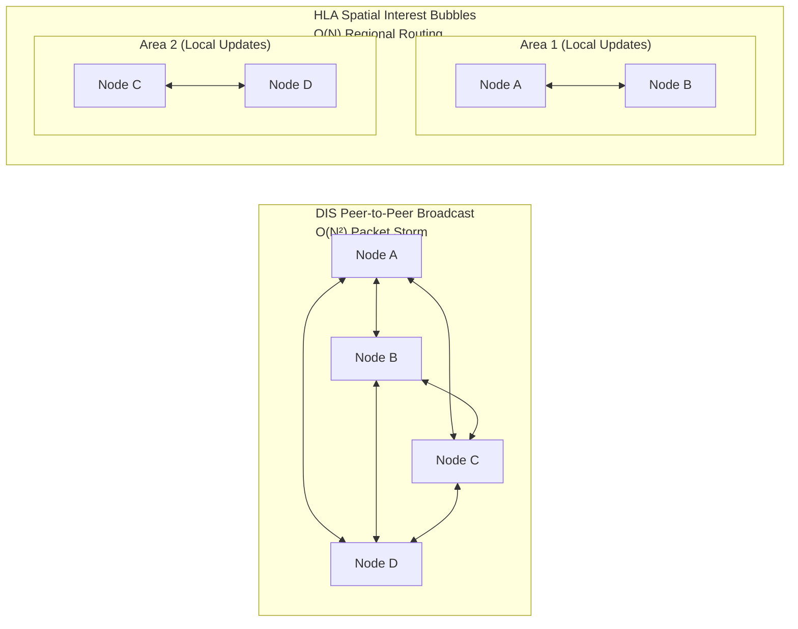
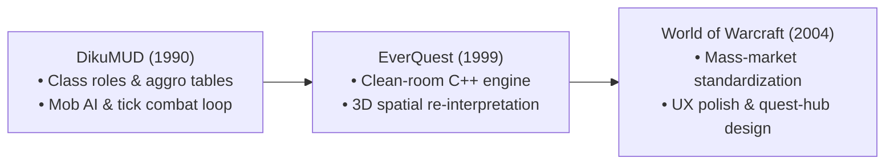

Storytelling is undergoing its most fundamental transition since the invention of the printing press. We are moving from linear, passive media consumption, "looking through a window", to spatial, dynamic co-creation, where participants step through the frame into shared digital realities.

This is the first post in a 5-part series examining the technological, structural, and theoretical shifts that have redefined interactive media over the past five decades. We trace this trajectory from 1970s text-based multi-user environments to modern passthrough spatial computing (Apple Vision Pro, Meta Quest 3), open web rendering stacks (WebGPU, WebXR, WebTransport), and generative AI narrative directors. Along the way, we evaluate these developments against humanity's dominant sci-fi benchmarks (The OASIS, Sword Art Online, and the Star Trek Holodeck) and test foundational theories—such as Janet H. Murray’s 2016 edition of Hamlet on the Holodeck and Judith Donath’s work on virtual identity—against today's live capabilities.

The 5-Part Series Roadmap

1. Part 1: From Text to Telepresence (This Post) — Exploring text parsers (Zork), MUDs/MOOs, DARPA’s SIMNET/DIS military protocol, Judith Donath's identity signaling theory, and early location-aware media.
2. Part 2: Place, Space, and Passthrough — Examining how the shift from legacy AR (HoloLens, Magic Leap) to video passthrough (Vision Pro, Quest 3) and controllerless optical gesture tracking grounds stories in physical architecture.
3. Part 3: The Engine Under the Hood — Deconstructing the modern web stack (WebGPU compute shaders, low-latency WebRTC pixel streaming, WebTransport UDP datagrams, VPS geofencing, and LLM Meta-Narrative Directors).
4. Part 4: Sci-Fi Realities & Benchmarks — Benchmarking current tech against Ready Player One (The OASIS), Sword Art Online (Full-Dive VR), and the Star Trek Holodeck.
5. Part 5: Revisiting Murray’s Holodeck — Re-evaluating Janet H. Murray’s 2016 updated theoretical framework (Hamlet on the Holodeck, MIT Press) in the era of generative AI co-creation and spatial computing.

## Storytelling Before the Screen Space

When modern observers imagine immersive digital worlds, they almost invariably picture photorealistic graphics engines, ray-traced dynamic lighting, and high-density micro-OLED displays strapped to a user’s face. However, this visual bias misses a fundamental historical truth: the core mechanics of digital immersion were fully realized long before head-mounted displays or 3D GPUs existed.

### The Illusion of Visuals

Early digital immersion did not rely on visual fidelity; it relied on human cognition and textual projection. Just as a reader projects vivid imagery onto the blank page of a novel, early digital participants used their own imaginations as the ultimate graphics pipeline. What made these early systems truly revolutionary was not how they looked, but how they behaved.

### The Paradigm Shift

Linear storytelling media—whether oral epic, printed novel, or cinematic film—operates on a one-way vector. The author constructs a fixed sequence of state transitions; the audience passively observes through a static frame. Interactive digital media breaks this vector. It converts storytelling into a participatory, stateful system where the audience becomes an active agent capable of inspecting, altering, and expanding the world.

> "Interactive media transforms storytelling from a static sequence of events into a responsive system of rules, state changes, and spatial affordances."
>
> — Janet H. Murray, Hamlet on the Holodeck: the Future of Narrative in Cyberspace (MIT Press, 2016 Edition)

## Single-Player Precursors & Text-Based Emergence (1970s–1990s)

To trace how participants evolved from passive readers into real-time system architects, we must start with the birth of interactive text parsers and the rapid expansion of multi-user dungeoncrawls through university networks.

### Single-Player Parsers & Reader Agency

In 1976, Will Crowther, a programmer and caving enthusiast, wrote Colossal Cave Adventure on a DEC PDP-10 mainframe to entertain his daughters. Expanded in 1977 by Don Woods, Adventure introduced the verb-noun command parser.

For the first time, a reader did not turn a page; they typed commands like go north, take lamp, or open grate. The software evaluated the command against an internal world graph, updated global state variables (e.g., inventory lists, room light levels), and returned a text description of the updated world.

```text
YOU ARE STANDING AT THE END OF A ROAD BEFORE A SMALL BRICK BUILDING.
AROUND YOU IS A FOREST. A SMALL STREAM FLOWS OUT OF THE BUILDING AND
DOWN A GULLY.

> enter building
YOU ARE INSIDE A BUILDING, A WELL HOUSE FOR A LARGE SPRING.
THERE IS A SHINY BRASS LAMP SITTING HERE.
THERE IS A BOTTLE OF WATER HERE.

> take lamp
OKAY.
```

Infocom took this paradigm further in 1977 with Zork. Powered by the Zork Implementation Language (ZIL) and the Z-Machine virtual computer, Zork introduced complex spatial logic, intricate inventory puzzles, and mechanical state tracking. The user was no longer merely reading a story; they were manipulating a state machine.

### The Birth of MUD1 (1978)

In 1978, Roy Trubshaw and Richard Bartle at the University of Essex asked a fundamental question: What happens if we open Zork’s state machine to multiple simultaneous players over a network?

The result was MUD1 (Multi-User Dungeon), the world’s first networked, multi-user virtual environment. Run on the university's DEC-10 mainframe and distributed via early ARPANET connections, MUD1 established a revolutionary concept: world persistence.

In his seminal design text Designing Virtual Worlds (2003), Richard Bartle emphasized that world persistence was the true leap forward:

> "What made MUD1 genuinely new was not the combat or the quests. It was persistence. The world existed whether or not any individual player was logged in. Player actions had lasting consequences."
>
> — Richard A. Bartle, Designing Virtual Worlds (New Riders, 2003, p. 7)

### The 1980s Server Divergence: Combat vs. Social Constructionism

Between MUD1 in 1978 and the rise of advanced object-oriented environments in the early 1990s, text-based online worlds underwent an explosive period of technical diversification across university mainframes and early online commercial networks (GEnie, CompuServe).

During the 1980s, the MUD landscape split into two primary evolutionary branches:

* The Combat & Progression Lineage
  * **LPMud (1989)**: Created by Lars Pensjö, LPMud introduced LPC, an in-world C-like scripting language. This allowed game administrators and builders to write complex items, monsters, and quests without taking down or recompiling the core server.
  * **DikuMUD (1990)**: Developed by Sebastian Hammer, Tom Madsen, Katja Nyboe, Michael Seifert, and Hans Henrik Stærfeldt at DIKU (Department of Computer Science at the University of Copenhagen), DikuMUD delivered a streamlined, combat-focused C codebase centered around class roles, mob AI, tick-based health regeneration, and the "kill-loot-level" progression loop.

    It is important to distinguish between direct software implementation and conceptual design influence. Modern 3D MMORPGs like EverQuest and World of Warcraft did not use DikuMUD source code; in fact, Verant Interactive formally certified during a 1999 licensing review that EverQuest was written entirely from scratch in custom C++. However, DikuMUD popularized the structural gameplay templates, vocabulary (e.g., "mob," "aggro," "tanking"), and class-based combat loops that designers re-engineered into 3D graphics engines.

    As lead game designer Raph Koster (Ultima Online, EverQuest II) noted in his historical analysis "What is a Diku?":

    > "Diku codebases did eventually popularize many of the major developments in MUDs... the Diku gameplay provided inspiration for numerous MMORPGs, including EverQuest, World of Warcraft, and Ultima Online."
    >
    > — Raph Koster, "What is a Diku?" (Raph Koster's Blog, Jan 9, 2009)

    This conceptual influence was explicitly acknowledged by EverQuest co-creator Brad McQuaid, who was an avid player of the Diku-derivative MUD Sojourn/TorilMUD prior to designing EverQuest:

    > "Even though it was text based and free to play, I saw there the commercial potential for these games when coupled with graphics... when the opportunity to combine them with MUDs came up, I jumped at the chance and began work on EverQuest."
    >
    > — Brad McQuaid, interview on EverQuest origins (Guru3D / MassivelyOP)

  * Commercial Pay-Per-Hour MUDs: Games like Simutronics' GemStone III (1988) on GEnie and Avalon: The Legend Lives (1989) demonstrated that multi-user virtual worlds could support vibrant economies, player-run governments, and thousands of concurrent customers paying $6 to $12 per hour.

* The Social & Constructionist Lineage
  * **TinyMUD (1989)**: Created by Jim Aspnes, TinyMUD stripped out combat statistics and level grinding entirely, refocusing the engine on conversation, spatial exploration, and user-driven building.
  * **MUSH & MUCK**: Evolved from TinyMUD to support collaborative storytelling, roleplay theater, and customizable spatial geography.
  * **LambdaMOO (1990)**: Developed by Pavel Curtis at Xerox PARC, LambdaMOO (MUD, Object-Oriented) represented the absolute peak of text-based constructionism.

    In a MOO, authorship ceased to be about scripting linear plot lines. Authorship became system architecture:

    Object-Oriented World Modeling: Every entity—rooms, players, items, dynamic doors—was represented as an object in a persistent database with parent-child inheritance.

    In-World Creation: Users did not leave the world to write content; they built the universe from within the running software using text commands and LPC/MOO verb scripting.

MUD History Timeline (1976–1999)

| Year | Milestone<br/>System | Historical Significance | Primary Citation |
| --- | --- | --- | --- |
| 1976 | Colossal Cave Adventure | Introduced the verb-noun text command parser and interactive spatial navigation. | Crowther & Woods (1976) |
| 1977 | Zork (Infocom) | Advanced state-tracking, virtual machine architecture, and complex inventory puzzles. | Lebling, Blank et al. (1977) |
| 1978 | MUD1 (Univ. of Essex) | Roy Trubshaw & Richard Bartle build the first multi-user persistent virtual world. | Bartle & Trubshaw (1978) |
| 1984 | MUD1 on CompuServe | First commercial deployment of a multi-user text dungeon outside university networks. | CompuServe Archives |
| 1988 | GemStone III (GEnie) | Commercial pay-per-hour model reaching thousands of concurrent players. | Simutronics / GEnie |
| 1989 | Avalon: The Legend Lives | Introduces non-resetting persistent worlds, player-run governments, and political systems. | Yehuda (1989) |
| 1989 | LPMud & TinyMUD | LPMud introduces live LPC scripting; TinyMUD removes combat to focus on social building. | Pensjö (1989) / Aspnes (1989) |
| 1989 | Avalon: The Legend Lives | Introduces non-resetting persistent worlds, player-run governments, and political systems. | Yehuda (1989) |
| 1990 | DikuMUD | Combat-heavy C codebase popularizing the class/mob/loot loop re-engineered by 3D MMORPGs. | Hammer, Madsen et al. (DIKU, 1990) |
| 1990 | LambdaMOO | Pavel Curtis (Xerox PARC) merges object-oriented inheritance with in-world end-user programming. | Curtis (Xerox PARC, 1990) |
| 1993 | A Rape in Cyberspace | Dibbell documents the Mr. Bungle event on LambdaMOO, birthing virtual ethics and digital law. | Dibbell (The Village Voice, 1993) |
| 1997 | Achaea / Iron Realms | Matt Mihaly invents the Free-to-Play (Freemium) microtransaction model in a text MUD. | Mihaly (Iron Realms, 1997) |
| 1999 | EverQuest | Re-engineers DikuMUD's core combat/level gameplay loop into a ground-up 3D C++ engine. | Verant / Sony Online Ent. (1999) |

## In-World Creation & Command Syntax Examples

In constructionist environments like LambdaMOO, users acted as real-time system architects. A participant could carve out new geographic topology and instantiate persistent objects on the fly using typed spatial construction commands:

```text
@dig north to Great Hall
@describe Great Hall as "A vast stone chamber illuminated by flickering iron torches."
@create glowing sword
@describe glowing sword as "An ancient blade etched with runic glyphs."
```

Beyond static geometry, MOO scripting languages allowed users to attach dynamic code directly to objects using verb programming:

```text
@verb sword:rub
@program sword:rub
  player:tell("You rub the blade. A faint blue aura pulses along its edge.");
  this.location:announce_except(player, player.name + " rubs the sword, causing it to hum softly.");
@end
```

Through simple scripts like this, early participants established the fundamental definition of procedural media: writing behavioral rules that react dynamically to human input in real time.

## Identity, Signaling, and Deception in Virtual Spaces

As text environments evolved from technical novelty into persistent social worlds, they severed the physical anchor connecting one human body to one identity.

### Judith Donath’s Identity Framework

In her seminal paper "Identity and Deception in the Virtual Community" (1999), Judith Donath provided the theoretical framework for analyzing interaction in virtual environments. Donath demonstrated that online spaces sever physical markers, creating a fundamental tension between two types of signals:

* **Conventional Signals**: Claims that are cheap and easy to fake (e.g., typing "I am a 6-foot wizard" or setting an avatar profile description).
* **Assessment Signals**: Costly-to-fake indicators that carry inherent structural costs (e.g., long-term reputational history, deep technical fluency, accumulated social capital, or sustained community participation).

Donath articulated the core dilemma facing virtual identity:

> "In the physical world, there is a continuous unity of the body and the self... Online, this unity is broken. Identity is composed entirely of signals emitted by the user... Where conventional signals are cheap, trust depends upon assessment signals—indicators that carry a real, structural cost to fabricate."
>
> — Judith Donath, "Identity and Deception in the Virtual Community" (MIT Media Lab, 1999)

Because text environments made conventional signals virtually free to fabricate, trust and social cohesion relied heavily on assessment signals built over months of sustained interaction.

### Narrative Case Study: LambdaMOO & Digital Ethics

This tension reached a dramatic boiling point in 1993, documented in Julian Dibbell’s landmark essay "A Rape in Cyberspace" (The Village Voice). A user named Mr. Bungle deployed a malicious "sub-routine" script inside LambdaMOO that spoofed command outputs, forcing other users' characters to perform explicit, non-consensual sexual acts in public chat logs.

Dibbell captured the profound psychological impact of this event:

> "They took place in a room... that was totally imaginary... And yet, to look back on that night... is to know that whatever happened inside that room happened to real people, and left real psychological wounds."
>
> — Julian Dibbell, "A Rape in Cyberspace" (The Village Voice, Dec 21, 1993)

This event sent shockwaves through early cyber-culture:

* **Real Emotional Weight**: It proved that virtual actions—even when conveyed strictly through ASCII text lines—inflict real psychological, emotional, and social consequences on the humans behind the avatars.
* **Birth of Digital Governance**: The LambdaMOO community was forced to grapple with questions of virtual law, digital enforcement, and community moderation, ultimately leading Pavel Curtis to hand governance tools directly over to the user community via ballot systems.
* **Identity Boundaries**: It proved that virtual space is never "just a game." It established the psychological foundation of spatial identity—a concept that remains hyper-relevant today as we navigate AI-generated deepfakes and avatar impersonation in spatial computing.

## SIMNET and DIS: The Military Blueprint for Co-Presence (1980s–1990s)

While text-based communities were discovering digital ethics, the military was quietly solving the hard networking architecture required to put dozens of humans into the same synthetic space simultaneously.

**DARPA’s SIMNET Project**

In the mid-1980s, DARPA launched SIMNET (Simulator Network), led by program manager Jack Thorpe. The challenge was massive: train tank crews spread across geographically distant physical military bases inside a shared, synchronized virtual battlefield—over extremely constrained 56 kbps modem links.

```mermaid
flowchart TD
    subgraph SIMNETNode ["SIMNET Node (Tank Simulator)"]
        LocalDR ["Local Dead-Reckoning Engine"]
        Render ["Real-Time Render Visual Display"]
    end

    Net ["56 kbps WAN Network (DIS UDP Broadcasts)"]

    LocalDR --> Net
    Net --> Render
```


### The Invention of Shared Telepresence

SIMNET established the Distributed Interactive Simulation (DIS) protocol (standardized as IEEE 1278). DIS introduced two foundational concepts that power every modern online multiplayer engine:

* **P2P State Broadcasting**: Instead of relying on a central server to calculate every vehicle's position, each simulator maintained a local model of the entire world.
* **Dead Reckoning**: To save precious network bandwidth over 56 kbps lines, simulators only sent a packet when an entity changed direction or speed. In the gaps between packets, every local machine ran predictive physics calculations ("dead reckoning") to extrapolate where surrounding vehicles were moving.

SIMNET proved that co-presence—the cognitive realization that another human shares your synthetic environment in real time—is the primary engine of engagement in digital space.

### The Scaling Wall: DIS vs. HLA Brigade Exercises

As military training ambitions expanded, engineers confronted a severe mathematical bottleneck: Can a full brigade combat team train together using DIS?

**The Bottleneck**: DIS was an unmanaged peer-to-peer broadcast protocol. Every unit sent packet updates to every other unit in the simulation.

**The Math**: Network traffic scaled quadratically according to Packets ∝ O(N²) where N represents the number of active entities (tanks, soldiers, artillery shells, aircraft).

**The Collapse**: While DIS performed admirably for company-level exercises (N ≈ 10 to 50 vehicles), attempting to scale DIS to a full Army Brigade Combat Team (N ≈ 3,000 to 5,000 troops plus thousands of vehicles and munitions) triggered catastrophic O(N²) network broadcast packet storms that crashed network pipelines.



**The Evolution**: This physical limit forced the U.S. Department of Defense to evolve DIS into HLA (High Level Architecture, IEEE 1516). HLA replaced global broadcasting with Data Distribution Management (DDM), filtering network packets based on geographic "interest bubbles." Units only received network updates for entities within their immediate visual or tactical range.

This architectural shift from DIS to HLA provided the exact blueprint used today by spatial web edge servers to shard multi-user virtual worlds across global networks.

## From MUDs to MMORPGs and Early Location-Based Games

The technological and social foundations laid by MUDs and SIMNET directly fathered modern graphical multiplayer media.

```mermaid
flowchart TD
    subgraph TextOrigins ["1970s: TEXT ORIGINS"]
        Origins ["Colossal Cave Adventure & Zork (1976–1977)<br/>Single-Player Parser Agency → Verb-Noun Command Rules"]
    end

    subgraph MultiUser ["1970s–1990s: MULTI-USER"]
        MUD ["MUD1 & LambdaMOO (1978–1990)<br/>Networked Shared Database → Authorship as System Architecture"]
    end

    subgraph Telepresence ["1980s–1990s: TELEPRESENCE"]
        SIM ["SIMNET & DIS Protocol (1983–1993)<br/>Real-Time Co-Presence, O(N²) Wall"]
    end

    subgraph Graphical ["1980s–2000s: GRAPHICAL MMORPGs"]
        MMO ["Habitat, Ultima Online, EverQuest, World of Warcraft<br/>Visual Engine over MUD Database Loop"]
    end

    subgraph Location ["2000s: LOCATION-AWARE MEDIA"]
        AR ["Can You See Me Now?, Blast Theory, BotFighters<br/>GPS Coordinates Replace Text Rooms → Physical City as Canvas"]
    end

    TextOrigins --> MultiUser
    MultiUser --> Telepresence
    MultiUser --> Graphical
    Telepresence --> Location
    Graphical --> Location
```

### The Graphical Leap: From EverQuest to World of Warcraft

When Lucasfilm released Habitat (1986), followed by Richard Garriott’s Ultima Online (1997) and Sony’s EverQuest (1999), the industry celebrated a graphical revolution. But underneath the 2D sprites and 3D polygons, these games were not brand-new conceptual inventions—they were graphical engines layered directly on top of MUD database architectures and text combat logs.

When an EverQuest or Ultima Online character swung a sword, the graphics engine simply rendered an animation representing a Diku-style text roll executing in the background database.

In 2004, Blizzard Entertainment released World of Warcraft (WoW), representing the definitive mass-market maturation of this lineage. Rather than inventing a new mechanical template, Blizzard refined and standardized the Diku-derived gameplay loop (class roles, quest hubs, instanced dungeon runs, aggro tables) for tens of millions of players worldwide. The human design bridge was explicit: key Blizzard leads—including game directors like Jeff Kaplan—were recruited directly from top EverQuest raiding guilds ("Legacy of Steel" and "Fires of Heaven"), transferring the experiential knowledge of high-level MUD and EQ mechanics directly into WoW's modern interface and quest structure.



### Breaking Out of Desktop Monitors

By the early 2000s, creators realized that if text rooms could be mapped to virtual database nodes, they could also be mapped to physical geographic coordinates.

Pioneering location-aware experiments transformed the physical world into an interactive canvas:

* Blast Theory’s Can You See Me Now? (2001): Online players navigated a virtual 3D city map while street runners tracked by real-time GPS ran through actual city streets, hunting the virtual players down.
* BotFighters (2001): An early location-based mobile game that used cellular tower triangulation to turn urban neighborhoods into physical battle arenas.

These experiments replaced textual MUD "rooms" with physical GPS coordinates, establishing the direct evolutionary bridge between network telepresence and modern augmented reality.

## Takeaways & Transition to Part 2

As we trace the lineage from 1970s text parsers to early location-aware games, several timeless principles emerge for modern creators:

* **Agency Over Fidelity**: True immersion is driven by player agency and meaningful world-state changes, not raw pixel counts.
* **Co-Presence as the Engine**: Realizing that another human shares your synthetic environment is the primary driver of narrative engagement.
* **Architecture is Narrative**: Writing system rules, database objects, and network interest bubbles is as much an act of storytelling as writing script dialogue.
* **Signaling and Ethics**: Removing physical body anchors necessitates clear assessment signals to prevent identity deception and build social trust.

## Looking Ahead to Part 2

Now that we have examined how storytelling broke free from linear pages into multi-user network databases, where does interactive media go when it breaks free from desktop monitors entirely?

In Part 2: Place, Space, and Passthrough, we explore how physical architecture, video passthrough hardware (Apple Vision Pro, Meta Quest 3), HRTF spatial audio, and controllerless optical hand tracking have replaced typed text commands—turning our physical living rooms into interactive narrative stages.

## Bibliography & Works Cited

Aspnes, J. (1989). TinyMUD [Computer software]. Carnegie Mellon University.

Bartle, R. A. (2003). Designing Virtual Worlds. New Riders Publishing. ISBN: 0-13-101816-7.

Bartle, R. A., & Trubshaw, R. (1978). MUD1 [Computer software]. University of Essex / DEC PDP-10.

Blast Theory. (2001). Can You See Me Now? [Interactive location-based game]. Commissioned by the Institute of Contemporary Arts (ICA), London.

Crowther, W., & Woods, D. (1976–1977). Colossal Cave Adventure [Computer software]. DEC PDP-10.

Curtis, P. (1990). LambdaMOO [Computer software]. Xerox Palo Alto Research Center (PARC).

Curtis, P. (1992). [Mudding: Social Phenomena in Text-Based Virtual Realities](https://www.researchgate.net/publication/2763495_MUDding_Social_Phenomena_in_Text-Based_Virtual_Realities). Xerox Palo Alto Research Center (PARC).

Curtis, P. and Nichols, D. (1993). [MUDs Grow Up: Social Virtual Reality in the Real World](https://www.researchgate.net/publication/2812522_MUDs_Grow_Up_Social_Virtual_Reality_in_the_Real_World). Xerox Palo Alto Research Center (PARC).

Dibbell, J. (1993, December 21). [A Rape in Cyberspace: How an Evil Clown, a Haitian Trickster Spirit, Two Wizards, and a Cast of Dozens Turned a Database Into a Society](https://www.degruyterbrill.com/document/doi/10.1515/9780822396765-012/html). The Village Voice, 38(51), 36–42.

Donath, J. S. (1999). [Identity and Deception in the Virtual Community](https://smg.media.mit.edu/papers/Donath/IdentityDeception/IdentityDeception.html). In M. A. Smith & P. Kollock (Eds.), Communities in Cyberspace (pp. 29–59). Routledge.

Hammer, S., Madsen, T., Nyboe, K., Seifert, M., & Stærfeldt, H. H. (1990). DikuMUD [Computer software]. Department of Computer Science (DIKU), University of Copenhagen.

IEEE. (1995). IEEE Standard for Distributed Interactive Simulation (DIS) - Application Protocols (IEEE Std 1278.1-1995). Institute of Electrical and Electronics Engineers.

IEEE. (2000). IEEE Standard for Modeling and Simulation High Level Architecture (HLA) - Framework and Rules (IEEE Std 1516-2000). Institute of Electrical and Electronics Engineers.

Iron Realms Entertainment. (2021). [The History of MUD Games: From MUD1 (1978) to Today](https://www.ironrealms.com/mud-games/the-history-of-muds/). Iron Realms Archives.

Koster, R. (2009, January 9). [What is a Diku?](https://www.raphkoster.com/2009/01/09/what-is-a-diku/) Raph Koster's Blog.

Lebling, P. D., Blank, M. S., & Anderson, T. A. (1977). Zork: The Great Underground Empire [Computer software]. Infocom / DEC PDP-10.

McQuaid, B. (1999). EverQuest origins and Sojourn/TorilMUD design influences [Interview]. Guru3D / MassivelyOP Archives.

Mihaly, M. (1997). Achaea: Dreams of Divine Lands [Computer software]. Iron Realms Entertainment.

Morningstar, F. R., & Farmer, F. R. (1991). The Lessons of Lucasfilm's Habitat. In M. Benedikt (Ed.), Cyberspace: First Steps (pp. 273–301). MIT Press.

Murray, J. H. (2016). Hamlet on the Holodeck: The Future of Narrative in Cyberspace (Updated ed.). MIT Press. ISBN: 978-0-262-53348-5.

Pensjö, L. (1989). LPMud / LPC [Computer software]. Chalmers University of Technology.

Thorpe, J. A. (1987). The Military Networked Simulation (SIMNET) Program. Proceedings of the 1987 IEEE Conference on Command, Control, and Communications, DARPA.

Verant Interactive. (1999). EverQuest Clean-Room C++ Certification and Clarification Statement. Sony Online Entertainment / Re:Game Conference.
