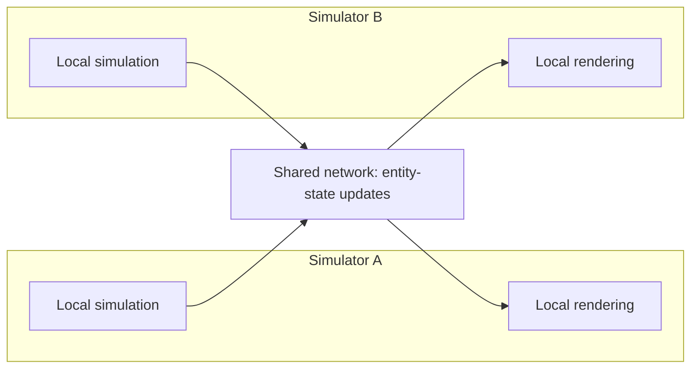
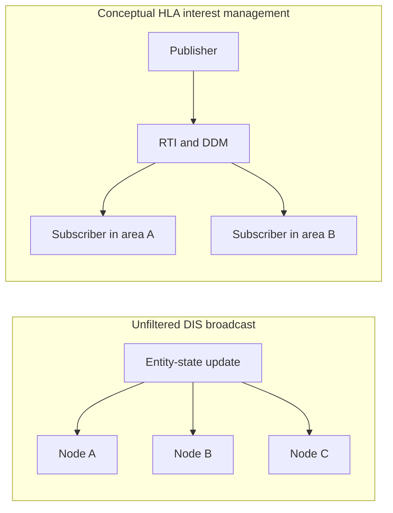
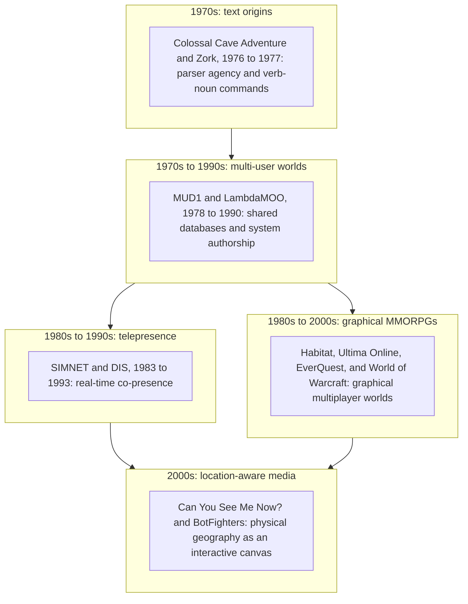
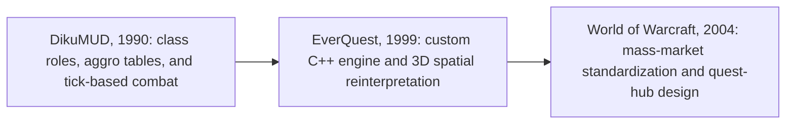

Interactive systems have changed how stories can be authored, experienced and revisited. We are moving from linear, passive media consumption, "looking through a window", to spatial, dynamic co-creation, where participants step through the frame into shared digital realities.

This is the first post in a 5-part series examining the technological, structural, and theoretical shifts that have redefined interactive media over the past five decades. We trace this trajectory from 1970s text-based multi-user environments to modern passthrough spatial computing (Apple Vision Pro, Meta Quest 3), open web rendering stacks (WebGPU, WebXR, WebTransport), and generative AI narrative directors. Along the way, we evaluate these developments against science-fiction benchmarks such as The OASIS, Sword Art Online, and the Star Trek Holodeck. We also examine foundational ideas and theories, including Janet H. Murray’s 2016 edition of Hamlet on the Holodeck and Judith Donath’s work on virtual identity, against today’s capabilities.

## The 5-part series roadmap

1. Part 1: From Text to Telepresence (This Post): Exploring text parsers (Zork), MUDs/MOOs, DARPA’s SIMNET/DIS military protocol, Judith Donath's identity signaling theory, and early location-aware media.
2. [Part 2: Place, Space, and Passthrough](/place-space-and-passthrough/): Examining how the shift from legacy AR (HoloLens, Magic Leap) to video passthrough (Vision Pro, Quest 3) and controllerless optical gesture tracking grounds stories in physical architecture.
3. [Part 3: The Engine Under the Hood](/the-engine-under-the-hood/): Deconstructing the modern web stack (WebGPU compute shaders, low-latency WebRTC pixel streaming, WebTransport UDP datagrams, VPS geofencing, and LLM Meta-Narrative Directors).
4. [Part 4: Sci-Fi Realities and Benchmarks](/sci-fi-realities-and-benchmarks/): Benchmarking current tech against Ready Player One (The OASIS), Sword Art Online (Full-Dive VR), and the Star Trek Holodeck.
5. [Part 5: Revisiting Murray’s Holodeck](/revisiting-murrays-holodeck/): Re-evaluating Janet H. Murray’s 2016 updated theoretical framework (Hamlet on the Holodeck, MIT Press) in the era of generative AI co-creation and spatial computing.

## Storytelling before the screen space

When modern observers imagine immersive digital worlds, they often picture photorealistic graphics engines, ray-traced dynamic lighting, and high-density micro-OLED displays strapped to a user’s face. However, this visual bias can obscure an important historical point: early text systems already explored several mechanics associated with digital immersion, long before head-mounted displays or 3D GPUs existed.

### The illusion of visuals

Early digital immersion did not rely on visual fidelity; it relied on human cognition and textual projection. Just as a reader projects vivid imagery onto the blank page of a novel, early digital participants used their own imaginations as the ultimate graphics pipeline. What made these early systems truly revolutionary was not how they looked, but how they behaved.

### The paradigm shift

Many storytelling forms, including oral epics, printed novels, and cinematic films, usually present a largely authored sequence, even though performance, interpretation, and audience participation can make them dynamic. Interactive digital media adds another kind of participation: it can make the audience an active agent who inspects, alters, and expands a stateful world.

> "Interactive media transforms storytelling from a static sequence of events into a responsive system of rules, state changes, and spatial affordances."
>
> Janet H. Murray, Hamlet on the Holodeck: the Future of Narrative in Cyberspace (MIT Press, 2016 Edition)

## Single-player precursors and text-based emergence (1970s–1990s)

To trace how participants evolved from passive readers into real-time system architects, we must start with the birth of interactive text parsers and the rapid expansion of multi-user dungeoncrawls through university networks.

### Single-player parsers and reader agency

In 1976, Will Crowther, a programmer and caving enthusiast, wrote Colossal Cave Adventure on a DEC PDP-10 mainframe to entertain his daughters. Expanded in 1977 by Don Woods, Adventure streamlined the command structure into two-word commands (GO EAST, GET LAMP) that fit the limited memory and processing power of 1970s mainframes and personal computers. ([Critical Code Studies Conference - Week Three Discussion](https://electronicbookreview.com/publications/critical-code-studies-conference-week-three-discussion/))

For the first time, a reader did not turn a page; they typed commands like go north, take lamp, or open grate. The software evaluated the command against an internal world graph, updated global state variables (e.g., inventory lists, room light levels), and returned a text description of the updated world.

```text
YOU ARE STANDING AT THE END OF A ROAD BEFORE A SMALL BRICK BUILDING.
AROUND YOU IS A FOREST. A SMALL STREAM FLOWS OUT OF THE BUILDING AND
DOWN A GULLY.

> enter building
YOU ARE INSIDE A BUILDING, A WELL HOUSE FOR A LARGE SPRING.
THERE IS A SHINY BRASS LAMP SITTING HERE.
THERE IS A BOTTLE OF WATER HERE.

> take lamp
OKAY.
```

Beginning in 1979, Infocom took this paradigm further with Zork. Powered by the Zork Implementation Language (ZIL) and the Z-Machine virtual computer, Zork introduced complex spatial logic, intricate inventory puzzles, and mechanical state tracking. The user was no longer merely reading a story; they were manipulating a state machine.

### The birth of MUD1 (1978)

In 1978, Roy Trubshaw and Richard Bartle created MUD (later known as MUD1) at the University of Essex.

> Trubshaw had two motivations to write MUD. First he had enjoyed single-player adventure games  (Crowther and Woods' ADVENT; Anderson, Blank, Daniels, and Lebling's Zork; Laird's HAUNT) and liked the idea of creating a multiplayer game along those lines.
>
> Secondly, he had a strong academic interest in writing programming language parsers and interpreters.
>
> Richard Bartle, *Designing Virtual Worlds* (2004)

The result was MUD1 (Multi-User Dungeon), the world's first networked, multi-user virtual environment. Initially, access was limited to University of Essex students using the university network. When the university gained access to ARPANET, MUD1 became available to users beyond the campus, creating a truly distributed networked environment. The world persistence it established became one of its defining innovations.

### The 1980s server divergence: combat vs. social and user-created worlds

Between MUD1 in 1978 and the rise of advanced object-oriented environments in the early 1990s, text-based online worlds underwent an explosive period of technical diversification across university mainframes and early online commercial networks (GEnie, CompuServe).

During the 1980s, the MUD landscape split into multiple branches. For the purposes of this article, the discussion focuses on two evolutionary trees:

* **The Combat and Progression Lineage**
  * **LPMud (1989)**: Created by Lars Pensjö, LPMud introduced LPC, an in-world C-like scripting language. This allowed game administrators and builders to write complex items, monsters, and quests without taking down or recompiling the core server.
  * **DikuMUD (1990)**: Developed by Sebastian Hammer, Tom Madsen, Katja Nyboe, Michael Seifert, and Hans Henrik Stærfeldt at DIKU (Department of Computer Science at the University of Copenhagen), DikuMUD delivered a streamlined, combat-focused C codebase centered around class roles, mob AI, tick-based health regeneration, and the "kill-loot-level" progression loop.

    It is important to distinguish between direct software implementation and conceptual design influence. Modern 3D MMORPGs such as EverQuest and World of Warcraft did not use DikuMUD source code. In a sworn statement dated March 17, 2000, Verant developers stated that EverQuest had been developed independently of the DikuMUD codebase, and the DikuMUD team subsequently published a statement accepting that clarification. DikuMUD's influence was instead visible in gameplay structures, terminology (such as "mob," "aggro," and "tanking"), and combat patterns that later designers adapted for graphical engines.

    As lead game designer Raph Koster (Ultima Online, EverQuest II) noted in his historical analysis "What is a Diku?":

    > "Diku codebases did eventually popularize many of the major developments in MUDs... the Diku gameplay provided inspiration for numerous MMORPGs, including EverQuest, World of Warcraft, and Ultima Online."
    >
    > Raph Koster, "What is a Diku?" (Raph Koster's Blog, Jan 9, 2009)

    One retrospective account connects EverQuest's design to TorilMUD, a DikuMUD derivative that Brad McQuaid reportedly played extensively. The author describes EverQuest as taking most of its design cues from TorilMUD, while noting that some elements had to be modified for a commercial, live-operations virtual world. ([Thirty Years of TorilMUD](https://tagn.wordpress.com/2023/12/15/thirty-years-of-toril-mud/))

    * Commercial Pay-Per-Hour MUDs: GemStone III, launched on GEnie in 1988, demonstrated the commercial potential of persistent text worlds. Players paid by the hour, with rates varying by service and time of day, while Simutronics reported peaks of more than 2,000 simultaneous users. ([Mulligan and Patrovsky, *Developing Online Games*](https://www.peachpit.com/store/developing-online-games-an-insiders-guide-9780321119367))
    * Avalon: The Legend Lives, launched in 1989, demonstrated persistent-world design, player-run governments, and political systems through UK dial-up and packet-based services.

* The Social and Constructionist Lineage
  * **TinyMUD (1989)**: Created by Jim Aspnes, TinyMUD stripped out combat statistics and level grinding entirely, refocusing the engine on conversation, spatial exploration, and user-driven building.
    * **MUSH and MUCK**: Evolved from TinyMUD to support collaborative storytelling, roleplay theater, and customizable spatial geography.
    * **LambdaMOO (1990)**: Developed by Pavel Curtis at Xerox PARC, LambdaMOO (MUD, Object-Oriented) was a notable example of text-based constructionism.

    In a MOO, authorship ceased to be about scripting linear plot lines. Authorship became system architecture:

    Object-Oriented World Modeling: Every entity, including rooms, players, items, and dynamic doors, was represented as an object in a persistent database with parent-child inheritance.

    In-world creation: Users did not leave the world to write content; they built the universe from within the running software using text commands and LPC/MOO verb scripting.

MUD History Timeline (1976–1999)

| Year | Milestone<br/>System | Historical Significance |
| --- | --- | --- |
| 1976 | Colossal Cave Adventure | Introduced the verb-noun text command parser and interactive spatial navigation. |
| 1977 | Zork (Infocom) | Advanced state-tracking, virtual machine architecture, and complex inventory puzzles. |
| 1978 | MUD1 (Univ. of Essex) | Roy Trubshaw and Richard Bartle build the first multi-user persistent virtual world. |
| 1984 | MUD1 on CompuServe | First commercial deployment of a multi-user text dungeon outside university networks. |
| 1988 | GemStone III (GEnie) | Commercial pay-per-hour model reaching thousands of concurrent players. |
| 1989 | Avalon: The Legend Lives | Introduces non-resetting persistent worlds, player-run governments, and political systems. |
| 1989 | LPMud and TinyMUD | LPMud introduces live LPC scripting; TinyMUD removes combat to focus on social building. |
| 1990 | DikuMUD | Combat-heavy C codebase popularizing the class/mob/loot loop re-engineered by 3D MMORPGs. |
| 1990 | LambdaMOO | Pavel Curtis (Xerox PARC) merges object-oriented inheritance with in-world end-user programming. |
| 1993 | A Rape in Cyberspace | The Mr. Bungle event on LambdaMOO becomes the starting point for Julian Dibbell's account of virtual ethics, community governance, and the consequences of online actions. |
| 1997 | Achaea / Iron Realms | Matt Mihaly launched an early text-based example of a free-to-play model funded by sales of virtual credits and items. Achaea was not the first game to sell virtual benefits, but it helped establish a commercially viable version of a model later known as free-to-play or microtransactions. |
| 1999 | EverQuest | Re-engineers DikuMUD's core combat/level gameplay loop into a ground-up 3D C++ engine. |

## In-world creation and command syntax examples

In constructionist environments like LambdaMOO, users acted as real-time system architects. The following examples use LambdaMOO version 1.8.1 syntax. They are intended to work in current installations that support these commands, but behavior may vary with server configuration and version differences. A participant could carve out new geographic topology and instantiate persistent objects on the fly using typed spatial construction commands:

**Illustrative transcript:**

```text
@dig north to Great Hall
@describe Great Hall as "A vast stone chamber illuminated by flickering iron torches."
@create glowing sword
@describe glowing sword as "An ancient blade etched with runic glyphs."
```

Beyond static geometry, LambdaMOO 1.8.1 allowed users to attach dynamic code directly to objects using verb programming:

**Illustrative transcript:**

```text
@verb sword:rub
@program sword:rub
  player:tell("You rub the blade. A faint blue aura pulses along its edge.");
  this.location:announce_except(player, player.name + " rubs the sword, causing it to hum softly.");
@end
```

Through simple scripts like this, early participants illustrated an early form of procedural media, in which rules respond to user input.

## Identity, signaling, and deception in virtual spaces

As text environments evolved from technical novelty into persistent social worlds, they severed the physical anchor connecting one human body to one identity.

### Judith Donath’s identity framework

In her paper "Identity and Deception in the Virtual Community" (1999), Judith Donath examined how people establish identity and trust when many of the physical cues present in face-to-face interaction are absent. Writing primarily about Usenet, she distinguished between **assessment signals**, whose reliability is connected to demonstrated traits or meaningful costs, and **conventional signals**, which depend on shared interpretation and are easier to imitate. In online communities, account history, writing style, reputation, and sustained participation can therefore provide stronger evidence of identity than a user's self-description.

This framework also helps explain identity and trust in text-based virtual worlds. Because users could easily invent names, roles, and biographies, communities often relied on reputation and observable participation accumulated over time. These signals were useful, but they were not infallible.

### Narrative case study: LambdaMOO and digital ethics

This tension reached a dramatic boiling point in 1993, when a user named Mr. Bungle deployed a malicious "sub-routine" script inside LambdaMOO that spoofed command outputs, forcing other users' characters to perform explicit, non-consensual sexual acts in public chat logs. Julian Dibbell begins *My Tiny Life: Crime and Passion in a Virtual World* with this incident and follows its consequences within the MOO and in the lives of the people outside it.

Dibbell captured the profound psychological impact of this event:

> "They took place in a room... that was totally imaginary... And yet, to look back on that night... is to know that whatever happened inside that room happened to real people, and left real psychological wounds."
>
> Julian Dibbell, *My Tiny Life: Crime and Passion in a Virtual World* (1998)

This event sent shockwaves through early cyber-culture:

* **Real Emotional Weight**: It showed that virtual actions, even when conveyed strictly through ASCII text lines, can inflict real psychological, emotional, and social consequences on the humans behind the avatars.
* **Birth of Digital Governance**: The LambdaMOO community was forced to grapple with questions of virtual law, digital enforcement, and community moderation, ultimately leading Pavel Curtis to hand governance tools directly over to the user community via ballot systems.
* **Identity Boundaries**: It showed that virtual space is never "just a game." It established the psychological foundation of spatial identity, a concept that remains relevant as we navigate AI-generated deepfakes and avatar impersonation in spatial computing.

## SIMNET and DIS: the military blueprint for co-presence (1980s–1990s)

While text-based communities were discovering digital ethics, the military was quietly solving the hard networking architecture required to put dozens of humans into the same synthetic space simultaneously.

**DARPA's SIMNET Project**

In the mid-1980s, DARPA launched SIMNET (Simulator Network), led by program manager Jack Thorpe. The project connected tank simulators at geographically distant military bases in a shared, synchronized virtual battlefield over bandwidth-constrained 56 kbps long-haul lines. ([Distributed interactive simulation: It's past, present, and future](https://ieeexplore.ieee.org/document/873276); [SIMNET and Beyond](https://www.iitsec.org/-/media/sites/iitsec/link-attachments/iitsec-fellows/2015_fellowpaper_miller.ashx))




### The invention of shared telepresence

SIMNET contributed to the development of the Distributed Interactive Simulation (DIS) protocol, later standardized as IEEE 1278. DIS used a distributed communication model in which participating simulation nodes exchanged entity-state Protocol Data Units rather than relying on one central server to calculate every vehicle's position. Each node maintained the local terrain and entity-state data needed to simulate and display the shared exercise. ([Networked Virtual Environments](https://www.researchgate.net/publication/314475366_Networked_Virtual_Environments); [IEEE Standard for Distributed Interactive Simulation](https://ieeexplore.ieee.org/document/873276))

* **Distributed state updates**: In an unfiltered broadcast or multicast deployment, nodes could send entity-state updates to many participating hosts. This was a distributed simulation model, but not necessarily a peer-to-peer overlay in the modern networking sense.
* **Dead reckoning**: To conserve bandwidth, a simulator predicted an entity's movement between updates. It could send a new state update when the prediction exceeded a configured error threshold, when a significant state changed, or periodically through heartbeat updates. ([Modelling of Dead Reckoning and Heartbeat Update Mechanisms in Distributed Interactive Simulation](https://www.researchgate.net/publication/328782049_Modelling_of_Dead_Reckoning_and_Heartbeat_Update_Mechanisms_in_Distributed_Interactive_Simulation))

SIMNET demonstrated how distributed simulation could create co-presence, the perception that other participants share the same synthetic environment in real time.

### Scaling distributed simulation

As military training requirements expanded from company-level exercises to larger battalion-, brigade-, and division-scale scenarios, the number of simulated entities and state updates increased substantially.

In an unfiltered broadcast deployment, each update could be delivered to many or all participating nodes. If every entity's updates reached every other node, aggregate delivery and processing costs could approach $N(N-1)$, or $O(N^2)$. The actual cost depended on update frequency, network topology, filtering, and the distribution of entities.



As distributed simulation requirements expanded, the U.S. Department of Defense introduced HLA (High Level Architecture, IEEE 1516) as a broader interoperability architecture. HLA provided services such as publish and subscribe and Data Distribution Management (DDM). In a spatial simulation, DDM could match publication and subscription regions so that participants received updates relevant to their area of interest rather than every update in the federation. This filtering could reduce local delivery and processing load, but it did not guarantee a universal $O(N)$ routing complexity. (See Dahmann, Fujimoto, and Weatherly, "The Department of Defense High Level Architecture," and the IEEE HLA standard in the bibliography.)

HLA's use of publish and subscribe and region-based filtering provides a useful architectural comparison for modern systems that distribute updates according to spatial interest. It is a comparison, not evidence that HLA was the exact blueprint for today's spatial-web edge servers.

## From MUDs to MMORPGs and early location-based games

The technological and social foundations laid by MUDs and SIMNET influenced modern graphical multiplayer media.



### The graphical leap: from EverQuest to World of Warcraft

When Lucasfilm released Habitat (1986), followed by Richard Garriott’s Ultima Online (1997) and Sony’s EverQuest (1999), the industry celebrated a graphical revolution. But underneath the 2D sprites and 3D polygons, these games were not brand-new conceptual inventions; they adapted ideas from MUDs and other text-based gaming experiences while implementing them in their own engines and data architectures.

When an EverQuest or Ultima Online character swung a sword, the game combined an animated presentation with its own combat and world-state systems. The resemblance to a Diku-style combat loop was one of gameplay lineage, not evidence that a text roll was being rendered directly from a shared MUD database.

In 2004, Blizzard Entertainment released World of Warcraft (WoW), representing the mass-market maturation of this lineage. Rather than inventing a new mechanical template, Blizzard refined and standardized gameplay patterns associated with Diku-derived games, including class roles, quest hubs, instanced dungeon runs, and aggro tables. The connection also included a documented transfer of design experience from EverQuest communities into WoW's interface and quest structure, but that influence should not be confused with shared source code or database architecture.



### Breaking out of desktop monitors

By the early 2000s, creators realized that if text rooms could be mapped to virtual database nodes, they could also be mapped to physical geographic coordinates.

Pioneering location-aware experiments transformed the physical world into an interactive canvas:

* Blast Theory's *Can You See Me Now?* (2001): Online players navigated a virtual 3D city map while street runners equipped with GPS-enabled handheld computers ran through actual city streets, hunting the virtual players down. (Flintham et al., 2003; Benford et al., 2006)
* *BotFighters* (2001): An early location-based mobile game for GSM phones that used coarse carrier-based positioning, commonly described as cellular positioning or triangulation, to turn urban neighborhoods into physical battle arenas. Its use of Cell-ID and related network positioning illustrates how the game worked within the limitations of pre-GPS mobile hardware. (Sotamaa, 2002; de Souza e Silva and Hjorth, 2009)

These experiments replaced textual MUD "rooms" with geographic positions or virtual maps. They can be understood as one historical bridge between network telepresence and modern augmented reality, rather than as a direct or linear origin story.

## Takeaways and transition to Part 2

As we trace the lineage from 1970s text parsers to early location-aware games, several lessons emerge for modern creators:

* **Agency Over Fidelity**: Immersion can depend on player agency and meaningful world-state changes, not only on raw pixel counts.
* **Co-Presence as the Engine**: Realizing that another human shares your synthetic environment is an important source of narrative engagement.
* **Architecture is Narrative**: Writing system rules, database objects, and network interest bubbles is as much an act of storytelling as writing script dialogue.
* **Signaling and Ethics**: Removing physical body anchors necessitates clear assessment signals to prevent identity deception and build social trust.

## Looking ahead to Part 2

Now that we have examined how storytelling broke free from linear pages into multi-user network databases, where does interactive media go when it breaks free from desktop monitors entirely?

In Part 2: Place, Space, and Passthrough, we explore how physical architecture, video passthrough hardware (Apple Vision Pro, Meta Quest 3), HRTF spatial audio, and controllerless optical hand tracking extend or supplement typed text commands, turning our physical living rooms into interactive narrative stages.

## References

Arcturus, W. (2023, December 15). [Thirty years of TorilMUD](https://tagn.wordpress.com/2023/12/15/thirty-years-of-toril-mud/). The Ancient Gaming Noob.

Aspnes, J. (1989). *TinyMUD* [Computer software]. Carnegie Mellon University.

Bartle, R. A. (2003). *Designing virtual worlds*. New Riders Publishing.

Bartle, R. A., & Trubshaw, R. (1978). *MUD1* [Computer software]. University of Essex / DEC PDP-10.

Benford, S., Crabtree, A., Flintham, M., Drozd, A., Anastasi, R., Paxton, M., Tandavanitj, N., Adams, M., & Row-Farr, J. (2006). [Can you see me now?](https://doi.org/10.1145/1143518.1143522). *ACM Transactions on Computer-Human Interaction, 13*(1), 100–133.

Blast Theory. (2001). *Can you see me now?* [Interactive location-based game]. Commissioned by the Institute of Contemporary Arts (ICA), London.

Calvin, J., et al. (1993). [The SIMNET architecture for distributed interactive simulation](https://doi.org/10.1109/38.210488). *IEEE Computer Graphics and Applications, 13*(3), 72–78.

Crowther, W., & Woods, D. (1976–1977). *Colossal Cave Adventure* [Computer software]. DEC PDP-10.

Curtis, P. (1990). *LambdaMOO* [Computer software]. Xerox Palo Alto Research Center (PARC).

Curtis, P. (1992). [Mudding: Social phenomena in text-based virtual realities](https://www.researchgate.net/publication/2763495_MUDding_Social_Phenomena_in_Text-Based_Virtual_Realities). Xerox Palo Alto Research Center (PARC).

Curtis, P., & Nichols, D. (1993). [MUDs grow up: Social virtual reality in the real world](https://www.researchgate.net/publication/2812522_MUDs_Grow_Up_Social_Virtual_Reality_in_the_Real_World). Xerox Palo Alto Research Center (PARC).

Dahmann, J. S., Fujimoto, R. M., & Weatherly, R. M. (1997). [The Department of Defense high level architecture](https://doi.org/10.1109/WSC.1997.640391). *Proceedings of the 1997 Winter Simulation Conference*. Open copy: [INFORMS Simulation archive](https://www.informs-sim.org/wsc97papers/0142.PDF).

de Souza e Silva, A., & Hjorth, L. (2009). Playful urban spaces: A historical approach to mobile games. *Simulation & Gaming, 40*(5), 602–625.

Dibbell, J. (1998). [*My tiny life: Crime and passion in a virtual world*](http://www.juliandibbell.com/texts/mytinylife.html). Henry Holt and Company.

DikuMUD Development Team. (2000, March 17). [DikuMUD / EverQuest joint resolution](https://dikumud.com/everquest/).

Donath, J. S. (1999). [Identity and deception in the virtual community](https://smg.media.mit.edu/papers/Donath/IdentityDeception/IdentityDeception.html). In M. A. Smith & P. Kollock (Eds.), *Communities in cyberspace* (pp. 29–59). Routledge.

Flintham, M., Benford, S., Anastasi, R., Hemmings, T., Crabtree, A., Greenhalgh, C., Tandavanitj, N., Adams, M., & Row-Farr, J. (2003). [Where on-line meets on the streets: Experiences with mobile mixed reality games](https://doi.org/10.1145/642611.642710). In *Proceedings of the SIGCHI Conference on Human Factors in Computing Systems* (pp. 569–576). ACM.

Fujimoto, R. M. (2000). [*Parallel and distributed simulation systems*](https://www.wiley.com/en-us/Parallel+and+Distributed+Simulation+Systems-p-9780471183839). Wiley.

Hammer, S., Madsen, T., Nyboe, K., Seifert, M., & Stærfeldt, H. H. (1990). *DikuMUD* [Computer software]. Department of Computer Science (DIKU), University of Copenhagen.

Hu, S.-Y., & Huang, J.-H. (2004). [ALM-based spatial publish/subscribe for distributed virtual environments](https://doi.org/10.1109/INFCOM.2004.1354536). *IEEE International Conference on Communications*.

IEEE. (1995). [*IEEE standard for distributed interactive simulation (DIS), application protocols*](https://standards.ieee.org/ieee/1278.1/4096/) (IEEE Std 1278.1-1995). Institute of Electrical and Electronics Engineers.

IEEE. (2000). [*IEEE standard for modeling and simulation high level architecture (HLA), framework and rules*](https://standards.ieee.org/ieee/1516/) (IEEE Std 1516-2000). Institute of Electrical and Electronics Engineers.

Iron Realms Entertainment. (2021). [The history of MUD games: From MUD1 (1978) to today](https://www.ironrealms.com/mud-games/the-history-of-muds/). Iron Realms Archives.

Jerz, D. (2011, May 25). [Critical code studies conference, week three discussion](https://electronicbookreview.com/publications/critical-code-studies-conference-week-three-discussion/). Electronic Book Review.

Koster, R. (2009, January 9). [What is a Diku?](https://www.raphkoster.com/2009/01/09/what-is-a-diku/). Raph Koster's Blog.

Lebling, P. D., Blank, M. S., & Anderson, T. A. (1977). *Zork: The great underground empire* [Computer software]. Infocom / DEC PDP-10.

Macedonia, M. R. (1994). [NPSNET: A network software architecture for large-scale virtual environments](https://doi.org/10.1162/pres.1994.3.4.265). *Presence: Teleoperators and Virtual Environments, 3*(4), 265–287. Open repository copy: [Calhoun](https://calhoun.nps.edu/handle/10945/41562).

Macedonia, M. R. (1995a). [A network architecture for large-scale virtual environments](https://calhoun.nps.edu/handle/10945/31333) (Doctoral dissertation). Naval Postgraduate School.

Macedonia, M. R., Zyda, M. J., et al. (1995b). [Exploiting reality with multicast groups: A network architecture for large-scale virtual environments](https://doi.org/10.1109/38.403826). *IEEE Virtual Reality Annual International Symposium*. Open repository copy: [Calhoun](https://calhoun.nps.edu/handle/10945/41562).

Mihaly, M. (1997). *Achaea: Dreams of divine lands* [Computer software]. Iron Realms Entertainment.

Miller, D. C. (2015). [*SIMNET and beyond: A history of the development of distributed simulation*](https://www.iitsec.org/-/media/sites/iitsec/link-attachments/iitsec-fellows/2015_fellowpaper_miller.ashx). National Training and Simulation Association.

Mills, M. (2020, April 15). [Achaea: The game where microtransactions cost hundreds of dollars](https://www.rockpapershotgun.com/achaea-the-game-where-microtransactions-cost-hundreds-of-dollars). *Rock Paper Shotgun*.

Morse, K. L. (1996). [Interest management in large-scale distributed simulations](https://escholarship.org/uc/item/9n9895jx) (Technical Report TR-96-27). University of California, Irvine.

Morse, K. L., & Steinman, J. S. (1997). Data distribution management in the HLA: Multidimensional regions and physically correct filtering. *Proceedings of the Spring Simulation Interoperability Workshop*. SISO Conference Archive.

Morse, K. L., et al. (2000). [An efficient sort-based DDM matching algorithm for HLA applications with a large spatial environment](https://doi.org/10.1109/DISRTA.2000.884218). *Workshop on Distributed Simulation and Real-Time Applications*.

Morningstar, F. R., & Farmer, F. R. (1991). The lessons of Lucasfilm's Habitat. In M. Benedikt (Ed.), *Cyberspace: First steps* (pp. 273–301). MIT Press.

Mulligan, J., & Patrovsky, B. (2003). *Developing online games: An insider's guide*. New Riders / Peachpit Press.

Murray, J. H. (2016). *Hamlet on the holodeck: The future of narrative in cyberspace* (Updated ed.). MIT Press.

Pensjö, L. (1989). *LPMud / LPC* [Computer software]. Chalmers University of Technology.

Pope, A. (1989). [The SIMNET network and protocols](https://apps.dtic.mil/sti/citations/ADA218356) (BBN Report No. 7102). Bolt Beranek and Newman Inc.

Reed, A. A. (2021). [1997: Achaea](https://if50.substack.com/p/1997-achaea). *50 Years of Text Games*.

Singhal, S., & Zyda, M. (1999). [*Networked virtual environments: Design and implementation*](https://dl.acm.org/doi/book/10.5555/553641). ACM Press and Addison-Wesley.

Sotamaa, O. (2002). All the world's a BotFighter stage: Notes on location-based multi-user gaming. In *Proceedings of the Computer Games and Digital Cultures Conference*.
