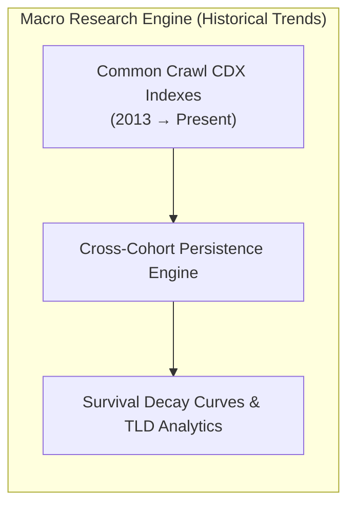
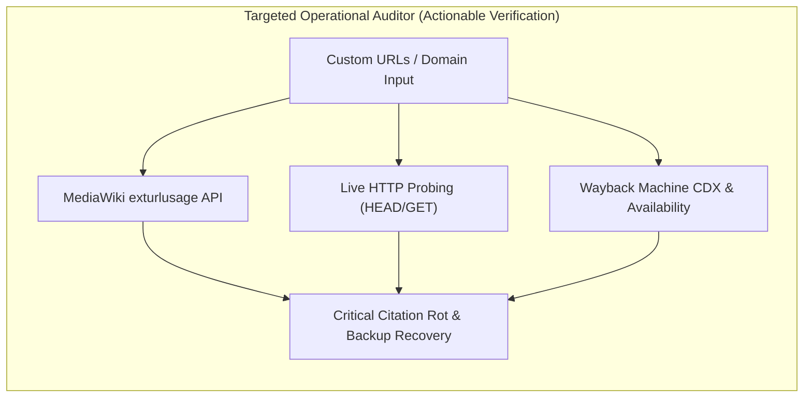
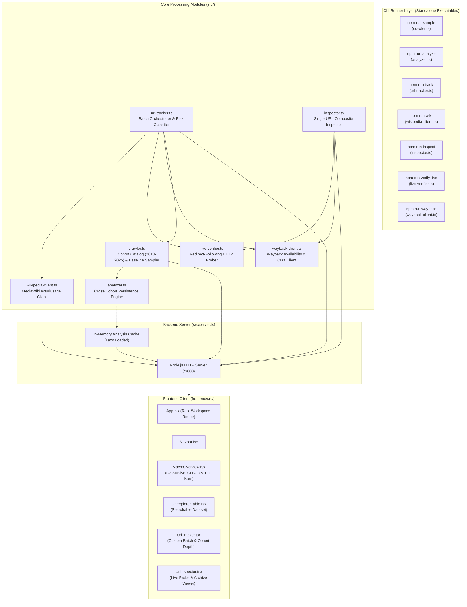
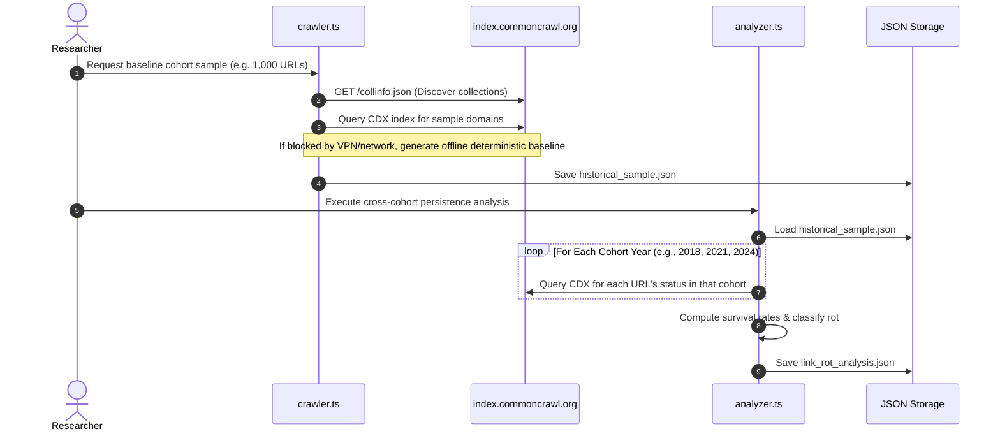
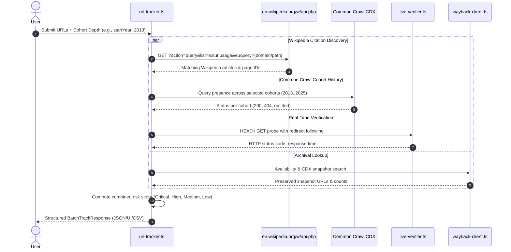
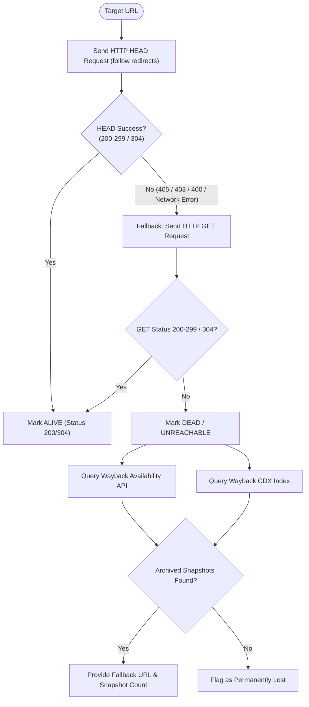
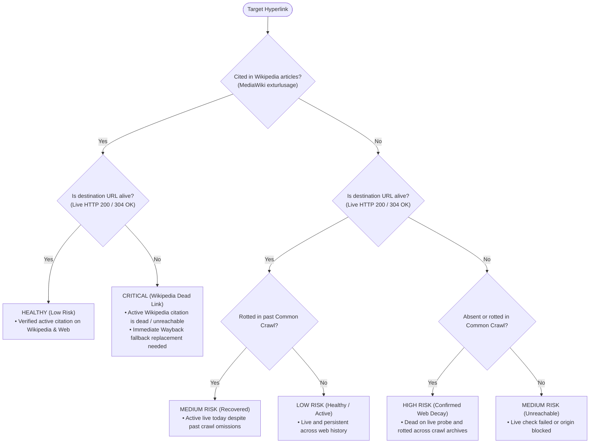
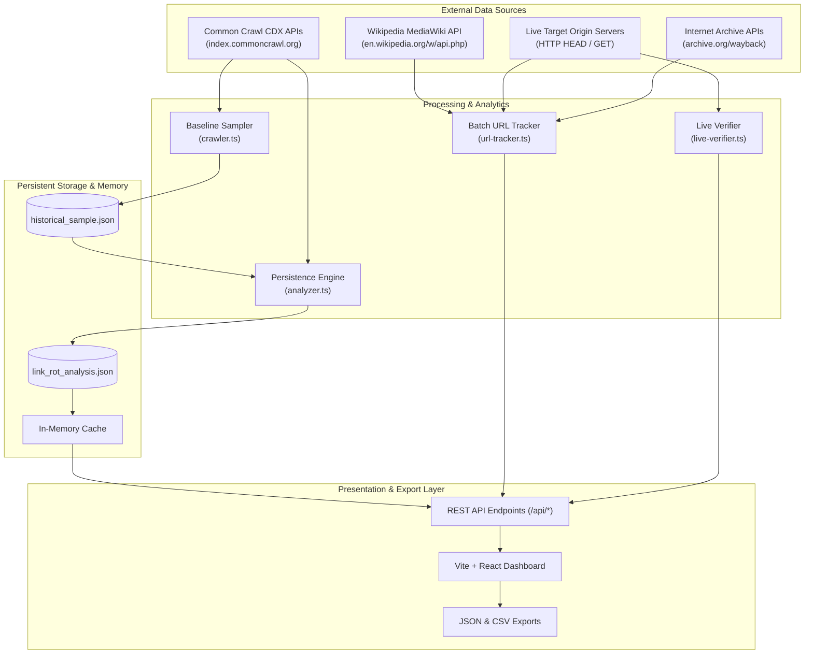

There's nothing more infuriating than encountering a dead link when you're trying to access information on the web.

Rather than manually checking each link for its availability and archival status, the Link Rot Analyzer automates this process, providing both broad longitudinal insights and targeted auditing capabilities.

This post provides a system overview of the Link Rot Analyzer, detailing its architecture, components, and the methodologies it employs for both longitudinal analysis and targeted auditing.

## The two types of link rot analysis

Link rot is the process by which hyperlinks on the World Wide Web cease to point to their originally targeted web page, server, or resource over time.

The **Link Rot Analyzer** addresses two distinct challenges in link rot research and remediation:

**Longitudinal Analysis**: Quantifies structural decay rates across large, random, longitudinal samples of the web over 5 to 12+ years using [Common Crawl](https://commoncrawl.org/) historical archives.

**Targeted Auditing**: Audits arbitrary URLs, determining whether they are cited in [Wikipedia](https://www.wikipedia.org/) articles, whether they are dead, and whether archival snapshots exist on the [Internet Archive Wayback Machine](https://archive.org/web/).

These tools help researchers and web developers analyze the prevalence and patterns of link rot over time, providing insights into the stability and longevity of web content.

## System architecture & component topology

The platform is designed with **strict decoupling**, each subsystem can run as a standalone CLI tool, as an isolated API endpoint, or through the React frontend.

## Deep-dive: The core processes

### Macro historical decay modeling (Common Crawl)

The historical decay tool models how URLs from an initial, random, baseline cohort (e.g., 2018 or 2013) persist or disappear across subsequent crawl years. This tool uses historical [Common Crawl](https://index.commoncrawl.org/) snapshots to track URL survival over time.

When analyzing link rot on a macro level, researchers construct mathematical decay models (similar to radioactive half-life calculations) to predict how long digital resources survive. Utilizing a truly randomized sample—such as selecting URLs from large-scale web dumps like the Common Crawl archive—is superior for several foundational statistical reasons:

#### Eliminating survivorship and selection bias

If a model relies on curated, active, or high-profile links (e.g., links from current popular blogs, top-tier news sites, or academic citations), it introduces severe bias. High-traffic websites are actively maintained and far less prone to immediate decay. Conversely, studying only specific dead-pooled spaces overrepresents rot. Random sampling ensures that ephemeral, personal, and minor sites are captured proportionally, reflecting the real composition of the web.

### True representation of web diversity

The internet consists of vastly different top-level domains (.com, .gov, .edu, .org), content types, and hosting architectures, each decaying at widely varying speeds. For instance:

* **Academic & Legal Citations**: Highly curated but exhibit surprisingly distinct decay trajectories due to institutional page moves.
* **Social Media & Feeds**: Rapid decay rates where content can vanish in a matter of months.
* **Government Sites**: Shift dramatically during political administration transitions.

1. **Cohort Discovery**: `crawler.ts` fetches `https://index.commoncrawl.org/collinfo.json` to enumerate all available crawls from 2013 to 2025.
2. **Baseline Sampling**: A diverse sample of URLs is captured from the earliest cohort (e.g., `CC-MAIN-2018-17`).
3. **Cross-Cohort Evaluation**: `analyzer.ts` iterates through subsequent crawl snapshots (e.g., 2021, 2024) and queries the CDX index server for each URL.
4. **Persistence Mathematics**:
   $$\text{Survival Rate}(Y) = \frac{\text{Count of URLs alive in cohort } Y}{\text{Total baseline URLs}} \times 100$$
5. **Lazy Loading**: The backend server caches this dataset in memory upon first request to `/api/summary` or `/api/urls`, ensuring instantaneous response times for subsequent queries.

### Wikipedia citation & dual-source tracking

The citation and dual-source tracking feature allows users to input custom URLs and discover whether those URLs are actively cited in Wikipedia articles, check their historical crawl presence across configurable cohorts, and assess link rot vulnerability.

Most URLs will not be cited in Wikipedia articles, but the system still tracks their historical presence across Common Crawl cohorts and verifies their real-time availability.

1. **Normalization**: `normalizeUrlForWikipedia()` strips protocols (`http://`, `https://`) and URL fragments (`#section`), formatting the string for MediaWiki's `euquery` parameter.
2. **MediaWiki Query**: Hits `https://en.wikipedia.org/w/api.php?action=query&list=exturlusage` (restricted to namespace `0` for main encyclopedic articles).
3. **Configurable Historical Depth**: Resolves the exact list of Common Crawl cohorts requested (e.g., full 11+ year depth from 2013, 10-year decade, or custom step intervals).
4. **Parallel Execution**: Uses `Promise.all` to run the Wikipedia, Common Crawl, live HTTP, and Wayback checks for each URL in parallel, while batching URLs so the analyzer does not send hundreds of requests to these services in a short period and trigger blacklisting.

### Targeted live verification & Internet Archive fallback

Targeted Live Verification & Internet Archive Fallback performs high-speed, accurate live HTTP verification and retrieves preserved Wayback Machine fallbacks for broken links, if available.

The tool leverages HTTP `HEAD` requests for live verification and `GET` as fallback requests when necessary, ensuring minimal bandwidth usage while maintaining accuracy.

1. **Smart Probing**: Initiates a fast `HEAD` request to reduce bandwidth. If the origin server rejects `HEAD` (HTTP 405 Method Not Allowed) or blocks automated HEAD requests (HTTP 403/400), it automatically falls back to an HTTP `GET` with complete redirect following.
2. **Reconciliation**: If a URL is missing from historical Common Crawl indexes but responds with `200 OK` on a live check, it is classified as *Recovered / Transient Historical Outage* rather than true link rot.
3. **Dual-API Wayback Search**: Hits both the Internet Archive **Availability API** (for fastest closest snapshot retrieval) and the **CDX Server API** (for total snapshot count and earliest archive date).

### Interactive UI & D3 visualization workspaces

Interactive UI & D3 Visualization Workspaces provide an accessible, responsive React dashboard that allows researchers to inspect data visually without cross-tab blocking.

* **Workspace Independence**: The React frontend (`App.tsx`) routes between 4 completely decoupled views:
  1. `MacroOverview.tsx`: D3 survival decay curves, donut charts, TLD distributions, top domain statistics.
  2. `UrlExplorerTable.tsx`: Searchable, filterable pagination table for the baseline crawl dataset.
  3. `UrlTracker.tsx`: Interactive multi-URL submission form with cohort preset selection, depth sliders, Wikipedia citation links, and CSV/JSON export.
  4. `UrlInspector.tsx`: Deep-dive live HTTP header inspector and Wayback timeline viewer.
* **Non-Blocking Architecture**: If the macro benchmark dataset is still generating or re-analyzing, users can use the URL Tracker and URL Inspector without interruption.

## Component relationship & coupling matrix

| Component | Primary Function | Upstream Dependencies | Downstream Consumers | Standalone CLI Command |
| :---: | --- | --- | --- | --- |
| **`crawler.ts`** | Common Crawl collection discovery & baseline sampling | Common Crawl Index API | `analyzer.ts`, `url-tracker.ts`, `server.ts` | `npm run sample` |
| **`analyzer.ts`** | Cross-cohort survival modeling & DuckDB analytics | `crawler.ts`, Common Crawl CDX | `server.ts` (lazy cached) | `npm run analyze` |
| **`live-verifier.ts`** | Lightweight HTTP probing & redirect tracing | Node.js native `fetch` | `inspector.ts`, `url-tracker.ts` | `npm run verify-live -- <url>` |
| **`wayback-client.ts`** | Internet Archive snapshot lookup & counts | Wayback Availability & CDX APIs | `inspector.ts`, `url-tracker.ts` | `npm run wayback -- <url>` |
| **`wikipedia-client.ts`** | External citation discovery in Wikipedia articles | MediaWiki API (`exturlusage`) | `url-tracker.ts`, `server.ts` | `npm run wiki -- <url>` |
| **`url-tracker.ts`** | Dual-source batch orchestrator & risk classification | `wikipedia-client`, `crawler`, `live-verifier`, `wayback-client` | `server.ts`, UI (`UrlTracker.tsx`) | `npm run track -- <urls...>` |
| **`inspector.ts`** | Single-URL composite inspection & recommendation | `live-verifier`, `wayback-client` | `server.ts`, UI (`UrlInspector.tsx`) | `npm run inspect -- <url>` |
| **`server.ts`** | Local HTTP REST API & static asset hosting | All `src/` modules | Frontend client (`api.ts`), CLI tools | `npm run server` |

## Classification logic & risk scoring engine

The platform uses a multi-factor risk matrix to classify hyperlinks:

### Risk tier definitions

1. **`CRITICAL` (Wikipedia Dead Link Risk)**:
   * **Condition**: Cited as an external reference on one or more Wikipedia pages, but returns `404 Not Found`, connection reset, or HTTP error on real-time verification.
   * **Action**: Immediate archival fallback replacement recommended.
2. **`HIGH` (Confirmed Web Decay)**:
   * **Condition**: Dead on live HTTP verification and absent or rotted across historical Common Crawl snapshots.
3. **`MEDIUM` (Recovered / Historical Crawl Omission)**:
   * **Condition**: Absent or errored in historical crawl archives, but currently responding `200 OK` on live probing.
4. **`LOW` (Verified Active)**:
   * **Condition**: Responding with valid `200 OK` or `304 Not Modified` headers on live probe.

## Data flow diagrams

### Complete system data flow

## Persistence mathematics & academic foundations

The platform's analytical models are derived from **Longitudinal Cohort Survival Analysis**, which tracks the same baseline group of URLs across later web captures to measure how many remain available, and from the academic literature on web graph reliability and digital preservation.

### Mathematical formulation

#### Longitudinal cohort survival rate $S(t_i)$

Given a baseline cohort of URLs $N_0$ sampled from Common Crawl, the analyzer evaluates each URL across three Common Crawl captures, such as 2018, 2021, and 2024. If a URL appears dead in any of the three captures, the project routes it through its classification and action logic, using later captures and live or Wayback checks to distinguish a transient omission, a recovered URL, or confirmed decay:

$$S(t_i) = \frac{N_{\text{alive}}(t_i)}{N_0} \times 100$$

Where $N_{\text{alive}}(t_i)$ represents the count of baseline URLs with an HTTP success code ($200 \le \text{status} < 300$ or $304$) in the capture for cohort year $t_i$. The project records the result for each capture rather than treating a single dead observation as conclusive link rot.

#### Cumulative link rot rate $R(t_i)$

The cumulative link rot percentage at any observed cohort $t_i$ is the exact complement of the survival rate:

$$R(t_i) = 100\% - S(t_i) = \frac{N_0 - N_{\text{alive}}(t_i)}{N_0} \times 100$$

#### Exponential decay & web half-life model

The following exponential equation is an approximation used to model expected web persistence over time $t$ (in years). It differs from the empirical survival calculation above, which counts the URLs observed as alive in each Common Crawl capture:

$$S(t) = S_0 \cdot e^{-\lambda t}$$

Where $\lambda$ is the empirical hazard rate per year. The **hyperlink half-life** ($t_{1/2}$), the duration after which 50% of the original links are broken, is derived as:

$$t_{1/2} = \frac{\ln(2)}{\lambda}$$

### Empirical research & literature references

The thresholds, cohort structures, and verification algorithms in this tool are grounded in the following foundational research:

**Pew Research Center (2024)**. *["When Online Content Disappears"](https://www.pewresearch.org/data-labs/2024/05/17/when-online-content-disappears/)* (Venkataramani, A., Bestvater, S., et al., May 2024).
: Examined nearly 1 million web pages across 2013–2023. Found that **38% of web pages from 2013 were completely inaccessible by 2023**, and **54% of Wikipedia pages contained at least one broken citation** in their "References" section.
: Direct impact on tool: Established the MediaWiki `exturlusage` citation auditor (`wikipedia-client.ts`) and the 2013–2025 cohort depth selector.

**Koehler, W. (2002)**. *["A longitudinal study of Web pages continued: a consideration of document persistence"](https://doi.org/10.1002/asi.10018)*. *Information Research*, 9(2).
**Koehler, W. (2004)**. *"A longitudinal study of web pages: 1996–2001"*. *Journal of the American Society for Information Science and Technology (JASIST)*, 55(2), 162–166. [DOI: 10.1002/asi.10367](https://doi.org/10.1002/asi.10367).
: Formulated the exponential decay mathematics for web documents and empirically measured the half-life of web citations ($t_{1/2} \approx 4.5\text{–}5\text{ years}$).

**Klein, M., Van de Sompel, H., Sanderson, R., Shankar, H., Balakireva, L., & Zhou, K. (2014)**. *"Scholarly Context Not Found: One in Five Articles Suffers from Reference Rot"*. *PLOS ONE*, 9(12), e115253. [DOI: 10.1371/journal.pone.0115253](https://doi.org/10.1371/journal.pone.0115253).
: Established the rigorous distinction between *Link Rot* (HTTP 404/DNS resolution failure) and *Content Drift* (the URL resolves, but the content changed), informing the cross-cohort persistence tracking methodology.

**Bar-Yossef, Z., Broder, A. Z., Kumar, R., & Tomkins, A. (2004)**. *"Sic transit gloria telae: towards an understanding of the web's decay"*. *Proceedings of the 13th International Conference on World Wide Web (WWW '04)*, 328–337. [DOI: 10.1145/988672.988716](https://doi.org/10.1145/988672.988716).
: Modeled decay dynamics in search engine crawlers and formulated corrections to distinguish transient crawler omissions from structural link rot.

**Zittrain, J., Albert, K., & Lessig, L. (2014/2021)**. *["Perma: Scoping and Addressing the Problem of Link and Reference Rot in Legal Citations"](https://harvardlawreview.org/forum/vol-127/perma-scoping-and-addressing-the-problem-of-link-and-reference-rot-in-legal-citations/)*. *Harvard Law Review Forum*, 127, 176.
: Demonstrated that 50% of hyperlinks in Supreme Court opinions no longer functioned, highlighting the urgency of real-time archival fallback resolution.

## Summary & key takeaways

The Link Rot Analyzer bridges **macro web preservation research** with **tactical citation auditing**:

* **Independent**: Any component can be executed as a standalone CLI script (`npm run <module>`).
* **Decoupled**: Heavy historical data loading does not block real-time URL tracking or inspection.
* **Accurate**: Combining historical crawl indexes with real-time HTTP verification eliminates false positives from transient crawl omissions.
* **Actionable**: Identifies specific broken citations on Wikipedia and provides immediate Internet Archive Wayback Machine fallback links.
