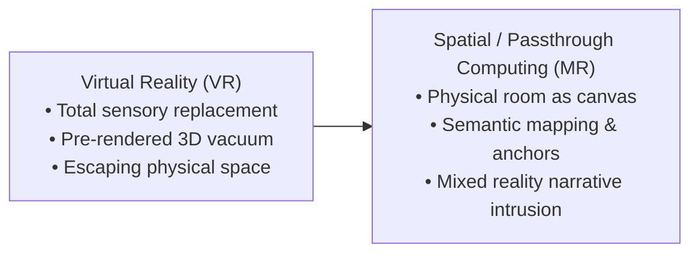
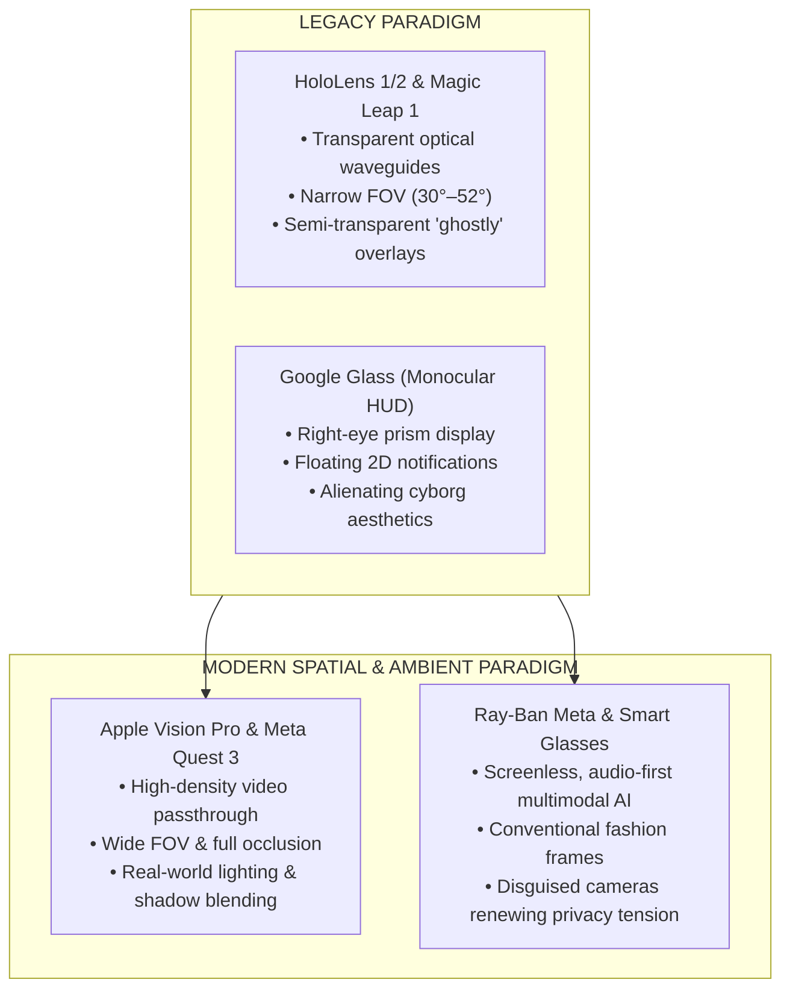
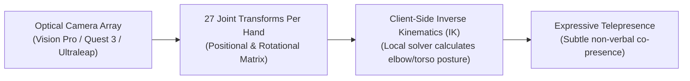
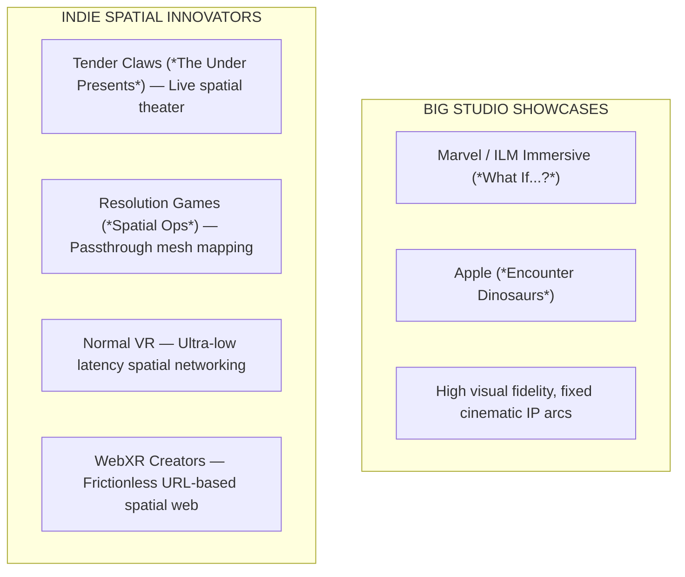

When Virtual Reality (VR) captured public imagination in the mid-2010s, the design paradigm was clear: total sensory replacement. The goal was to blindfold the user from physical reality and transport them into a fully synthesized, pre-rendered 3D vacuum.

However, as head-mounted displays evolved from heavy, tethered VR boxes into lightweight, high-density optical and video passthrough systems, a more profound narrative affordance emerged: spatial grounding.

Instead of escaping physical space, modern spatial computing layers digital narrative directly over physical architecture. The physical room, table, or city street ceases to be an obstacle; it becomes the canvas, stage, and co-author of the experience.



## From Virtual Reality to Mixed Reality: The Power of Spatial Grounding

The transition from VR to Mixed Reality (MR) represents a fundamental shift in how human cognition processes digital stories.

### Replacing Reality vs. Layering Story Over Space

In traditional VR, the user's brain must suspend disbelief to accept an entirely artificial environment. If a virtual character sits on a virtual chair, the illusion holds only as long as the user doesn't try to touch the chair.

In spatial computing, story elements intrude upon real physical architecture. When a digital entity sits on your physical sofa or casts a shadow across your living room rug, the cognitive threshold for suspension of disbelief drops dramatically. The user does not have to pretend they are somewhere else; the fiction has invaded their immediate reality.

### The Concept of "Spatial Grounding"

Spatial grounding occurs when a narrative engine anchors digital state changes to real-world physical properties. Real-world surroundings alter the emotional resonance of the narrative. A horror story set inside an abstract virtual castle is terrifying; the same horror story experienced in your own hallway—where a virtual anomaly cracks open your actual bedroom closet door—is psychologically visceral.

### Hardware Evolution: What Replaced Legacy Platforms?

To understand how spatial narrative reached this point, we must analyze the hardware transition from legacy transparent optical AR and monocular displays to modern video passthrough spatial computing and ambient smart glasses.

### Hardware Transition Matrix

| Platform Era | Representative Hardware | Display & Optics Architecture | Key Narrative & Interaction Limits |
| --- | --- | --- | --- |
| Legacy Optical AR | Microsoft HoloLens 1 & 2 (Discontinued) | Transparent diffractive waveguides; narrow field-of-view (30°–52° FOV). | Low brightness, severe visual clipping, ghosted/semi-transparent holograms, limited outdoor usability. |
| Consumer Misfires | Magic Leap 1 (Sunsetted) | Photonic lightfield chips; dual-focal plane optical waveguides. | High cost, complex external puck tether, narrow FOV, consumer content void. |
| Monocular HUDs | Google Glass / Enterprise Prism Displays | Monocular right-eye glass prism display; floating 2D notification UI. | Zero spatial understanding; no room mesh; requires upward eye-gaze toward a small floating box. |
| Modern Passthrough | Apple Vision Pro & Meta Quest 3 / 3S | Dual 4K micro-OLED / LCD displays with high-density full-color video passthrough cameras. | Occlusion-capable photorealism, wide FOV, high-density pixel rendering, sub-12ms passthrough latency. |
| Ambient Smart Glasses | Ray-Ban Meta Smart Glasses / XREAL / Orion | Screenless optical frames; open-ear audio, camera/sensor array, multimodal LLM awareness. | Audio-first ambient storytelling; contextual vision without heavy visors; heightened bystander privacy friction. |




### Optical See-Through vs. Video Passthrough

Before evaluating why display architectures diverged, we must clearly define these competing hardware mechanisms:

* **Optical See-Through (OST)**: The user looks directly through transparent glass or optical waveguides at the physical world. An optical engine projects light onto the glass, layering virtual holograms directly over the physical photons entering the eye (e.g., Microsoft HoloLens, Magic Leap).
* **Video Passthrough (VST)**: The user is physically enclosed by an opaque near-eye display screen (micro-OLED or LCD). External high-resolution camera arrays continuously capture the physical surroundings in real time, send the video feed to a GPU, composite 3D digital elements over the pixels, and render the merged video feed back to the user's eyes at sub-12-millisecond latency (e.g., Apple Vision Pro, Meta Quest 3).

Why did video passthrough win the immediate consumer spatial computing race over transparent optical see-through waveguides?

1. **Occlusion & Opacity**: Optical see-through displays cannot easily project "black" or solid dark colors because ambient light from the real world passes directly through the glass. Digital objects appear ghostly and translucent. Video passthrough digitizes the real-world camera feed first, allowing the GPU to render fully opaque digital objects that block light from the real world completely.
2. **Field of View (FOV)**: Waveguide optics suffer from severe physical limits in bending light, capping transparent AR FOV to ~50°. Video passthrough uses high-resolution camera lenses that match the wide FOV of standard VR headsets (100°+).
3. **Focal Blending & Lighting**: Video passthrough allows dynamic real-time relighting. A virtual lamp can project real-time light onto the video feed of your physical carpet, matching the physical room's color temperature and shadow directions.

### Monocular Prism HUDs vs. Ambient Audio-AI Smart Glasses

It is equally critical to distinguish legacy monocular heads-up displays (like Google Glass) from modern ambient smart glasses (like Ray-Ban Meta):

* **Monocular Glass Prisms (Google Glass)**: Google Glass relied on a tiny glass prism positioned above the user's right eye, acting as a small, floating 2D notification screen. It possessed zero 3D spatial mesh understanding and required the user to look up continuously at an artificial display box.
* **Screenless Ambient Smart Glasses (Ray-Ban Meta)**: Unlike HUDs or waveguide AR, standard Ray-Ban Meta smart glasses have no display in the lenses whatsoever. The user looks through ordinary glass. Interaction is entirely audio-first and multimodal: open-ear directional speakers paired with an onboard camera and LLM vision model ("Meta AI").

### The Wearer vs. Bystander Privacy Friction

While smart glasses solved the wearer's aesthetic friction by integrating electronics into iconic fashion frames (e.g., Wayfarer styles), they did not eliminate social friction—they reshaped it:

* **Aesthetic Acceptance for the Wearer**: Unlike the alienating, cyborg-like metal band of Google Glass, consumer smart glasses look indistinguishable from ordinary eyewear, removing the wearer's hesitation to wear them in daily life.
* **Amplified Bystander Privacy Tension**: Because the high-resolution camera and microphone arrays are disguised inside normal fashion frames, surrounding bystanders cannot easily tell when they are being recorded or analyzed by multimodal AI. Consequently, covert recording fears, venue bans (in movie theaters, gyms, restrooms, and performance halls), and social mistrust remain just as intense as—and in many contexts more severe than—during the original "Glasshole" era.

### Controllerless Optical Gesture Tracking & Inverse Kinematics

Another critical hardware leap is the removal of handheld plastic controllers in favor of camera-based optical hand and joint tracking (e.g., Ultraleap Controller 2 sensor arrays, Vision Pro hand-tracking pipelines, Quest 3 optical arrays).

Instead of forcing users to memorize button combinations (`Trigger + A`), optical tracking captures 27 joint points per hand. When combined with client-side Inverse Kinematics (IK), a mathematical solver running locally on the device that calculates unobserved joint angles (like elbows, shoulders, and knees) using only a few tracked endpoints (like hands and head), the system reconstructs full-body posture, torso orientation, and micro-gestures without requiring heavy sensors on every limb.



This transition fundamentally alters user agency:

* **Natural Expressive Telepresence**: In multi-user spatial environments, subtle hand twitches, pointing, and relaxed posture convey non-verbal social signals that plastic controllers completely sanitize.
* **Low Network Payload**: Transmitting skeletal transform matrices over low-latency protocols requires minimal bandwidth, allowing dense multi-user co-presence without network congestion.

## Identity and Spatial Tele-Presence: Donath on Tele-Presence and Identity Signaling

In her essay "Being Real" (2007) and her foundational research on digital communication ("Identity and Deception in the Virtual Community", 1999), Judith Donath provided an essential theoretical foundation for understanding identity, authenticity, and tele-presence in mediated environments. Rather than serving as a software engineering framework, Donath's work offers a sharp analytical lens that explains why spatial co-presence feels so cognitively powerful—and why spatial deception feels uniquely invasive.

### Unbundling Body from Location

In physical reality, identity and geography are tethered by biology: a human body can only exist in one physical location at a given moment, emitting continuous physical signals (facial expressions, voice timbre, physical proximity).

Spatial computing and video passthrough sever this tether. In spatial tele-presence, a participant sits physically in their own living room while their digital avatar or volumetric spatial capture is rendered in another person's physical space thousands of miles away.

Donath points out that mediated tele-presence shifts the burden of trust onto technological signals. When an avatar enters your physical room via passthrough AR, your brain's spatial processing system registers the entity as an inhabitant of your immediate physical sanctuary. This psychological shift—moving from watching a avatar on a flat screen to perceiving an entity sitting on your real couch—elevates the cognitive weight of the interaction.

### Conventional vs. Assessment Signals in Spatial Environments

Donath's distinction between conventional signals and assessment signals becomes intensely practical when applied to spatial computing and generative AI:

* **Conventional Signals in Spatial Computing**: Claims or digital assets that carry low production costs and are easily fabricated or spoofed. An avatar's visual fidelity, custom 3D clothes, a rendered background, or a typed/synthesized claim about where someone is located are conventional signals. In an era of real-time deepfakes and AI avatar generation, conventional signals carry almost zero inherent proof of authenticity.
* **Assessment Signals in Spatial Computing**: Indicators that possess a structural, physical, or cryptographic link to reality, making them inherently costly or difficult to forge. In spatial computing, assessment signals include:
  * **Physical Mesh Interaction**: The organic, unpredictable micro-adjustments an avatar makes when interacting with a mapped physical room (e.g., sitting naturally on a physical chair using real-time local IK solvers rather than clipping through geometry).
  * **Biometric & Kinematic Micro-Signaling**: Subtle, continuous non-verbal cues—eye gaze micro-saccades, pupillary reflexes, and natural skeletal joint movements captured at sub-millisecond latency—that reflect genuine human neuro-physiology rather than scripted loops.
  * **Cryptographic Attestations**: Verifiable cryptographic proofs (such as Zero-Knowledge hardware attestations) confirming that a spatial stream originates from an authenticated headset and user rather than a spoofed camera feed or AI generator.

By applying Donath's signaling analysis to spatial storytelling, creators understand why users instinctively mistrust overly polished, static digital avatars, yet respond deeply to raw, kinematically authentic spatial tele-presence. Grounding digital identity in verifiable assessment signals is essential for preserving narrative trust in shared spatial computing.

## Audio-Only AR: Beyond the Stereo Audiobook

While visual spatial computing receives the majority of public attention, Audio-Only Augmented Reality (Audio AR) represents one of the most expressive, accessible, and lightweight frontiers of spatial storytelling.


### Defining Audio-Only AR vs. Traditional Audio Media

It is essential to distinguish Audio-Only AR from traditional audiobooks, podcasts, or radio dramas:

* **Audiobooks & Podcasts (Linear / Static)**: Traditional audio media delivers a pre-recorded, linear stereo or binaural stream. Regardless of whether the listener turns their head, sits down, or walks down the street, the audio mix remains completely static relative to the listener's ears.
* **Audio-Only AR (Dynamic / Spatialized)**: Audio AR uses real-time 6DOF (Six Degrees of Freedom) head tracking and geographic or indoor spatial anchors to lock virtual sound sources to precise 3D physical coordinates.

In Audio AR, your physical body acts as the playback scrubber and camera angle:

* **Spatial Attenuation & Head-Related Transfer Function (HRTF)**: If a virtual narrator or historical figure is anchored to a specific park bench on your left, turning your head to the right causes the sound to pan behind your left ear using HRTF binaural filters.
* **Physical Locomotion as Scrubber**: Walking closer to the bench increases the volume and alters the direct-to-reverberant audio ratio; walking away causes the sound to fade into ambient background noise.
* **Acoustic Environment Matching**: Advanced spatial audio engines sample the surrounding room mesh to apply matching reverberation algorithms (e.g., matching the sharp acoustic reflections of a concrete alleyway vs. the dampened acoustics of a carpeted bedroom).

Smart glasses and spatial earbuds enable ambient Audio AR experiences where narrative soundscapes layer continuously over daily life without blinding the user with screen displays.

## Mechanics of Place-Based & Spatial Storytelling

Building narrative experiences for spatial computing requires a new set of system mechanics designed around room architecture and spatial perception.

### Semantic Room Mapping & Spatial Anchors

Legacy mobile AR relied on crude GPS geofencing (~5m–10m accuracy) or basic horizontal plane detection. Modern spatial computing uses semantic room mapping.

The device's spatial sensors scan the room and categorize physical surfaces into a semantic node graph:


* `surface_type: "chair"`, `bounds: [x, y, z]`
* `surface_type: "wall"`, `has_door: true`
* `surface_type: "table"`, `material: "wood"`

```ts
// Conceptual Semantic Spatial Mesh Query
const roomMesh = await navigator.xr.requestHitTestResult();
if (roomMesh.semanticType === 'table') {
  instantiateNarrativeProp('ancient_scroll', roomMesh.position);
}
```

This semantic understanding changes narrative design:

* **Contextual Spawning**: Instead of spawning a virtual character in mid-air, the narrative engine instructs an NPC to walk over and sit on the user's actual, mapped couch.
* **Structural Integration**: A sci-fi anomaly doesn't just appear on a screen; it creates a procedural "hole" in the user's physical wall, revealing a virtual starship corridor behind the drywall.

### Spatial Audio as a Directional Guide

Without a fixed 2D TV screen or cinema frame, how do creators direct user attention in a 360-degree room?

Traditional games use UI arrows or forced camera cuts. Spatial computing uses spatial audio cues. An HRTF-filtered whisper behind the user's left shoulder naturally triggers the human startle reflex, causing the user to turn their head precisely toward the intended narrative beat without requiring intrusive visual UI.

### The Concept of "Mixed Reality Intrusion"

Mixed reality intrusion is a storytelling trope unique to spatial computing. The narrative relies on the fiction invading the user's safe, familiar physical sanctuary. Genres that thrive in this medium include:

* **Spatial Horror**: Anomalies, haunting entities, or creature attacks occurring in your real living room.
* **Historical Overlays**: Standing on a modern city corner while passthrough layers reveal the same street during historical events.
* **Contextual AI Companions**: Persistent virtual companions that sit on your desk, observe your real-world activities through multimodal vision, and converse naturally.

## Real-World Case Studies: Big Studios and Indie Innovators

The spatial computing ecosystem is driven by two distinct creative forces: high-budget flagship studio showcases and agile indie developers pushing mechanical boundaries.

### Flagship Studio Showcases & Location-Based Precursors

* **GPS Location Antecedents (Ingress, Pokémon GO)**: Demonstrated that mapping digital gameplay loops to physical geographic nodes creates massive real-world player engagement.
* **Spatial Narrative Releases (What If...? An Immersive Story, Encounter Dinosaurs)**: Apple Vision Pro releases produced by Marvel/ILM Immersive and Apple that demonstrate photorealistic passthrough blending, where virtual portals tear open real physical ceilings and prehistoric creatures interact with living room floor planes.

### Spotlight on Indie Spatial Developers

While major studios focus on high-fidelity cinematic IPs, independent developers are driving the most radical mechanical and narrative experimentation in spatial computing:

* **Tender Claws (The Under Presents, Virtual Virtual Reality, Stranger Things VR)**: Tender Claws has consistently pioneered narrative agency in XR. In The Under Presents, they blended live immersive theater (real actors wearing VR headsets interacting with players) with spatial room manipulation, proving that co-presence and theatrical agency transcend static game scripting.
* **Resolution Games (Demeo, Spatial Ops)**: Resolution Games demonstrated how tabletop board games (Demeo) and room-scale tactical passthrough shooters (Spatial Ops) can turn any domestic living room into an interactive spatial playground using real-time semantic mesh mapping.
* **Normal VR (Nock)**: Normal VR developed custom physics and low-latency networking tools that allow real-time multi-user physical interactions in shared spatial environments with sub-millisecond gesture responsiveness.
* **WebXR Indie Creators**: Independent web developers leveraging Three.js, A-Frame, and WebGPU to deploy instant-access spatial narratives directly via URLs, bypassing traditional app store review delays and heavy installation friction.



## Design Challenges & Environmental Unpredictability

Designing stories for physical spaces introduces severe design constraints that do not exist in linear media or traditional video games.

### Uncontrolled Physical Environments

In a traditional video game, the developer controls every wall, light source, and obstacle. In spatial computing, the developer has zero control over the user's room size, lighting conditions, or clutter.

* **The Small Room Problem**: A narrative script designed for a wide open living room will break if played inside a tiny dorm room or airplane seat. Creators must use procedural room scaling—dynamically shrinking or rearranging spatial narrative props to fit mapped physical boundaries.
* **Safety & Chaperone Boundaries**: Spatial stories must account for user safety. If a narrative encourages a user to chase a virtual entity, the spatial system must dynamically blend passthrough visual bounds to prevent real-world collisions with physical furniture.

### Locomotion vs. Physical Boundaries

How does a user explore a vast virtual castle when they are physically bounded by a 3-meter by 3-meter room?

* **Passthrough Portals**: The user stays inside their physical room, but looks through spatial "windows" or "portals" into infinite virtual landscapes.
* **Redirected Walking & Teleportation**: Blending physical 1:1 walking for room-scale interaction with discrete spatial teleportation mechanics for long-distance travel.

### Conclusion & Transition to Part 3

Hardware and spatial mapping capabilities have finally caught up to spatial narrative intent. Video passthrough, controllerless hand tracking, HRTF spatial audio, and semantic room mapping allow creators to treat the physical world as an active narrative stage.

However, spatial hardware is only as effective as the underlying software architecture that powers it. How do we render photorealistic volumetric lighting inside a web browser? How do we stream real-time skeletal joint data across global networks without latency jitter?

In Part 3: The Engine Under the Hood, we open the software stack—examining Native Spatial OSs (visionOS, Horizon OS) versus the Open Web Stack (WebGPU, WebXR, WebRTC, WebTransport) and detailing how generative AI acts as a dynamic narrative director.

### Bibliography & Works Cited

Apple Inc. (2024). [visionOS Developer Documentation & ARKit Spatial Mapping](https://developer.apple.com/visionos/). Apple Developer Archives.

Donath, J. S. (2007). [Being Real](https://smg.media.mit.edu/papers/Donath/BeingReal/BeingReal.html). In Digital Media and Identity (pp. 1–24). MIT Media Lab.

Hauser, K. (2021). [Inverse Kinematics](https://motion.cs.illinois.edu/RoboticSystems/InverseKinematics.html). In Robotic Systems. University of Illinois Urbana-Champaign.

ILM Immersive & Marvel Studios. (2024). What If...? An Immersive Story [Spatial computing software]. Apple Vision Pro.

Meta Platforms. (2023–2024). [Meta Quest 3 Passthrough SDK & Horizon OS Building Blocks](https://developer.oculus.com/). Meta Developers.

Normal VR. (2022). [Nock & Normcore Spatial Networking Framework](https://normcore.io/). Normal VR.

Resolution Games. (2022–2024). Demeo & Spatial Ops [Spatial computing software]. Resolution Games.

Tender Claws. (2019). The Under Presents [Interactive XR theater software]. Oculus Quest / SteamVR.

Ultraleap. (2023). Ultraleap Controller 2 & Hyperion Hand Tracking Software. Ultraleap Engine Docs.
