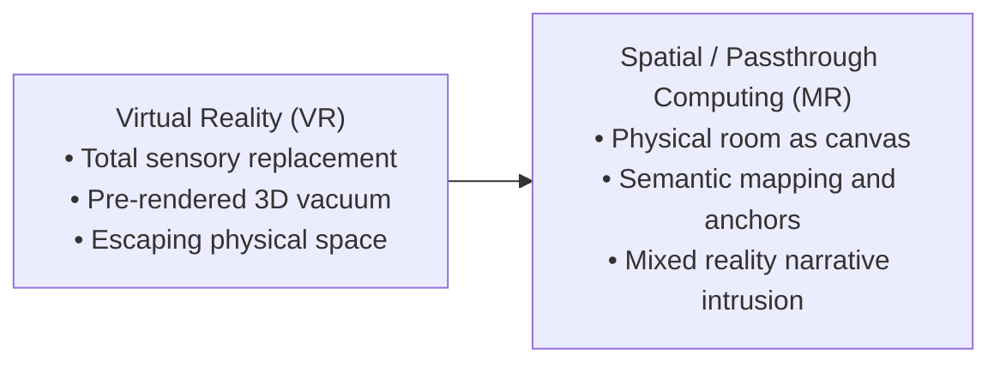
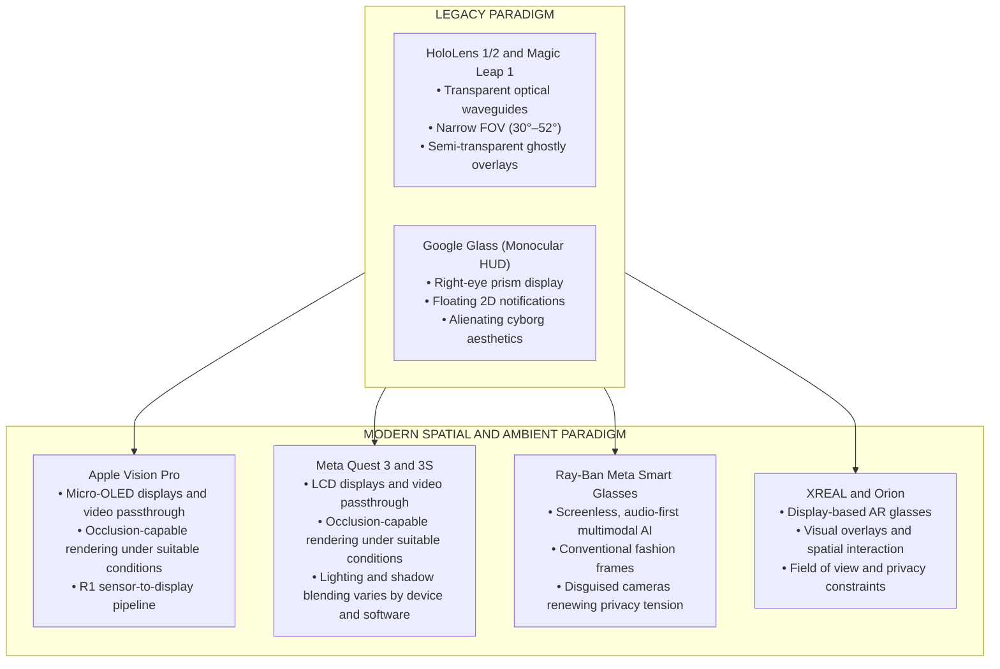
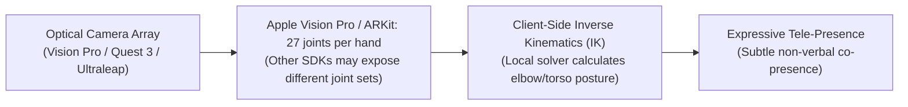
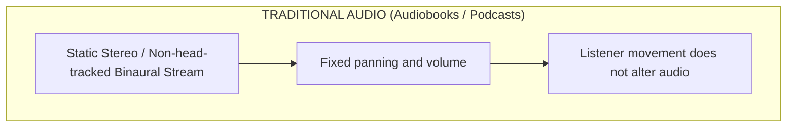
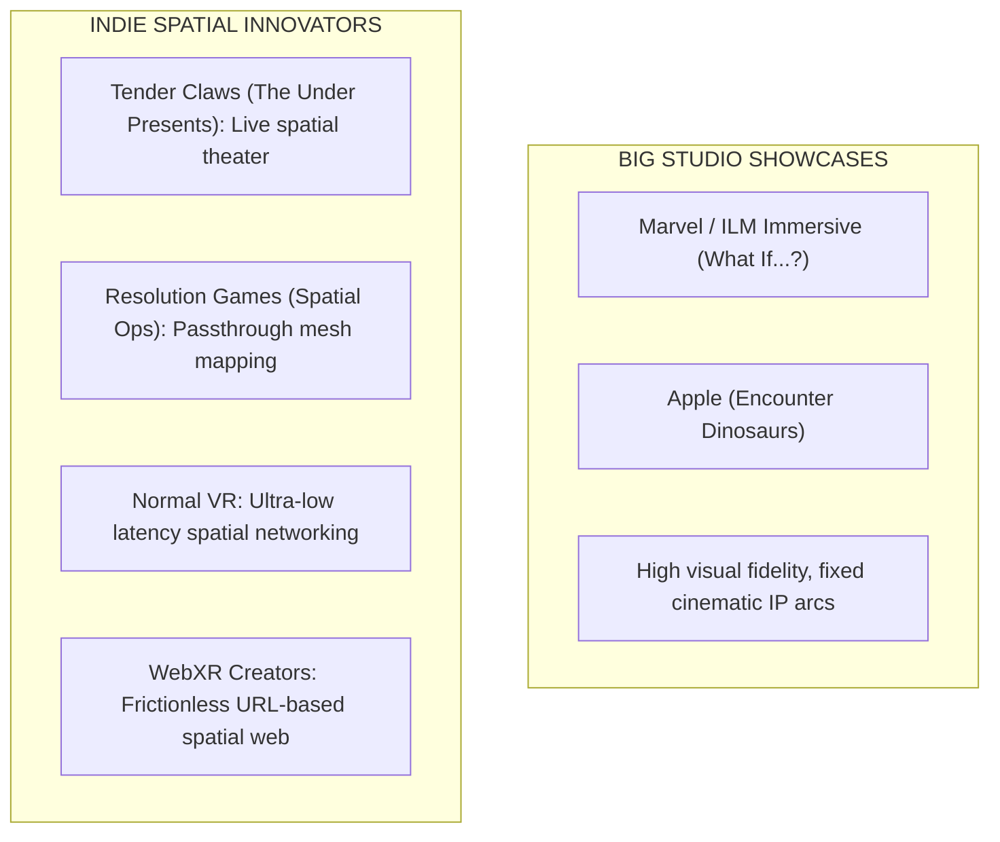

When Virtual Reality (VR) captured public imagination in the mid-2010s, the design paradigm was clear: total sensory replacement. The goal was to blindfold the user from physical reality and transport them into a fully synthesized, pre-rendered 3D vacuum.

However, as head-mounted displays evolved from heavy, tethered VR boxes into lightweight, high-density optical and video passthrough systems, a more profound narrative affordance emerged: spatial grounding.

Instead of escaping physical space, modern spatial computing layers digital narrative directly over physical architecture. The physical room, table, or city street ceases to be an obstacle; it becomes the canvas, stage, and co-author of the experience.



## From Virtual Reality to Mixed Reality: The Power of Spatial Grounding

The transition from VR to Mixed Reality (MR) represents a fundamental shift in how human cognition processes digital stories.

### Replacing Reality vs. Layering Story Over Space

In traditional VR, the user's brain must suspend disbelief to accept an entirely artificial environment. If a virtual character sits on a virtual chair, the illusion holds only as long as the user doesn't try to touch the chair.

In spatial computing, story elements can be anchored to real physical architecture. When a digital entity appears to sit on your physical sofa or cast a shadow across your living room rug, the juxtaposition may make the fiction feel more immediate. The user does not have to imagine an entirely separate setting; the experience can incorporate the user's immediate surroundings.

### The Concept of "Spatial Grounding"

Spatial grounding occurs when a narrative engine anchors digital state changes to real-world physical properties. Real-world surroundings can alter the emotional resonance of a narrative. A horror story set inside an abstract virtual castle may feel different from the same story experienced in your own hallway, where a virtual anomaly appears to crack open your actual bedroom closet door.

### Hardware Evolution: What Replaced Legacy Platforms?

To understand how spatial narrative reached this point, we must analyze the hardware transition from legacy transparent optical AR and monocular displays to modern video passthrough spatial computing and ambient smart glasses.

### Hardware Transition Matrix

| Platform Era | Representative Hardware | Display and Optics Architecture | Key Narrative and Interaction Limits |
| --- | --- | --- | --- |
| Legacy Optical AR | Microsoft HoloLens 1 and 2 (Discontinued) | Transparent diffractive waveguides; narrow field-of-view (30°–52° FOV). | Low brightness, severe visual clipping, ghosted/semi-transparent holograms, limited outdoor usability. |
| Consumer Misfires | Magic Leap 1 (Sunsetted) | Photonic lightfield chips; dual-focal plane optical waveguides. | High cost, complex external puck tether, narrow FOV, consumer content void. |
| Monocular HUDs | Google Glass / Enterprise Prism Displays | Monocular right-eye glass prism display; floating 2D notification UI. | Zero spatial understanding; no room mesh; requires upward eye-gaze toward a small floating box. |
| Modern Passthrough | Apple Vision Pro | Dual high-resolution micro-OLED displays with full-color video passthrough cameras. | Can support high-resolution video passthrough and occlusion-capable rendering under suitable lighting, software, and scene conditions. |
| Modern Passthrough | Meta Quest 3 / 3S | LCD displays with full-color video passthrough cameras. | Can support high-resolution video passthrough and occlusion-capable rendering under suitable lighting, software, and scene conditions. |
| Ambient Screenless Smart Glasses | Ray-Ban Meta Smart Glasses | Screenless optical frames; open-ear audio, camera, and microphone array; multimodal AI awareness. | Audio-first ambient storytelling and contextual vision without a display; heightened bystander privacy friction. |
| Display-Based AR Glasses | XREAL / Orion | Near-eye display system with cameras and sensors for spatial interaction. | Visual overlays and spatial computing without a full visor; field of view, battery life, weight, and privacy constraints. |




### Optical See-Through vs. Video Passthrough

Before evaluating why display architectures diverged, we must clearly define these competing hardware mechanisms:

* **Optical See-Through (OST)**: The user looks directly through transparent glass or optical waveguides at the physical world. An optical engine projects light onto the glass, layering virtual holograms directly over the physical photons entering the eye (e.g., Microsoft HoloLens, Magic Leap).
* **Video Passthrough (VST)**: The user is physically enclosed by an opaque near-eye display screen (micro-OLED or LCD). External high-resolution camera arrays continuously capture the physical surroundings in real time, send the video feed to a GPU, composite 3D digital elements over the pixels, and render the merged video feed back to the user's eyes. Apple describes the Vision Pro's R1 sensor-to-display pipeline as operating within 12 milliseconds, TechInsights provides an independent analysis of the R1's low-latency architecture, and OptoFidelity measured approximately 11 milliseconds of photon-to-photon see-through latency on the device (Apple Inc., 2023; OptoFidelity, 2024; TechInsights, n.d.). These figures describe a measured or specified latency for a particular device and test method, not a universal property of video passthrough (e.g., Apple Vision Pro, Meta Quest 3).

Why has video passthrough become prominent in consumer spatial computing, while transparent optical see-through waveguides remain important in enterprise and specialized applications?

1. **Occlusion and Opacity**: Optical see-through displays cannot easily project "black" or solid dark colors because ambient light from the real world passes directly through the glass. Digital objects appear ghostly and translucent. Video passthrough digitizes the real-world camera feed first, allowing the GPU to render fully opaque digital objects that block light from the real world completely.
2. **Field of View (FOV)**: Waveguide optics can limit the effective field of view of transparent AR displays, and the measured value varies by device. Video passthrough headsets can provide a wider VR-style display FOV, but the user's effective view is determined by the display optics, camera coverage, and software composition rather than by camera FOV alone.
3. **Focal Blending and Lighting**: Video passthrough can combine the camera feed with depth data and lighting estimates to blend virtual objects into the scene. This can improve apparent alignment, shading, and occlusion under suitable conditions, but it does not necessarily relight the camera image of real surfaces such as a physical carpet.

### Monocular Prism HUDs vs. Ambient Audio-AI Smart Glasses

It is equally critical to distinguish legacy monocular heads-up displays (like Google Glass) from modern ambient smart glasses (like Ray-Ban Meta):

* **Monocular Glass Prisms (Google Glass)**: Google Glass relied on a tiny glass prism positioned above the user's right eye, acting as a small, floating 2D notification screen. It possessed zero 3D spatial mesh understanding and required the user to look up continuously at an artificial display box.
* **Screenless Ambient Smart Glasses (Ray-Ban Meta)**: Unlike HUDs or waveguide AR, standard Ray-Ban Meta smart glasses have no display in the lenses whatsoever. The user looks through ordinary glass. Interaction is entirely audio-first and multimodal: open-ear directional speakers paired with an onboard camera and LLM vision model ("Meta AI").

### The Wearer vs. Bystander Privacy Friction

While smart glasses solved the wearer's aesthetic friction by integrating electronics into iconic fashion frames (e.g., Wayfarer styles), they did not eliminate social friction, they reshaped it:

* **Aesthetic Acceptance for the Wearer**: Unlike the alienating, cyborg-like metal band of Google Glass, consumer smart glasses look indistinguishable from ordinary eyewear, removing the wearer's hesitation to wear them in daily life.
* **Amplified Bystander Privacy Tension**: Because the high-resolution camera and microphone arrays are disguised inside normal fashion frames, surrounding bystanders cannot easily tell when they are being recorded or analyzed by multimodal AI. Consequently, covert recording fears, venue bans (in movie theaters, gyms, restrooms, and performance halls), and social mistrust remain just as intense as (and in many contexts more severe than) during the original "Glasshole" era.

### Controllerless Optical Gesture Tracking and Inverse Kinematics

Another critical hardware leap is the removal of handheld plastic controllers in favor of camera-based optical hand and joint tracking (e.g., Ultraleap Controller 2 sensor arrays, Vision Pro hand-tracking pipelines, Quest 3 optical arrays).

Instead of forcing users to memorize button combinations (`Trigger + A`), Apple Vision Pro's ARKit hand-tracking model exposes 27 named joints or reference entities per hand. Other hand-tracking SDKs may expose different joint sets. When combined with client-side Inverse Kinematics (IK), a mathematical solver running locally on the device, the tracked data can estimate unobserved joint angles, such as elbows, shoulders, and knees, from available endpoints such as the hands and head. These IK-derived values are estimates, not direct measurements, and can help reconstruct full-body posture, torso orientation, and micro-gestures without requiring heavy sensors on every limb ([Apple Developer, n.d.-a](https://developer.apple.com/documentation/arkit/handskeleton); [Apple Developer, n.d.-b](https://developer.apple.com/documentation/arkit/handskeleton/jointname)).



This transition fundamentally alters user agency:

* **Natural Expressive Tele-Presence**: In multi-user spatial environments, subtle hand twitches, pointing, and relaxed posture convey non-verbal social signals that plastic controllers completely sanitize.
* **Low Network Payload**: Transmitting skeletal transform matrices over low-latency protocols requires minimal bandwidth, allowing dense multi-user co-presence without network congestion.

## Identity and Spatial Tele-Presence: Donath on Tele-Presence and Identity Signaling

In her essay "Being Real" (2007) and her foundational research on digital communication ("Identity and Deception in the Virtual Community", 1999), Judith Donath provided an essential theoretical foundation for understanding identity, authenticity, and tele-presence in mediated environments. Rather than serving as a software engineering framework, Donath's work offers a sharp analytical lens that explains why spatial co-presence feels so cognitively powerful, and why spatial deception feels uniquely invasive.

### Unbundling Body from Location

In physical reality, identity and geography are tethered by biology: a human body can only exist in one physical location at a given moment, emitting continuous physical signals (facial expressions, voice timbre, physical proximity).

Spatial computing and video passthrough sever this tether. In spatial tele-presence, a participant sits physically in their own living room while their digital avatar or volumetric spatial capture is rendered in another person's physical space thousands of miles away.

Donath points out that mediated tele-presence shifts the burden of trust onto technological signals. When an avatar enters your physical room via passthrough AR, its apparent placement in that space may make the interaction feel more immediate than watching an avatar on a flat screen. The perceived presence of an entity sitting on your real couch can increase the emotional and social weight of the interaction, although the effect depends on the experience and the participant.

### Conventional vs. Assessment Signals in Spatial Environments

Donath's distinction between conventional signals and assessment signals becomes intensely practical when applied to spatial computing and generative AI:

* **Conventional Signals in Spatial Computing**: Claims or digital assets that carry low production costs and are easily fabricated or spoofed. An avatar's visual fidelity, custom 3D clothes, a rendered background, or a typed/synthesized claim about where someone is located are conventional signals. In an era of real-time deepfakes and AI avatar generation, conventional signals carry almost zero inherent proof of authenticity.
* **Assessment Signals in Spatial Computing**: Indicators that possess a structural, physical, or cryptographic link to reality, making them inherently costly or difficult to forge. In spatial computing, assessment signals include:
  * **Physical Mesh Interaction**: The organic, unpredictable micro-adjustments an avatar makes when interacting with a mapped physical room (e.g., sitting naturally on a physical chair using real-time local IK solvers rather than clipping through geometry).
    * **Biometric and Kinematic Micro-Signaling**: Eye gaze, pupillary responses, and natural skeletal motion can make an avatar appear more lifelike and can provide supporting evidence that a performance was captured from a live input stream. However, these signals are not proof of identity or authenticity by themselves. They can be synthesized, replayed, or altered. Stronger provenance requires a verified capture pipeline, such as signed sensor data, secure hardware attestation, or an authenticated live-session protocol.
    * **Cryptographic Attestations**: A hardware attestation is a signed statement produced by a device's secure hardware or trusted execution environment. Depending on the platform, it can attest that a cryptographic key was generated in protected hardware, that an approved application is running, or that the device satisfies a particular software and security state. Platform-backed examples include [Android Key Attestation](https://developer.android.com/privacy-and-security/security-key-attestation) and [Apple App Attest](https://developer.apple.com/documentation/devicecheck/validating_apps_that_connect_to_your_server).

        A zero-knowledge hardware attestation would allow a device to prove a statement about its key or measured software state without revealing the underlying secret or raw sensor data. This is a proposed architecture in this context, not a universal capability of current spatial headsets. Even a valid attestation establishes the provenance of a device or software pipeline, not the identity of the wearer or the truth of the captured scene. Additional identity checks and trusted sensor handling are still required.

| Signal type | What it can establish | What it cannot establish |
| --- | --- | --- |
| Eye movements and gaze | That the rendered avatar exhibits plausible gaze behavior. | That the behavior came from a live human. |
| Pupillary responses | Increased physiological realism when captured reliably. | That the signal was not simulated, replayed, or altered. |
| Skeletal motion | A more natural and temporally coherent performance. | That the motion originated from the claimed person or device. |
| Signed sensor data | That data came through an attested capture pipeline. | That the person, environment, or interpretation is truthful. |
| End-to-end cryptographic provenance | That a particular device or service produced an unaltered stream. | That the device was used by the claimed person without additional identity checks. |

By applying Donath's signaling analysis to spatial storytelling, creators understand why users instinctively mistrust overly polished, static digital avatars, yet respond deeply to raw, kinematically authentic spatial tele-presence. Grounding digital identity in verifiable assessment signals is essential for preserving narrative trust in shared spatial computing.

## Audio-Only AR: Beyond the Stereo Audiobook

While visual spatial computing receives the majority of public attention, Audio-Only Augmented Reality (Audio AR) represents one of the most expressive, accessible, and lightweight frontiers of spatial storytelling.




### Defining Audio-Only AR vs. Traditional Audio Media

It is essential to distinguish Audio-Only AR from traditional audiobooks, podcasts, or radio dramas:

* **Audiobooks and Podcasts (Linear / Static)**: Conventional audio media delivers a pre-recorded, linear stereo or non-head-tracked binaural stream. In this common playback model, turning the listener's head or changing location does not alter the mix relative to the listener's ears. Head-tracked binaural playback and interactive audio are exceptions because they update the sound in response to movement.
* **Audio-Only AR (Dynamic / Spatialized)**: Audio AR uses real-time 6DOF (Six Degrees of Freedom) head tracking and geographic or indoor spatial anchors to lock virtual sound sources to precise 3D physical coordinates.

In Audio AR, your physical body acts as the playback scrubber and camera angle:

* **Spatial Attenuation and Head-Related Transfer Function (HRTF)**: If a virtual narrator or historical figure is anchored to a specific park bench on your left, turning your head to the right causes the sound to pan behind your left ear using HRTF binaural filters.
* **Physical Locomotion as Scrubber**: Walking closer to the bench increases the volume and alters the direct-to-reverberant audio ratio; walking away causes the sound to fade into ambient background noise.
* **Acoustic Environment Matching**: Advanced spatial audio engines sample the surrounding room mesh to apply matching reverberation algorithms (e.g., matching the sharp acoustic reflections of a concrete alleyway vs. the dampened acoustics of a carpeted bedroom).

Smart glasses and spatial earbuds enable ambient Audio AR experiences where narrative soundscapes layer continuously over daily life without blinding the user with screen displays.

## Mechanics of Place-based and Spatial Storytelling

Building narrative experiences for spatial computing requires a new set of system mechanics designed around room architecture and spatial perception.

### Semantic Room Mapping and Spatial Anchors

Semantic room mapping is the process of identifying physical surfaces and objects, such as walls, tables, and chairs, and associating those meanings with their spatial locations.

Legacy mobile AR relied on crude GPS geofencing (~5m–10m accuracy) or basic horizontal plane detection. Modern spatial computing can add semantic room mapping instead of recording coordinates alone. These semantic labels generally come from platform-specific scene-understanding APIs or application-side computer vision. Standard WebXR hit testing provides spatial intersections with detected geometry, but it does not standardize labels such as `table` or `wall`.

The device's spatial sensors scan the room and categorize physical surfaces into a semantic node graph:


* `surface_type: "chair"`, `bounds: [x, y, z]`
* `surface_type: "wall"`, `has_door: true`
* `surface_type: "table"`, `material: "wood"`

The TypeScript example below requires WebXR-compatible type definitions for `DOMPointReadOnly`, `XRSession`, and `XRHitTestSource`.

```ts
// WebXR hit-test setup with session and source cleanup
async function startSpatialExperience() {
    if (!navigator.xr || !(await navigator.xr.isSessionSupported('immersive-ar'))) {
        throw new Error('Immersive AR with hit testing is not supported.');
    }

    const session = await navigator.xr.requestSession('immersive-ar', {
        requiredFeatures: ['hit-test'],
    });
    const referenceSpace = await session.requestReferenceSpace('local');
    const viewerSpace = await session.requestReferenceSpace('viewer');
    let hitTestSource = await session.requestHitTestSource({ space: viewerSpace });

    session.addEventListener('end', () => {
        hitTestSource?.cancel();
        hitTestSource = null;
    });

    session.requestAnimationFrame(function onFrame(_time, frame) {
        if (hitTestSource) {
            const hitResult = frame.getHitTestResults(hitTestSource)[0];
            const pose = hitResult?.getPose(referenceSpace);

            if (pose) {
                instantiateNarrativeProp('ancient_scroll', pose.transform.position);
            }
        }

        session.requestAnimationFrame(onFrame);
    });
}

function instantiateNarrativeProp(name: string, position: DOMPointReadOnly) {
    // Application-specific rendering code creates the object at this pose.
    console.log(`Place ${name} at`, position);
}

startSpatialExperience().catch(console.error);
```

This semantic understanding changes narrative design:

* **Contextual Spawning**: Instead of spawning a virtual character in mid-air, the narrative engine instructs an NPC to walk over and sit on the user's actual, mapped couch.
* **Structural Integration**: A sci-fi anomaly doesn't just appear on a screen; it creates a procedural "hole" in the user's physical wall, revealing a virtual starship corridor behind the drywall.

### Spatial Audio as a Directional Guide

Without a fixed 2D TV screen or cinema frame, how do creators direct user attention in a 360-degree room?

Traditional games use UI arrows or forced camera cuts. Spatial computing can use spatial audio cues instead. An HRTF-filtered whisper behind the user's left shoulder may attract attention or prompt the user to turn toward the sound, without requiring an intrusive visual UI.

### The Concept of "Mixed Reality Intrusion"

Mixed reality intrusion is a storytelling technique in which fiction enters or responds to the user's familiar physical surroundings. Spatial computing can support this technique by making the user's room part of the narrative context. Genres that may benefit from it include:

* **Spatial Horror**: Anomalies, haunting entities, or creature attacks occurring in your real living room.
* **Historical Overlays**: Standing on a modern city corner while passthrough layers reveal the same street during historical events.
* **Contextual AI Companions**: Persistent virtual companions that sit on your desk, observe your real-world activities through multimodal vision, and converse naturally.

## Real-World Case Studies: Big Studios and Indie Innovators

The spatial computing ecosystem is driven by two distinct creative forces: high-budget flagship studio showcases and agile indie developers pushing mechanical boundaries.

### Flagship Studio Showcases and Location-Based Precursors

* **GPS Location Antecedents (Ingress, Pokémon GO)**: Demonstrated that mapping digital gameplay loops to physical geographic nodes creates massive real-world player engagement.
* **What If...? An Immersive Story**: Marvel and ILM Immersive's Apple Vision Pro experience uses interactive mixed-reality elements to place characters and environments around the participant. It demonstrates how spatial storytelling can respond to the participant's presence, without requiring a fixed cinema frame (ILM Immersive and Marvel Studios, 2024).
* **Encounter Dinosaurs**: Apple's Apple Vision Pro immersive experience places the participant alongside prehistoric animals and responds to movement and interaction. It demonstrates immersive presence and adaptive immersion, but should not be presented as evidence of passthrough scene understanding or virtual creatures interacting with mapped floor planes (Apple Inc., n.d.).

### Spotlight on Indie Spatial Developers

While major studios focus on high-fidelity cinematic IPs, independent developers are driving the most radical mechanical and narrative experimentation in spatial computing:

* **Tender Claws (The Under Presents, Virtual Virtual Reality, Stranger Things VR)**: Tender Claws has consistently pioneered narrative agency in XR. In The Under Presents, they blended live immersive theater (real actors wearing VR headsets interacting with players) with spatial room manipulation, proving that co-presence and theatrical agency transcend static game scripting.
* **Resolution Games (Demeo, Spatial Ops)**: Resolution Games demonstrated how tabletop board games (Demeo) and room-scale tactical passthrough shooters (Spatial Ops) can turn any domestic living room into an interactive spatial playground using real-time semantic mesh mapping.
* **Normal VR (Nock)**: Normal VR developed custom physics and low-latency networking tools for real-time multi-user physical interactions in shared spatial environments. Observed gesture responsiveness depends on the device, network path, simulation and update rates, and runtime conditions, so a specific latency figure requires a defined end-to-end measurement.
* **WebXR Indie Creators**: Independent web developers leveraging Three.js, A-Frame, and WebGPU to deploy instant-access spatial narratives directly via URLs, bypassing traditional app store review delays and heavy installation friction.



## Design Challenges and Environmental Unpredictability

Designing stories for physical spaces introduces severe design constraints that do not exist in linear media or traditional video games.

### Uncontrolled Physical Environments

In a traditional video game, the developer controls every wall, light source, and obstacle. In spatial computing, the developer has zero control over the user's room size, lighting conditions, or clutter.

* **The Small Room Problem**: A narrative script designed for a wide open living room will break if played inside a tiny dorm room or airplane seat. Creators must use procedural room scaling, dynamically shrinking or rearranging spatial narrative props to fit mapped physical boundaries.
* **Safety and Chaperone Boundaries**: Spatial stories must account for user safety. If a narrative encourages a user to chase a virtual entity, the spatial system must dynamically blend passthrough visual bounds to prevent real-world collisions with physical furniture.

### Locomotion vs. Physical Boundaries

How does a user explore a vast virtual castle when they are physically bounded by a 3-meter by 3-meter room?

* **Passthrough Portals**: The user stays inside their physical room, but looks through spatial "windows" or "portals" into infinite virtual landscapes.
* **Redirected Walking and Teleportation**: Blending physical 1:1 walking for room-scale interaction with discrete spatial teleportation mechanics for long-distance travel.

### Conclusion and Transition to Part 3

Hardware and spatial mapping capabilities have finally caught up to spatial narrative intent. Video passthrough, controllerless hand tracking, HRTF spatial audio, and semantic room mapping allow creators to treat the physical world as an active narrative stage.

However, spatial hardware is only as effective as the underlying software architecture that powers it. How do we render photorealistic volumetric lighting inside a web browser? How do we stream real-time skeletal joint data across global networks without latency jitter?

In Part 3: The Engine Under the Hood, we open the software stack, examining Native Spatial OSs (visionOS, Horizon OS) versus the Open Web Stack (WebGPU, WebXR, WebRTC, WebTransport) and detailing how generative AI acts as a dynamic narrative director.

### References

Apple Developer. (n.d.-a). *HandSkeleton* [Software documentation]. Apple Developer. https://developer.apple.com/documentation/arkit/handskeleton

Apple Developer. (n.d.-b). *HandSkeleton.JointName* [Software documentation]. Apple Developer. https://developer.apple.com/documentation/arkit/handskeleton/jointname

Apple Inc. (2024). *visionOS developer documentation and ARKit spatial mapping* [Software documentation]. Apple Developer. https://developer.apple.com/visionos/

Apple Inc. (2023). *Introducing Apple Vision Pro: Apple's first spatial computer* [News release]. Apple Newsroom. https://www.apple.com/newsroom/2023/06/introducing-apple-vision-pro/

Donath, J. S. (2007). *Being real*. In *Digital media and identity* (pp. 1–24). MIT Media Lab. https://smg.media.mit.edu/papers/Donath/BeingReal/BeingReal.html

Hauser, K. (2021). *Inverse kinematics* [Web page]. University of Illinois Urbana-Champaign. https://motion.cs.illinois.edu/RoboticSystems/InverseKinematics.html

Apple Inc. (n.d.). *Explore Encounter Dinosaurs on Apple Vision Pro* [Support guide]. Apple Support. https://support.apple.com/guide/apple-vision-pro/encounter-dinosaurs-tane01bb99a2/visionos

ILM Immersive, & Marvel Studios. (2024). *What If...? An immersive story* [Immersive experience]. Apple Vision Pro. https://www.marvel.com/whatifimmersive

Meta Platforms. (n.d.). *Meta Quest 3 passthrough SDK and Horizon OS building blocks* [Software documentation]. Meta Developers. https://developer.oculus.com/

Normal VR. (n.d.). *Nock and Normcore spatial networking framework* [Software documentation]. https://normcore.io/

OptoFidelity. (2024). *Apple Vision Pro benchmark: See-through latency, photon-to-photon* [Benchmark report]. https://www.optofidelity.com/insights/blogs/apple-vision-pro-benchmark-test-1-see-through-latency-photon-to-photon

TechInsights. (n.d.). *Apple R1 SoC advanced packaging analysis* [Technical analysis]. https://www.techinsights.com/blog/apple-r1-soc-advanced-packaging-analysis

Resolution Games. (n.d.). *Demeo and Spatial Ops* [Computer software]. Resolution Games.

Tender Claws. (2019). *The Under Presents* [Interactive XR theater software]. Oculus Quest and SteamVR.

Ultraleap. (2023). *Ultraleap Controller 2 and Hyperion hand-tracking software* [Software documentation]. Ultraleap Engine Docs.
