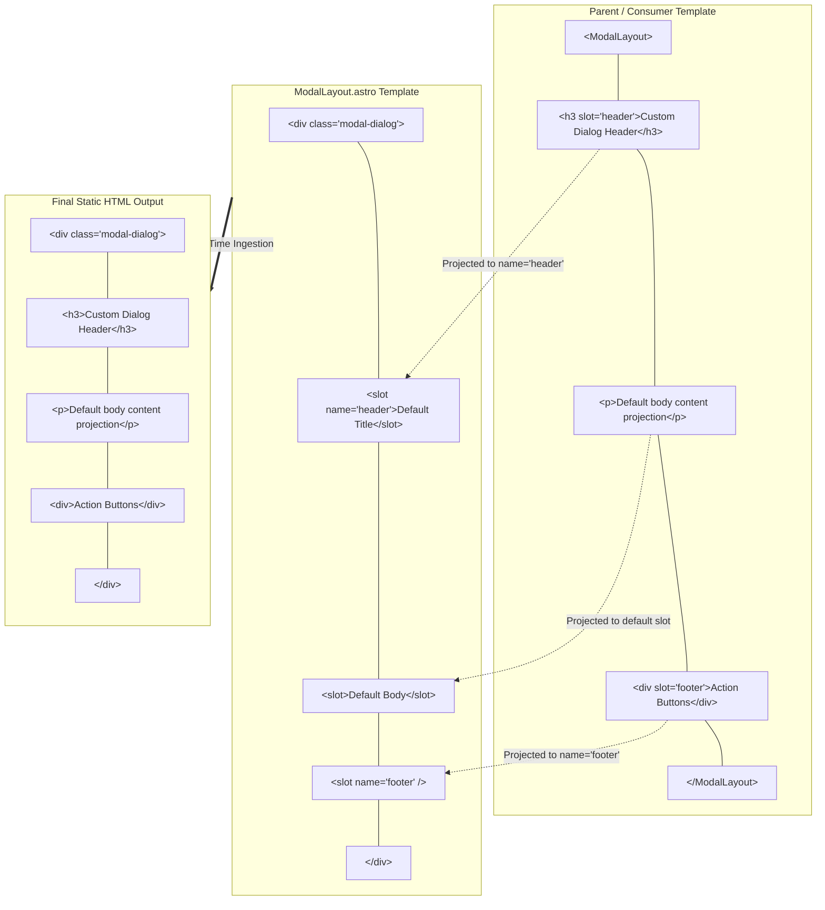
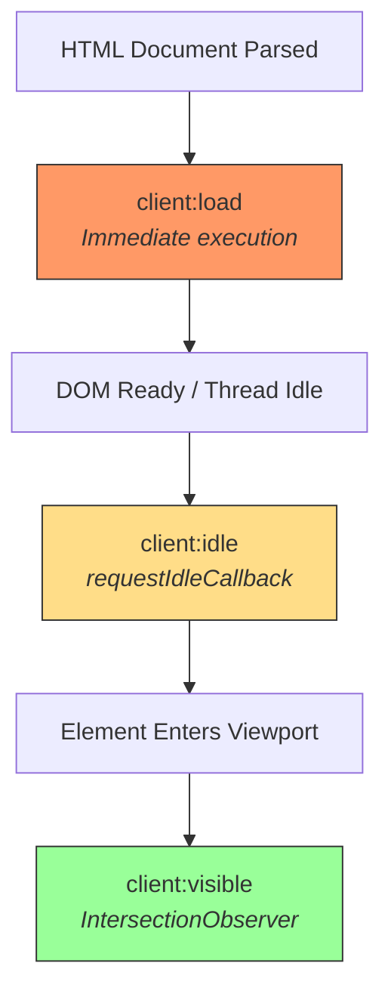
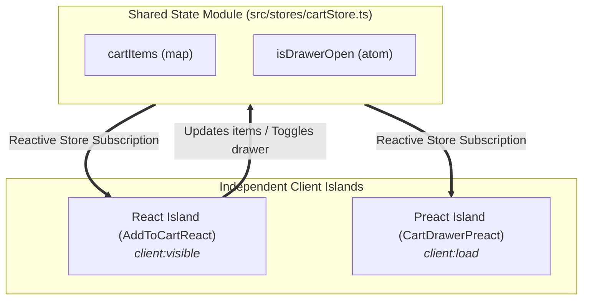
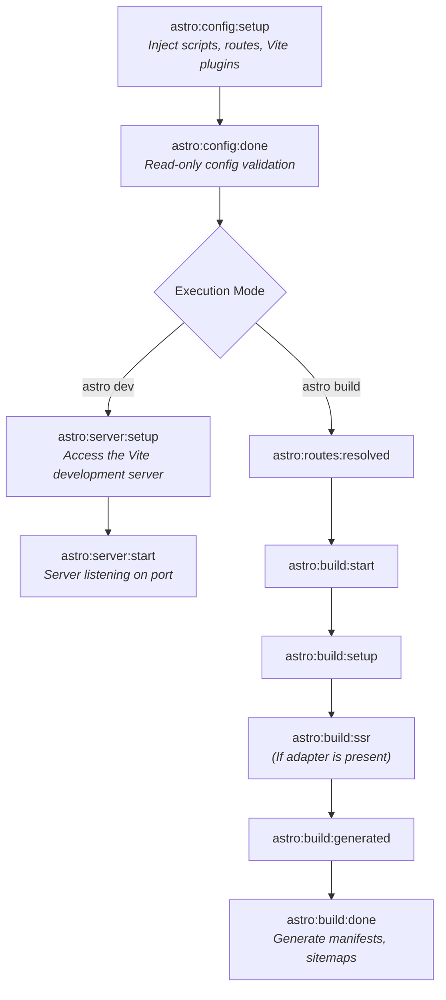

Astro components, props, slots, and islands are core concepts for building maintainable, performant sites.

This post consolidates component patterns, server-side slot mechanics, client-side hydration directives, and an appendix on islands architecture.

## Component Props and Type Safety

Props are the primary mechanism for passing dynamic data from parent templates or pages down into child .astro components. Because Astro components execute strictly in a server environment, props are resolved and rendered before any markup reaches the client.

### Core Mechanics of `Astro.props`

Every .astro component has access to a global `Astro.props` object inside its frontmatter script. By convention and design, Astro binds any top-level TypeScript interface or type alias named `Props` directly to `Astro.props`, providing full editor autocomplete, inline documentation, and build-time type verification.

```tsx
---
// src/components/UserProfile.astro

// 1. Define the component's strict contract
interface Props {
  userId: string;
  displayName: string;
  email?: string;
  role?: "superadmin" | "admin" | "member" | "guest";
  tags?: string[];
  accountDetails?: {
    createdAt?: Date;
    isVerified?: boolean;
    tier?: "free" | "pro" | "enterprise";
  };
  isActive?: boolean;
}

// 2. Destructure with default fallback values
const {
  userId,
  displayName,
  email = "no-reply@example.com",
  role = "member",
  tags = [],
  accountDetails,
  isActive = true,
} = Astro.props;
---

<div class:list={["user-profile", { "is-active": isActive }]} data-id={userId}>
  <div class="user-header">
    <h2>{displayName} <span class="role-pill">({role})</span></h2>
    <a href={`mailto:${email}`} class="user-email">{email}</a>
  </div>

  <div class="user-meta">
    <p>Account Tier: <strong>{accountDetails?.tier?.toUpperCase() ?? "FREE"}</strong></p>
    <p>Status: {accountDetails?.isVerified ? "Verified" : "Pending Verification"}</p>
    {accountDetails?.createdAt && (
      <time datetime={accountDetails.createdAt.toISOString()}>
        Joined: {accountDetails.createdAt.toLocaleDateString()}
      </time>
    )}
  </div>

  {tags.length > 0 && (
    <ul class="tag-list">
      {tags.map((tag) => (
        <li class="tag">{tag}</li>
      ))}
    </ul>
  )}
</div>
```

### Managing Complex Defaults: The Defaults Object Pattern

When components accept optional nested objects or arrays, inline destructuring can become verbose and error-prone. If an optional object prop like accountDetails is omitted by the caller, accessing nested properties like accountDetails.tier directly in the template will throw a runtime error during compilation.

A clean, maintainable pattern is to define a unified DEFAULTS object and merge it with Astro.props in a single step before destructuring.

```tsx
---
// src/components/UserProfile.astro

interface Props {
  userId: string;
  displayName: string;
  email?: string;
  role?: "superadmin" | "admin" | "member" | "guest";
  tags?: string[];
  accountDetails?: {
    createdAt?: Date;
    isVerified?: boolean;
    tier?: "free" | "pro" | "enterprise";
  };
  isActive?: boolean;
}

// 1. Single unified defaults object
const DEFAULTS = {
  email: "no-reply@example.com",
  role: "member" as const,
  tags: [] as string[],
  isActive: true,
  accountDetails: {
    createdAt: new Date(),
    isVerified: false,
    tier: "free" as const,
  },
};

// 2. Merge all props and nested objects in one place
const {
  userId,
  displayName,
  email,
  role,
  tags,
  isActive,
  accountDetails: { createdAt, isVerified, tier },
} = {
  ...DEFAULTS,
  ...Astro.props,
  accountDetails: {
    ...DEFAULTS.accountDetails,
    ...Astro.props.accountDetails,
  },
};
---

<div class:list={["user-profile", { "is-active": isActive }]} data-id={userId}>
  <div class="user-header">
    <h2>{displayName} <span class="role-pill">({role})</span></h2>
    <a href={`mailto:${email}`} class="user-email">{email}</a>
  </div>

  <div class="user-meta">
    <!-- Safe: tier, isVerified, and createdAt are guaranteed to exist -->
    <p>Account Tier: <strong>{tier.toUpperCase()}</strong></p>
    <p>Status: {isVerified ? "Verified" : "Pending Verification"}</p>
    <time datetime={createdAt.toISOString()}>
      Joined: {createdAt.toLocaleDateString()}
    </time>
  </div>

  {tags.length > 0 && (
    <ul class="tag-list">
      {tags.map((tag) => (
        <li class="tag">{tag}</li>
      ))}
    </ul>
  )}
</div>
```

### Syntax Rules for Passing Props

Passing props in Astro mimics standard HTML attribute syntax with JavaScript enhancements:

* **Static strings**: Pass raw strings using quotes (`prop="value"`).
* **JavaScript expressions and primitives**: Pass numbers, booleans, arrays, objects, and functions enclosed in curly braces (`prop={42}`, `prop={false}`, `prop={['A', 'B']}`).
* **Boolean shorthand**: Providing an attribute name without a value implicitly evaluates to true (e.g., `<UserProfile isActive/>` is equivalent to `isActive={true}`).
* **Spread operator (...)**: Spread plain JavaScript objects directly onto the component when the object keys conform to the `Props` interface.

```tsx
---
// src/pages/members.astro
import UserProfile from "../components/UserProfile.astro";

const memberRecord = {
  userId: "usr_9981",
  displayName: "Jordan Hayes",
  email: "jordan@example.com",
  role: "admin" as const,
  tags: ["Core", "Maintainer"],
  accountDetails: {
    createdAt: new Date("2024-03-01"),
    isVerified: true,
    tier: "enterprise" as const,
  },
};
---

<!-- Explicit property assignment -->
<UserProfile
  userId="usr_1002"
  displayName="Taylor Vance"
  email="taylor@example.com"
  role="member"
  tags={["Contributor"]}
  accountDetails={{
    createdAt: new Date("2024-06-15"),
    isVerified: false,
    tier: "pro",
  }}
  isActive
/>

<!-- Spreading an object directly -->
<UserProfile {...memberRecord} />
```

### Prop Validation and Static Verification

Astro provides end-to-end type safety at two distinct stages of development:

* **Language server and IDE diagnostics**: The Astro Language Server inspects components in real time. Omitting a required prop or providing an incompatible type immediately generates an inline compiler diagnostic.
* **Static build verification (astro check)**: The astro check CLI command evaluates all `.astro` and `.ts` files across the project workspace, ensuring that invalid prop assignments prevent faulty builds from deploying to production.

```tsx
<!-- TypeScript Error: Property 'userId' is missing in type -->
<UserProfile
  displayName="Morgan Reed"
  email="morgan@example.com"
  tags={[]}
/>

<!-- TypeScript Error: Type 'string' is not assignable to type '"superadmin" | "admin" | "member" | "guest"' -->
<UserProfile
  userId="usr_3002"
  displayName="Morgan Reed"
  email="morgan@example.com"
  role="developer"
  tags={[]}
/>
```

### Prop Forwarding and the "Rest" Props Pattern

When creating reusable UI components (buttons, badges, inputs), you often need to consume a few custom props while passing all other standard HTML attributes (`id`, `data-*`, `aria-*`, `title`, `tabindex`) directly to the rendered root DOM element.

Astro provides the `HTMLAttributes` helper for this purpose:

```tsx
---
// src/components/Button.astro
import type { HTMLAttributes } from "astro/types";

interface Props extends HTMLAttributes<"button"> {
  variant?: "primary" | "secondary" | "danger" | "ghost";
  size?: "sm" | "md" | "lg";
  isLoading?: boolean;
}

const {
  variant = "primary",
  size = "md",
  isLoading = false,
  class: className,
  disabled,
  ...restAttributes
} = Astro.props;
---

<button
  class:list={[
    "btn",
    `btn-${variant}`,
    `btn-${size}`,
    { "is-loading": isLoading },
    className,
  ]}
  disabled={disabled || isLoading}
  {...restAttributes}
>
  {isLoading ? <span class="spinner" aria-hidden="true" /> : <slot />}
</button>
```

**Consumer usage**

```tsx
<!-- Standard button attributes pass through automatically -->
<Button
  variant="danger"
  size="lg"
  id="delete-account-btn"
  data-action="confirm-delete"
  aria-haspopup="dialog"
>
  Delete Account
</Button>
```

### Note on Pure Pass-Through Wrappers and Rest Naming

* **Pure pass-through wrappers**: If a component does not extract custom props and serves strictly as a semantic or styled wrapper, extend HTMLAttributes with an empty body (`interface Props extends HTMLAttributes<"button"> {}`) and forward all attributes via `{...Astro.props}` or `{...attrs}`.
* **Identifier naming conventions**: Use camelCase identifiers such as `...restAttributes`, `...restProps`, or `...attrs` for the runtime rest variable. Avoid naming the runtime variable `HTMLAttributes` to prevent shadowing and naming collisions with the imported TypeScript type `HTMLAttributes`.

### Polymorphic Components (as Prop)

Polymorphic components can dynamically change their underlying HTML root element (e.g., rendering either an `<a>` tag or a `<button>` tag) while preserving strict element-specific typing and accessibility attributes.

Using `HTMLTag` and `Polymorphic` from `astro/types` (available in Astro 2.5 and later):

```tsx
---
// src/components/DynamicLink.astro
import type { HTMLTag, Polymorphic } from "astro/types";

type Props<Tag extends HTMLTag> = Polymorphic<{ as: Tag }>;

const { as: Component = "div", ...props } = Astro.props;
---

<Component {...props}>
  <slot />
</Component>
```

**Consumer usage**

```tsx
---
import DynamicLink from "../components/DynamicLink.astro";
---

<!-- Type-checked as an <a> tag: 'href' is valid -->
<DynamicLink as="a" href="/dashboard" target="_blank" rel="noopener">
  Go to Dashboard
</DynamicLink>

<!-- Type-checked as a <button> tag: 'type' and 'disabled' are valid -->
<DynamicLink as="button" type="submit" disabled>
  Submit Form
</DynamicLink>
```

## Slots and Server-Side Template Composition

Slots are Astro’s primary mechanism for content projection. They allow parent templates to inject arbitrary markup, text, and other components into designated placeholders inside a child component.

Slots evaluate entirely on the server at compile or request time.



### Default Slots and Fallback Rendering

An unnamed `<slot />` captures all child nodes passed to the component that do not specify a slot attribute. Adding markup between `<slot>` and `</slot>` defines fallback content, which is rendered only when no children are supplied by the parent.

```tsx
---
// src/components/Callout.astro
interface Props {
  type?: "info" | "warning" | "success";
}

const { type = "info" } = Astro.props;
---

<aside class:list={["callout", `callout-${type}`]}>
  <slot>
    <!-- Fallback content rendered only if no children are passed -->
    <p class="fallback-text">No additional details provided.</p>
  </slot>
</aside>
```

**Consumer usage**

```tsx
---
import Callout from "../components/Callout.astro";
---

<!-- Renders the custom passed paragraph -->
<Callout type="warning">
  <p>System maintenance scheduled for tonight at 02:00 UTC.</p>
</Callout>

<!-- Renders the fallback: "No additional details provided." -->
<Callout type="info" />
```

### Named Slots and Wrapperless Projection

Named slots allow components to distribute content to specific zones across the layout. Use the name attribute on the child component's `<slot />` tag and match it with `slot="[name]"` on the incoming parent elements.

To avoid introducing unwanted wrapper elements (such as `<div>` or `<span>`) into your rendered HTML, project markup using `<Fragment slot="...">`.

```tsx
---
// src/components/CardLayout.astro
interface Props {
  bordered?: boolean;
}

const { bordered = true } = Astro.props;
---

<article class:list={["card", { "is-bordered": bordered }]}>
  <header class="card-header">
    <slot name="header">
      <h4>Default Title</h4>
    </slot>
  </header>

  <main class="card-body">
    <!-- Unnamed default slot -->
    <slot />
  </main>

  <footer class="card-footer">
    <slot name="footer" />
  </footer>
</article>
```

**Consumer usage**

```tsx
---
import CardLayout from "../components/CardLayout.astro";
---

<CardLayout bordered={false}>
  <!-- Zero-DOM wrapper projection -->
  <Fragment slot="header">
    <h3>Enterprise Architecture Blueprint</h3>
    <span class="badge">Architecture</span>
  </Fragment>

  <!-- Default slot content -->
  <p>Detailed overview of serverless rendering pipelines.</p>
  <p>All unnamed elements are grouped here in source order.</p>

  <Fragment slot="footer">
    <button type="button" class="btn-primary">Download PDF</button>
  </Fragment>
</CardLayout>
```

### Conditional Slot Rendering with `Astro.slots.has()`

A common layout issue is rendering empty wrapper elements (like `<aside>` or `<footer>`) when the parent did not pass any content for that slot.

The `Astro.slots.has(slotName)` method allows components to conditionally render DOM wrappers only when content actually exists for that slot:

```tsx
---
// src/components/ArticleContainer.astro
interface Props {
  headline: string;
}

const { headline } = Astro.props;

// Inspect slot existence before outputting wrapper HTML
const hasSidebar = Astro.slots.has("sidebar");
const hasFooter = Astro.slots.has("footer");
---

<div class="article-layout">
  <article class="main-content">
    <h1>{headline}</h1>
    <slot />
  </article>

  <!-- Only rendered if <... slot="sidebar" /> was supplied -->
  {hasSidebar && (
    <aside class="sidebar-region">
      <slot name="sidebar" />
    </aside>
  )}

  <!-- Only rendered if <... slot="footer" /> was supplied -->
  {hasFooter && (
    <footer class="article-footer">
      <slot name="footer" />
    </footer>
  )}
</div>
```

### `Astro.slots.render()`: Scoped Slot Functions

`Astro.slots.render()` enables a child component to pass server-side data back to the parent consumer during template execution. This pattern is similar to scoped slots in Vue and render props in React.

**Execution process**

1. The consumer passes an arrow function as the slot child instead of static markup.
2. The child component executes `Astro.slots.render(slotName, [args])` in its frontmatter, providing dynamic arguments.
3. `Astro.slots.render()` resolves to an HTML string promise.
4. The child component outputs the generated markup using `<Fragment set:html="{htmlString}"/>`.

**Child component (`src/components/DataTable.astro`)**

```tsx
---
interface Props<T> {
  data: T[];
}

const { data } = Astro.props;

// Execute the default slot function for every record
const renderedRows = await Promise.all(
  data.map((item, index) => Astro.slots.render("default", [item, index]))
);
---

<table class="data-table">
  <thead>
    <tr>
      <slot name="header" />
    </tr>
  </thead>
  <tbody>
    {
      renderedRows.map((rowHtml) => (
        <tr class="table-row">
          <Fragment set:html={rowHtml} />
        </tr>
      ))
    }
  </tbody>
</table>
```

**Consumer Usage (`src/pages/metrics.astro`)**

```tsx
---
import DataTable from "../components/DataTable.astro";

interface PerformanceMetric {
  id: string;
  metricName: string;
  value: number;
  status: "optimal" | "warning" | "critical";
}

const metrics: PerformanceMetric[] = [
  { id: "m-1", metricName: "TTFB", value: 45, status: "optimal" },
  { id: "m-2", metricName: "INP", value: 240, status: "warning" },
  { id: "m-3", metricName: "CLS", value: 0.02, status: "optimal" },
];
---

<DataTable data={metrics}>
  <!-- Static named header slot -->
  <Fragment slot="header">
    <th>Index</th>
    <th>Metric</th>
    <th>Measurement</th>
    <th>Status</th>
  </Fragment>

  <!-- Scoped slot function receiving data back from DataTable.astro -->
  {(metric: PerformanceMetric, index: number) => (
    <>
      <td>#{index + 1}</td>
      <td><strong>{metric.metricName}</strong></td>
      <td>{metric.value}</td>
      <td><span class={`pill pill-${metric.status}`}>{metric.status}</span></td>
    </>
  )}
</DataTable>
```

### Slot Forwarding and Nested Composition

When composing higher-order Astro components, you can forward incoming slots directly into deeper child components by attaching the slot attribute to the `<slot />` tag itself:

```tsx
---
// src/components/DashboardModal.astro
import ModalLayout from "./ModalLayout.astro";
---

<ModalLayout>
  <!-- Forward the 'custom-header' slot into ModalLayout's 'header' slot -->
  <slot name="custom-header" slot="header" />

  <!-- Forward the default slot -->
  <slot />

  <!-- Forward the 'custom-actions' slot into ModalLayout's 'footer' slot -->
  <slot name="custom-actions" slot="footer" />
</ModalLayout>
```

## Appendix: Islands Architecture, Client Directives, and Integrations

While Astro components render strictly static HTML on the server, interactive UI framework components (React, Preact, Vue, Svelte, Solid) can be hydrated on the client using Astro's Islands architecture.

### Client Hydration Directives

Framework components render as static HTML by default. Applying a client:* directive instructs Astro to bundle the component's JavaScript and hydrate it in the browser based on explicit conditions.



| Directive | Execution lifecycle | Primary use case |
| --- | --- | --- |
| client:load | Immediately on page load | Above-the-fold critical interactive elements (search inputs, primary navigation). |
| client:idle | Once main thread is idle (requestIdleCallback) | Secondary interactive UI (live notifications, analytics widgets, floating buttons). |
| client:visible | When entering viewport (IntersectionObserver) | Below-the-fold interactive components (accordions, comments, heavy charts). |
| client:media | On matching CSS media query (window.matchMedia) | Screen-size-specific controls (mobile-only drawer menus). |
| client:only | Skips SSR; renders exclusively in browser | Browser-only dependencies (canvas, WebGL, localStorage). |


### Passing Server Slots to Client Islands

When you pass child elements or slots into a client-hydrated framework component (like React or Preact), Astro renders those children to static HTML on the server:

* Default slots are received as `props.children` (`ReactNode` / `ComponentChildren`).
* Named slots (`slot="name"`) arrive as named props (e.g., `props.headerSlot`).
* Astro wraps the static slot output inside `<astro-slot>` custom elements. Static slot content is outside the parent island's hydration boundary, so the parent framework does not attach event listeners to or hydrate that content. Nested framework components can still hydrate as independent islands when they use their own `client:*` directives.

```tsx
// src/components/CollapsibleReact.tsx
import type { ReactNode } from "react";
import { useState } from "react";

interface Props {
  title: string;
  headerSlot?: ReactNode;
  children: ReactNode;
}

export function CollapsibleReact({ title, headerSlot, children }: Props) {
  const [isOpen, setIsOpen] = useState(false);

  return (
    <section className="collapsible-panel">
      <button type="button" onClick={() => setIsOpen(!isOpen)}>
        {title}
      </button>
      {headerSlot && <div className="slot-header">{headerSlot}</div>}
      {isOpen && <div className="slot-body">{children}</div>}
    </section>
  );
}
```

```tsx
---
// src/pages/index.astro
import { CollapsibleReact } from "../components/CollapsibleReact";
import ServerBanner from "../components/ServerBanner.astro";
---

<CollapsibleReact client:load title="Account Information">
  <span slot="headerSlot" class="badge">Active</span>
  <ServerBanner message="Rendered statically on the server" />
  <p>Pure static markup with no additional client-side JavaScript for the static children.</p>
</CollapsibleReact>
```

### Cross-Island State Synchronization with Nanostores

Nanostores provides framework-agnostic atomic state management to synchronize isolated islands (e.g., React and Preact) without requiring a shared UI framework root context.

**Prerequisites**

Install Nanostores, its React and Preact bindings, and the Astro Preact integration:

```bash
npm install nanostores @nanostores/react @nanostores/preact preact @astrojs/preact
```

Register the React and Preact integrations in `astro.config.mjs`:

```js
import { defineConfig } from "astro/config";
import react from "@astrojs/react";
import preact from "@astrojs/preact";

export default defineConfig({
  integrations: [react(), preact()],
});
```



**Define the shared store (`src/stores/cartStore.ts`)**

```ts
// src/stores/cartStore.ts
import { atom, map } from "nanostores";

export interface CartItem {
  id: string;
  name: string;
  price: number;
  quantity: number;
}

export const isDrawerOpen = atom<boolean>(false);
export const cartItems = map<Record<string, CartItem>>({});

export function addItem(item: Omit<CartItem, "quantity">): void {
  const current = cartItems.get();
  const existing = current[item.id];

  if (existing) {
    cartItems.setKey(item.id, {
      ...existing,
      quantity: existing.quantity + 1,
    });
  } else {
    cartItems.setKey(item.id, {
      ...item,
      quantity: 1,
    });
  }
}

export function toggleDrawer(): void {
  isDrawerOpen.set(!isDrawerOpen.get());
}
```

**React island component (`src/components/AddToCartReact.tsx`)**

```tsx
// src/components/AddToCartReact.tsx
import { useStore } from "@nanostores/react";
import { addItem, isDrawerOpen, toggleDrawer } from "../stores/cartStore";

interface AddToCartProps {
  id: string;
  name: string;
  price: number;
}

export function AddToCartReact({ id, name, price }: AddToCartProps) {
  const isOpen = useStore(isDrawerOpen);

  function handleAdd() {
    addItem({ id, name, price });
    if (!isOpen) {
      toggleDrawer();
    }
  }

  return (
    <button type="button" onClick={handleAdd}>
      Add {name} (${price})
    </button>
  );
}
```

**Preact island component (`src/components/CartDrawerPreact.tsx`)**

```tsx
// src/components/CartDrawerPreact.tsx
import { useStore } from "@nanostores/preact";
import { cartItems, isDrawerOpen, toggleDrawer } from "../stores/cartStore";

export function CartDrawerPreact() {
  const $cartItems = useStore(cartItems);
  const $isOpen = useStore(isDrawerOpen);

  const items = Object.values($cartItems);
  const totalCount = items.reduce((sum, item) => sum + item.quantity, 0);

  if (!$isOpen) {
    return (
      <button type="button" onClick={toggleDrawer}>
        Cart ({totalCount})
      </button>
    );
  }

  return (
    <aside class="cart-drawer">
      <div class="header">
        <h2>Your Cart ({totalCount})</h2>
        <button type="button" onClick={toggleDrawer}>
          Close
        </button>
      </div>
      <ul>
        {items.map((item) => (
          <li key={item.id}>
            <span>{item.name}</span> × <span>{item.quantity}</span>
            <strong> (${item.price * item.quantity})</strong>
          </li>
        ))}
      </ul>
    </aside>
  );
}
```

**Astro template composition (`src/pages/shop.astro`)**

```tsx
---
// src/pages/shop.astro
import { AddToCartReact } from "../components/AddToCartReact";
import { CartDrawerPreact } from "../components/CartDrawerPreact";
---

<header>
  <nav>
    <a href="/">Home</a>
    <CartDrawerPreact client:load />
  </nav>
</header>

<main>
  <section class="products">
    <AddToCartReact client:visible id="kb-01" name="Mechanical Keyboard" price={120} />
    <AddToCartReact client:visible id="ms-02" name="Optical Mouse" price={60} />
  </section>
</main>
```

### Custom Client Directives

You can define custom hydration triggers (e.g., hydrating on mouse click or hover) using the `addClientDirective` hook.

**Prerequisite:** A custom client directive requires an Astro integration that registers the directive with `addClientDirective`, plus a client-directive entry point that implements the hydration trigger.

**Directive handler (`src/directives/onClickDirective.ts`)**

```ts
// src/directives/onClickDirective.ts
import type { ClientDirective } from "astro";

const onClickDirective: ClientDirective = (load, opts) => {
  const element = opts.host;

  const handleClick = async () => {
    element.removeEventListener("click", handleClick, { capture: true });
    const hydrate = await load();
    await hydrate();
  };

  element.addEventListener("click", handleClick, { capture: true, once: true });
};

export default onClickDirective;
```

**Register directive in configuration (`astro.config.mjs`)**

```js
// astro.config.mjs
import { defineConfig } from "astro/config";
import react from "@astrojs/react";

export default defineConfig({
  integrations: [
    react(),
    {
      name: "custom-client-directives",
      hooks: {
        "astro:config:setup": ({ addClientDirective }) => {
          addClientDirective({
            name: "click",
            entrypoint: "./src/directives/onClickDirective.ts",
          });
        },
      },
    },
  ],
});
```

**TypeScript declaration (`src/env.d.ts`)**

```ts
// src/env.d.ts
/// <reference path="../.astro/types.d.ts" />

declare module "astro" {
  interface AstroClientDirectives {
    "client:click"?: boolean | string;
  }
}
```

**Template usage (`src/pages/index.astro`)**

```tsx
---
// src/pages/index.astro
import { InteractiveModal } from "../components/InteractiveModal";
---

<InteractiveModal client:click title="Account Settings">
  <button type="button">Open Settings Modal</button>
</InteractiveModal>
```

### Astro Integration Lifecycle Hooks

Astro integrations hook directly into the compilation pipeline, the [Vite development server](https://vite.dev/guide/api-javascript.html), and the production build stages. Vite provides the development server. For production builds, Vite versions before 8 use [Rollup](https://rollupjs.org/), while Vite 8 and later use [Rolldown](https://rolldown.rs/).



**Lifecycle hook reference table**

| Hook | Primary arguments | Description |
| --- | --- | --- |
| astro:config:setup | config, command, updateConfig, addClientDirective, injectScript, injectRoute, logger | Main configuration hook. Configure Vite, inject routes, or register custom directives. |
| astro:config:done | config, setAdapter, logger | Configuration is finalized and read-only. Used by SSR adapters. |
| astro:server:setup | server, logger | Grants access to the underlying [Vite development server](https://vite.dev/guide/api-javascript.html) during dev mode. |
| astro:server:start | address, logger | Fires after the dev server begins listening for connections. |
| astro:routes:resolved | routes, logger | Provides read access to the compiled route table. |
| astro:build:start | logger | Fires at the beginning of astro build. |
| astro:build:setup | vite, pages, target, logger | Customizes [Vite build settings](https://vite.dev/config/) and bundler options for [Rollup](https://rollupjs.org/configuration-options/) or [Rolldown](https://rolldown.rs/) for client or SSR targets. |
| astro:build:ssr | manifest, entryPoints, logger | Receives SSR bundle manifests when using an adapter. |
| astro:build:generated | dir, logger | Fires after static route generation completes before writing output. |
| astro:build:done | dir, pages, assets, logger | Build output is complete. Use for post-processing files or generating manifests. |

### Custom Plugin Implementation (`src/integrations/customBuildPlugin.ts`)

```ts
// src/integrations/customBuildPlugin.ts
import type { AstroIntegration } from "astro";
import { fileURLToPath } from "node:url";
import * as fs from "node:fs/promises";
import * as path from "node:path";

export interface PluginOptions {
  enableStatusRoute?: boolean;
  exportRouteManifest?: boolean;
}

export default function customBuildPlugin(options: PluginOptions = {}): AstroIntegration {
  return {
    name: "custom-build-plugin",
    hooks: {
      "astro:config:setup": ({ injectRoute, injectScript, updateConfig, logger }) => {
        logger.info("Initializing plugin configuration...");

        // Inject global client script
        injectScript("page", `console.info("Application initialized with custom plugin.");`);

        // Inject dynamic virtual route
        if (options.enableStatusRoute) {
          injectRoute({
            pattern: "/_system/status",
            entrypoint: "./src/pages/_system/status.astro",
            prerender: true,
          });
        }

        // Extend underlying Vite build configuration
        updateConfig({
          vite: {
            define: {
              __BUILD_TIMESTAMP__: JSON.stringify(Date.now()),
            },
          },
        });
      },

      "astro:server:setup": ({ server }) => {
        server.middlewares.use((req, res, next) => {
          if (req.url === "/api/health") {
            res.setHeader("Content-Type", "application/json");
            res.end(JSON.stringify({ status: "healthy", timestamp: Date.now() }));
            return;
          }
          next();
        });
      },

      "astro:build:done": async ({ dir, pages, logger }) => {
        if (!options.exportRouteManifest) return;

        const outDir = fileURLToPath(dir);
        const manifestPath = path.join(outDir, "route-manifest.json");

        const routeData = pages.map(({ pathname }) => ({ pathname }));

        await fs.writeFile(manifestPath, JSON.stringify(routeData, null, 2), "utf-8");
        logger.info(`Generated build manifest: ${manifestPath}`);
      },
    },
  };
}
```

### Registering the Integration (`astro.config.mjs`)

```js
// astro.config.mjs
import { defineConfig } from "astro/config";
import customBuildPlugin from "./src/integrations/customBuildPlugin";

export default defineConfig({
  integrations: [
    customBuildPlugin({
      enableStatusRoute: true,
      exportRouteManifest: true,
    }),
  ],
});
```
