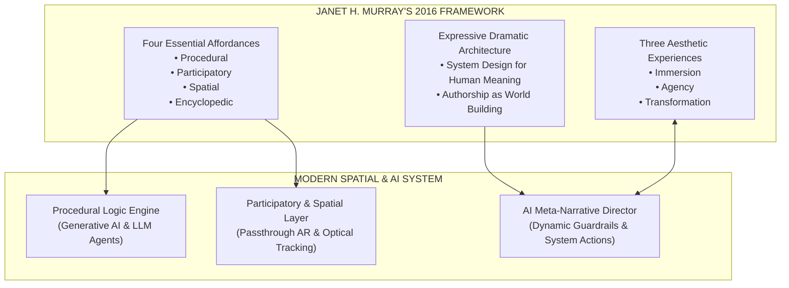
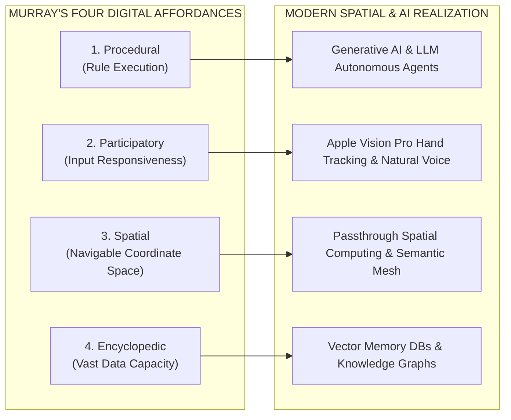
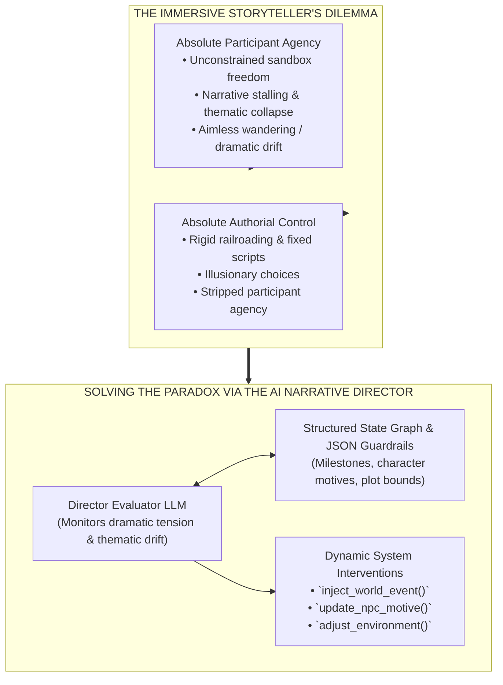
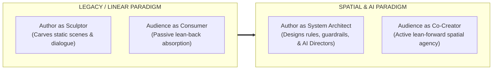

When Janet H. Murray published Hamlet on the Holodeck: The Future of Narrative in Cyberspace in 1997, critics often dismissed her core metaphor as science fiction speculation. Skeptics argued that analyzing text-based HyperCard stacks, MUDs, and early 3D graphics through the lens of Star Trek's Holodeck was overly idealistic for a medium bound to 2D desktop monitors and rigid procedural scripts.

However, in the updated edition, identified inside the book as the 2016 updated edition and published by MIT Press in 2017, Murray added an extensive new introduction and over 10,000 words of chapter commentaries. In this updated edition, she revisited two decades of developments in digital storytelling, including long-form television, artificial intelligence, and virtual reality. MIT Press describes these developments as evidence that practices once considered speculative had been validated by academia, artistic practice, and the marketplace. Murray's affordances therefore remain useful as enduring design principles for interactive digital media.

Today, as generative AI models, spatial computing visors (Apple Vision Pro, Meta Quest 3), and open web stacks (WebGPU, WebXR) converge, Murray's framework offers a way to interpret current capabilities and propose new architectures for interactive media.

By evaluating Murray’s affordances as design principles on their own terms, we can answer the central question confronting modern interactive media: How do creators transition from linear sculptors into spatial system architects?

## The 2016 theoretical core: expressive architecture and system design

To construct a rigorous foundation for modern spatial and AI-driven media, we can examine Murray’s expressivist framework as a set of architectural concerns. The discussion separates three layers of evidence: claims about Murray’s theory, observations about current platform capabilities, and the architecture proposed in this article. Her affordances describe what computational media enables creators and participants to do; they do not prescribe particular APIs, data stores, or deployment patterns.

### Murray's expressivist dramatic framework

Murray approaches digital computation through the lens of human drama, literature, and system design. Rather than viewing software as a mere calculation engine or a collection of rule-based puzzles, Murray evaluates computer code as a symbolic, expressive medium capable of representing human behavior, emotion, and dramatic conflict.

In her 2016 commentaries, Murray re-affirms that computation is not an enemy of narrative, but its natural evolutionary expansion. Just as the invention of the printing press transformed oral traditions into novels, and the invention of the camera gave birth to cinema, computation allows authors to create dynamic, responsive worlds where dramatic action unfolds interactively.

### The Holodeck as an architectural design lens

For Murray, Star Trek's Holodeck was never about Starfleet trivia or holographic light beams. It served as a thought experiment representing a complete digital narrative medium:

* **Complete Spatial Co-Presence**: An unencumbered space where human participants enter physical-digital environments.
* **Systemic Responsiveness**: A world governed by procedural rules that react instantaneously to human voice, movement, and moral choices.
* **Dramatic Coherence**: A system managed by an underlying computer that maintains story pacing, character motivations, and thematic resolution.

In the era of spatial computing headsets and generative large language models, Murray’s Holodeck remains a useful architectural design lens. Procedurality can become a rule and state layer, participation an interaction and feedback layer, spatiality a world-modeling layer, and encyclopedic capacity a content and memory layer. This translation is interpretive: Murray provides a durable set of design principles for interactive media, not a literal technical specification.

## Testing Murray’s four essential affordances of the digital medium

In her 2016 updated edition, Murray identifies four affordances that are especially important to computational media: procedurality, participation, spatiality, and encyclopedic capacity. In *Inventing the Medium* (2012), she extends this argument beyond storytelling and games, describing all things made with electronic bits and computer code as belonging to a single digital medium (pp. 1, 51–82). Testing these affordances against modern technical capabilities shows how software infrastructure can support the kinds of interactive experiences she describes.

These examples do not map one-to-one to the affordances. ELIZA demonstrates how procedural rules and participatory input can work together. *Zork* and *Myst* are directly referenced in Murray's work as examples of navigable space and spatial exploration. The encyclopedic examples below are drawn from Murray's discussions of hypertext literature and multiform narratives.

### Examples of the four affordances

#### Procedural and participatory

* **ELIZA, Joseph Weizenbaum’s Rogerian psychotherapist program:** ELIZA demonstrates how procedural rule execution and participatory interaction can work in tandem.
* **Procedural:** ELIZA runs a simple parsing algorithm that transforms the user’s input according to syntactic rules, such as converting “I am depressed” into “How long have you been depressed?”
* **Participatory:** The user’s responses drive the dialogue forward, creating an illusion of conversational life through reciprocal feedback. This demonstrates participation, but not necessarily agency: ELIZA responds to input without producing meaningful changes to a persistent world state.

#### Spatial

* **Text adventure games, such as *Zork*, and graphic worlds, such as *Myst*:** Murray directly references both works when discussing navigable space and spatial exploration. Digital environments represent navigable space rather than linear narrative pages. In text adventures such as *Zork*, spatial orientation is established through directional verbs (`NORTH`, `SOUTH`, `UP`, `DOWN`) and room descriptions.
* In *Myst*, spatial affordance takes the form of linked, explorable environments. Navigation and observation reveal story information through geography and place.

#### Encyclopedic

* **Hypertext literature and multiform narratives:** Murray's examples include Michael Joyce's *afternoon, a story*, Stuart Moulthrop's *Victory Garden*, and Shelley Jackson's *Patchwork Girl*. These works illustrate how digital media can store, cross-link, and present multiple paths through heterogeneous textual materials.
* Print antecedents such as Milorad Pavić's *Dictionary of the Khazars*, Jorge Luis Borges's "The Garden of Forking Paths," and Italo Calvino's *If on a winter's night a traveler* show that the desire for encyclopedic, nonlinear, and multiform narrative structures predates digital media.

### Procedural: From conditional code to probabilistic AI engines

**Murray's framework**: Murray defined the procedural affordance as the computer's engine-driven ability to execute rule-based behaviors (conditional if/then logic, state machines, and procedural animation loops).

**Current capabilities and proposed architecture**: Generative AI and large language models can extend procedurality, but they do not replace deterministic procedural systems. A deterministic system produces the same result when it receives the same state and input, as with a conditional rule, state machine, or fixed branching structure. A probabilistic model instead generates one possible result from a distribution shaped by its prompt, context, and internal parameters, so the same input may produce different dialogue or actions. Constrained orchestration combines both approaches: deterministic code maintains world state, validates actions, applies permissions, and enforces guardrails, while a model proposes dialogue, plans, or narrative events within those constraints. This architecture can produce adaptive behavior without treating probabilistic output as inherently coherent or reliably rule-following.

### Participatory: From keyboard parsers to natural spatial input

**Murray's framework**: The participatory affordance represents the system's responsiveness to human input, ensuring that participant actions trigger meaningful state updates.

**Current platform capabilities**: Participatory interaction has evolved from typing text commands (open grate) or pressing controller buttons (Trigger + A) to unencumbered, natural physical presence. On Apple Vision Pro, Apple's visionOS and ARKit hand-tracking APIs report 27 joint transforms per hand (Apple, 2024); other platforms may expose different hand-tracking data. Eye-gaze micro-saccades, physical body posture, and natural conversational voice streams can also serve as participatory inputs, depending on the device and permissions. The physical body becomes the primary interface.

### Spatial: From 3D monitors to passthrough physical architecture

**Murray's framework**: Spatiality is the digital medium's ability to represent navigable coordinate space and architectural environments.

**Current platform capabilities**: Video passthrough spatial computing (Apple Vision Pro, Meta Quest 3) and semantic room mapping merge digital coordinate space with physical reality. Navigation is no longer moving a virtual avatar across a 2D monitor with a joystick; it is walking physical steps through one's own living room, where digital narrative props and entities can anchor to physical surfaces, furniture, and walls.

On platforms that support it, the [WebXR Anchors Module](https://immersive-web.github.io/anchors/) provides a web API for tracking such anchors. Vision Pro and Quest also expose platform-specific spatial-mapping capabilities that are not necessarily available through WebXR.

### Encyclopedic: From relational databases to persistent vector memory

**Murray's framework**: The encyclopedic affordance is the capacity to store, index, and retrieve vast databases of hyperlinked information and media assets.

**Proposed architecture**: Modern AI spatial architectures can combine cloud vector databases (e.g., Pinecone, Qdrant) with persistent knowledge graphs. Autonomous LLM character agents can retain episodic memory of past participant interactions, recalling conversations, choices, and moral alignments across multi-session narrative arcs.

## Testing Murray’s three aesthetic experiences

When a digital system balances these four affordances effectively, it can support the three aesthetic experiences Murray describes: immersion, agency, and transformation.

### Immersion: Crossing the perceptual boundary

Murray defines immersion as the sensation of being submerged in a complete, coherent alternative reality. Spatial computing and video passthrough transition immersion from a purely psychological state (reading a novel) into a perceptual and physiological reality:

* **Spatial audio**: An HRTF-spatialized whisper uses direction-dependent filters that model how the listener's torso, head, and pinnae shape sound at each ear. When the whisper originates from behind the listener's physical chair, spatial audio can reinforce the impression that the sound belongs to the surrounding environment (Begault, 1994; Larsson et al., 2002).
* **Visual grounding**: A virtual character's realistic shadow across a physical rug can provide depth and contact cues that help integrate the virtual object with its surroundings (Sugano et al., 2003; Jacobs and Loscos, 2006).
* **Cross-modal alignment**: When auditory and visual cues agree, multisensory integration may reduce the distance between the represented world and the participant's perception. Research on place and plausibility illusions and multisensory integration supports treating this alignment as a design hypothesis rather than a guaranteed perceptual result (Slater, 2009; Ernst and Banks, 2002).
* **The "Poor Man's Holodeck"**: This phrase predates this article and Murray's work. It appears in *Star Trek: Voyager*'s "Equinox, Part II" (1999), where a character uses it to describe a substitute for a conventional holodeck. The phrase also became a technology colloquialism for lower-cost immersive systems. In this article, it describes passthrough mixed reality: because physical matter synthesis remains unviable, passthrough can act as an optical approximation of a Holodeck, presenting fictional content inside physical space without fabricating physical matter.

### Agency: The critical distinction between activity and agency

A common failure in interactive game design is confusing activity with agency:

* **Activity**: Pressing buttons, opening doors, turning pages, or making trivial dialogue choices that yield no lasting impact on the global world state.
* **Agency**: The deeply satisfying aesthetic experience of taking a meaningful action within a system and witnessing clear, dramatic, persistent consequences ripple across the world state.

In her 2016 commentaries, Murray stressed that agency is not about offering infinite, unconstrained choices (which causes choice paralysis); it is about providing clear, intentional choices within an expressively coherent rule system.

### Transformation: Identity experimentation and Donath’s signaling tension

Murray’s third aesthetic experience, Transformation, involves avatar alter-egos, roleplay experimentation, and testing new perspectives.

When evaluated alongside Judith Donath’s identity and signaling research ("Identity and Deception in the Virtual Community", 1999; "Being Real", 2000), transformation in spatial computing reveals a profound societal tension:

* **Creative Transformation**: Participants utilize generative voice synthesis, dynamic avatar meshes, and spatial roleplay to explore diverse identities and empathetic perspectives.
* **Predatory Identity Deception**: Because generative AI allows malicious actors to forge conventional signals (voice cloning, deepfake visual avatars, spoofed spatial feeds) at near-zero cost, identity transformation can easily devolve into predatory deception.
* **The Assessment Solution**: Preserving narrative trust may require anchoring spatial identity in **costly-to-fake assessment signals**. The appropriate signal depends on what must be established, such as continuity of identity, provenance of an asset, control of a device, or reliability of a participant. Possible implementations include local biometric hardware attestations, behavioral patterns, reputation systems, economic costs, or verifiable cryptographic signatures. These mechanisms can be used independently or in combination. They do not guarantee that a participant is trustworthy; they give users and communities signals they can evaluate according to their own standards, needs, and tolerance for risk.

## The core paradox: Agency vs. authorial intent and the AI narrative director

The central dilemma of interactive storytelling, what Murray calls the "Immersive Storyteller's Dilemma", is the fundamental tension between participant freedom and authorial structure:

### The paradox defined

* **Absolute Agency (Sandbox Collapse)**: If a participant is granted complete freedom without structural boundaries, the narrative collapses. Participants wander aimlessly, ignore plot hooks, test boundary limits, or destroy dramatic pacing.
* **Absolute Authorial Control (Railroading)**: If an author enforces a rigid, linear plot script, participant choices become illusionary. The participant feels railroaded, stripping away Murray's aesthetic experience of genuine agency.

### Solving the paradox via the AI meta-narrative director

**Proposed architecture**: In the framework developed in this series, an AI meta-narrative director addresses this paradox through an orchestration layer that combines evaluator LLMs, real-time world-state tracking, and state-graph guardrails (as defined in Part 3).

Instead of hard-blocking unscripted participant actions or relying on static branching paths, the AI Narrative Director operates as a dynamic dramaturge:

* **Continuous Evaluation**: Within this proposed framework, the Director LLM continuously evaluates participant actions, dialogue, and spatial movements against an author-defined JSON state graph.
* **Measuring Thematic Drift**: If a participant strays wildly from central plot milestones or dramatic pacing stalls, the Director LLM calculates the degree of thematic drift.
* **Dynamic World Interventions**: Rather than railroading the participant, the Director LLM executes structured function calls (inject_world_event(), update_npc_motive(), adjust_environment()) to alter the world state dynamically. These function names are illustrative and conceptual; they do not refer to an implemented API.

If a participant unexpectedly burns down a key village, the AI Director does not crash or display an error message. It dynamically updates surrounding NPC motivations, shifts quest goals, and triggers environmental events that guide the participant back toward central thematic beats. This approach preserves the author's overarching dramatic structure while offering perceived or bounded agency: participants can make meaningful choices within constraints that remain part of the authored system.

## Conclusion: Are we ready for the change?

Janet H. Murray’s updated 2016 framework argues that digital interactive media is not merely a new distribution mechanism for old linear stories; it is an expressive medium that can require a fundamental shift in mindset from both creators and audiences.

### The authorial shift: From sculptor to system architect

Authors may need to transition from sculptors (carving static dialogue lines, fixed camera angles, and rigid plot branches) into system architects. A modern digital author builds:

* A rule-based world simulation (Murray's Procedural affordance).
* An ensemble of autonomous LLM character agents with vector memories.
* An AI Meta-Narrative Director equipped with thematic guardrails and dynamic function-calling tools.
* Semantic spatial boundaries that adapt to physical room architecture.

### The audience shift: From consumer to co-creator

Audiences may increasingly act as active lean-forward co-creators rather than passive lean-back consumers watching stories through 2D glass windows. Participants step through the frame into shared spatial realities where their presence, movements, and choices can shape the emerging narrative.

### Final reflection

The Holodeck is no longer only a sci-fi metaphor from 1990s television; it is a design lens that software engineers, AI researchers, and spatial designers can use when building interactive systems. By grounding our proposed systems in Murray's enduring affordances, agency principles, and dramatic system design, we can construct interactive worlds that honor human agency, foster genuine co-presence, and deliver deeply transformative stories.

## References

Apple Inc. (2024). *Apple Vision Pro technical specifications and visionOS architecture*. https://developer.apple.com/visionos/

Begault, D. R. (1994). *3D sound for virtual reality and multimedia*. AP Professional.

Berman, R., Taylor, M., & Braga, B. (Writers). (1999, September). Equinox, Part II (Season 6, Episode 1) [TV series episode]. In *Star Trek: Voyager*. Paramount Television.

Bogost, I. (2006). *Unit operations: An approach to videogame criticism*. MIT Press.

Donath, J. S. (1999). Identity and deception in the virtual community. In M. A. Smith & P. Kollock (Eds.), *Communities in cyberspace* (pp. 29–59). Routledge. https://smg.media.mit.edu/papers/Donath/IdentityDeception/IdentityDeception.html

Donath, J. S. (2000). *Being real*. MIT Media Lab. https://smg.media.mit.edu/papers/Donath/BeingReal/BeingReal.html

Ernst, M. O., & Banks, M. S. (2002). Humans integrate visual and haptic information in a statistically optimal fashion. *Nature, 415*(6870), 429–433.

Inworld AI. (n.d.). *Inworld character engine and realtime agent API documentation*. https://docs.inworld.ai/

Jacobs, K., & Loscos, C. (2006). Classification of illumination methods for mixed reality. *Computer Graphics Forum, 25*(1), 29–50.

Juul, J. (2005). *Half-real: Video games between real rules and fictional worlds*. MIT Press.

Kim, H., Yoo, T., & Cheong, Y.-G. (2025). CoDi: A director-actor framework for goal-driven interactive story generation with LLMs. *Proceedings of the Twenty-First AAAI Conference on Artificial Intelligence and Interactive Digital Entertainment, 21*(1), 70–80. https://ojs.aaai.org/index.php/AIIDE/article/view/36811

Larsson, P., Västfjäll, D., & Kleiner, M. (2002). The effect of spatialized audio on presence in virtual environments. In *Proceedings of the 5th Annual International Workshop on Presence*, Porto, Portugal.

Meta Platforms & Reality Labs. (n.d.). *Meta Quest 3 developer documentation and OpenXR integration*. https://developer.oculus.com/

Murray, J. H. (1997). *Hamlet on the holodeck: The future of narrative in cyberspace*. Free Press.

Murray, J. H. (2012). *Inventing the medium: Principles of interaction design as a cultural practice*. MIT Press.

Murray, J. H. (2016). *Hamlet on the holodeck: The future of narrative in cyberspace* (Updated ed.). MIT Press.

Slater, M. (2009). Place illusion and plausibility can lead to realistic behaviour in immersive virtual environments. *Philosophical Transactions of the Royal Society B: Biological Sciences, 364*(1535), 3549–3557.

Sugano, N., Kato, H., & Sato, K. (2003). The effects of shadow representation of virtual objects in augmented reality. *IEICE Transactions on Information and Systems, E86-D*(1), 76–83.

W3C. (2023). *WebXR Device API specification*. https://www.w3.org/TR/webxr/

W3C. (2026). *WebGPU* [Candidate Recommendation Draft]. https://www.w3.org/TR/webgpu/

Wardrip-Fruin, N. (2009). *Expressive processing: Digital fictions, computer games, and software studies*. MIT Press.

WebXR Community Group. (n.d.). *WebXR Anchors Module*. https://immersive-web.github.io/anchors/