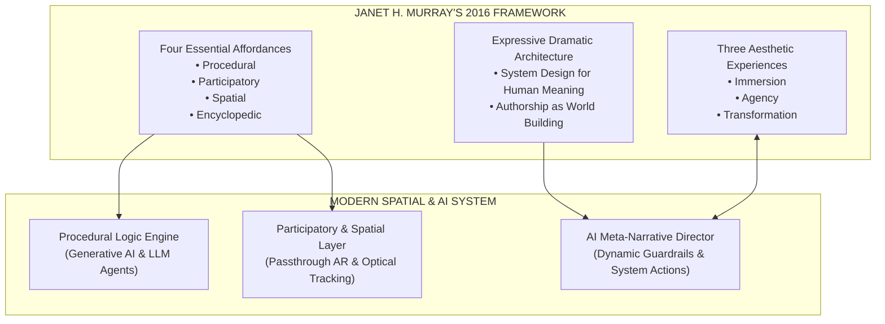
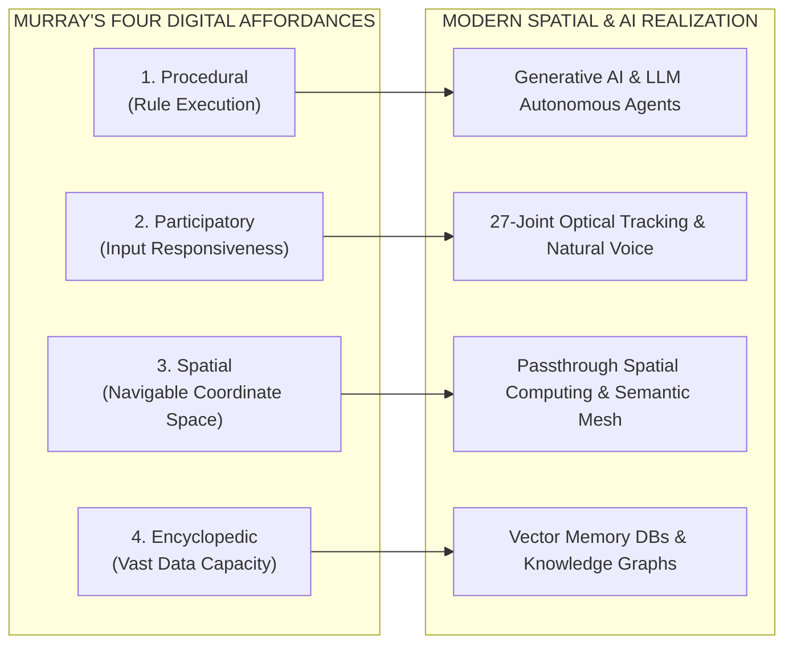
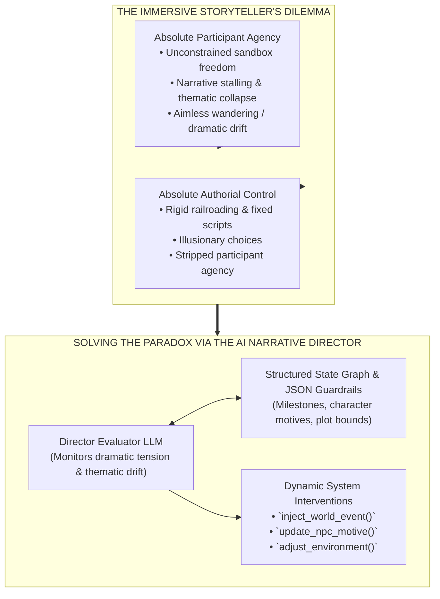
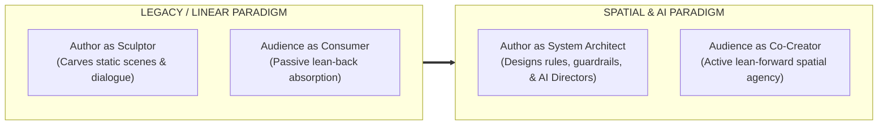

When Janet H. Murray published Hamlet on the Holodeck: The Future of Narrative in Cyberspace in 1997, critics often dismissed her core metaphor as science fiction speculation. Skeptics argued that analyzing text-based HyperCard stacks, MUDs, and early 3D graphics through the lens of Star Trek's Holodeck was overly idealistic for a medium bound to 2D desktop monitors and rigid procedural scripts.

However, when MIT Press released the 2016 Updated Edition of Hamlet on the Holodeck, Murray added an extensive new introduction and over 10,000 words of chapter commentaries. In this updated edition, Murray systematically audited twenty years of validated industry practice across AAA video games, long-form serialized television, ambient computing, and early virtual reality. She demonstrated that her theoretical affordances were never speculative predictions about 1990s hardware; they were timeless structural laws governing interactive digital media.

Today, as generative AI models, spatial computing visors (Apple Vision Pro, Meta Quest 3), and open web stacks (WebGPU, WebXR) converge, Murray's updated framework has evolved from a theoretical framework into an urgent design specification.

By evaluating Murray’s laws on their own terms, we can answer the central question confronting modern interactive media: How do creators transition from linear sculptors into spatial system architects?

## The 2016 Theoretical Core: Expressive Architecture and System Design

To construct a rigorous theoretical foundation for modern spatial and AI-driven media, we must examine Murray’s expressivist framework on its own terms.

### Murray's Expressivist Dramatic Framework

Murray approaches digital computation through the lens of human drama, literature, and system design. Rather than viewing software as a mere calculation engine or a collection of rule-based puzzles, Murray evaluates computer code as a symbolic, expressive medium capable of representing human behavior, emotion, and dramatic conflict.

In her 2016 commentaries, Murray re-affirms that computation is not an enemy of narrative, but its natural evolutionary expansion. Just as the invention of the printing press transformed oral traditions into novels, and the invention of the camera gave birth to cinema, computation allows authors to create dynamic, responsive worlds where dramatic action unfolds interactively.

### The Holodeck as Design Specification, Not Sci-Fi Metaphor

For Murray, Star Trek's Holodeck was never about Starfleet trivia or holographic light beams. It served as a thought experiment representing a complete digital narrative medium:

* **Complete Spatial Co-Presence**: An unencumbered space where human participants enter physical-digital environments.
* **Systemic Responsiveness**: A world governed by procedural rules that react instantaneously to human voice, movement, and moral choices.
* **Dramatic Coherence**: A system managed by an underlying computer that maintains story pacing, character motivations, and thematic resolution.

In the era of spatial computing headsets and generative large language models, Murray’s Holodeck has transitioned from a 1990s theoretical dream into a modern software architecture specification.

## Testing Murray’s Four Essential Affordances of the Digital Medium

In her 2016 edition, Murray re-affirmed that any digital medium is defined by four fundamental affordances. Testing these affordances against modern technical capabilities demonstrates how completely software infrastructure has realized her theoretical vision.

### Procedural: From Conditional Code to Probabilistic AI Engines

****The 2016 View****: Murray defined the procedural affordance as the computer's engine-driven ability to execute rule-based behaviors (conditional if/then logic, state machines, and procedural animation loops).

****Modern Reality****: Generative AI, Large Language Models, and dynamic world engines represent the ultimate realization of procedurality. Instead of hardcoding explicit branching trees in Twine or Ink, system architects author high-level system prompts, agent motivations, and dynamic world boundaries. The underlying AI model executes procedural behaviors probabilistically in real time, generating coherent dialogue, adaptive character responses, and emergent narrative events that adhere strictly to structural guardrails.

### Participatory: From Keyboard Parsers to Natural Spatial Input

**The 2016 View**: The participatory affordance represents the system's responsiveness to human input—ensuring that participant actions trigger meaningful state updates.

****Modern Reality****: Participatory interaction has evolved from typing text commands (open grate) or pressing controller buttons (Trigger + A) to unencumbered, natural physical presence. Controllerless optical hand tracking (capturing 27 joint transforms per hand), eye-gaze micro-saccades, physical body posture, and natural conversational voice streams serve as continuous participatory inputs. The physical body becomes the primary interface.

### Spatial: From 3D Monitors to Passthrough Physical Architecture

**The 2016 View**: Spatiality is the digital medium's ability to represent navigable coordinate space and architectural environments.

**Modern Reality**: Video passthrough spatial computing (Apple Vision Pro, Meta Quest 3) and semantic room mapping merge digital coordinate space with physical reality. Navigation is no longer moving a virtual avatar across a 2D monitor with a joystick; it is walking physical steps through one's own living room, where digital narrative props and entities anchor to physical surfaces, furniture, and walls via WebXR spatial anchors.

### Encyclopedic: From Relational Databases to Persistent Vector Memory

**The 2016 View**: The encyclopedic affordance is the capacity to store, index, and retrieve vast databases of hyperlinked information and media assets.

**Modern Reality**: Modern AI spatial architectures combine cloud vector databases (e.g., Pinecone, Qdrant) with persistent knowledge graphs. Autonomous LLM character agents retain episodic memory of past participant interactions, recalling conversations, choices, and moral alignments across multi-session narrative arcs.

## Testing Murray’s Three Aesthetic Experiences

When a digital system correctly balances these four affordances, it unlocks Murray’s three core aesthetic experiences: Immersion, Agency, and Transformation.

### Immersion: Crossing the Perceptual Boundary

Murray defines immersion as the sensation of being submerged in a complete, coherent alternative reality. Spatial computing and video passthrough transition immersion from a purely psychological state (reading a novel) into a perceptual and physiological reality:

* **Optical & Acoustic Grounding**: When an HRTF-spatialized whisper (simulating how human ears calculate directional 3D audio, volume attenuation, and acoustic room reflections) originates from behind your actual physical chair, or a virtual character casts a realistic physical shadow across your real-world rug, the cognitive threshold for suspension of disbelief drops dramatically.
* **The "Poor Man's Holodeck"**: Because physical matter synthesis remains unviable, passthrough mixed reality acts as an optical Holodeck—tricking human visual, auditory, and proprioceptive systems into perceiving fiction inside physical space.

### Agency: The Critical Distinction Between Activity and Agency

A common failure in interactive game design is confusing activity with agency:

* **Activity**: Pressing buttons, opening doors, turning pages, or making trivial dialogue choices that yield no lasting impact on the global world state.
* **Agency**: The deeply satisfying aesthetic experience of taking a meaningful action within a system and witnessing clear, dramatic, persistent consequences ripple across the world state.

In her 2016 commentaries, Murray stressed that agency is not about offering infinite, unconstrained choices (which causes choice paralysis); it is about providing clear, intentional choices within an expressively coherent rule system.

### Transformation: Identity Experimentation and Donath’s Signaling Tension

Murray’s third aesthetic experience, Transformation, involves avatar alter-egos, roleplay experimentation, and testing new perspectives.

When evaluated alongside Judith Donath’s identity and signaling research ("Identity and Deception in the Virtual Community", 1999; "Being Real", 2007), transformation in spatial computing reveals a profound societal tension:

* **Creative Transformation**: Participants utilize generative voice synthesis, dynamic avatar meshes, and spatial roleplay to explore diverse identities and empathetic perspectives.
* **Predatory Identity Deception**: Because generative AI allows malicious actors to forge conventional signals (voice cloning, deepfake visual avatars, spoofed spatial feeds) at near-zero cost, identity transformation can easily devolve into predatory deception.
* **The Assessment Solution**: Preserving authentic narrative trust requires anchoring spatial identity in **costly-to-fake assessment signals**, such as local zero-knowledge biometric hardware attestations, organic skeletal kinematic micro-gestures, and verifiable cryptographic asset signatures.

## The Core Paradox: Agency vs. Authorial Intent & The AI Narrative Director

The central dilemma of interactive storytelling, what Murray calls the "Immersive Storyteller's Dilemma", is the fundamental tension between participant freedom and authorial structure:

### The Paradox Defined

* **Absolute Agency (Sandbox Collapse)**: If a participant is granted complete freedom without structural boundaries, the narrative collapses. Participants wander aimlessly, ignore plot hooks, test boundary limits, or destroy dramatic pacing.
* **Absolute Authorial Control (Railroading)**: If an author enforces a rigid, linear plot script, participant choices become illusionary. The participant feels railroaded, stripping away Murray's aesthetic experience of genuine agency.

### Solving the Paradox via the AI Meta-Narrative Director

Modern software architecture resolves this paradox by deploying an AI Meta-Narrative Director—an orchestration framework combining evaluator LLMs, real-time world state tracking, and state-graph guardrails (as defined in Part 3).

Instead of hard-blocking unscripted participant actions or relying on static branching paths, the AI Narrative Director operates as a dynamic dramaturge:

* **Continuous Evaluation**: The Director LLM continuously evaluates participant actions, dialogue, and spatial movements against an author-defined JSON state graph.
* **Measuring Thematic Drift**: If a participant strays wildly from central plot milestones or dramatic pacing stalls, the Director LLM calculates the degree of thematic drift.
* **Dynamic World Interventions**: Rather than railroading the participant, the Director LLM executes structured function calls (inject_world_event(), update_npc_motive(), adjust_environment()) to alter the world state dynamically.

If a participant unexpectedly burns down a key village, the AI Director does not crash or display an error message. It dynamically updates surrounding NPC motivations, shifts quest goals, and triggers environmental events that guide the participant back toward central thematic beats, preserving both the author's overarching dramatic structure and the participant's feeling of absolute agency.

## Conclusion: Are We Ready for the Change?

Janet H. Murray’s updated 2016 framework proves that digital interactive media is not merely a new distribution mechanism for old linear stories; it is an entirely original, expressive medium requiring a fundamental shift in mindset from both creators and audiences.

### The Authorial Shift: From Sculptor to System Architect

Authors must transition from sculptors (carving static dialogue lines, fixed camera angles, and rigid plot branches) into system architects. A modern digital author builds:

* A rule-based world simulation (Murray's Procedural affordance).
* An ensemble of autonomous LLM character agents with vector memories.
* An AI Meta-Narrative Director equipped with thematic guardrails and dynamic function-calling tools.
* Semantic spatial boundaries that adapt to physical room architecture.

### The Audience Shift: From Consumer to Co-Creator

Audiences must transition from passive lean-back consumers watching stories through 2D glass windows into active lean-forward co-creators. Participants step through the frame into shared spatial realities where their presence, movements, and choices actively shape the emerging narrative.

### Final Reflection

The Holodeck is no longer a sci-fi metaphor from 1990s television, it is a concrete design specification that software engineers, AI researchers, and spatial designers are actively building today. By grounding our systems in Murray's timeless affordances, agency principles, and dramatic system design, we can construct interactive worlds that honor human agency, foster genuine co-presence, and deliver deeply transformative stories.

## Bibliography & Works Cited

Apple Inc. (2024). [Apple Vision Pro Technical Specifications and visionOS Architecture](https://developer.apple.com/visionos/). Apple Developer Documentation.

Bogost, I. (2006). Unit Operations: An Approach to Videogame Criticism. MIT Press. ISBN: 978-0-262-02599-7.

Donath, J. S. (1999). [Identity and Deception in the Virtual Community](https://smg.media.mit.edu/papers/Donath/IdentityDeception/IdentityDeception.html). In M. A. Smith & P. Kollock (Eds.), Communities in Cyberspace (pp. 29–59). Routledge.

Donath, J. S. (2007). [Being Real](https://smg.media.mit.edu/papers/Donath/BeingReal/BeingReal.html). In Digital Media and Identity (pp. 1–24). MIT Media Lab.

Inworld AI. (2023–2026). Inworld Character Engine & Realtime Agent API Documentation. Inworld Developer Portal. https://docs.inworld.ai/

Juul, J. (2005). Half-Real: Video Games between Real Rules and Fictional Worlds. MIT Press. ISBN: 978-0-262-10110-3.

Kim, H., Yoo, T., & Cheong, Y.-G. (2025). [CoDi: A Director-Actor Framework for Goal-Driven Interactive Story Generation with LLMs](https://ojs.aaai.org/index.php/AIIDE/article/view/36811). Proceedings of the Twenty-First AAAI Conference on Artificial Intelligence and Interactive Digital Entertainment (AIIDE 2025).

Meta Platforms & Reality Labs. (2023–2024). [Meta Quest 3 Developer Documentation & OpenXR Integration](https://developer.oculus.com/). Meta Developers.

Murray, J. H. (1997). Hamlet on the Holodeck: The Future of Narrative in Cyberspace. Free Press.

Murray, J. H. (2016). Hamlet on the Holodeck: The Future of Narrative in Cyberspace (Updated ed.). MIT Press. ISBN: 978-0-262-53348-5.

W3C. (2023). [WebXR Device API Specification](https://www.w3.org/TR/webxr/). World Wide Web Consortium.

W3C. (2024). [WebGPU Protocol Specification](https://www.w3.org/TR/webgpu/). World Wide Web Consortium.

Wardrip-Fruin, N. (2009). Expressive Processing: Digital Fictions, Computer Games, and Software Studies. MIT Press. ISBN: 978-0-262-01343-7.
