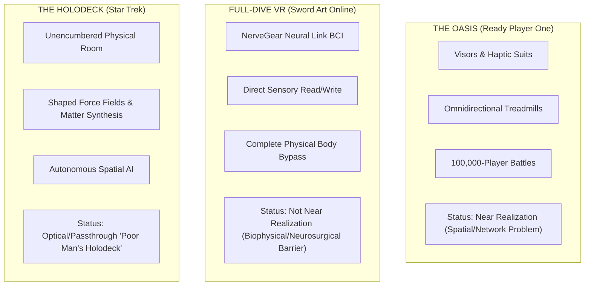
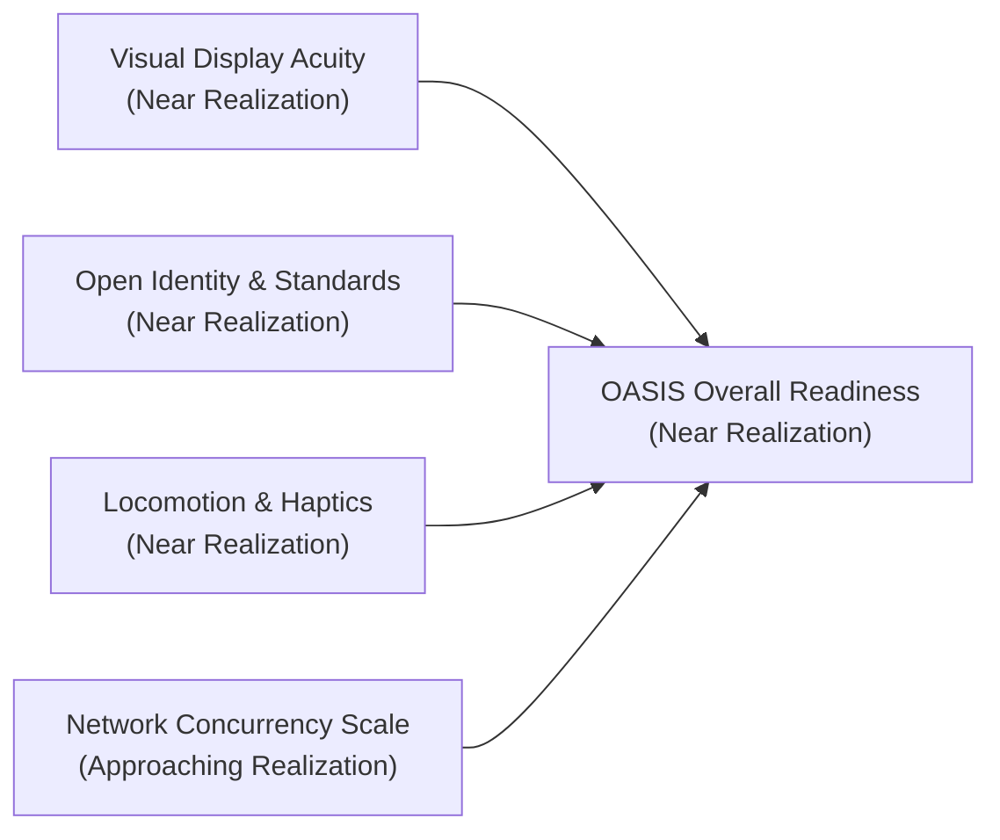
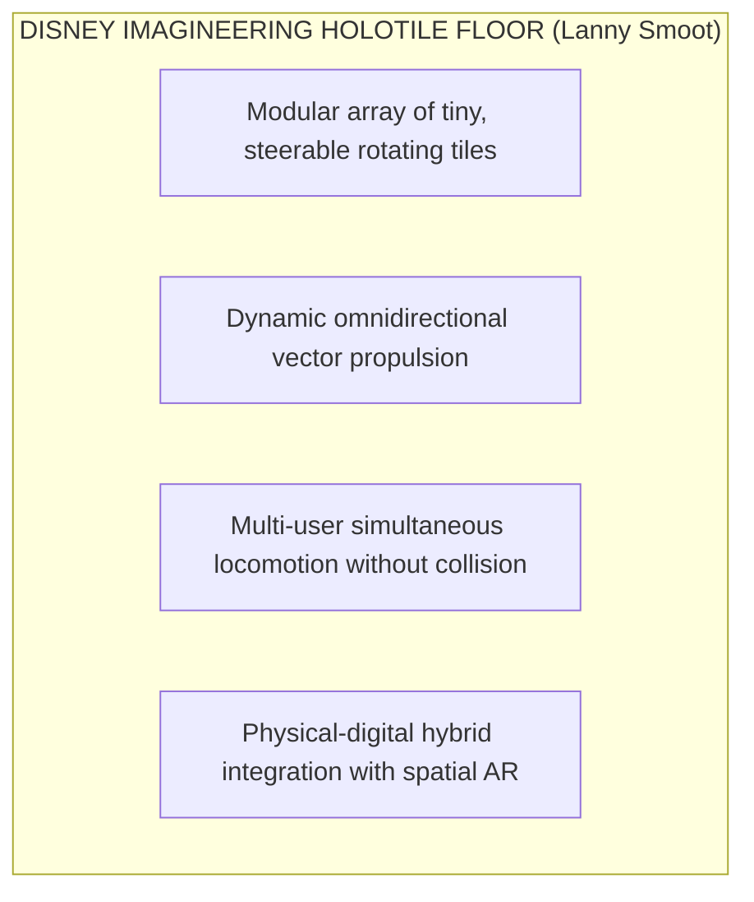
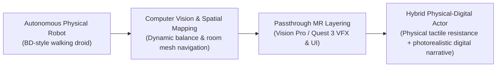
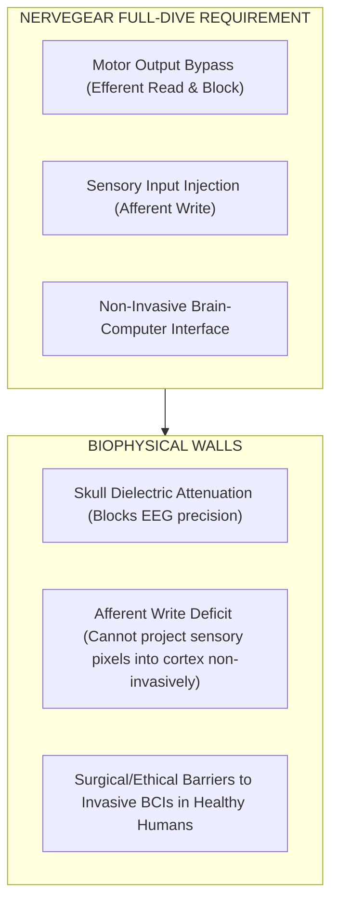
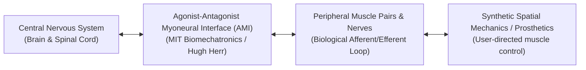

For decades, speculative fiction has dictated public expectations and venture capital investment horizons for spatial technology. When creators design spatial hardware or write interactive software, they do not build in a cultural vacuum; they build in the shadow of science fiction.

Media like Ernest Cline’s Ready Player One, Reki Kawahara’s Sword Art Online, and Gene Roddenberry’s Star Trek helped shape popular expectations for immersive media. However, pop culture often conflates these sci-fi visions into a single monolithic idea of "the Metaverse" or "Virtual Reality," ignoring the radically different software, hardware, and biophysical paradigms required to achieve each one.

To evaluate where spatial media actually stands today, we must deconstruct these sci-fi baselines. By auditing current visual displays, network protocols, haptic surfaces, robotic anchors, and neuro-technology against these benchmarks, we can separate achievable spatial engineering challenges from fundamental biophysical constraints.

## Setting the Sci-Fi Baselines

Before scoring current readiness, we must establish clear theoretical boundaries for each sci-fi framework:

### The OASIS (Ready Player One by Ernest Cline)

* **Hardware Profile**: Lightweight VR visors, haptic gloves/suits, omnidirectional treadmills, and dynamic motion rigs.
* **Architecture**: A persistent, multi-planetary digital universe connected by an open, inter-operable economy housing millions of concurrent users.
* **Human Experience**: Sensory input is delivered externally through optical screens, spatial headphones, and localized mechanical/vibrotactile pressure against the skin.

### Sword Art Online / NerveGear (SAO by Reki Kawahara)

The NerveGear is a fictional mechanism in Kawahara’s story, not an established neuroscience model.

* **Hardware Profile**: The NerveGear—a stream-lined helmet containing high-density microwave transceivers clamped around the human skull.
* **Architecture**: Full-Dive Neural Link Brain-Computer Interface (BCI).
* **Human Experience**: Total physical motor bypass. The NerveGear intercepts efferent motor signals sent from the brain before they reach the spinal cord (paralyzing the physical body), while simultaneously writing afferent sensory data (vision, sound, touch, taste, smell, temperature, and pain) directly into the brain's sensory cortex.

### The Holodeck (Star Trek)

* **Hardware Profile**: An unencumbered, multi-user physical room synthesized without headsets, goggles, or suits.
* **Architecture**: A fusion of shaped force fields (sub-atomic force projections acting as physical surfaces), matter replication, spatial acoustics, and real-time autonomous AI holograms.
* **Human Experience**: Natural physical presence in a physical room where participants touch force-field objects and converse with embodied AI characters.

## Benchmark 1: The OASIS Readiness Score (Near Realization)

The OASIS represents an extraordinary engineering challenge, but it does not violate human biology. Its implementation relies entirely on display density, networking pipelines, standards inter-operability, and physical haptics.

### Visual Fidelity & Display Tech (Approaching Realization)

In Ready Player One, Ernest Cline describes visors that project images directly onto the retina at resolutions indistinguishable from reality. Today's hardware is approaching this baseline, but has not fully achieved it.

Human visual acuity is measured at approximately 60 pixels per degree (PPD). Legacy consumer headsets (such as the Meta Quest 2 or HTC Vive) operated between 15 and 20 PPD, producing a visible "screen-door effect." Modern spatial displays—such as the dual micro-OLED 4K displays in the Apple Vision Pro (delivering over 23 million pixels across two 1.41-inch displays at ~34–40 PPD)—are approaching the visual acuity threshold for ambient reading and photorealistic immersion. Paired with eye-tracking foveated rendering (rendering full resolution only where the fovea looks), display optics are no longer the primary bottleneck.

### Concurrency & Network Scale (The Core Bottleneck)

While individual graphics rendering is near complete, network concurrency remains severely constrained. In Ready Player One, hundreds of thousands of avatars engage in simultaneous combat during the Battle of Castle Anorak.

Capacity varies substantially by platform, experience, hardware target, and server configuration. Meta Horizon Worlds has commonly supported rooms for roughly 20 to 32 participants, with lower recommended counts for experiences using physics or complex animation. VRChat world authors can generally set a soft capacity of up to 40 users, while standard instances support up to 80. Roblox uses a different client-server model: standard experiences commonly support 100 to 200 players per server, and eligible developers can configure larger servers, with some beta configurations supporting up to 700 players. These figures are platform-specific limits and configurations, not a universal cap for spatial environments.

### Why this remains difficult

* **Draw Call & Geometry Limits**: Rendering 1,000 unique avatars—each with custom shaders, high-poly meshes, and dynamic bone physics—instantly overloads local GPU draw-call pipelines.
* **Kinematic Synchronization**: Synchronizing 27-joint skeletal hand transforms and Inverse Kinematics (IK) at 60Hz becomes expensive under a naïve all-to-all broadcast model. If every participant sends each update to every other participant, the number of message paths grows approximately as `O(N²)`:

    `Packets ∝ O(N²)`

    This quadratic behavior is not an unavoidable property of multiplayer spatial networking. Area-of-Interest (AOI) filtering and replication graphs limit each client to nearby or otherwise relevant entities, reducing unnecessary updates. Relays and server-side fan-out can also prevent every client from maintaining a direct path to every other client, while dynamic server sharding distributes users and simulation work across multiple processes. These techniques improve the scaling model, but they introduce tradeoffs in consistency, visibility, latency, and cross-shard coordination. To scale from current platform-specific server limits to 100,000-user simultaneous battles, spatial architectures are combining these approaches with WebTransport UDP datagrams and edge-computing server meshes. Massive multi-user co-presence therefore remains an engineering and deployment challenge, not a consequence of an inherently quadratic network in every architecture.

### Interoperability & Open Identity (In Progress)

The OASIS is a single, continuous, persistent universe where a user can carry an avatar, weapon, or inventory item from a sci-fi planet to a fantasy realm seamlessly.

Today's spatial ecosystem remains fractured inside proprietary walled gardens (Apple App Store, Meta Quest Store, Roblox). However, open standards are rapidly building the inter-operability layer:

* **OpenXR**: Standardizes cross-platform hardware input and tracking APIs across headsets.
* **OpenUSD (Universal Scene Description)**: Spearheaded by Pixar, Apple, and NVIDIA, OpenUSD serves as an interchange format for complex 3D scenes and materials. It improves portability, but engines may still require adaptation for physics behaviors, rendering features, and runtime support.
* **WebXR & WebGPU**: Enable browser-based, URL-based distribution that bypasses native app packaging, store submission, review, listing, and installation. For compatible browsers and devices, this makes access effectively frictionless.

### Locomotion, Haptics, and Disney Imagineering

Tactile feedback in consumer spatial computing remains largely limited to vibrotactile haptic motors inside handheld controllers or wristbands. While full-body haptic suits (e.g., Teslasuit, bHaptics) exist, they rely on localized electrical muscle stimulation (EMS) or tactile vibration. They cannot exert physical structural resistance: a vibrotactile glove can vibrate when you touch a virtual stone wall, but it cannot stop your physical fingers from pushing through it.

However, physical locomotion has advanced through Disney Imagineering’s HoloTile floor, created by Disney Research Imagineering’s Lanny Smoot and supported by Disney’s wider R&D team ([Disney Research](https://la.disneyresearch.com/holotile/)).

HoloTile is a modular surface made of many small, steerable, rotating tiles. Controlled by real-time spatial tracking algorithms, the surface adjusts rotational vectors underneath a walker's feet. Disney Research presents the system as a demonstration of passive omnidirectional locomotion and programmed movement, rather than as a generally deployed consumer product:

* **Omnidirectional Walking**: The demonstrated design enables a user to walk in different directions while the tiles redirect their motion across the surface. The system is intended to extend the usable walking area, but it does not eliminate the physical limits of the installation.
* **Multi-User Potential**: Unlike mechanical omnidirectional treadmills (which typically accommodate one person tethered to a harness), the HoloTile design is intended to support multiple independent users by adjusting tile zones in real time. The supplied demonstration does not establish broad commercial deployment or performance under all crowd conditions.

By pairing a modular HoloTile floor with video passthrough spatial computing, specialized location-based entertainment venues could approximate aspects of OASIS-style physical locomotion. This remains a venue-specific approximation, not an OASIS-equivalent system available today.

## Physical-Digital Hybrid Entities: Disney Imagineering in Passthrough AR

A critical bridge between the OASIS and the Holodeck is the convergence of physical robotics with passthrough augmented reality.

### Autonomous Spatial Droids as Physical Anchors

Disney has demonstrated autonomous, untethered walking droids in both research and themed-entertainment settings. A 2024 Robotics: Science and Systems paper describes a child-sized bipedal robotic character whose control system combines reinforcement learning with artist-directed motion and real-time operator control (Grandia et al., “[Design and Control of a Bipedal Robotic Character](https://la.disneyresearch.com/publication/design-and-control-of-a-bipedal-robotic-character/),” Robotics: Science and Systems 2024). Disney also conducted a 2023 playtest of three untethered BD-style droids at Star Wars: Galaxy’s Edge, where the robots navigated park pathways, interacted with characters, and maintained balance around guests ([Disney Parks Blog](https://disneyparksblog.com/disney-experiences/imagineering-behind-the-dreams-pavilion-at-d23/), October 2023). These demonstrations show that physical autonomous characters can anchor otherwise virtual spatial experiences, but they do not establish general-purpose deployment across arbitrary environments or reproduce a fully physical Disney-style show. They also do not prove that comparable experiences are impossible in the virtual OASIS and Full-Dive SAO scenarios, or in the Holodeck’s fictional physical environment.

### Passthrough Mixed Reality Layering

These droids are designed to operate in physical environments, where their bodies, motors, and movement provide the tactile interaction. That differs from the Holodeck's fictional environment, in which objects and characters are synthesized throughout an otherwise unencumbered room. When paired with passthrough headsets such as Apple Vision Pro or Meta Quest 3, a physical droid could provide a real-world anchor for virtual effects:

1. **Physical Tactile Surface**: When a guest reaches out to touch the droid, their physical hands can feel the robot's actual body, motor resistance, and weight. This is contact with a physical robot, not generated force-field resistance.
2. **Digital Narrative Layering**: A passthrough headset could overlay visual effects, such as an energy shield or particle trail, onto the physical robot. This would combine a real object with virtual content, rather than synthesize the object itself.

This physical-digital hybrid architecture suggests a way to create limited Holodeck-like interactions by pairing physical autonomous robotics with passthrough spatial compositing. It does not reproduce the Holodeck's synthesized physical environment.

## Benchmark 2: Full-Dive VR / SAO Readiness Score (Not Near Realization)

If the OASIS is an advanced spatial engineering problem, Sword Art Online (SAO) and the NerveGear represent a fundamental biophysical and neurosurgical barrier.

### The Neural Barrier: Reading vs. Writing Brain Signals

The fundamental flaw in pop-culture depictions of "Full-Dive VR" is the assumption that reading brain signals and writing brain signals are equivalent challenges. They are not.

**Reading Brain Signals (Efferent Motor Intention)**

Current brain-computer interfaces can decode selected signals under constrained conditions, particularly in clinical research, but they do not provide general-purpose motor-intent decoding:

* **Non-Invasive BCI (EEG / EMOTIV / NextMind)**: Consumer EEG caps measure aggregate voltage fluctuations through the skull. In limited, task-specific settings, they can classify crude signals (for example, distinguishing attention states) to trigger simple software actions. However, EEG has limited spatial resolution because the skull attenuates and spreads the measured signals.
* **Invasive BCI (Neuralink / Synchron)**: In clinical research, implanted motor-cortex electrode arrays (Neuralink) and endovascular interfaces placed in cerebral blood vessels (Synchron) have been used to decode selected motor-related signals. These systems can help research participants with paralysis control robotic limbs or digital cursors, but they remain specialized medical technologies rather than general-purpose interfaces.

**Writing Sensory Data (Afferent Sensory Injection)**

To achieve SAO's Full-Dive experience, a device cannot merely read motor intent; it must write photorealistic visual scenes, spatial acoustics, tactile resistance, thermal changes, and olfactory data directly into the brain's sensory processing centers non-invasively.

Current non-invasive techniques cannot deliver the spatial resolution and multimodal fidelity required for Full-Dive VR. They can modulate or measure some brain activity, but they cannot write structured, high-density visual, auditory, tactile, thermal, and olfactory experiences into specific cortical areas with the precision required by the fictional system.

Transcranial Magnetic Stimulation (TMS) and focused ultrasound can excite broad cortical regions (causing a subject to see crude flashes of light called phosphenes), but they cannot write structured 4K visual imagery or subtle tactile textures into the visual or somatosensory cortex.

Invasive approaches remain experimental and involve substantial surgical, safety, ethical, and regulatory considerations. Current research does not support deploying the scale and multimodal fidelity required for Full-Dive VR as a consumer entertainment system.

## The Biophysical Real-World Bridge: MIT Media Lab & Peripheral Neural Interfaces

Because current systems cannot provide full-brain sensory injection, where is neuro-engineering actually bridging the gap between digital systems and human physiology?

One example is the peripheral neural-interface work led by Hugh Herr and the MIT Biomechatronics Group at the MIT Media Lab.

### The Agonist-Antagonist Myoneural Interface (AMI)

The [**Agonist-Antagonist Myoneural Interface (AMI)**](https://www.media.mit.edu/projects/agonist-antagonist-myoneural-interface-ami/overview/) reconnects muscle pairs in a residual limb so that the user's own muscle activity can help control a powered prosthesis. The approach demonstrates that a person can direct a machine through peripheral neuromuscular pathways, without requiring the prosthesis to decode signals directly from an implanted brain interface.

### Narrative & Technical Implications

The MIT Biomechatronics Group’s work demonstrates a simple but important point for embodied spatial interaction: a person's own muscles can direct a prosthesis through the body's peripheral pathways. This provides an alternative example of machine control beyond direct cortical BCI, without claiming that AMI is a general-purpose interface for virtual objects.

## Conclusion & Transition to Part 5

Our audit reveals a clear dichotomy:

* **The OASIS is a Spatial Engineering & Network Challenge**: Its realization does not require scientific miracles. It depends on scaling edge server pipelines, standardizing OpenUSD/WebXR protocols, expanding video passthrough optics, and deploying physical locomotion surfaces like Disney's HoloTile. We are near realizing it, but important challenges remain.
* **Full-Dive SAO is a Biophysical & Neurosurgical Challenge**: Current non-invasive techniques cannot provide the spatial resolution and multimodal fidelity required for Full-Dive VR, while invasive approaches remain experimental and involve substantial surgical, safety, ethical, and regulatory considerations. Consumer Full-Dive VR remains far from realization. Meanwhile, peripheral neuromuscular interfaces such as MIT's AMI demonstrate an alternative path to embodied machine control without requiring direct cortical decoding.

Having established the physical and technical parameters of spatial hardware, we confront the ultimate question: Even if we build the OASIS, how do we structure compelling stories within it?

In Part 5: Revisiting Murray’s Holodeck, we turn to theoretical narrative architecture—testing Janet H. Murray’s updated 2016 framework (Hamlet on the Holodeck, MIT Press) to determine how authors transition from linear sculptors into spatial system architects.

## References

Apple Inc. (2024). [Apple Vision Pro Technical Specifications and visionOS Architecture](https://developer.apple.com/visionos/). Apple Developer Documentation.

Cline, E. (2011). Ready Player One. Random House. ISBN: 978-0-307-88743-6.

Grandia, R., Knoop, E., Hopkins, M., Wiedebach, G., Bishop, J., Pickles, S., Muelller, D., and Bächer, M. (2024). [Design and Control of a Bipedal Robotic Character](https://la.disneyresearch.com/publication/design-and-control-of-a-bipedal-robotic-character/). *Robotics: Science and Systems 2024*. [PDF](https://la.disneyresearch.com/wp-content/uploads/BD_X_paper.pdf).

Disney Parks Blog. (2023). [Imagineering Behind the Dreams Pavilion at D23](https://disneyparksblog.com/disney-experiences/imagineering-behind-the-dreams-pavilion-at-d23/). Disney Parks.

Herr, H. M., et al. (2018–2024). [Agonist-Antagonist Myoneural Interface (AMI) for Synthetic Proprioception and Neuro-Prosthetic Control](https://www.media.mit.edu/projects/agonist-antagonist-myoneural-interface-ami/overview/). MIT Media Lab Biomechatronics Group.

Ito, T. (Director). (2012). [Sword Art Online (Season 1)](https://www.crunchyroll.com/series/GR49G9VP6/sword-art-online) [Television anime series]. A-1 Pictures / Aniplex / Crunchyroll.

Kawahara, R. (2009). Sword Art Online. ASCII Media Works / Yen Press. [https://yenpress.com/series/sword-art-online#](https://yenpress.com/series/sword-art-online#)

Meta Platforms & Reality Labs. (2023–2024). [Meta Quest 3 Developer Documentation & OpenXR Integration](https://developer.oculus.com/). Meta Developers.

Meta Reality Labs. (2024–2025). [Human-Computer Input via a Wrist-Based sEMG Wearable: A Generic Noninvasive Neuromotor Interface](https://www.meta.com/blog/surface-emg-wrist-white-paper-reality-labs/). Meta Quest Research & bioRxiv preprint.

Murray, J. H. (2016). Hamlet on the Holodeck: The Future of Narrative in Cyberspace (Updated ed.). MIT Press. ISBN: 978-0-262-53348-5.

OpenUSD Alliance. (2023–2024). [Universal Scene Description (USD) Open Standards Specification](https://aousd.org/). Alliance for OpenUSD (AOUSD).

Smoot, L. (2024). HoloTile Modular Omnidirectional Treadmill Surface. Disney Imagineering Research & Development / National Inventors Hall of Fame.

W3C. (2023). [WebXR Device API Specification](https://www.w3.org/TR/webxr/). World Wide Web Consortium.

W3C. (2024). [WebGPU Protocol Specification](https://www.w3.org/TR/webgpu/). World Wide Web Consortium.
