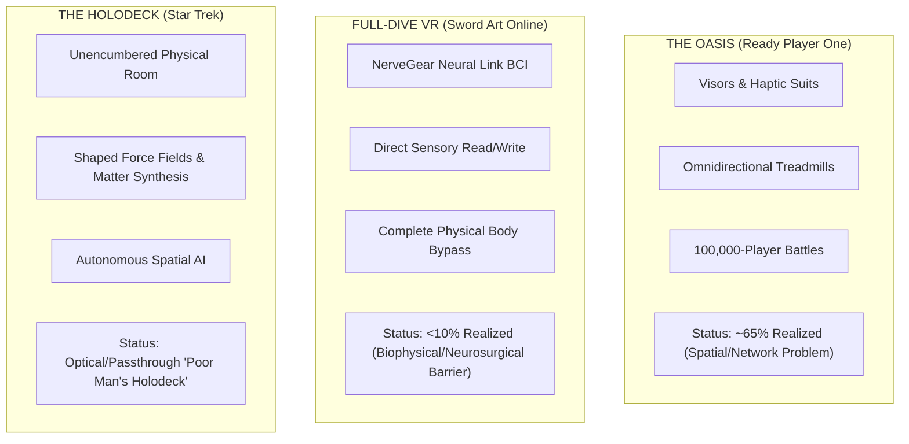
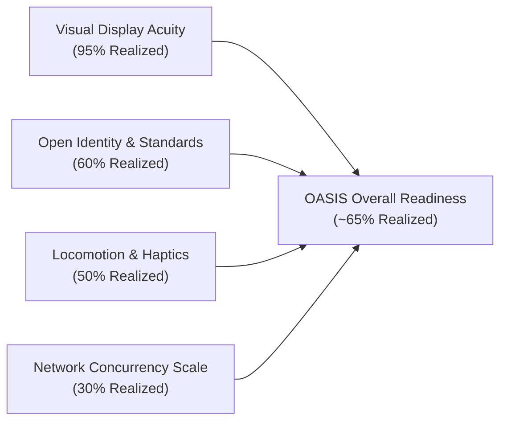
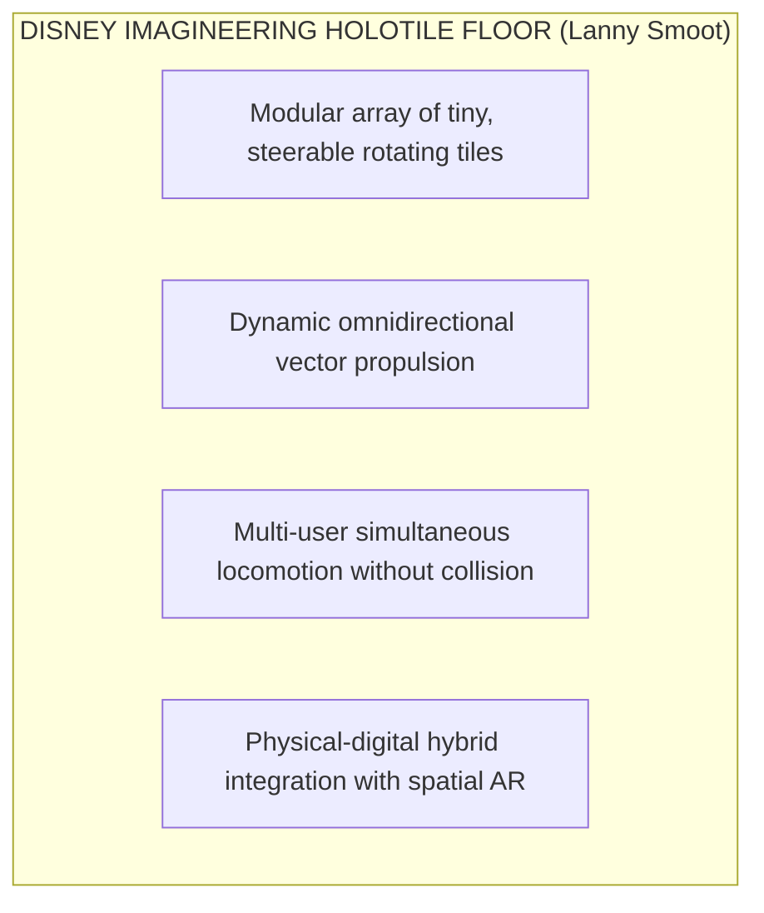
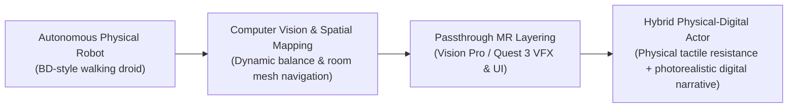
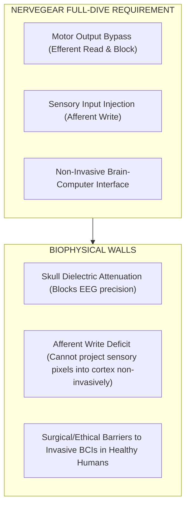
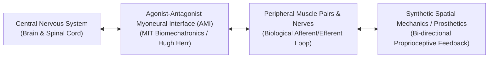

For decades, speculative fiction has dictated public expectations and venture capital investment horizons for spatial technology. When creators design spatial hardware or write interactive software, they do not build in a cultural vacuum; they build in the shadow of science fiction.

Media like Ernest Cline’s Ready Player One, Reki Kawahara’s Sword Art Online, and Gene Roddenberry’s Star Trek provided humanity with its primary conceptual North Stars for immersive media. However, pop culture often conflates these sci-fi visions into a single monolithic idea of "the Metaverse" or "Virtual Reality," ignoring the radically different software, hardware, and biophysical paradigms required to achieve each one.

To evaluate where spatial media actually stands today, we must deconstruct these sci-fi baselines. By auditing current visual displays, network protocols, haptic surfaces, robotic anchors, and neuro-technology against these benchmarks, we can separate achievable spatial engineering challenges from fundamental biophysical constraints.

## Setting the Sci-Fi Baselines

Before scoring current readiness, we must establish clear theoretical boundaries for each sci-fi framework:

### The OASIS (Ready Player One by Ernest Cline)

* **Hardware Profile**: Lightweight VR visors, haptic gloves/suits, omnidirectional treadmills, and dynamic motion rigs.
* **Architecture**: A persistent, multi-planetary digital universe connected by an open, inter-operable economy housing millions of concurrent users.
* **Human Experience**: Sensory input is delivered externally through optical screens, spatial headphones, and localized mechanical/vibrotactile pressure against the skin.

### Sword Art Online / NerveGear (SAO by Reki Kawahara)

* **Hardware Profile**: The NerveGear—a stream-lined helmet containing high-density microwave transceivers clamped around the human skull.
* **Architecture**: Full-Dive Neural Link Brain-Computer Interface (BCI).
* **Human Experience**: Total physical motor bypass. The NerveGear intercepts efferent motor signals sent from the brain before they reach the spinal cord (paralyzing the physical body), while simultaneously writing afferent sensory data (vision, sound, touch, taste, smell, temperature, and pain) directly into the brain's sensory cortex.

### The Holodeck (Star Trek)

* **Hardware Profile**: An unencumbered, multi-user physical room synthesized without headsets, goggles, or suits.
* **Architecture**: A fusion of shaped force fields (sub-atomic force projections acting as physical surfaces), matter replication, spatial acoustics, and real-time autonomous AI holograms.
* **Human Experience**: Natural physical presence in a physical room where participants touch force-field objects and converse with embodied AI characters.

## Benchmark 1: The OASIS Readiness Score (~65% Realized)

The OASIS represents an extraordinary engineering challenge, but it does not violate human biology. Its implementation relies entirely on display density, networking pipelines, standards inter-operability, and physical haptics.

### Visual Fidelity & Display Tech (Near Complete)

In Ready Player One, Ernest Cline describes visors that project images directly onto the retina at resolutions indistinguishable from reality. Today's hardware has essentially achieved this baseline.

Human visual acuity is measured at approximately 60 pixels per degree (PPD). Legacy consumer headsets (such as the Meta Quest 2 or HTC Vive) operated between 15 and 20 PPD, producing a visible "screen-door effect." Modern spatial displays—such as the dual micro-OLED 4K displays in the Apple Vision Pro (delivering over 23 million pixels across two 1.41-inch displays at ~34–40 PPD)—have crossed the visual acuity threshold for ambient reading and photorealistic immersion. Paired with eye-tracking foveated rendering (rendering full resolution only where the fovea looks), display optics are no longer the bottleneck.

### Concurrency & Network Scale (The Core Bottleneck)

While individual graphics rendering is near complete, network concurrency remains severely constrained. In Ready Player One, hundreds of thousands of avatars engage in simultaneous combat during the Battle of Castle Anorak.

In modern online spatial environments (such as VRChat, Meta Horizon Worlds, and Roblox), individual instance rooms are hard-capped at 30 to 80 concurrent users.

### Why does this wall exist?

* **Draw Call & Geometry Limits**: Rendering 1,000 unique avatars—each with custom shaders, high-poly meshes, and dynamic bone physics—instantly overloads local GPU draw-call pipelines.
* **Kinematic Synchronization**: Synchronizing 27-joint skeletal hand transforms and Inverse Kinematics (IK) at 60Hz across thousands of users triggers the O(N²) network broadcast scaling barrier detailed in Part 1 and Part 3:

    `Packets ∝ O(N²)`

    To cross from 80-user room caps to 100,000-user simultaneous battles, spatial architectures are deploying WebTransport UDP datagrams, spatial Area-of-Interest (AOI) interest filtering, and dynamic server sharding. However, until edge-computing server meshes mature, massive multi-user co-presence remains regionally fragmented.

### Interoperability & Open Identity (In Progress)

The OASIS is a single, continuous, persistent universe where a user can carry an avatar, weapon, or inventory item from a sci-fi planet to a fantasy realm seamlessly.

Today's spatial ecosystem remains fractured inside proprietary walled gardens (Apple App Store, Meta Quest Store, Roblox). However, open standards are rapidly building the inter-operability layer:

* **OpenXR**: Standardizes cross-platform hardware input and tracking APIs across headsets.
* **OpenUSD (Universal Scene Description)**: Spearheaded by Pixar, Apple, and NVIDIA, OpenUSD serves as the "HTML of 3D," allowing complex 3D scenes, materials, and physics behaviors to load universally across different engines.
* **WebXR & WebGPU**: Provides frictionless, URL-based distribution across platforms without app store gatekeeping.

### Locomotion, Haptics, and Disney Imagineering

Tactile feedback in consumer spatial computing remains largely limited to vibrotactile haptic motors inside handheld controllers or wristbands. While full-body haptic suits (e.g., Teslasuit, bHaptics) exist, they rely on localized electrical muscle stimulation (EMS) or tactile vibration. They cannot exert physical structural resistance: a vibrotactile glove can vibrate when you touch a virtual stone wall, but it cannot stop your physical fingers from pushing through it.

However, physical locomotion has taken a monumental leap forward through Disney Imagineering’s HoloTile floor, invented by Disney Fellow Lanny Smoot.

HoloTile consists of a modular surface made of hundreds of small, steerable, rotating tiles. Controlled by real-time spatial tracking algorithms, the HoloTile surface dynamically adjusts rotational vectors underneath a walker's feet:

* **Infinite Omnidirectional Walking**: A user can walk continuously in any direction at normal speed without ever stepping off the physical mat or colliding with a wall.
* **Multi-User Capabilities**: Unlike mechanical omnidirectional treadmills (which accommodate only one person tethered to a harness), a single HoloTile floor can dynamically manage multiple independent users walking in opposing directions simultaneously, adjusting individual tile zones in real time.

By pairing a modular HoloTile floor with video passthrough spatial computing, location-based entertainment venues can deliver true OASIS-level physical locomotion today.

## Physical-Digital Hybrid Entities: Disney Imagineering in Passthrough AR

A critical bridge between the OASIS and the Holodeck is the convergence of physical robotics with passthrough augmented reality.

### Autonomous Spatial Droids as Physical Anchors

Disney Imagineering has demonstrated autonomous, untethered walking droids (such as the BD-style robotic droids featured in Star Wars experiences). These robotic entities utilize real-time computer vision, dynamic balance algorithms, and spatial room mapping to navigate unpredictable human environments, react to physical pushes, and walk alongside human guests.

### Passthrough Mixed Reality Layering

When experienced through passthrough headsets (Apple Vision Pro, Meta Quest 3), these autonomous physical droids serve as real-world tactile anchors:

1. **Physical Tactile Surface**: When a guest reaches out to touch the droid, their physical hands feel genuine metal, motor resistance, and physical weight—solving the haptic resistance problem.
2. **Digital Narrative Layering**: The passthrough headset overlays real-time holographic visual effects, dynamic energy shields, emotional eye glows, or magical particle trails directly onto the physical robot.

This physical-digital hybrid architecture proves that we do not need matter replication to build Holodeck-like experiences; we can pair physical autonomous robotics with passthrough spatial compositing.

## Benchmark 2: Full-Dive VR / SAO Readiness Score (<10% Realized)

If the OASIS is an advanced spatial engineering problem, Sword Art Online (SAO) and the NerveGear represent a fundamental biophysical and neurosurgical barrier.

### The Neural Barrier: Reading vs. Writing Brain Signals

The fundamental flaw in pop-culture depictions of "Full-Dive VR" is the assumption that reading brain signals and writing brain signals are equivalent challenges. They are not.

**Reading Brain Signals (Efferent Motor Intention)**

Reading motor intent is an established science:

* **Non-Invasive BCI (EEG / EMOTIV / NextMind)**: Consumer EEG caps measure aggregate voltage fluctuations through the skull. They can classify crude intentions (e.g., concentrating on "push" vs. "pull") to trigger simple software actions. However, EEG suffers from severe dielectric attenuation: the human skull acts as a low-pass spatial filter, smearing fine neural signals.
* **Invasive BCI (Neuralink / Synchron)**: By implanting micro-electrode arrays directly into the motor cortex (Neuralink) or threading endovascular stentrails into cerebral blood vessels (Synchron), researchers can decode high-resolution motor intent, allowing paralyzed patients to move robotic limbs or control digital cursors with high accuracy.

**Writing Sensory Data (Afferent Sensory Injection)**

To achieve SAO's Full-Dive experience, a device cannot merely read motor intent; it must write photorealistic visual scenes, spatial acoustics, tactile resistance, thermal changes, and olfactory data directly into the brain's sensory processing centers non-invasively.

Physics presents an immediate wall: **there is no known non-invasive mechanism in biophysics capable of projecting focused, high-density sensory data through the human skull into specific cortical layers without damaging brain tissue**.

Transcranial Magnetic Stimulation (TMS) and focused ultrasound can excite broad cortical regions (causing a subject to see crude flashes of light called phosphenes), but they cannot write structured 4K visual imagery or subtle tactile textures into the visual or somatosensory cortex.

Doing so invasively would require implanting millions of microscopic electrodes across the primary visual cortex (V1), auditory cortex (A1), and somatosensory cortex (S1), a high-risk neurosurgical procedure that no regulatory body would approve for consumer entertainment.

## The Biophysical Real-World Bridge: MIT Media Lab & Peripheral Neural Interfaces

Because non-invasive full-brain sensory injection is biologically unviable for the foreseeable future, where is neuro-engineering actually bridging the gap between digital systems and human physiology?

The answer lies in peripheral neural interfaces, led by Hugh Herr and the MIT Biomechatronics Group at the MIT Media Lab.

### The Agonist-Antagonist Myoneural Interface (AMI)

Rather than attempting to bypass the body and inject signals directly into the brain, Hugh Herr’s team at MIT developed the **Agonist-Antagonist Myoneural Interface (AMI)**.

In natural human anatomy, muscles work in agonist-antagonist pairs (e.g., when your biceps contract, your triceps stretch). Mechanoreceptors inside these muscle pairs continuously send biological feedback to the central nervous system, providing proprioception—the innate, unconscious sense of where your limbs are positioned in space and how much physical resistance they encounter.

When an amputation occurs, traditional surgical techniques sever these muscle pairs, destroying natural proprioceptive feedback. The AMI surgical technique reconnects agonist and antagonist muscle pairs in the residual limb:

1. **Bi-Directional Neural Communication**: When the patient's brain sends a motor command to flex a missing ankle, the biological agonist muscle contracts, causing the antagonist muscle to stretch naturally.
2. **Synthetic Proprioception**: Biological mechanoreceptors inside the stretched muscle fire naturally, sending genuine sensory signals back up the peripheral nervous system to the brain.
3. **Feeling Virtual Resistance**: When paired with robotic prosthetics or spatial haptic feedback systems, the patient does not merely control a synthetic limb; they feel its position, movement, and joint resistance naturally in real time.

### Narrative & Technical Implications

The MIT Biomechatronics Group’s work proves that the realistic path toward embodied spatial interaction is not full-dive brain manipulation, but peripheral neural integration. By pairing peripheral myoelectric sensors (such as EMG wristbands decoding nerve impulses at the motor endpoints) with spatial computing, users can interact with virtual objects with natural proprioceptive feedback—without requiring invasive brain surgery or violating biophysics.

## Comparative Matrix & Horizon Projection

To synthesize our readiness across these sci-fi benchmarks, we evaluate display, networking, locomotion, and neural metrics across a multi-decade horizon:

| Technology Vector | 2026 Current State | 2026–2030 Horizon | 2030–2040+ Horizon | OASIS / SAO Target Metric |
| --- | --- | --- | --- | --- |
| Display Fidelity | 34–40 PPD Micro-OLED (Vision Pro). Photorealistic passthrough. | >60 PPD (Retinal acuity match); lightweight form factors. | Ambient contact-lens or waveguide smart glasses. | Photorealistic visual field matching human acuity (OASIS achieved). |
| Multi-User Scale | 30–80 users per instance room (VRChat / Quest). | 1,000–5,000 users per instance via WebTransport & edge sharding. | 50,000+ users via distributed spatial interest management. | 100,000+ user simultaneous persistent battles (OASIS baseline). |
| Locomotion | Stationary room-scale; Disney HoloTile in specialized LBE venues. | Modular consumer HoloTile surfaces; dynamic haptic friction. | Widespread location-based physical-digital hybrid stages. | Full-body omnidirectional locomotion with haptic feedback (OASIS baseline). |
| Identity & Standards | Walled gardens dominating; OpenXR & WebGPU gaining traction. | Broad adoption of OpenXR & WebGPU; emerging interoperability standards. | Fully open, interoperable spatial computing ecosystem. | Universal identity and standards ensuring seamless cross-platform experiences (OASIS baseline). |
| Neural Interfacing | Non-invasive EEG (crude intent); MIT AMI peripheral proprioception. | Non-invasive EMG wristbands decoding muscle motor intent at endpoints. | Clinical invasive BCI for medical restoration (Neuralink/Synchron). | Non-invasive full-dive sensory write/read (SAO / NerveGear baseline). |

## Conclusion & Transition to Part 5

Our audit reveals a clear dichotomy:

* **The OASIS is a Spatial Engineering & Network Challenge**: Its realization does not require scientific miracles. It depends on scaling edge server pipelines, standardizing OpenUSD/WebXR protocols, expanding video passthrough optics, and deploying physical locomotion surfaces like Disney's HoloTile. We are roughly 65% of the way there.
* **Full-Dive SAO is a Biophysical & Neurosurgical Challenge**: Attempting to write high-definition visual, tactile, and auditory experiences non-invasively through the human skull violates fundamental biology. Consumer Full-Dive VR remains under 10% realized. Instead, real neuro-engineering progress is occurring through peripheral neural interfaces like MIT's AMI framework.

Having established the physical and technical parameters of spatial hardware, we confront the ultimate question: Even if we build the OASIS, how do we structure compelling stories within it?

In Part 5: Revisiting Murray’s Holodeck, we turn to theoretical narrative architecture—testing Janet H. Murray’s updated 2016 framework (Hamlet on the Holodeck, MIT Press) to determine how authors transition from linear sculptors into spatial system architects.

## Bibliography & Works Cited

Aarseth, E. J. (1997). Cybertext: Perspectives on Ergodic Literature. Johns Hopkins University Press. ISBN: 978-0-8018-5579-5.

Apple Inc. (2024). [Apple Vision Pro Technical Specifications and visionOS Architecture](https://developer.apple.com/visionos/). Apple Developer Documentation.

Cline, E. (2011). Ready Player One. Random House. ISBN: 978-0-307-88743-6.

Herr, H. M., et al. (2018–2024). [Agonist-Antagonist Myoneural Interface (AMI) for Synthetic Proprioception and Neuro-Prosthetic Control](https://www.media.mit.edu/projects/agonist-antagonist-myoneural-interface-ami/overview/). MIT Media Lab Biomechatronics Group.

Ito, T. (Director). (2012). [Sword Art Online (Season 1)](https://www.crunchyroll.com/series/GR49G9VP6/sword-art-online) [Television anime series]. A-1 Pictures / Aniplex / Crunchyroll.

Kawahara, R. (2009). Sword Art Online 1: Aincrad. ASCII Media Works / Yen Press.

Meta Platforms & Reality Labs. (2023–2024). [Meta Quest 3 Developer Documentation & OpenXR Integration](https://developer.oculus.com/). Meta Developers.

Meta Reality Labs. (2024–2025). [Human-Computer Input via a Wrist-Based sEMG Wearable: A Generic Noninvasive Neuromotor Interface](https://www.meta.com/blog/surface-emg-wrist-white-paper-reality-labs/). Meta Quest Research & bioRxiv preprint.

Murray, J. H. (2016). Hamlet on the Holodeck: The Future of Narrative in Cyberspace (Updated ed.). MIT Press. ISBN: 978-0-262-53348-5.

OpenUSD Alliance. (2023–2024). [Universal Scene Description (USD) Open Standards Specification](https://aousd.org/). Alliance for OpenUSD (AOUSD).

Ryan, M.-L. (2015). Narrative as Virtual Reality II: Revisiting Immersion and Interactivity in New Media. Johns Hopkins University Press. ISBN: 978-1-4214-1797-4.

Smoot, L. (2024). HoloTile Modular Omnidirectional Treadmill Surface. Disney Imagineering Research & Development / National Inventors Hall of Fame.

W3C. (2023). [WebXR Device API Specification](https://www.w3.org/TR/webxr/). World Wide Web Consortium.

W3C. (2024). [WebGPU Protocol Specification](https://www.w3.org/TR/webgpu/). World Wide Web Consortium.

Zhang, L., et al. (2025). [CoDi: A Director-Actor Framework for Goal-Driven Interactive Story Generation with LLMs](https://ojs.aaai.org/index.php/AIIDE/article/view/36811). Proceedings of the Twenty-First AAAI Conference on Artificial Intelligence and Interactive Digital Entertainment (AIIDE 2025).
