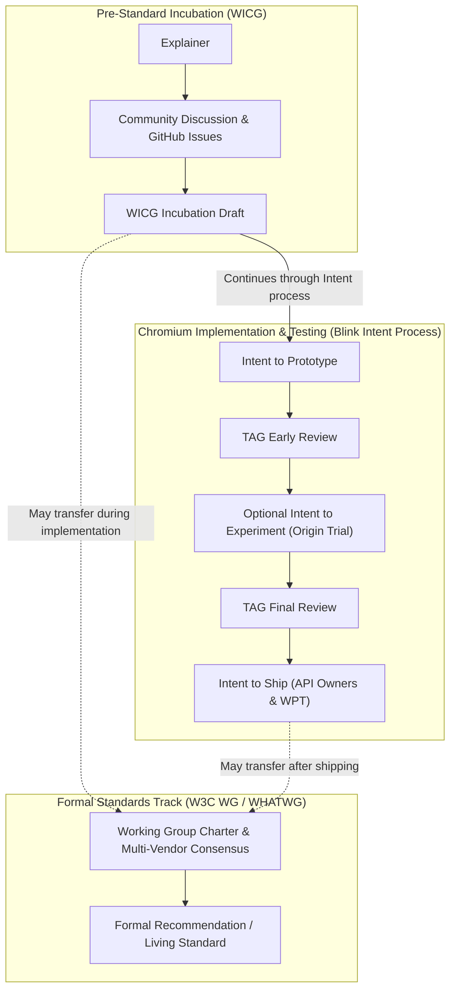
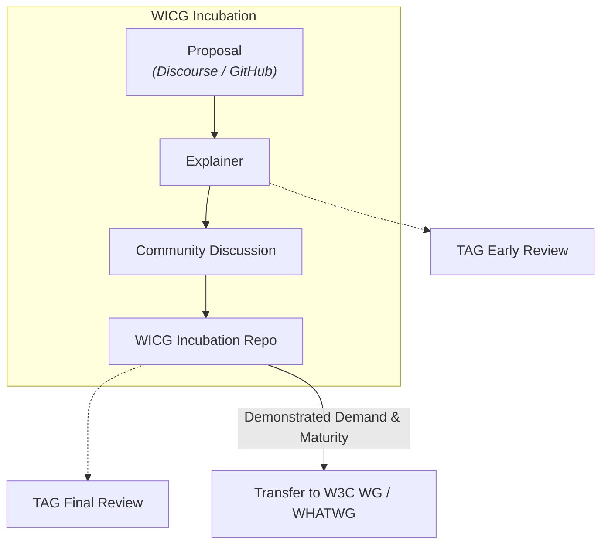
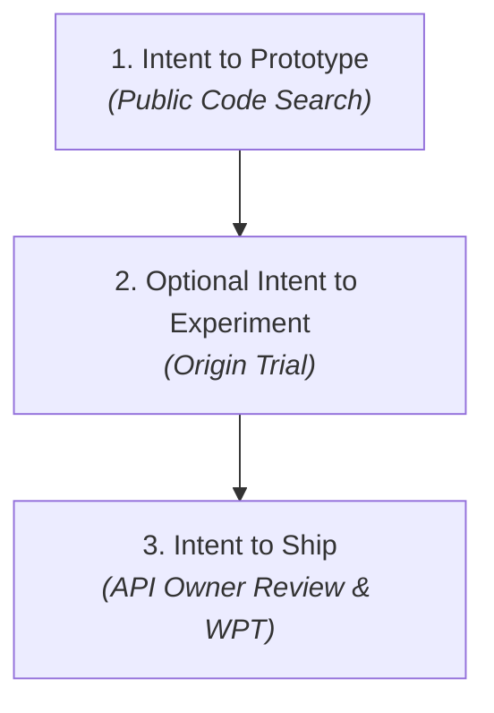
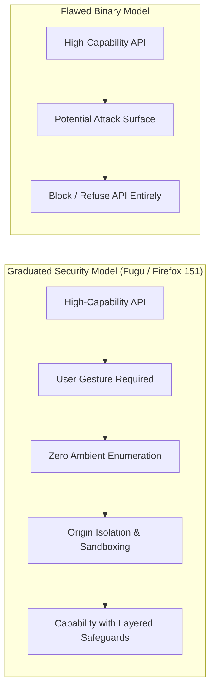
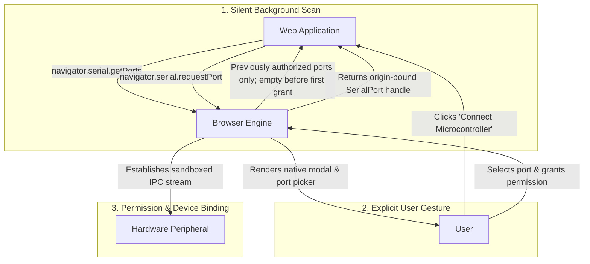
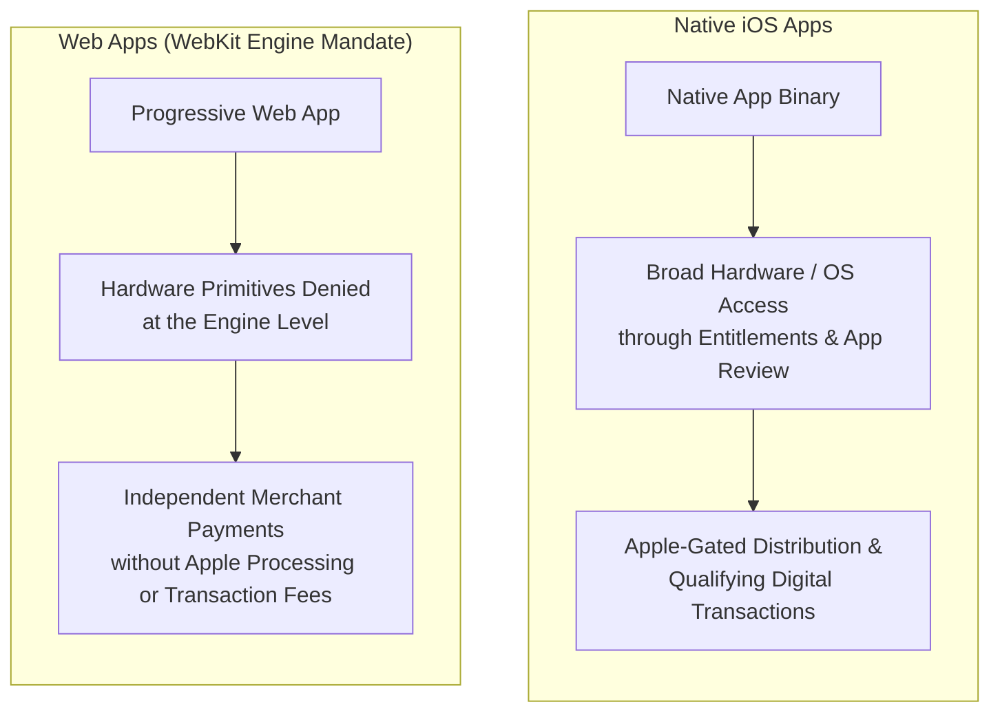

The ongoing debate over modern web capabilities often hides behind high-minded security and privacy rhetoric. At its core, however, it is a conflict over platform trust, developer empowerment, and mobile ecosystem control.

On one side stands the Chromium/Blink philosophy (Project Fugu): trust developers, build robust runtime sandboxes, and empower the open web to run desktop-grade, native-class applications. On the other side stand Mozilla (Gecko) and, most aggressively, Apple (WebKit): adopt an adversarial posture toward web developers, treat low-level capabilities as inherent security liabilities, and block system primitives under the banner of protecting users from themselves.

The restrictive posture championed by WebKit and historically echoed by Mozilla is fundamentally flawed. When you examine the technical reality, treating security as a binary excuse to deny web capabilities overlooks viable permission models and, on iOS, aligns conveniently with protecting native ecosystem incentives.

## The historical precedent: Running code vs. speculative standards

Critics often accuse Blink of pushing "unilateral" APIs that fracture the web. This argument overlooks both the open mechanics of modern web platform development and the foundational history of how the platform has always evolved.

The web has never advanced through purely speculative, top-down consensus. In February 1993, before the W3C or WHATWG existed and before the publication of the HTML specification that eventually became RFC 1866 / HTML 2.0, Marc Andreessen posted to the [www-talk mailing list](http://1997.webhistory.org/www.lists/www-talk.1993q1/0182.html) proposing the `` tag. He did not wait for an academic consensus on a generalized, format-agnostic media container; he announced that NCSA Mosaic had already implemented the tag to solve an immediate user need. Standards purists objected, but the running implementation drove adoption and defined the web's trajectory.

While the governance landscape in 1993 was rudimentary compared to modern multi-engine standards bodies, the underlying dynamic remains the same: specifications that succeed are grounded in running code and real developer utility, not hypothetical committee purity.

Today, Chromium’s path from a new web-platform idea to implementation and formal standardization involves three broad stages: pre-standard community incubation, vendor-level implementation and testing, and formal multi-stakeholder standardization within recognized bodies such as W3C Working Groups or the WHATWG.

### Stage 1: Incubation via the Web Incubator Community Group (WICG)

Before an API is ready for a formal standards track, it is incubated within the [W3C Web Incubator Community Group (WICG)](https://wicg.io/):

1. **The explainer first**: Any engineer (from Google, Microsoft, Intel, Apple, Mozilla, or an independent consultancy) must write a public explainer outlining the problem statement, end-user use cases, alternative solutions considered, and security/privacy trade-offs.
2. **Open discussion**: Incubations live in public GitHub repositories under the WICG organization. Issues, pull requests, and design debates are open to the entire web community, including engineers from competing browser vendors and security researchers.
3. **Transition to the standards track**: The WICG is explicitly an incubator, not a standards body. Once an API design stabilizes and demonstrates real-world demand, it is formally proposed for adoption by a W3C Working Group (such as the Web Platform Working Group or Web Application Security Working Group) or the WHATWG.

### What happens when Chromium ships an incubation that doesn't graduate?

Not every WICG proposal transitions into a formal W3C Working Group Recommendation or WHATWG Living Standard. When an API ships in Chromium without multi-engine consensus in a formal standards body, it follows one of three outcomes:

* **De facto specifications**: The specification remains hosted in WICG as a Community Group Report, maintained actively by Chromium and industry partners. While lacking formal multi-vendor consensus, it serves as a stable de facto reference for Chromium-targeted web apps (e.g., WebUSB, Web Serial, File System Access API).
* **Deprecation and removal**: Proposals that fail to demonstrate developer adoption, reveal unfixable security flaws, or create high maintenance costs enter Blink's deprecation pipeline (Intent to Deprecate &rightarrow; Intent to Remove). The code is deleted from Blink and the repository is archived (e.g., Portals, HTML Imports).
* **Rescoping and absorption**: The initial design is retired after multi-engine feedback, but its core technical capability is re-architected and absorbed into an existing standard (e.g., the WICG App History proposal being re-designed and absorbed into the WHATWG HTML specification as the standard Navigation API).

### Stage 2: The implementation feedback loop (the "Intent" system)

While standards bodies govern formal specifications, individual browser engines govern implementation through structured public release pipelines. In Chromium, this is announced directly on the public blink-dev mailing list and tracked transparently on chromestatus.com.

1. **Intent to prototype**: Engineers announce they are beginning to write code behind an experimental flag. Deliverables include links to the WICG explainer, initial security/privacy self-assessments, and formal requests for feedback from Mozilla and Apple via their Standards Positions repositories.
2. **Intent to experiment (origin trials)**: Origin trials are optional but strongly encouraged when a team needs evidence about developer demand, real-world usage, or the API's shape. Instead of relying on manual `chrome://flags` (which caused historical web lock-in), Chromium uses cryptographic tokens to enable experimental APIs only for specific domains over a time-bound window. Teams gather performance, stability, usage, and developer feedback, then use that evidence to refine the API, continue toward shipping, park the feature, or request an extension with API Owner approval. An origin trial does not pass or fail.
3. **Intent to ship**: Shipping by default requires formal LGTM (Looks Good To Me) approvals from at least three independent [API Owners](https://www.chromium.org/blink/guidelines/api-owners/), mandatory security/privacy audits, explicit responses to WebKit/Gecko positions, and comprehensive coverage in the cross-browser [Web Platform Tests](https://web-platform-tests.org/) (WPT) suite. Chromium developers strive for 100% coverage of both the specification and Chromium-specific code, but this ideal is not a mandatory hard gate for Intent to Ship approval.

### Stage 3: Formal standardization (W3C and WHATWG)

True standardization occurs only when a proposal enters a recognized standards body:

* **[W3C](https://www.w3.org/) working groups**: Produce formal W3C Recommendations backed by comprehensive patent commitments, formal charter reviews, and Advisory Committee review.
* **[WHATWG](https://whatwg.org/)**: Maintains Living Standards (HTML, DOM, Fetch, URL) under the multi-stakeholder Steering Group.

### Transparency vs. consensus vetoes

The incubation and implementation pipeline demonstrates the critical difference between transparent experimentation and unanimous veto power:

* **It is transparent**: The core technical artifacts, including implementation code, specifications, Intent discussions, standards positions, and available review records, are publicly searchable. A small number of features also require supplemental Google-internal launch review when they affect internal resources or applications, but that review does not replace the public Blink Intent process.
* **It avoids speculative deadlock**: In a multi-engine ecosystem, requiring unanimous vendor approval before prototyping or experimenting with a feature would allow any single vendor to stall web evolution indefinitely, reinforcing the early IETF principle that progress requires running code to validate ideas before standardization can succeed.

## The security dilemma: Sandbox enforcement vs. blanket refusal

The standard justification for blocking Project Fugu APIs (such as WebUSB, Web Serial, WebHID, and File System Access) rests on three arguments:

1. Malicious sites will exploit connected hardware.
2. Ambient hardware querying enables cross-site fingerprinting.
3. Users suffer from prompt fatigue and cannot evaluate hardware risks.

These arguments treat security as a binary blocker rather than an engineering constraint.

Project Fugu mitigates these threat vectors through four explicit architectural principles:

* **Transient user activation**: Background scripts, iframes, and timers cannot invoke hardware pickers; a direct user gesture (like a physical click) is mandatory.
* **Zero ambient enumeration**: A website cannot scan for attached devices to build a fingerprint. `getPorts()` and `getDevices()` return only previously authorized devices and initially return an empty array when no grant exists.
* **Origin-bound scoping**: Permissions are strictly isolated by (Scheme, Host, Port) and can be restricted via HTTP Permissions-Policy headers to prevent third-party ad script abuse.
* **OS-level sandboxing**: Untrusted web content runs in sandboxed renderer processes, while selected browser services run in sandboxed utility processes. These processes use platform-specific OS mitigations and system-call restrictions, including seccomp-BPF on Linux, to reduce the kernel attack surface and restrict unauthorized access to user data and the underlying operating system.

When Mozilla shipped desktop Web Serial support in [Firefox 151](https://www.firefox.com/en-US/firefox/151.0/releasenotes/), it marked Firefox’s first implementation of a hardware-facing API originating in Project Fugu. Firefox had supported WebMIDI since version 108, but that API predates Fugu. The [Firefox 151 developer notes](https://developer.mozilla.org/en-US/docs/Mozilla/Firefox/Releases/151#apis) make the relationship explicit: Web Serial requires users to install a synthetically generated site permission add-on, the same approach Firefox uses for WebMIDI. After that site-level authorization, the user still selects the serial device through the API’s request flow. Chromium requires no add-on: a call to [`requestPort()`](https://developer.chrome.com/docs/capabilities/serial) following a user gesture opens the browser’s native device chooser, and the resulting permission applies only to the selected device. Firefox therefore adds a higher-friction site-authorization layer while preserving explicit device selection, proving what Blink had demonstrated for years: privacy and hardware capabilities are not mutually exclusive.

## The double standard in Apple's "privacy and battery" defense

While Mozilla’s hesitation stems from a genuine (if overly paternalistic) privacy ethos, Apple’s dual role as steward of WebKit on iOS and operator of the native app distribution ecosystem creates a clear commercial conflict of interest. Alex Russell’s [Browser Choice Must Matter](https://infrequently.org/series/browser-choice-must-matter/) series documents this tension through iOS browser-engine restrictions, delayed or missing web capabilities, and the web’s potential to provide an alternative to App Store distribution. Taken together with the native-versus-web contrast below, that record supports this article’s conclusion that Apple’s commercial incentives help explain its restrictive web-platform policies.

Apple routinely cites user safety and battery life to justify rejecting Fugu APIs in Safari.

### Native iOS entropy collection

Third-party SDKs gather signals to construct a unique device fingerprint or risk profile. In [“Towards Detecting Device Fingerprinting on iOS with API Function Hooking,”](https://dl.acm.org/doi/10.1145/3590777.3590790) Kris Heid, Vincent Andrae, and Jens Heider analyze how iOS apps query system properties that can contribute to device fingerprints. The paper documents behavior found in apps; it does not establish that Apple approves fingerprinting. Apple’s [“Describing Use of Required Reason API”](https://developer.apple.com/documentation/bundleresources/describing-use-of-required-reason-api) prohibits fingerprinting and requires developers to declare an approved, non-fingerprinting reason for using APIs that could otherwise facilitate it.

Evidence published after Apple began requiring these declarations in May 2024 shows the limits of that policy control. Talal Haj Bakry and Tommy Mysk reported in [“Does Apple’s Required Reason API Thwart Device Fingerprinting?”](https://mysk.blog/2024/05/03/apple-required-reason-api/) that several popular apps sent system-uptime data off-device despite declaring reasons that prohibited doing so. In 2025, Fraunhofer’s Appicaptor team found that major fingerprinting libraries generally supplied the required declarations, but some libraries obtained boot time through APIs outside Apple’s required-reason list. Its follow-up, [“Apple’s Required Reason API: Aftermath after One Year in Practice,”](https://blog.appicaptor.com/2025/02/05/apples-required-reason-api-aftermath-after-one-year-in-practice/) concluded that the policy improved disclosure while leaving technical loopholes. These findings document conduct contrary to Apple’s policy, not capabilities that Apple has approved for fingerprinting.

A broader study by Michael A. Specter and colleagues, [“Fingerprinting SDKs for Mobile Apps and Where to Find Them: Understanding the Market for Device Fingerprinting,”](https://arxiv.org/abs/2506.22639) analyzed more than 228,000 SDKs and 178,000 Android apps. Its results show why enforcement is difficult across the mobile ecosystem: likely fingerprinting behavior is distributed across many kinds of SDKs and signals. Because its measured app dataset is Android-specific, it supports the broader SDK-market argument rather than the claims about Apple’s enforcement.

The double standard is obvious:

* **Native iOS apps**: Can request rich peripheral access, background execution, and local device communication through native OS entitlements and justify those uses during App Review.
* **Web apps on iOS**: Cannot request comparable review when WebKit does not expose the underlying primitive, even when modern specifications mandate deliberate user-intent friction and explicit device selection.

### Alternative web browser engine regions

Apple provides distinct developer documentation and entitlement guides depending on the region where alternative browser engines (non-WebKit engines) are supported. The regulatory mandates of the EU’s Digital Markets Act (DMA) forced Apple to create EU alternative browser engine entitlements on iOS 17.4+, but Apple strictly ring-fenced the EU entitlement:

> To qualify for the entitlement, your app must:
>
> * Be distributed solely on iOS and/or iPadOS in the European Union;
>
> Source: Apple, [Using alternative browser engines in the European Union](https://developer.apple.com/support/alternative-browser-engines/)

Apple later created separate entitlements for Japan. Its regional guide imposes a corresponding restriction:

> * Be distributed solely on iOS in Japan (except for any other jurisdiction or Apple platform expressly permitted by Apple under the Developer Agreement - including any addenda - for which you have likewise obtained a corresponding entitlement profile);
>
> Source: Apple, [Using alternative browser engines in Japan](https://developer.apple.com/support/alternative-browser-engines-jp/)

The Japanese entitlement therefore does not make the EU entitlement portable or globally available.

### 90-day alternative distribution update window

When traveling outside an eligible territory where alternative app marketplaces or web distribution are supported (such as the EU, Japan, or Brazil), Apple enforces a strict grace period for software maintenance:

> If you leave your eligible country or region, you can continue to open and use apps that you previously installed through alternative app distribution. You can continue to update apps from alternative app distribution for up to 90 days after you leave, and you can continue using alternative app distribution to manage previously installed apps. However, you must be in your eligible country or region to install alternative app marketplaces and new apps through alternative app distribution.
>
> Source: Apple, [About alternative app distribution](https://support.apple.com/en-us/118110)

By forcing browser vendors to maintain region-specific alternative-engine builds alongside a WebKit wrapper for markets where the entitlement remains unavailable, this geographical gatekeeping creates maximum operational friction to protect native platform control, not user security.

## The web as a sovereign application platform

Bringing Photoshop, AutoCAD, and VS Code’s desktop-class workflows to the web required their developers to account for two separate constraints: the browser sandbox and uneven API support across engines. Adobe ported existing Photoshop C/C++ code to WebAssembly with Emscripten, then integrated that core with browser-native components and services. Adobe engineers describe that architecture in [“How Adobe Used Web ML with TensorFlow.js to Enhance Photoshop for Web,”](https://blog.tensorflow.org/2023/03/how-adobe-used-web-ml-with-tensorflowjs-to-enhance-photoshop-for-web.html) while Addy Osmani’s [“Photoshop Is Now on the Web”](https://medium.com/@addyosmani/photoshop-is-now-on-the-web-38d70954365a) details its reliance on WebAssembly threads and SIMD, the Origin Private File System, service workers, and Web Components. AutoCAD followed a comparable route: its web app uses Emscripten to port selected pieces of Autodesk’s long-established native application to WebAssembly, as documented by [Made with WebAssembly](https://madewithwebassembly.com/showcase/autocad/) and Autodesk engineer Dania El Hassan’s talk, [“AutoCAD’s Journey to the Web.”](https://www.youtube.com/watch?v=BfkL3WgOPdI)

The resulting applications still operate within browser constraints. Adobe’s [Photoshop on the web requirements](https://helpx.adobe.com/photoshop/system-requirements-web.html), for example, warn that storage quotas and private browsing can prevent the application from operating. Engine support also arrived unevenly: Osmani’s 2023 case study listed Chrome, Edge, and Firefox as supported while work to close the Safari gap continued. Safari and Firefox later implemented some standardized capabilities, narrowing parts of the gap, but Chromium was the first to provide the broad combination of low-level primitives needed for these applications’ highest-fidelity web experiences.

This does not mean every limitation is an API gap: Microsoft’s [VS Code for the Web documentation](https://code.visualstudio.com/docs/remote/vscode-web#_limitations) attributes the missing terminal, debugger, runtimes, and many extensions to the browser’s sandboxed execution environment. It separately identifies local folder access as dependent on the File System Access API, which its documentation says is available in Chrome and Edge. Other browsers later implemented standardized capabilities such as the Origin Private File System (OPFS), SharedArrayBuffer multi-threading, and WebAssembly SIMD. That convergence contrasts with hardware-facing Fugu APIs and capabilities such as Local Font Access, which other browser vendors have declined to implement.

Treating the web exclusively as a sandboxed document reader denies its future as a sovereign application runtime. Security should be enforced through cryptographic origin boundaries, explicit user intent, and OS sandboxing, not by holding back the platform to protect developers from themselves, or to protect proprietary app ecosystem models.
