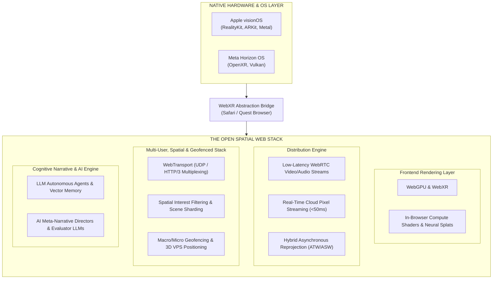
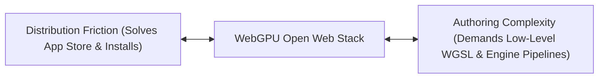
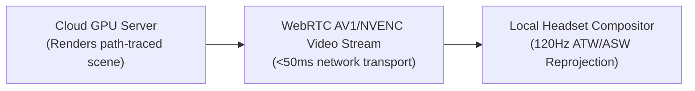
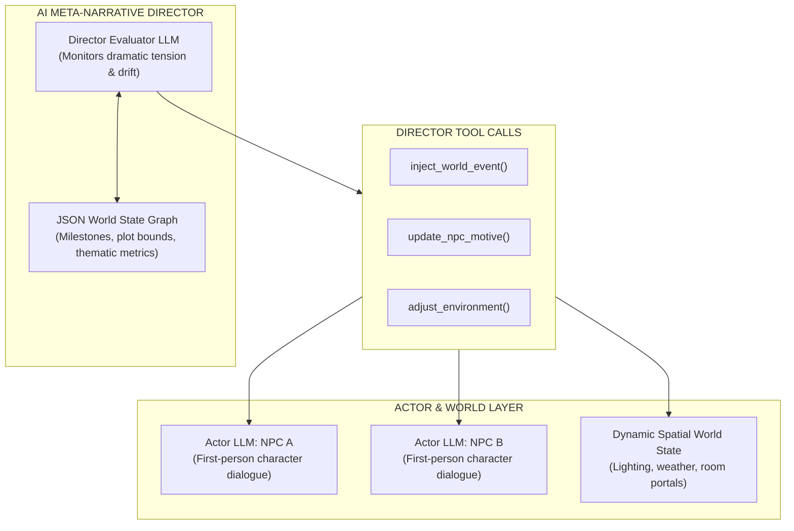
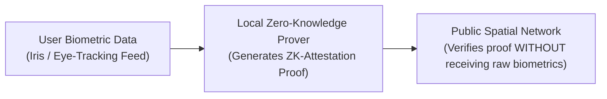

In the early decades of interactive digital media, storytelling lived inside isolated runtimes. Players bought a disc or downloaded a multi-gigabyte app, waited for installation, and entered a closed ecosystem before a story could begin.

As spatial computing and generative AI converge, that friction-heavy distribution model becomes the main bottleneck to mainstream narrative adoption. If a story requires app-store approvals, multi-gigabyte installs, and platform-locked ecosystems, it stays trapped in isolated silos.

The central question is no longer whether spatial stories can be rendered at high fidelity, but whether they can be distributed, synchronized, and experienced across devices without forcing every participant through native platform friction. To answer that question, we must inspect the software engine under the hood: comparing proprietary native operating systems against the open spatial web stack and examining how generative AI functions as the dynamic cognitive layer of modern storytelling.



## The Native vs. Open Web Dilemma

Designing spatial narratives requires navigating a fundamental engineering trade-off: hardware exploitation versus distribution friction.

Native platforms still win on local hardware access, tightly integrated sensor pipelines, and high-performance rendering paths. The open web stack, by contrast, reduces distribution friction and makes spatial experiences easier to share through a URL, even though the exact capabilities vary by browser, headset, and operating system.

### The Friction Problem

Native applications built for proprietary spatial operating systems achieve unparalleled visual fidelity by writing code directly to low-level hardware APIs. However, this performance comes at severe structural costs:

1. **Monopoly Gatekeeping**: Platform owners enforce strict content guidelines, revenue cuts (typically 30%), and lengthy review cycles that stifle experimental, real-time narrative updates.
2. **Installation Barriers**: Forcing a participant to download tens of gigabytes before experiencing a 10-minute location-based story destroys spontaneous engagement.
3. **Platform Fragmented Identity**: An avatar or narrative inventory item created inside one native ecosystem remains locked behind that platform's proprietary wall.

### The Core Thesis

Native spatial platforms still win on local hardware access, tightly integrated sensor pipelines, and high-performance rendering paths. Native platforms still excel in sensor access and render fidelity, but the open web stack has a decisive advantage in distribution: a URL can often launch a spatial experience without app-store friction, even when the exact capabilities vary by browser, headset, and operating system.

The Open Web Stack ([WebGPU](https://www.w3.org/TR/webgpu/), [WebXR](https://www.w3.org/TR/webxr/), [WebRTC](https://www.w3.org/TR/webrtc/), [WebTransport](https://www.w3.org/TR/webtransport/)) is compelling because it reduces distribution friction while exposing a shared runtime model for rendering, streaming, and multi-user networking.

A user navigating to a standard URL (https://story.example.com) can often launch a shared 3D narrative world without a platform-specific installation step, but the experience still varies by device: Apple Vision Pro and Meta Quest expose different sensor APIs and performance envelopes, while mobile and desktop browsers impose their own rendering and input constraints.

## The Native Hardware Layer vs. the Web Abstraction Bridge

To understand how web browsers deliver spatial experiences, we must look at how the browser bridges high-level web code to low-level hardware drivers.

### Native OS Platforms

* **Apple visionOS**: Relies on [RealityKit](https://developer.apple.com/documentation/realitykit) and the Metal graphics API. It enforces strict privacy sandboxing: applications do not receive raw camera feeds. Instead, the OS processes spatial tracking internally and delivers abstracted 3D surface meshes and eye/hand tracking vectors to the developer.
* **Meta Horizon OS**: Built on Android, leveraging OpenXR and the Vulkan graphics API. It grants developers access to spatial anchor SDKs, body tracking algorithms, and passthrough compositing layers.

### The WebXR Abstraction Layer

The WebXR Device API serves as a standardized translation bridge between native OS drivers and in-browser runtime engines, even though the exact browser-to-OS negotiation is platform-specific. When a Safari (visionOS) or Quest Browser user clicks "Enter XR," the browser typically establishes an XR session through a device-specific runtime path:

1. The browser requests an `XRSession` from the underlying operating system driver or browser runtime (such as ARKit or OpenXR).
2. The native layer delivers pose matrices (head position, hand joint transforms) to the browser engine at 90Hz–120Hz, though the exact API surfaces and timing can differ by device.
3. The browser exposes these matrices to JavaScript/WebAssembly frameworks (such as [Three.js](https://threejs.org/), [Babylon.js](https://www.babylonjs.com/), or [PlayCanvas](https://playcanvas.com/)) inside a secure execution sandbox.

### WebGPU Shader Mapping & the Authoring Complexity Wall

Where WebGL was limited to aging OpenGL ES standards, WebGPU provides modern, low-level access to the GPU. WebGPU compiles WGSL (WebGPU Shading Language) directly into native platform instructions:

* On visionOS, Safari translates WGSL into Metal shading language.
* On Horizon OS / Android, Quest Browser translates WGSL into Vulkan SPIR-V bytecode.

At the same time, solving distribution friction introduces a major engineering barrier: authoring complexity.



Writing bare-metal WebGPU pipelines and WGSL shaders is not trivial. Authoring believable, photorealistic human avatars requires complex rendering techniques: skeletal mesh skinning, facial blend shapes, subsurface scattering for skin translucency, anisotropic specular highlights for hair, and complex eye refraction. Hand-authoring these shader pipelines directly in raw WebGPU creates immense technical overhead for narrative creators.

To bridge this complexity wall without sacrificing web distribution, spatial web architectures rely on three strategies:

* **WebAssembly (Wasm) Engine Compilation**: Instead of writing raw WGSL, studios compile established C++ or Rust engines (such as Unreal Engine, Unity, or custom C++ runtimes) into WebAssembly targeting the WebGPU backend, allowing authors to use familiar high-level content pipelines.
* **Volumetric Neural Rendering (Gaussian Splats)**: Rather than hand-crafting complex polygon mesh shaders, subsurface scattering, and bone physics for lifelike avatars, developers use WebGPU compute shaders to decode volumetric point clouds (3D Gaussian Splatting). The compute shader handles heavy linear algebra rasterization, shifting the complexity from manual shader authoring to AI-assisted neural capture.
* **Cloud Pixel Streaming Fallback**: When hyper-realistic avatars (such as Unreal Engine Metahumans) exceed both web authoring capacity and local mobile GPU thermal envelopes, rendering is offloaded entirely to cloud datacenter GPUs via low-latency WebRTC streams.


## Rendering & Cloud Streaming Architecture

Delivering photorealistic spatial media inside lightweight, battery-constrained headsets requires balancing local in-browser rendering against remote cloud computation.

### WebGPU Mechanics & Neural Rendering

Traditional 3D rendering relies on polygon meshes wrapped in image textures. However, capturing real-world places for spatial storytelling increasingly relies on volumetric neural capture techniques: NeRFs (Neural Radiance Fields) and 3D Gaussian Splatting.

WebGPU compute shaders enable real-time rasterization of millions of 3D Gaussian splats directly inside a web browser frame. Creators can walk through a historical site with a smartphone camera, reconstruct the space into a Gaussian splat point cloud, and render it in a browser at 90 frames per second.

This example is intentionally generic and schematic. It illustrates the browser-side setup and the compute-pipeline shape in the conceptual architecture, not a production-ready drop-in replacement for a shipped spatial renderer.

```ts
// WebGPU Initialization & Compute Shader Pipeline Setup
async function initWebGPURenderer(canvas) {
  if (!navigator.gpu) {
    throw new Error("WebGPU is not supported on this browser/device.");
  }

  if (!(canvas instanceof HTMLCanvasElement)) {
    throw new Error("A valid canvas element is required to initialize WebGPU.");
  }

  const adapter = await navigator.gpu.requestAdapter({
    powerPreference: "high-performance"
  });

  if (!adapter) {
    throw new Error("No compatible WebGPU adapter was found for this device.");
  }

  const device = await adapter.requestDevice();
  const context = canvas.getContext("webgpu");
  if (!context) {
    throw new Error("WebGPU context could not be created for the given canvas.");
  }

  const presentationFormat = navigator.gpu.getPreferredCanvasFormat();

  context.configure({
    device,
    format: presentationFormat,
    alphaMode: "premultiplied"
  });

  // WGSL Compute Shader for Updating Spatial Gaussian Particle Transforms
  const wgslShaderCode = `
    struct Particle {
      position : vec3<f32>,
      velocity : vec3<f32>,
    };

    @group(0) @binding(0) var<storage, read_write> particles : array<Particle>;

    @compute @workgroup_size(64)
    fn main(@builtin(global_invocation_id) global_id : vec3<u32>) {
      let index = global_id.x;
      // Update particle positions based on spatial physics or AI field forces
      particles[index].position += particles[index].velocity * 0.016;
    }
  `;

  const shaderModule = device.createShaderModule({ code: wgslShaderCode });

  const computePipeline = device.createComputePipeline({
    layout: "auto",
    compute: {
      module: shaderModule,
      entryPoint: "main"
    }
  });

  return { device, computePipeline, context };
}
```

### Sub-50ms Cloud Pixel Streaming

When visual complexity exceeds local mobile GPU capabilities, architects deploy Cloud Pixel Streaming via WebRTC. High-performance cloud servers equipped with datacenter GPUs render the scene using path-tracing or Unreal Engine 5, compress the frame feed using hardware NVENC/AV1 encoders, and stream video frames to the headset over low-latency WebRTC data channels.



To prevent motion sickness caused by network latency spikes, spatial engines use Hybrid Asynchronous Reprojection (ATW/ASW):

1. The cloud server renders lighting, complex geometry, and AI interactions, streaming video frames at 30–60 fps.
2. The local headset compositor receives the video frame and applies local 6DOF head-tracking transforms at 120Hz.
3. If a network packet is delayed, the local device warps the previous frame based on the user's latest rotational and translational movements, eliminating perceptual latency and motion sickness.

## Real-Time Spatial Networking, Multi-User Scale & Geofencing

Spatial storytelling is fundamentally co-present. For multiple humans to inhabit a story simultaneously, network engines must synchronize skeletal joint data, spatial transforms, and dynamic world state without network jitter.

### Transport Protocols: WebSockets vs. WebTransport

Traditional web applications rely on WebSockets over TCP. However, TCP enforces ordered packet delivery; if a single packet is dropped, TCP halts all subsequent data processing until the dropped packet is retransmitted, a phenomenon known as head-of-line blocking. In spatial computing, receiving an outdated hand position matrix 200 milliseconds late is useless.

Modern spatial web architectures use WebTransport (HTTP/3 over UDP). WebTransport provides unreliable datagram delivery: positional updates stream continuously without head-of-line blocking. If a pose packet drops, the client simply receives the next frame's position 16 milliseconds later.

```ts
// WebTransport Low-Latency UDP Datagram Transport Setup
class SpatialPoseStreamer {
  constructor(endpointUrl) {
    this.endpointUrl = endpointUrl;
    this.transport = null;
    this.writer = null;
  }

  async connect() {
    this.transport = new WebTransport(this.endpointUrl);
    await this.transport.ready;

    // Create an unreliable datagram writer for high-frequency skeletal pose streaming
    this.writer = this.transport.datagrams.writable.getWriter();
    console.log("WebTransport datagram session established.");
  }

  // Stream 27-joint hand skeletal transforms (Float32Array) at 60Hz
  sendHandJointTransform(jointArrayBuffer) {
    if (this.writer) {
      this.writer.write(jointArrayBuffer).catch((err) => {
        console.warn("Datagram write dropped:", err);
      });
    }
  }
}
```

### Solving the `O(N^2)` Network Scaling Barrier

As established in Part 1's historical analysis of military simulation protocols (DIS vs. HLA), naive peer-to-peer data broadcasting scales quadratically according to:

`Packets ∝ O(N^2)`

Where `N` represents the number of active participants in a room. In a room with 100 participants, broadcasting every hand gesture to every user requires 10,000 network updates per tick, a useful conceptual model for why naive broadcasting fails at scale.

The exact production failure mode depends on bandwidth, packet size, jitter, and client hardware, but the underlying math still holds: unbounded fan-out becomes unsustainable quickly. In practice, the real system is usually shaped by a blend of network topology, edge compute, and per-user interest filtering rather than by a single mathematically idealized model.

Spatial web edge servers solve this wall through three spatial optimizations:

1. **Area-of-Interest (AOI) Spatial Filtering**: The server constructs a 3D spatial grid. Participants only receive high-frequency joint transforms for avatars standing within their immediate Euclidean distance bubble (e.g., a 15-meter radius).
2. **Distance-Based LOD Tick Rate Degradation**: Avatars standing 2 meters away update at 60Hz. Avatars standing 30 meters away update at 10Hz, with client-side interpolation filling the gaps.
3. **Geographic Server Sharding**: Worlds are split geographically across edge datacenters, allowing localized clusters of participants to interact seamlessly.

This pattern is now the current best practice in large-scale multiplayer design, but it still does not guarantee perfectly consistent world state across all devices and network conditions. In production, engineers must still manage packet loss, edge-region handoff, head-tracking latency, and the trade-off between precision and bandwidth. In other words, the model is the right architecture for scaling, but production reliability still depends on real-world network variability and device constraints.

### Geofencing & Spatial Anchors

In location-aware spatial media, digital story elements must anchor to physical geography with sub-centimeter precision. Modern engines have evolved beyond 2D GPS radii (~5m–10m error margin) to Visual Positioning Systems (VPS) and 3D Micro-Geofencing.

VPS algorithms match raw camera features against pre-mapped 3D point cloud scans of physical streets or building interiors. Once aligned, the application instantiates a WebXR Spatial Anchor, locking a virtual narrative prop to a real-world physical surface.

```ts
// Production-oriented WebXR hit-test flow for a physical surface anchor.
async function anchorNarrativeProp(
  xrFrame,
  xrReferenceSpace,
  viewerSpace,
  sceneGraph
) {
  const session = xrFrame.session;

  // Create the hit-test source once when the session starts, then reuse it.
  const hitTestSource = session.requestHitTestSource({ space: viewerSpace });

  // Query the latest physical-surface intersection results.
  const hitTestResults = xrFrame.getHitTestResults(hitTestSource);
  if (!hitTestResults.length) {
    return;
  }

  const hitResult = hitTestResults[0];
  const pose = hitResult.getPose(xrReferenceSpace);
  if (!pose) {
    return;
  }

  // Create a persistent anchor tied to the real-world mesh.
  const anchor = await xrFrame.createAnchor(pose.transform, xrReferenceSpace);

  // Attach a story object to the anchor. In a Three.js app, this is usually
  // added to a scene graph rooted at the anchor or to a tracked object group.
  const narrativeNode = createInteractiveStoryObject();
  narrativeNode.position.set(
    pose.transform.matrix[12],
    pose.transform.matrix[13],
    pose.transform.matrix[14]
  );
  sceneGraph.add(narrativeNode);

  // Optional: clean up when the OS removes the anchor.
  anchor.addEventListener("remove", () => {
    sceneGraph.remove(narrativeNode);
  });
}
```

This flow is intentionally more production-ready than a bare `getHitTestResults(hitTestSource)` call because it validates the session state, checks for empty results, handles missing poses, and cleans up the world object when the anchor is removed by the runtime.

### Spatial Audio Pipelines

To maintain spatial presence, multi-user voice channels cannot use flat stereo mixes. Spatial web engines route WebRTC audio streams through the Web Audio API Spatial Panner Node.

The panner node applies Head-Related Transfer Function (HRTF) filters, calculating acoustic attenuation, interaural time differences (ITD), and room reverberation based on the distance and orientation between the listener and the speaker's avatar.

## Generative AI & the AI Narrative Director

High-fidelity graphics and network synchronization construct the physical body of a spatial world; generative AI provides its cognitive brain.



### Autonomous LLM NPCs

Traditional video games use fixed branching dialogue trees (written in tools like Ink or Twine). Generative AI replaces static trees with Autonomous LLM Agents.

These agents combine three key sub-systems:

1. **Vector Database Memory**: Episodic retention storing past player conversations and actions as mathematical embeddings, allowing NPCs to recall past interactions naturally.
2. **Dynamic Planning Engines**: Translating character goals ("Protect the ancient artifact") into dynamic task execution.
3. **Real-Time Vocal Synthesis**: Low-latency text-to-speech models that synthesize emotional, directional spatial voice lines on the fly.

### Defining the AI Narrative Director

To understand how AI orchestrates stories, we must distinguish between legacy procedural pacing systems and modern LLM Meta-Narrative Directors:

* **Legacy Pacing Directors (e.g., Valve's Left 4 Dead)**: Monitored real-time combat stress metrics (player health, ammo levels, damage taken). When stress was low, it spawned enemy hordes; when stress was high, it paused spawns and provided health packs. It managed pacing and combat intensity, but possessed zero understanding of plot, character arc, or thematic narrative context.
* **Modern AI Meta-Narrative Directors**: An orchestration framework combining evaluator LLMs, real-time world state tracking, and state-graph guardrails. It monitors player choices, measures thematic drift against authorial boundaries, and dynamically alters the world to maintain dramatic tension.

### Publicly Available Frameworks & Research

* **Commercial Middleware**: Platforms like **Inworld AI** provide runtime engines featuring narrative node graphs, dynamic character relationships, and goal-orchestration triggers.
* **Academic Research Frameworks**: Frameworks such as **CoDi** (Director-Actor Framework for Interactive Story Generation) and **LLMR/HAMLET** deploy hierarchical multi-agent systems. A background "Director Agent" issues hidden directives (acting as a dramatic superego) to individual character "Actor LLMs."

### Step-by-Step Architectural Implementation Blueprint

Implementing an AI Narrative Director requires a four-part software architecture:

#### Decouple Director from Actor

Never use a single LLM to generate character dialogue and manage plot pacing simultaneously. Separate character LLMs (the "Actors") from the background "Director LLM." The Actors only know their character's immediate perception and motives; the Director possesses omniscient vision over the entire world state.

#### State Graph & JSON Tracking

Structure story milestones, dramatic tension metrics, and plot guardrails into a structured, queryable JSON state object:

```json
{
  "story_title": "The Cipher of Alexandria",
  "current_act": 2,
  "dramatic_tension_score": 0.35,
  "thematic_drift": "high",
  "player_state": {
    "location": "library_catacombs",
    "has_key_artifact": true,
    "moral_alignment": "pragmatic"
  },
  "plot_guardrails": {
    "required_clue_discovered": false,
    "max_allowed_act_time_seconds": 1200
  }
}
```

#### The Evaluation Loop

On significant player actions or dialogue turns, trigger an Evaluator Prompt executed by the background Director LLM. The evaluator calculates whether the player's choices align with narrative bounds or if the story is stagnating.

#### Tool Calling & Dynamic World Interventions

When dramatic tension drops or thematic drift exceeds authorial bounds, the Director LLM executes structured Function / Tool Calls to steer the world dynamically:

```json
{
  "tool_call": "inject_world_event",
  "parameters": {
    "event_type": "catacomb_cave_in",
    "target_location": "library_catacombs_exit",
    "narrative_purpose": "Force player to collaborate with rival NPC in eastern chamber"
  }
}

{
  "tool_call": "update_npc_motive",
  "parameters": {
    "npc_id": "scholar_julius",
    "new_hidden_motive": "Reveal secret betrayal early due to player discovering the key artifact",
    "emotional_tone": "panicked"
  }
}
```

Through function calling (`inject_world_event()`, `update_npc_motive()`, `adjust_environment()`), the Director LLM alters the world naturally without hard-blocking player choices or breaking the illusion of agency.

## Cryptographic Spatial Identity & Anti-Spoofing Infrastructure

As spatial media integrates video passthrough, multi-user networking, and generative AI, virtual spaces sever the connection between physical presence and digital identity.



### Zero-Knowledge Biometric Attestations

Modern spatial headsets incorporate hardware iris scanners and eye-tracking camera arrays. Transmitting raw biometric data to cloud servers creates massive privacy hazards.

Spatial web architectures use Zero-Knowledge Proofs (ZKPs). The local headset generates a cryptographic proof verifying that the user is an authenticated human participant without exposing raw iris images or tracking logs to the server.

### Cryptographic Asset & World Verification

To prevent client-side injection attacks—where a malicious participant injects forged 3D assets, altered physical room boundaries, or deepfake audio into a shared room—spatial assets are cryptographically signed at the edge server level. The browser verifies asset signatures before rendering props inside the user's passthrough environment.

### Bot vs. Human Identity Validation

As generative AI NPCs achieve human-level conversational fluency, participants in multi-user spatial environments require verifiable assessment signals (recalling Judith Donath's signaling analysis from Part 1 and Part 2) to distinguish between autonomous LLM agents and real human participants. Cryptographic identity attestations ensure that AI entities are clearly badged at the protocol layer.

### Conclusion & Transition to Part 4

The Open Spatial Web Stack—powered by WebGPU compute pipelines, WebRTC cloud pixel streaming, WebTransport UDP networking, and AI Narrative Directors—provides the technical backbone required to render responsive, frictionless multi-user worlds.

However, having the software stack in place raises a compelling question: How close are these operational tools to the visionary spatial media promised by science fiction?

In Part 4: Sci-Fi Realities & Benchmarks, we test our current capabilities against humanity's dominant immersive benchmarks: Ready Player One (The OASIS), Sword Art Online (Full-Dive VR), and the Star Trek Holodeck—evaluating display metrics, network scale, locomotion treadmills (Disney's HoloTile), and brain-computer interfaces.

## Bibliography & Works Cited

Apple Inc. (2024). [visionOS Developer Documentation & RealityKit Engine](https://developer.apple.com/visionos/). Apple Developer Archives.

Inworld AI. (2023–2024). [Inworld AI Character Engine & Runtime Node Architectures](https://docs.inworld.ai/). Inworld AI Docs.

W3C. (2023). [WebXR Device API](https://www.w3.org/TR/webxr/) (W3C Recommendation). World Wide Web Consortium.

Meta Platforms. (2023–2024). [Meta Quest OpenXR & Passthrough Compositor SDKs](https://developer.oculus.com/). Meta Developers.

Standard Performance Evaluation Corporation / W3C. (2024). [WebGPU W3C Working Draft & WGSL Specification](https://www.w3.org/TR/webgpu/). World Wide Web Consortium.

Valve Corporation. (2009). [The AI Systems of Left 4 Dead](https://cdn.fastly.steamstatic.com/apps/valve/2009/ai_systems_of_l4d_mike_booth.pdf). Game Developers Conference (Slides).

W3C. (2023). [WebTransport Protocol Specification](https://www.w3.org/TR/webtransport/) (W3C Candidate Recommendation). World Wide Web Consortium.

Zhang, L., et al. (2023). [CoDi: Co-Director Framework for Interactive Story Generation with Large Language Models](https://arxiv.org/abs/2305.14287). arXiv preprint arXiv:2305.14287.
