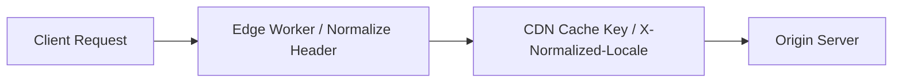
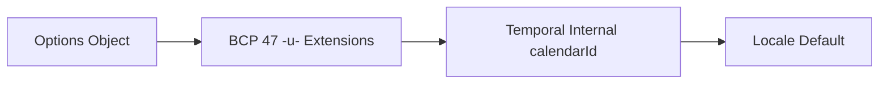

Language negotiation and locale handling form the foundation of global web development. BCP 47 language tags coordinate how content is matched across HTTP headers, rendered in HTML documents, normalized at edge CDN layers, styled in CSS, pronounced by screen readers, and serialized in date/time formats defined in [RFC 5646](https://www.rfc-editor.org/rfc/rfc5646.txt), [RFC 4647](https://www.rfc-editor.org/rfc/rfc4647.txt), [RFC 6067](https://www.rfc-editor.org/rfc/rfc6067.txt), and [RFC 9557](https://www.rfc-editor.org/rfc/rfc9557.txt).

## BCP 47 and the IANA Language Subtag Registry

A fundamental distinction in internationalization standards is the separation between grammar and vocabulary:

* **BCP 47 (RFC 5646)**: Defines the grammar and structural rules for constructing valid language tags (e.g., language-script-region-variant).
* **IANA Language Subtag Registry**: Provides the authoritative vocabulary of valid subtags that can be placed inside those structural slots.

### Canonical Tag Structure

```text
[primary language]-[script]-[region]-[variant]-[extension]-[private use]
```

### Key Subtag Categories in the Registry

| Registry Subtag Type | Underlying ISO/UN Standard | Example Values | Purpose |
| --- | --- | --- | --- | --- |
| `language`| ISO 639-1 (2-letter),<br>ISO 639-2/3 (3-letter) | en, fr, cmn, yue | Identifies primary language |
| `extlang` | ISO 639-3, ISO 639-5 | kok, zh | Reserved for extended language dialects |
| `script` | ISO 15924 (4-letter Titlecase) | Latn, Hans, Cyrl, Arab | Identifies writing script |
| `region` | ISO 3166-1 alpha-2, UN M.49 (3-digit) | US, GB, BR, 419 | Identifies geographical region or territory |
| `variant` | Registered dialectal variations | valencia, pinyin, 1994ac | Specific orthographic or dialect variations |

### The Suppress-Script Rule

The IANA registry contains `Suppress-Script` fields for languages that overwhelmingly use a single writing script. BCP 47 mandates omitting script subtags listed in `Suppress-Script`. For instance, because fr has `Suppress-Script: Latn`, using `fr-Latn` is non-canonical; developers should use fr unless specifically contrasting script variants (e.g., `zh-Hans` vs. `zh-Hant`).

### IANA Language Subtag Registry vs. Unicode CLDR

A common source of confusion is the division of labor between the IANA Registry and the Unicode CLDR (Common Locale Data Repository):

* **IANA Language Subtag Registry (IETF-governed)**: Focuses strictly on **language identification**. It answers the question: "*What are the valid codes to identify a spoken/written human language, script, or region?*" It contains no formatting rules, translations, or locale data.
* **Unicode CLDR (Unicode Consortium-governed / UTS #35)**: Focuses on **locale formatting and cultural behavior**. It answers the question: "*How do people in a given locale format numbers, currencies, dates, relative time, and text sorting?*"

Crucially, while IANA maintains the primary subtags (`en`, `fr`, `US`, `Hans`), **Unicode CLDR maintains the extended vocabulary used inside BCP 47 Unicode extensions (`-u-`)** (defined via RFC 6067). Keys like `ca` (calendar), `nu` (numbering system), and `co` (collation) and their allowed values (`japanese`, `thai`, `pinyin`) are defined by CLDR under UTS #35.

| Feature / Dimension | IANA Language Subtag Registry | Unicode CLDR |
| --- | --- | --- |
| Primary Focus | Language Identification | Locale Formatting & Cultural Behavior |
| Identification | Valid subtags for language, script, region, and dialect variants. | Formatting & Cultural Data: Date/time patterns, number symbols, translations, plural rules, and `-u-` extension keys. |
| Governing Authority | IETF / IANA | Unicode Consortium |
| Underlying Standard | RFC 5646 (BCP 47) | UTS #35 (LDML - Unicode Technical Standard #35) |
| Data Format | Flat plain-text key-value records | XML database (CLDR data repository) |

## Role in Web APIs

Used by browsers & servers to parse and match language tags (Accept-Language, lang="en").

Ingested by JavaScript engines (V8, JavaScriptCore, SpiderMonkey) to power Intl and Temporal.

### Unicode Extensions (`-u-`) for Custom Locale Formatting

While standard BCP 47 tags identify which language to present, RFC 6067 defines the u singleton extension (Unicode Locale Extension) to specify how data should be formatted within that locale.

#### Extension Subtag Structure

An extension tag starts with `-u-` followed by key-value pairs where keys are 2-alphanumeric characters and values are 3-to-8 alphanumeric characters:

$$
\text{Tag} = \underbrace{\text{th-TH}}_{\text{Base Locale}} - \overbrace{\text{u}}^{\text{Extension Singleton}} - \underbrace{\text{nu-thai}}_{\text{Numbering System}} - \underbrace{\text{ca-buddhist}}_{\text{Calendar System}}
$$

#### Essential Unicode Extension Keys

| Key | Description | Common Subtag Values | Example Tag | Output / Behavior
| :---: | --- | --- | --- | --- |
| `nu` | Numbering System | latn, arab, thai, deva, native | ar-EG-u-nu-latn | Uses Western Arabic digits (123) instead of Eastern (١٢٣) |
| `ca` | Calendar System | gregory, buddhist, japanese, islamic, hebrew | ja-JP-u-ca-japanese | Displays Japanese Imperial era years (e.g., Reiwa era) |
| `co` | Collation / Sorting | pinyin, stroke, emoji, phonebk, compat | zh-u-co-pinyin | Sorts Chinese characters phonetically by Pinyin |
| `hc` | Hour Cycle | h11, h12, h23, h24 | en-GB-u-hc-h12 | Forces 12-hour clock (AM/PM) in British English |
| `fw` | First Day of Week | mon, sun, sat, fri | en-US-u-fw-mon | Overrides US Sunday start-of-week to Monday |
| `kn` | Numeric Ordering | true, false | en-u-kn-true | Sorts strings containing numbers naturally ("2" before "10") |

## BCP 47 in HTML: Accessibility, CSS, and Document Rendering

Declaring BCP 47 language tags in HTML documents using the global lang attribute is essential for building accessible, localized web applications.

```html
<!DOCTYPE html>
<html lang="en-US">
  <head>
    <meta charset="UTF-8">
    <title>Multilingual Article</title>
  </head>
  <body>
    <article>
      <h1>Welcome to Our Global Platform</h1>
      <p>We serve users across many regions.</p>

      <!-- Inline language override for French quote -->
      <blockquote lang="fr">
        <p>C'est la vie, comme on dit en France.</p>
      </blockquote>
    </article>
  </body>
</html>
```

### Accessibility Impact: Screen Readers and Assistive Technologies

Screen readers (such as NVDA, JAWS, VoiceOver, and TalkBack) and refreshable Braille displays rely directly on HTML lang attributes to render text accurately:

* **Text-to-Speech (TTS) Voice Engine Switching**: When a screen reader encounters a `lang` attribute, it dynamically swaps its speech synthesis engine, pronunciation rules, and accent dictionary. If French text is embedded in an English document without `lang="fr"`, the screen reader attempts to pronounce French words using English phonemes, resulting in incomprehensible audio.
* **Refreshable Braille Translation Tables**: Braille output devices use BCP 47 tags to select the appropriate Braille code table (e.g., Grade 2 Unified English Braille vs. French Braille vs. German Braille). Incorrect tags result in misformatted Braille cell combinations.
* WCAG Compliance:
  * **WCAG 2.1 SC 3.1.1 (Language of Page - Level A)**: Mandates declaring a valid BCP 47 language tag on the root `<html>` element.
  * **WCAG 2.1 SC 3.1.2 (Language of Parts - Level AA)**: Mandates wrapping inline content shifts in elements with an appropriate lang attribute whenever the language differs from the rest of the document.

### Interaction with CSS and Typography Rendering

Browser layout engines evaluate BCP 47 tags to apply localized typographic conventions and font selection:

#### CSS `:lang()` Pseudo-Class

The CSS `:lang()` pseudo-class selector matches elements based on their active BCP 47 tag, handling subtag hierarchies automatically (e.g., `:lang(en)` matches `en`, `en-US`, and `en-GB`):

```css
/* Localized quotation mark styling */
:lang(en) q {
  quotes: "“" "”";
}

:lang(fr) q {
  quotes: "« " " »";
}

:lang(de) q {
  quotes: "„" "“";
}
```

#### CJK Glyph Selection via OpenType (locl)

Languages in the CJK (Chinese, Japanese, Korean) unification block share thousands of identical Unicode codepoints, but the actual visual rendering of those characters differs by region. Browser text engines map the element's BCP 47 lang tag directly to OpenType language system tags (locl) to select correct glyph variants:

```css
/* Forces correct regional Han character glyphs for identical Unicode characters */
:lang(zh-Hans) { font-family: "Noto Sans SC", sans-serif; }
:lang(zh-Hant) { font-family: "Noto Sans TC", sans-serif; }
:lang(ja)      { font-family: "Noto Sans JP", sans-serif; }
```

#### Automated Hyphenation and Spell-Checking

* **Hyphenation (`hyphens: auto;`)**: Browsers require an accurate BCP 47 tag on the element to load the corresponding language dictionary for word-breaking and soft hyphen placement.
* `Forms and ContentEditable`: Native browser spell-checkers use lang attributes on `<textarea>`, `<input>`, or contenteditable elements to activate the appropriate spell-check dictionary.

## The Accept-Language Header

When a web client requests a resource, it transmits an Accept-Language header containing a weighted list of BCP 47 language ranges:

```apacheconf
Accept-Language: fr-CH, fr;q=0.9, en-US;q=0.8, en;q=0.7, *;q=0.5
```

**Breakdown of Quality Values ($q$-factors)**

Each item in the header is evaluated in order of preference using $q$-factors (quality values ranging from 0.0 to 1.0):

* `fr-CH (Implicit $q = 1.0$)`: Top Choice. Swiss French. When $q$ is omitted, it defaults to the highest priority ($1.0$).
* `fr;q=0.9`: Second Choice. Any French dialect (weight 0.9). If fr-CH isn't available, standard French is preferred.
* `en-US;q=0.8`: Third Choice. American English (weight 0.8).
* `en;q=0.7`: Fourth Choice. Generic English (weight 0.7).
* `*;q=0.5`: Wildcard Fallback. Matches any other language supported by the server at a lower priority (0.5).

    **Is fr-CH the default fallback?**

    No. `fr-CH` is the client's most preferred language (rank #1). If the server supports Swiss French, it serves `fr-CH`.

    If the server supports none of the specified languages (`fr-CH`, `fr`, `en-US`, `en`), the wildcard `*;q=0.5` allows the server to send any available language. If no wildcard were present and none of the requested languages matched, the server would fall back to its internal default origin locale or return a 406 Not Acceptable HTTP status.

### Case Insensitivity in Content Negotiation

According to RFC 5646 Section 2.1, all BCP 47 language tags and subtags are strictly case-insensitive.

When browsers communicate with web servers via the Accept-Language header or HTML attributes:

`en-us`, `en-US`, `EN-US`, and `eN-Us` are 100% semantically equivalent.

Formatting conventions (lowercase for language codes like en, Titlecase for scripts like Hans, and uppercase for region codes like US) exist solely for human readability and visual consistency.

HTTP servers, edge workers, and client-side parsers MUST treat casing variations as identical during language negotiation and lookup.

## BCP 47 Matching Algorithms (RFC 4647)

RFC 4647 defines two primary ways to match language tags:

* **Filtering**: Returns all matching tags from a set of supported locales (e.g., filtering en against [en, en-US, en-GB, fr] returns [en, en-US, en-GB]).
* **Lookup (Section 3.4)**: Returns a single best matching locale or falls back to a default language.

### The RFC 4647 Lookup Algorithm Steps

Sort client ranges by quality factor ($q$-value) in descending order.

* For each requested range, check if an exact match exists in the supported locales list (comparing case-insensitively).
* If no match is found, strip the rightmost subtag (e.g., zh-Hans-CN becomes zh-Hans) and try again.
* Continue stripping subtags until a match is found or the tag becomes empty.
* If no ranges match, return the default server locale.

## Web Server Language Negotiation & CDN Caching

Relying solely on Accept-Language headers is rarely sufficient for production applications. Web architecture layers use a combination of strategies depending on SEO, caching requirements, and user preferences.

**Strategy Comparison Matrix**

| Strategy | Implementation | Pros | Cons / Challenges |
| --- | --- | --- | --- |
| HTTP<br>Accept-Language | Auto-detection via HTTP request header | Zero user effort;<br>immediate language detection | Unreliable for users on shared/public machines;<br>CDN cache fragmentation |
| URL Path Prefixing | /en-US/about, /fr/about | Exceptional for SEO; clear canonical URLs; easy shareability | Requires router path handling and link generation abstraction |
| Subdomain / TLD | fr.example.com, example.de | Strong regional branding; geographically distinct CDN routing | Higher DNS and SSL maintenance; isolated cookie state |
| Cookies / Query Params | ?lang=es, Set-Cookie: pref_lang=es | High user control; overrides default browser settings | Invisible to search engine indexers; potential redirect loops |

### Recommended Hybrid Strategy Flow

1. **Explicit Preference (Cookie/Query Param)**: Respect explicit user toggles stored in a cookie or query parameter above all else.
2. **URL Route Prefix**: If no explicit cookie is set, inspect the URL path (`/zh-Hans/dashboard`).
3. **HTTP Header Fallback**: If the route is unlocalized (`/dashboard`), inspect Accept-Language and perform RFC 4647 lookup against supported locales.
4. **Canonical Redirect**: Redirect the client to the localized URL prefix (e.g., 302/307 redirect to `/zh-Hans/dashboard`) while setting a persistent cookie.

### Edge Normalization & Managing Vary Headers

If an origin server sends `Vary: Accept-Language`, CDNs will cache distinct copies of the response for every unique string value of `Accept-Language`. Because browsers send complex, varying combinations of $q$-factors, this leads to cache fragmentation and an extremely low cache hit ratio.

To solve this, edge workers normalize request headers before hitting the CDN cache key:



## Implementation: Edge Worker & Negotiation Utilities

### Architectural Context: When Is Custom Negotiation Code Required?

While client-side browsers and JavaScript runtimes provide built-in internationalization APIs (`Intl.Locale`, `Intl.DateTimeFormat`), server environments and edge networks often require explicit BCP 47 parsing and matching logic.

Custom implementation is necessary in the following scenarios:

1. **Absence of Native HTTP Header Parsing APIs**: The Web Platform and Node.js standard libraries provide Intl for formatting, but no native API exists to parse and sort weighted Accept-Language HTTP headers (`fr-CH, fr;q=0.9, en-US;q=0.8`). Developers must either write a custom parser or import external dependencies.
2. **Zero-Dependency Edge Runtimes**: Edge platforms (Cloudflare Workers, Fastly Compute@Edge, AWS CloudFront Functions, Vercel Edge) enforce strict deployment bundle limits and require instantaneous cold starts. A self-contained utility avoids pulling in heavy npm packages like negotiator or `@formatjs/intl-localematcher`.
3. **Deterministic RFC 4647 Fallback Control**: Off-the-shelf frameworks often implement non-standard fallback rules. Custom lookup code ensures strict adherence to RFC 4647 Section 3.4 (e.g., mapping `es-CL` to `es-419` rather than falling back directly to `en`).

#### Language Negotiation Utility (`languageNegotiator.ts`)

```ts
/**
 * Parsed Accept-Language header entry.
 */
export interface LanguagePreference {
  range: string;
  q: number;
}

/**
 * Parsed BCP 47 locale with extracted Unicode extensions.
 */
export interface ParsedLocale {
  baseLocale: string;
  unicodeExtensions: Map<string, string>;
}

/**
 * Parses an HTTP Accept-Language header into an array sorted by q-factor.
 * Case-insensitivity is enforced by converting ranges to lowercase.
 */
export function parseAcceptLanguage(header: string | null): LanguagePreference[] {
  if (!header) return [];

  return header
    .split(",")
    .map((item) => {
      const [rangeStr, ...params] = item.trim().split(";");
      let q = 1.0;

      for (const param of params) {
        const [key, val] = param.trim().split("=");
        if (key === "q" && val) {
          const parsedQ = parseFloat(val);
          if (!isNaN(parsedQ)) {
            q = Math.max(0, Math.min(1, parsedQ));
          }
        }
      }

      return { range: rangeStr.toLowerCase(), q };
    })
    .filter((entry) => entry.range.length > 0 && entry.q > 0)
    .sort((a, b) => b.q - a.q);
}

/**
 * Extracts base language tag and Unicode extensions (-u-) from a BCP 47 tag.
 * Prefers native Intl.Locale when available.
 */
export function parseUnicodeExtensions(tag: string): ParsedLocale {
  if (typeof Intl !== "undefined" && "Locale" in Intl) {
    try {
      const loc = new Intl.Locale(tag);
      const extensions = new Map<string, string>();
      if (loc.calendar) extensions.set("ca", loc.calendar);
      if (loc.numberingSystem) extensions.set("nu", loc.numberingSystem);
      if (loc.hourCycle) extensions.set("hc", loc.hourCycle);
      if (loc.collation) extensions.set("co", loc.collation);
      return { baseLocale: loc.baseName, unicodeExtensions: extensions };
    } catch {
      // Fallback to manual string parsing if invalid tag
    }
  }

  const unicodeExtensions = new Map<string, string>();
  const uIndex = tag.toLowerCase().indexOf("-u-");

  if (uIndex === -1) {
    return { baseLocale: tag, unicodeExtensions };
  }

  const baseLocale = tag.substring(0, uIndex);
  const extensionString = tag.substring(uIndex + 3);
  const parts = extensionString.split("-");

  for (let i = 0; i < parts.length - 1; i += 2) {
    const key = parts[i];
    const value = parts[i + 1];
    if (key.length === 2 && value) {
      unicodeExtensions.set(key.toLowerCase(), value.toLowerCase());
    }
  }

  return { baseLocale, unicodeExtensions };
}

/**
 * Executes RFC 4647 Lookup algorithm to find the best matching supported locale.
 * Performs case-insensitive matching by lowercasing supported locale keys.
 */
export function matchLanguageLookup(
  requested: LanguagePreference[],
  supportedLocales: string[],
  defaultLocale: string
): string {
  const supportedMap = new Map<string, string>();
  for (const locale of supportedLocales) {
    supportedMap.set(locale.toLowerCase(), locale);
  }

  for (const { range } of requested) {
    if (range === "*") continue;

    const { baseLocale } = parseUnicodeExtensions(range);
    let currentRange = baseLocale;

    while (currentRange.length > 0) {
      if (supportedMap.has(currentRange)) {
        return supportedMap.get(currentRange)!;
      }

      const lastHyphen = currentRange.lastIndexOf("-");
      if (lastHyphen === -1) break;

      currentRange = currentRange.substring(0, lastHyphen);

      if (currentRange.endsWith("-") || /-[a-z0-9]$/i.test(currentRange)) {
        const trailingHyphen = currentRange.lastIndexOf("-");
        if (trailingHyphen !== -1) {
          currentRange = currentRange.substring(0, trailingHyphen);
        }
      }
    }
  }

  return defaultLocale;
}
```

### Edge Worker Integration (Cloudflare / Vercel Edge)

Executing language negotiation at the CDN edge before requests hit origin servers offers significant architectural benefits:

* **Sub-Millisecond TTFB Reduction**: Eliminates multi-hop origin redirects for unlocalized paths, reducing Time-To-First-Byte (TTFB) globally.
* **CDN Cache Key Hygiene**: Normalizes thousands of header permutations into a single X-Normalized-Locale header key.
* **SEO Consistency**: Enforces canonical URL prefixes (`/en-US/`, `/fr/`) to ensure deterministic search engine indexing.

```ts
import { parseAcceptLanguage, matchLanguageLookup } from "./languageNegotiator";

const SUPPORTED_LOCALES = ["en-US", "es-419", "fr", "zh-Hans"];
const DEFAULT_LOCALE = "en-US";

export default {
  async fetch(request: Request): Promise<Response> {
    const url = new URL(request.url);

    // Skip static assets
    if (url.pathname.match(/\.(png|jpg|css|js|ico|svg|woff2)$/)) {
      return fetch(request);
    }

    // 1. Check persistent user preference cookie
    const cookies = request.headers.get("Cookie") || "";
    const cookieMatch = cookies.match(/pref_locale=([^;]+)/);
    let targetLocale = cookieMatch ? cookieMatch[1] : null;

    // 2. If no cookie, perform BCP 47 Accept-Language negotiation
    if (!targetLocale) {
      const acceptLangHeader = request.headers.get("Accept-Language");
      const preferences = parseAcceptLanguage(acceptLangHeader);
      targetLocale = matchLanguageLookup(preferences, SUPPORTED_LOCALES, DEFAULT_LOCALE);
    }

    // 3. Normalize headers for CDN caching downstream
    const modifiedHeaders = new Headers(request.headers);
    modifiedHeaders.set("X-Normalized-Locale", targetLocale);

    // 4. Enforce URL path locale prefix for SEO
    const pathSegments = url.pathname.split("/").filter(Boolean);
    const currentPrefix = pathSegments[0];

    const isSupportedPrefix = SUPPORTED_LOCALES.some(
      (loc) => loc.toLowerCase() === currentPrefix?.toLowerCase()
    );

    if (!isSupportedPrefix && url.pathname === "/") {
      url.pathname = `/${targetLocale}`;
      return Response.redirect(url.toString(), 302);
    }

    return fetch(new Request(url.toString(), { headers: modifiedHeaders }));
  },
};
```

## JavaScript Presentation APIs: ECMA-402 (`Intl`)

The JavaScript runtime bridges BCP 47 language tags and client-side application presentation through ECMA-402 (Intl).

### The ECMA-402 Intl Resolution Pipeline

When you instantiate any Intl constructor (such as `Intl.DateTimeFormat`, `Intl.NumberFormat`, or `Intl.Collator`), the engine executes the Locale Resolution Algorithm:

1. **Canonicalization**: The input tag string is parsed and standardized via Intl.getCanonicalLocales(). Syntax errors throw a RangeError.
2. **Subtag Extraction**: The engine extracts base language, script, region, and any `-u-` Unicode extension key-value pairs.
3. **Fallback Matching**: The engine checks available system locale data. If `en-AU` is requested but unavailable, it falls back to `en`, then to the system default.
4. **Option Merging**: Extension subtags inside the BCP 47 tag serve as default configurations, which are overridden by explicit properties passed in the second argument (options).

```ts
// Demonstrating Option Merging & Resolution Mechanics
const bcp47Tag = "ar-EG-u-nu-latn-ca-gregory";

// Explicit options override '-u-ca-gregory', but '-u-nu-latn' persists
const formatter = new Intl.DateTimeFormat(bcp47Tag, { calendar: "islamic" });

const resolved = formatter.resolvedOptions();
console.log(resolved.locale);         // "ar-EG-u-ca-islamic-nu-latn"
console.log(resolved.numberingSystem);// "latn" (from BCP 47 subtag)
console.log(resolved.calendar);       // "islamic" (from JS options object)
```

### Native Tag Manipulation with `Intl.Locale`

The `Intl.Locale` object (ES2020) provides an imperative API to inspect, modify, and build BCP 47 language tags with Unicode extensions without manual string concatenation:

```ts
const baseLocale = new Intl.Locale("th-TH-u-nu-thai");

// Programmatically mutate or extend Unicode subtags
const customLocale = new Intl.Locale(baseLocale, {
  calendar: "buddhist",
  numberingSystem: "latn", // Overrides 'thai'
  hourCycle: "h23"
});

console.log(customLocale.toString()); // "th-TH-u-ca-buddhist-hc-h23-nu-latn"
console.log(customLocale.baseName);   // "th-TH"
```

### Practical Presentation Examples

#### Number & Currency Formatting (`Intl.NumberFormat`)

```ts
const value = 1250500.75;

// Eastern Arabic numerals in Egyptian Arabic
console.log(new Intl.NumberFormat("ar-EG").format(value));
// Output: "١٬٢٥0٬٥00٫٧٥"

// Force Western Latin numerals (0-9) while keeping Arabic text formatting
console.log(new Intl.NumberFormat("ar-EG-u-nu-latn").format(value));
// Output: "1,250,500.75"
```

#### String Comparison & Sorting (`Intl.Collator`)

```ts
const fileNames = ["file10.txt", "file2.txt", "file1.txt", "file20.txt"];

// Natural numeric sorting enabled via BCP 47 extension '-u-kn-true'
const numericCollator = new Intl.Collator("en-u-kn-true");
console.log([...fileNames].sort(numericCollator.compare));
// Output: ["file1.txt", "file2.txt", "file10.txt", "file20.txt"]
```

## Date/Time Mechanics: The TC39 Temporal API & RFC 9557

While Intl handles presentation formatting, the Temporal API (Temporal) is JavaScript's modern date and time standard for data mechanics, arithmetic, and serialization.

### Data Serialization via RFC 9557 Annotations

The Temporal API adopts RFC 9557 (an extension to ISO 8601 / RFC 3339) for string serialization. RFC 9557 incorporates BCP 47 Unicode extension keys inside square brackets:

```ts
// ISO 8601 Date with Japanese Imperial Calendar Annotation
const plainDate = Temporal.PlainDate.from("2026-08-02[u-ca=japanese]");

console.log(plainDate.calendarId); // "japanese"
console.log(plainDate.year);       // 2026 (Continuous arithmetic year)
console.log(plainDate.era);        // "reiwa"
console.log(plainDate.eraYear);    // 8
console.log(plainDate.toString()); // "2026-08-02[u-ca=japanese]"
```

**Return Types**: `plainDate.year` returns the continuous arithmetic year integer (2026), `plainDate.era` returns the era string ("reiwa"), and `plainDate.eraYear` returns the era-specific year integer (8).

### Critical Flag (`[!u-ca=...]`)

Prefixing a critical flag (!) instructs receiving parsers that the calendar extension must be supported to process the string. If unsupported, the system throws an error rather than falling back to ISO 8601:

```ts
// Throws RangeError if 'hebrew' calendar is unsupported by the runtime
const date = Temporal.PlainDate.from("2026-08-02[!u-ca=hebrew]");
```

### Formatting Precedence Hierarchy in Temporal

When calling `.toLocaleString()` on a Temporal object, configuration options are evaluated in the following order:



In the example below, we can see how the precedence hierarchy resolves conflicts when multiple formatting instructions are provided:

1. **Level 3 (Internal State):** When we pass a simple `"en-US"` locale to `.toLocaleString()`, Temporal defaults to the calendar embedded within the object's internal data (`hebrew`). It completely ignores the standard US Gregorian calendar because the object itself is inherently Hebrew.
2. **Level 2 (BCP 47 Extension):** By appending `-u-ca-gregory` to the locale string (`"en-US-u-ca-gregory"`), we explicitly instruct the formatter to override the object's internal Hebrew calendar and format the output using the Gregorian calendar instead.
3. **Level 1 (Options Object):** Finally, by passing an explicit `{ calendar: "islamic" }` inside the options object, we override both the internal state *and* the BCP 47 string extension. The options object acts as the absolute highest authority, forcing the final output to use the Islamic calendar regardless of what the string or the object state say.

```ts
// Temporal object created with a Hebrew calendar
const date = Temporal.PlainDate.from("2026-08-02[u-ca=hebrew]");

// Level 3 active: Uses internal 'hebrew' calendar
console.log(date.toLocaleString("en-US"));
// Output: "18 Av 5786"

// Level 2 active: BCP 47 -u-ca- extension overrides internal calendar
console.log(date.toLocaleString("en-US-u-ca-gregory"));
// Output: "8/2/2026"

// Level 1 active: Options object overrides BCP 47 tag and internal state
console.log(date.toLocaleString("en-US-u-ca-gregory", { calendar: "islamic" }));
// Output: "18 Safar 1448 AH"
```

### Summary of Intl vs. Temporal BCP 47 Roles

| Domain | Intl (ECMA-402) | Temporal (TC39) |
| --- | --- | --- |
| Primary Focus | User-facing presentation (formatting numbers, dates, lists, and relative times). | Data mechanics, arithmetic, and serialization for temporal data. |
| BCP 47 Tag Ingestion | Passed as locale string parameters into constructors (new Intl.DateTimeFormat('th-TH-u-nu-thai')). | Parsed from RFC 9557 ISO string annotations ("2026-08-02[u-ca=japanese]") |
| Unicode Extensions | Controls formatting attributes (nu, ca, co, hc, fw, kn). | Dictates calendar calculations internally (calendarId) and formatting presentation externally. |

## References and Standards

[RFC 5646](https://www.rfc-editor.org/rfc/rfc5646.txt): Tags for Identifying Languages

[RFC 4647](https://www.rfc-editor.org/rfc/rfc4647.txt): Matching of Language Tags

[RFC 6067](https://www.rfc-editor.org/rfc/rfc6067.txt): BCP 47 Extension U (Unicode Locale Extension)

[RFC 9557](https://www.rfc-editor.org/rfc/rfc9557.txt): Date and Time on the Internet: Timestamps with Additional Information

[IANA Language Subtag Registry](https://www.iana.org/assignments/language-subtag-registry/language-subtag-registry): Official Registry of Valid Subtags

[Unicode CLDR LDML Spec (UTS #35)](https://www.unicode.org/reports/tr35/): Unicode Language and Locale Identifiers

[ECMA-402 Standard](https://www.ecma-international.org/publications-and-standards/standards/ecma-402/): ECMAScript Internationalization API
