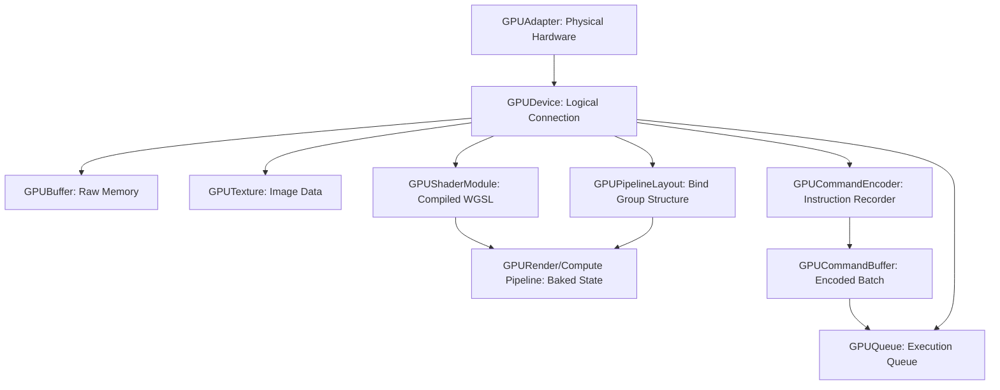

WebGPU represents a fundamental shift in how the web interacts with graphics hardware. By discarding legacy state-machine designs in favor of explicit, pre-compiled pipelines, it provides low-overhead access to modern GPU architectures.

This post summarizes the current state of WebGPU in 2026, highlighting the changes since its initial rollout in late 2024, and provides a practical example of rendering a triangle and performing compute shader raytracing.

## What Has Changed Since Late 2024

If you last evaluated WebGPU during its initial rollout, the ecosystem has matured significantly:

* **Universal Browser Adoption**: WebGPU is now a baseline standard. It is shipped by default across Chrome, Edge, Firefox (via the wgpu backend), and Safari 26 (across macOS Tahoe, iOS 26, and visionOS).
* **Mobile Parity**: Android devices powered by ARM and Qualcomm, alongside iOS 26 devices, now support WebGPU natively, enabling high-performance rendering on mobile power envelopes.
* **WGSL Maturation**: The WebGPU Shading Language (WGSL) has expanded. Crucial extensions, such as readonly_and_readwrite_storage_textures (a single combined feature flag), are now broadly supported natively.
* **The AI/ML Compute Explosion**: Compute shaders are driving client-side machine learning. Libraries like Transformers.js and ONNX Runtime rely on WebGPU to execute Large Language Models (LLMs) and vision models entirely in the browser.

Core Object Hierarchy

WebGPU requires you to explicitly declare memory allocation, state management, and command encoding. Understanding the object hierarchy is critical to structuring your applications.



* **Adapter**: The physical hardware (e.g., an integrated chip or discrete GPU).
* **Device**: Your logical connection to that adapter. The device acts as the factory for buffers, textures, and pipelines.
* **Command Encoder**: GPUs process instructions in batches. You record instructions into a command buffer, then submit the entire batch to the GPU queue.
* **Pipelines**: Render states (depth, blending, shaders) are baked upfront. This allows the browser to validate operations before the render loop begins.

**WebGPU vs. WebGL**

| Feature | WebGL 2.0 | WebGPU |
| --- | --- | --- |
| API Design | Implicit global state machine. | Explicit, object-oriented command encoding. |
| Foundation | OpenGL ES 3.0 (Legacy). | Vulkan, Metal, Direct3D 12 (Modern). |
| Compute Shaders | No native support. | First-class support. |
| Threading | Single-threaded. | Multi-threaded command generation. |
| Performance Overhead | High CPU overhead per draw call. | Low CPU overhead, highly batchable. |

## Browser Support and the Native Ecosystem

WebGPU is a cross-platform graphics API that extends beyond the browser. Two major open-source projects power the specification:

* **Dawn**: A C++ implementation maintained by Google (powers Chromium).
* **wgpu**: A Rust implementation maintained by Mozilla (powers Firefox).

Engineers write native applications targeting Dawn or wgpu, compile them to machine code for desktop execution, and compile that exact same codebase to WebAssembly (Wasm) to run in the browser without altering the graphics logic.

## Initializing a WebGPU Render Pipeline

Before an application can draw anything, it must initialize the GPU context, configure the canvas, compile the shaders, and bake the render state into a pipeline. This is the minimal setup required for a successful WebGPU render pass.

### Acquire the adapter and device

The first step is to check whether the browser exposes `navigator.gpu` and request a compatible GPU adapter. If the browser does not support WebGPU, the application should fall back to a legacy graphics path.

```ts
if (!navigator.gpu) {
  throw new Error('WebGPU is not supported in this browser.');
}

const adapter = await navigator.gpu.requestAdapter({
  powerPreference: 'high-performance',
});

if (!adapter) {
  throw new Error('No compatible GPU adapter was found.');
}

const device = await adapter.requestDevice();
```

### Configure the canvas

Once you have a `GPUDevice`, configure the canvas context so the browser knows how to present the rendered output. The `getPreferredCanvasFormat()` call selects the most appropriate swapchain format for the current platform.

```ts
const canvas = document.querySelector('canvas') as HTMLCanvasElement;
const context = canvas.getContext('webgpu');

if (!context) {
  throw new Error('Failed to obtain the WebGPU canvas context.');
}

const format = navigator.gpu.getPreferredCanvasFormat();
context.configure({
  device,
  format,
  alphaMode: 'premultiplied',
});
```

### Compile WGSL and create the pipeline

The next step is to compile your shader code into a `GPUShaderModule` and combine it with the intended render state. A render pipeline defines the vertex and fragment entry points, the target format, and the primitive topology.

```ts
const shaderModule = device.createShaderModule({
  code: `
    @vertex
    fn vs_main(@builtin(vertex_index) vertex_index: u32) -> @builtin(position) vec4<f32> {
      var pos = array<vec2<f32>, 3>(
        vec2<f32>(0.0, 0.5),
        vec2<f32>(-0.5, -0.5),
        vec2<f32>(0.5, -0.5)
      );

      return vec4<f32>(pos[vertex_index], 0.0, 1.0);
    }

    @fragment
    fn fs_main() -> @location(0) vec4<f32> {
      return vec4<f32>(1.0, 0.0, 0.0, 1.0);
    }
  `,
});

const pipeline = device.createRenderPipeline({
  layout: 'auto',
  vertex: {
    module: shaderModule,
    entryPoint: 'vs_main',
  },
  fragment: {
    module: shaderModule,
    entryPoint: 'fs_main',
    targets: [{ format }],
  },
  primitive: {
    topology: 'triangle-list',
  },
});
```

### Record the render pass and submit it

After the pipeline is ready, you record the actual draw call in a command encoder, set the pipeline on the pass, and submit the resulting command buffer to the queue.

```ts
const encoder = device.createCommandEncoder();
const view = context.getCurrentTexture().createView();

const pass = encoder.beginRenderPass({
  colorAttachments: [{
    view,
    clearValue: { r: 0.1, g: 0.2, b: 0.3, a: 1.0 },
    loadOp: 'clear',
    storeOp: 'store',
  }],
});

pass.setPipeline(pipeline);
pass.draw(3);
pass.end();

device.queue.submit([encoder.finish()]);
```

This pattern is the foundation of every WebGPU render pipeline. Once the device, canvas, and pipeline are configured correctly, the application can begin rendering real scenes and adding higher-level logic such as buffers, uniforms, depth testing, and post-processing.

### Graceful fallback and resource constraints

Real-world applications must anticipate unsupported browsers, device loss, and low-power hardware. These checks belong alongside initialization because they determine whether the pipeline is even safe to create.

#### Two-step fallback strategy

Always verify support before requesting an adapter to prevent unhandled exceptions on legacy hardware.

```ts
async function initializeGraphics() {
  if (!navigator.gpu) {
    console.warn("WebGPU not supported. Falling back to WebGL.");
    initWebGL();
    return;
  }

  const adapter = await navigator.gpu.requestAdapter({
    powerPreference: 'low-power' // Request 'high-performance' for intensive tasks
  });

  if (!adapter) {
    console.warn("No compatible GPU adapter found. Falling back to WebGL.");
    initWebGL();
    return;
  }

  // Continue with device creation...
}
```

#### Managing device loss

Mobile operating systems frequently reclaim GPU resources when users background applications. WebGPU exposes a lost promise on the device that resolves when the operating system revokes access.

```ts
device.lost.then((info) => {
  console.error(`WebGPU device lost: ${info.message}`);
  if (info.reason !== 'destroyed') {
    // Attempt to request a new adapter and rebuild pipelines gracefully
    recoverWebGPUContext();
  }
});
```

#### Querying limits

Avoid exhausting memory by querying adapter.limits and requesting exactly what the application needs during device creation.

```ts
const device = await adapter.requestDevice({
  requiredLimits: {
    maxStorageBufferBindingSize: adapter.limits.maxStorageBufferBindingSize,
    maxComputeWorkgroupSizeX: 256,
  }
});
```

### Putting it all together

The complete lifecycle is straightforward: check for support, request an adapter and device, configure the canvas, compile the shader, create the pipeline, and then encode and submit the render pass. The following example shows the minimal pattern in a single function.

```ts
async function initializeRenderPipeline(canvas: HTMLCanvasElement) {
  if (!navigator.gpu) {
    console.warn('WebGPU is unavailable; falling back to a legacy rendering path.');
    return;
  }

  const adapter = await navigator.gpu.requestAdapter({
    powerPreference: 'high-performance',
  });

  if (!adapter) {
    console.warn('No compatible adapter was found.');
    return;
  }

  const device = await adapter.requestDevice({
    requiredLimits: {
      maxStorageBufferBindingSize: adapter.limits.maxStorageBufferBindingSize,
    },
  });

  const context = canvas.getContext('webgpu');
  if (!context) {
    throw new Error('Could not create a WebGPU canvas context.');
  }

  const format = navigator.gpu.getPreferredCanvasFormat();
  context.configure({
    device,
    format,
    alphaMode: 'premultiplied',
  });

  const shaderModule = device.createShaderModule({
    code: `
      @vertex
      fn vs_main(@builtin(vertex_index) vertex_index: u32) -> @builtin(position) vec4<f32> {
        var pos = array<vec2<f32>, 3>(
          vec2<f32>(0.0, 0.5),
          vec2<f32>(-0.5, -0.5),
          vec2<f32>(0.5, -0.5)
        );

        return vec4<f32>(pos[vertex_index], 0.0, 1.0);
      }

      @fragment
      fn fs_main() -> @location(0) vec4<f32> {
        return vec4<f32>(1.0, 0.0, 0.0, 1.0);
      }
    `,
  });

  const pipeline = device.createRenderPipeline({
    layout: 'auto',
    vertex: {
      module: shaderModule,
      entryPoint: 'vs_main',
    },
    fragment: {
      module: shaderModule,
      entryPoint: 'fs_main',
      targets: [{ format }],
    },
    primitive: {
      topology: 'triangle-list',
    },
  });

  const encoder = device.createCommandEncoder();
  const pass = encoder.beginRenderPass({
    colorAttachments: [{
      view: context.getCurrentTexture().createView(),
      clearValue: { r: 0.1, g: 0.2, b: 0.3, a: 1.0 },
      loadOp: 'clear',
      storeOp: 'store',
    }],
  });

  pass.setPipeline(pipeline);
  pass.draw(3);
  pass.end();

  device.queue.submit([encoder.finish()]);
}
```

This minimal pattern is the starting point for every WebGPU app: initialize the device, configure the canvas, compile the shader, create the pipeline, and then submit a render pass.

## Writing and Importing WGSL

The earlier summary script shows the full lifecycle for initializing a WebGPU render pipeline: acquire the adapter and device, configure the canvas, create the shader module, build the pipeline, and submit the drawing command. The only difference when you move WGSL into a separate file is where the shader source comes from.

Writing shaders as inline strings in your JavaScript creates maintenance bottlenecks. Separate WGSL into dedicated files and fetch them asynchronously.

Fetching `.wgsl` files is subject to standard Same-Origin Policy (SOP) and CORS rules. Once fetched, the browser's internal compiler strictly sanitizes the string, enforcing bounds-checking and preventing memory leaks before the code reaches the physical GPU.

```ts
async function loadShader(url: string, device: GPUDevice): Promise<GPUShaderModule> {
  const response = await fetch(url);
  if (!response.ok) {
    throw new Error(`Failed to load shader from ${url}`);
  }
  const wgslCode = await response.text();

  return device.createShaderModule({
    label: url,
    code: wgslCode
  });
}
```

## The Graphics Pipeline: Rendering a Basic Triangle

To render graphics, WebGPU requires a Vertex Shader (to calculate positions) and a Fragment Shader (to calculate pixel colors), bundled into a Render Pipeline.

```wgsl
@vertex
fn vs_main(@builtin(vertex_index) vertex_index: u32) -> @builtin(position) vec4<f32> {
  var pos = array<vec2<f32>, 3>(
    vec2<f32>( 0.0,  0.5),
    vec2<f32>(-0.5, -0.5),
    vec2<f32>( 0.5, -0.5)
  );
  return vec4<f32>(pos[vertex_index], 0.0, 1.0);
}

@fragment
fn fs_main() -> @location(0) vec4<f32> {
  return vec4<f32>(1.0, 0.0, 0.0, 1.0); // Red color
}
```

### Integrating the Pipeline in TypeScript

1. **Hardware Acquisition** (`adapter` & `device`): Verifies browser support, negotiates access with the physical GPU, and links the HTML `<canvas>` element to the graphics engine using the display's preferred pixel format.
2. **Shader Compilation** (`shaderModule`): Asynchronously fetches the external .wgsl source text and compiles it into driver-level bytecode via createShaderModule.
3. **Pipeline Baking** (`pipeline`): Combines the entry points (`vs_main`, `fs_main`), primitive topology (`triangle-list`), and target canvas output format into an immutable, pre-validated `GPURenderPipeline`.
4. **Command Recording** (`commandEncoder` & `renderPass`): Allocates a batch recorder, binds the canvas texture as an active render target, erases the background to dark blue, attaches the pipeline, and queues draw(3).
5. **Queue Submission** (`device.queue`): Finalizes the recorded instructions into an opaque `GPUCommandBuffer` and pushes it to the GPU queue for asynchronous execution.

```ts
async function renderTriangle(canvas: HTMLCanvasElement): Promise<void> {
  // Step 1: Initialize WebGPU Hardware and Context
  if (!navigator.gpu) {
    throw new Error("WebGPU is not supported on this browser.");
  }

  const adapter = await navigator.gpu.requestAdapter();
  if (!adapter) {
    throw new Error("No appropriate GPU adapter found.");
  }

  const device = await adapter.requestDevice();
  const context = canvas.getContext("webgpu");
  if (!context) {
    throw new Error("Failed to obtain WebGPU canvas context.");
  }

  const presentationFormat = navigator.gpu.getPreferredCanvasFormat();
  context.configure({
    device,
    format: presentationFormat,
    alphaMode: "premultiplied",
  });

  // Step 2: Fetch and Compile the WGSL Shader Module
  const response = await fetch("/shaders/triangle.wgsl");
  if (!response.ok) {
    throw new Error("Failed to load WGSL shader file.");
  }
  const wgslCode = await response.text();

  const shaderModule = device.createShaderModule({
    label: "Triangle Shader Module",
    code: wgslCode,
  });

  // Step 3: Bake the Immutable Render Pipeline State
  const pipeline = device.createRenderPipeline({
    label: "Triangle Render Pipeline",
    layout: "auto",
    vertex: {
      module: shaderModule,
      entryPoint: "vs_main",
    },
    fragment: {
      module: shaderModule,
      entryPoint: "fs_main",
      targets: [{ format: presentationFormat }],
    },
    primitive: {
      topology: "triangle-list",
    },
  });

  // Step 4: Encode the Render Pass Instructions
  const commandEncoder = device.createCommandEncoder({
    label: "Main Command Encoder",
  });

  const textureView = context.getCurrentTexture().createView();
  const renderPassDescriptor: GPURenderPassDescriptor = {
    colorAttachments: [
      {
        view: textureView,
        clearValue: { r: 0.1, g: 0.2, b: 0.3, a: 1.0 },
        loadOp: "clear",
        storeOp: "store",
      },
    ],
  };

  const renderPass = commandEncoder.beginRenderPass(renderPassDescriptor);
  renderPass.setPipeline(pipeline);
  renderPass.draw(3);
  renderPass.end();

  // Step 5: Submit the Command Buffer to the GPU Execution Queue
  const commandBuffer = commandEncoder.finish();
  device.queue.submit([commandBuffer]);
}
```

<custom-admonition type="info" title="Note on Animation">
<p>The code above executes a single, static draw call. If you adapt this pipeline for animation using a requestAnimationFrame loop, you must call <code>context.getCurrentTexture().createView()</code> inside the per-frame loop. WebGPU destroys the canvas texture immediately after it presents it to the screen.</p>
</custom-admonition>

## Advanced Example: Compute Shader Raytracing

Compute shaders bypass the rasterization pipeline to perform arbitrary mathematical operations. This enables techniques like client-side raytracing. Because a compute shader cannot write directly to the canvas, we use a two-step process:

* **Compute Pass**: Calculate the raytracing math and output the colors to a storage texture.
* **Blit Render Pass**: Draw a fullscreen quad and sample the compute texture to display it on the canvas.

### The Compute Shader (raytracer.wgsl)

```wgsl
@group(0) @binding(0) var out_tex: texture_storage_2d<rgba8unorm, write>;

fn hit_sphere(center: vec3<f32>, radius: f32, ray_origin: vec3<f32>, ray_dir: vec3<f32>) -> f32 {
  let oc = ray_origin - center;
  let a = dot(ray_dir, ray_dir);
  let b = 2.0 * dot(oc, ray_dir);
  let c = dot(oc, oc) - radius * radius;
  let discriminant = b * b - 4.0 * a * c;

  if (discriminant < 0.0) {
    return -1.0;
  }
  return (-b - sqrt(discriminant)) / (2.0 * a);
}

@compute @workgroup_size(16, 16)
fn main(@builtin(global_invocation_id) global_id: vec3<u32>) {
  let dims = textureDimensions(out_tex);

  if (global_id.x >= dims.x || global_id.y >= dims.y) {
    return;
  }

  let u = f32(global_id.x) / f32(dims.x);
  let v = f32(global_id.y) / f32(dims.y);
  let uv = vec2<f32>(u, v) * 2.0 - 1.0;

  let aspect = f32(dims.x) / f32(dims.y);
  let screen_uv = vec2<f32>(uv.x * aspect, -uv.y);

  let ray_origin = vec3<f32>(0.0, 0.0, 1.0);
  let ray_dir = normalize(vec3<f32>(screen_uv, -1.0) - ray_origin);

  let sphere_center = vec3<f32>(0.0, 0.0, -1.5);
  let sphere_radius = 0.8;

  let t = hit_sphere(sphere_center, sphere_radius, ray_origin, ray_dir);
  var pixel_color = vec3<f32>(0.05, 0.05, 0.05);

  if (t > 0.0) {
    let hit_point = ray_origin + ray_dir * t;
    let normal = normalize(hit_point - sphere_center);
    let light_dir = normalize(vec3<f32>(1.0, 1.0, 1.0));
    let diffuse = max(dot(normal, light_dir), 0.0);

    let albedo = vec3<f32>(0.8, 0.2, 0.2);
    pixel_color = albedo * diffuse;
  }

  textureStore(out_tex, global_id.xy, vec4<f32>(pixel_color, 1.0));
}
```

### The Blit Render Shader (`blit.wgsl`)

This shader generates a single triangle large enough to cover the screen and maps the compute output texture onto it.

```wgsl
struct VertexOutput {
  @builtin(position) position: vec4<f32>,
  @location(0) uv: vec2<f32>,
};

@vertex
fn vs_main(@builtin(vertex_index) vertex_index: u32) -> VertexOutput {
  var pos = array<vec2<f32>, 3>(
    vec2<f32>(-1.0, -1.0),
    vec2<f32>( 3.0, -1.0),
    vec2<f32>(-1.0,  3.0)
  );

  var out: VertexOutput;
  out.position = vec4<f32>(pos[vertex_index], 0.0, 1.0);

  // Convert standard position to texture UV coordinates
  out.uv = pos[vertex_index] * 0.5 + 0.5;
  out.uv.y = 1.0 - out.uv.y;

  return out;
}

@group(0) @binding(0) var tex_sampler: sampler;
@group(0) @binding(1) var compute_tex: texture_2d<f32>;

@fragment
fn fs_main(in: VertexOutput) -> @location(0) vec4<f32> {
  return textureSample(compute_tex, tex_sampler, in.uv);
}
```

### Pipeline Integration and Execution

We combine both pipelines. First, we dispatch the compute workgroups. Then, we immediately encode a render pass to draw the result to the canvas context.

```ts
async function initComputeRaytracer(device: GPUDevice, context: GPUCanvasContext, presentationFormat: GPUTextureFormat, width: number, height: number): Promise<void> {
  // 1. Fetch both shaders
  const computeShaderModule = await loadShader('/shaders/raytracer.wgsl', device);
  const blitShaderModule = await loadShader('/shaders/blit.wgsl', device);

  // 2. Build the Compute and Render pipelines
  const computePipeline = device.createComputePipeline({
    layout: 'auto',
    compute: {
      module: computeShaderModule,
      entryPoint: 'main',
    },
  });

  const renderPipeline = device.createRenderPipeline({
    layout: 'auto',
    vertex: {
      module: blitShaderModule,
      entryPoint: 'vs_main',
    },
    fragment: {
      module: blitShaderModule,
      entryPoint: 'fs_main',
      targets: [{ format: presentationFormat }],
    },
    primitive: {
      topology: 'triangle-list',
    },
  });

  // 3. Create the intermediate storage texture
  // Note: TEXTURE_BINDING allows the render pipeline to read this texture
  const outputTexture = device.createTexture({
    size: [width, height, 1],
    format: 'rgba8unorm',
    usage: GPUTextureUsage.STORAGE_BINDING | GPUTextureUsage.TEXTURE_BINDING | GPUTextureUsage.COPY_SRC,
  });

  // 4. Create bind groups for both pipelines
  const computeBindGroup = device.createBindGroup({
    layout: computePipeline.getBindGroupLayout(0),
    entries: [
      { binding: 0, resource: outputTexture.createView() },
    ],
  });

  const sampler = device.createSampler({
    magFilter: 'linear',
    minFilter: 'linear',
  });

  const renderBindGroup = device.createBindGroup({
    layout: renderPipeline.getBindGroupLayout(0),
    entries: [
      { binding: 0, resource: sampler },
      { binding: 1, resource: outputTexture.createView() },
    ],
  });

  // 5. Encode commands: Compute first, then Blit to Canvas
  const commandEncoder = device.createCommandEncoder();

  // --- Compute Pass ---
  const computePass = commandEncoder.beginComputePass();
  computePass.setPipeline(computePipeline);
  computePass.setBindGroup(0, computeBindGroup);

  const workgroupCountX = Math.ceil(width / 16);
  const workgroupCountY = Math.ceil(height / 16);
  computePass.dispatchWorkgroups(workgroupCountX, workgroupCountY);
  computePass.end();

  // --- Render Pass (Blit) ---
  const renderPass = commandEncoder.beginRenderPass({
    colorAttachments: [{
      view: context.getCurrentTexture().createView(),
      clearValue: { r: 0.0, g: 0.0, b: 0.0, a: 1.0 },
      loadOp: 'clear',
      storeOp: 'store',
    }],
  });

  renderPass.setPipeline(renderPipeline);
  renderPass.setBindGroup(0, renderBindGroup);
  renderPass.draw(3);
  renderPass.end();

  // 6. Submit the combined batch
  device.queue.submit([commandEncoder.finish()]);
}
```

## Conclusion

WebGPU has matured from an experimental graphics API into a practical browser platform for high-performance rendering and compute workloads. The key idea is not that it replaces every existing graphics stack, but that it makes GPU work explicit, predictable, and portable across modern browsers.

Once you understand the lifecycle—adapter and device creation, canvas configuration, shader compilation, pipeline creation, and command submission—you have the foundation for everything from a single triangle to complex compute-driven rendering. In other words, the API is more demanding than WebGL, but that explicitness is exactly what makes it scalable, debuggable, and powerful.
