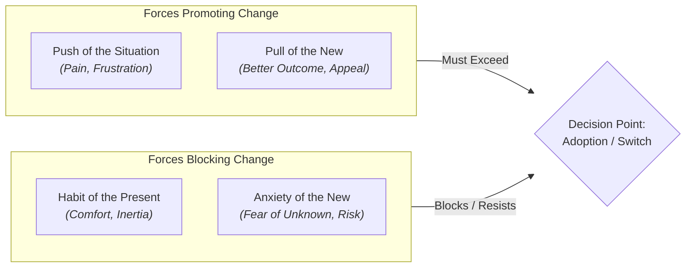

Kent C. Dodds, a well-known educator and developer in the React community, recently released a video titled "The Framework wars are over. Why no one dethroned React." In this video, Kent explores the reasons behind React's continued dominance in the frontend development landscape.

<lite-youtube videoid="mxRjJPoWBE4" title="The Framework wars are over. Why no one dethroned React"></lite-youtube>

He quotes this [tweet from Dax](https://x.com/thdxr/status/2069933148767400094), a software engineer and educator, which highlights the importance of understanding why React has maintained its position as the leading frontend library.

<blockquote class="twitter-tweet">
it&#39;s worth deeply studying why no framework dethroned react  it&#39;s completely misunderstood and it&#39;s why every prediction you see by programmers tends to be wrong  and once you get it, you can apply this understanding to nearly everything you do
&mdash; dax (@thdxr) <a href="https://x.com/thdxr/status/2069933148767400094?ref_src=twsrc%5Etfw">June 24, 2026</a></blockquote> 

This post uses Kent’s video as a starting point for examining why React has remained dominant. I provide historical context, consider several of Kent’s claims, and explain where my own perspective differs from his. This is not a transcript or comprehensive summary, but an independent analysis of the questions raised by the video.

## A Little Bit of History

To understand why React has maintained its dominance, we need to look back at its history, the context in which it was created.

### What Was Out When React Came Out?

A good starting point is to look at the state of web development in 2013, when React was first released. At that time, the landscape was dominated by a mix of heavyweight frameworks, lightweight libraries, and utility tools.

* Heavyweight MVC Frameworks
  * **AngularJS (v1.x)**: Released by Google in 2010, this was the dominant heavyweight framework. It popularized two-way data binding and a directive-based approach to HTML template extension.
  * **Ember.js**: Released in late 2011, Ember was a highly opinionated MVC framework built for ambitious web applications. It relied on strict conventions, a powerful routing system, and two-way data bindings.
  * **Knockout.js**: Released in 2010, Knockout focused heavily on the Model-View-View-Model (MVVM) pattern, utilizing "observables" to handle automated UI tracking and data binding.
* **Lightweight Frameworks & Structure Tools**
  * **Backbone.js**: Released in 2010, Backbone provided minimal structure for web apps via Models, Collections, and Views. It gave developers complete freedom but required them to manually handle DOM rendering and data binding updates.
  * **SproutCore / Cappuccino**: Earlier, desktop-like frameworks that helped pioneer JavaScript-heavy Single Page Applications (SPAs) before the 2010 wave.
* **DOM Manipulation & Utility Libraries**
  * **jQuery**: The undisputed king of the web in 2013. While not a structured architectural framework, it was used in almost every project to normalize cross-browser inconsistencies and handle direct DOM queries.
  * **Mootools / Prototype / YUI / Dojo**: Popular utility libraries from the mid-to-late 2000s that were still present in legacy enterprise codebases during React's debut.

It is also important to note that centralized client-state libraries, as we know them today, were not mainstream in 2013. Libraries such as Redux and MobX came later, and developers often relied on ad-hoc patterns for managing application state that varied from framework to framework.

### Meta (Facebook) & Jordan Walke (2011–2013)

<lite-youtube videoid="8pDqJVdNa44" title="How A Small Team of Developers Created React at Facebook | React.js: The Documentary"></lite-youtube>

React was created by Jordan Walke, a software engineer at Facebook.

The Problem: Facebook's chat application and newsfeed were becoming unmaintainable with traditional imperative JavaScript (DOM manipulation using jQuery or early MVC frameworks). State changes were causing unpredictable cascading UI bugs.

The Solution: Walke created FaxJS in 2011 (which evolved into React). It brought declarative UI and the Virtual DOM to the mainstream, instead of manually updating DOM nodes, developers could simply describe what the UI should look like for a given state, and React handled the DOM updates efficiently under the hood.

### Open Sourcing & "Component-Driven" Paradigm (2013)

When Facebook open-sourced React at JSConf US in May 2013, the initial reception was skeptical. The industry was accustomed to separating HTML, CSS, and JS into distinct files. React introduced JSX (mixing markup inside JavaScript), which many initially dismissed as a step backward.

However, developers quickly realized the benefits of the Component Model:

* **Component-Based Architecture**: Helped popularize self-contained, reusable UI blocks instead of huge, monolithic templates.
* **One-Way Data Flow**: Made application state far easier to reason about, debug, and test compared to two-way data binding (which was popular in AngularJS 1.x at the time).

### The AngularJS Migration Wave (2014–2016)

One factor in React's rise was Google's transition from AngularJS (1.x) to Angular 2:

* Angular 2 was a substantial rewrite that was not backward-compatible with AngularJS, creating migration pressure for some teams.
* Some engineering teams looked for alternatives. React offered a lighter, library-based approach that could be adopted incrementally rather than forcing a total application rewrite.

Straight comparison between React and Angular (either version) is misleading because they are fundamentally different tools.

React is a UI library that focuses on the "V" in MVC, while Angular is a full-fledged framework that prescribes how to structure your entire application. React's flexibility allowed developers to integrate it into existing projects without committing to a full framework migration.

Whether a fair comparison is possible or not, it happened anyway and React's adoption skyrocketed as a result. Many developers who were frustrated with Angular 2's breaking changes and steep learning curve found React to be a more approachable and pragmatic solution, even though it was an incomplete one.

### Massive Enterprise Adoption And Evolution

Major tech leaders adopted React early and publicly validated its performance at scale:

Netflix
: In a [2015 Netflix Tech Blog post](https://netflixtechblog.com/netflix-likes-react-5096750ab9e0), Netflix described adopting React for Netflix.com, citing startup speed, runtime performance, and modularity.
: In [Making Netflix.com Faster](https://netflixtechblog.com/making-netflix-com-faster-f95d15f2e972), Netflix described using server-side rendering to improve the initial loading experience.
: Netflix has also continued investing in [client-server GraphQL APIs](https://netflixtechblog.com/unlocking-dynamic-pages-the-evolution-of-netflixs-client-server-graphql-apis-8b4631a59b39) for dynamic pages. Together, these sources show long-term use of React and GraphQL in Netflix's web ecosystem, without establishing that every Netflix surface uses the same stack.

Airbnb
: Heavily invested in the React ecosystem starting in 2015, creating influential testing and styling libraries such as Enzyme and establishing widely adopted style guides.
: In a [2024 engineering post](https://medium.com/airbnb-engineering/how-airbnb-smoothly-upgrades-react-b1d772a565fd), Airbnb described upgrading all of its web surfaces, including Guest and Host pages and internal tools, from React 16 to React 18.
: Airbnb used a React Upgrade System with server-side rendering, parallel React versions, automated testing, and progressive rollout to complete the migration without rollbacks.
: In a [2018 engineering post](https://medium.com/airbnb-engineering/sunsetting-react-native-1868ba28e30a), Airbnb announced that it was sunsetting React Native because of technical and organizational challenges. The company halted new React Native features and planned to transition most high-traffic screens to native by the end of 2018, with support beginning to ramp down in 2019.

### Ecosystem & Meta-Frameworks

React's decision to remain a UI library rather than a full-featured framework allowed an enormous open-source ecosystem to flourish around it:

* **Vite / Webpack / Babel**: While modern JavaScript tooling often centers on React's JSX ecosystem, the broader landscape standardized around flexible bundlers and native browser workflows that support non-JSX frameworks and buildless development.
* **Next.js (Vercel) & Remix**: Helped evolve React from a primarily client-side UI library into full-stack web frameworks capable of Server-Side Rendering (SSR), Static Site Generation (SSG), and, in supported frameworks, Server Components.
* **Cross-Platform: React Native** extended the same mental model (Learn Once, Write Anywhere) to iOS and Android development.

## Where I Disagree With Kent

I used the transcript of Kent's video to present the points where I disagree with his position. I reproduce his selected quotations verbatim, followed by my own perspective.

### Framework Selection

The first point is about Framework selection and why he says that it doesn't matter.

> So things do change over time and so the question is well okay eventually another framework could develop some sort of critical mass and and now it becomes a lot easier to choose something else. But the reason that that didn't happen is because now it actually doesn't really matter. it like whether my agent decides to use React or Vue or Spelt or Solid or Remix, it actually doesn't make a huge material difference to me because each one of those frameworks is capable of doing what the other frameworks are doing for like most intents and purposes.

I disagree that frameworks don't matter. Frameworks are the foundation of your application and they dictate how you structure your code, how you manage state, and how you handle side effects. While it's true that many frameworks can achieve similar outcomes, the developer experience, performance characteristics, and community support can vary significantly between them. Choosing the right framework can have long-term implications on maintainability, scalability, and developer productivity.

### Understanding the Framework

The following quote, to me, is the most dangerous part of the video, because it downplays the importance of understanding the frameworks we use, which can lead to poor architectural decisions and a lack of deep technical knowledge among developers.

> and this is why I say it's the last framework you need to learn because you don't need to learn any other framework in the future because the agent is going to do that now
>
> some of you are saying wait Kent you got to still read the code you got to understand what it's doing and yes I agree that you need to understand the system in which your uh software is operating in and what your agent is doing. Yeah, you need to understand that system. But understanding when and where to use use state uh that is not what we need to be doing anymore.

Let's start with three assertions about AI:

1. It doesn't guarantee correctness
2. It's non-deterministic
3. It's not accessible by default

If we can't depend on AI to provide correct and deterministic code, then we must understand what the framework does, how it works, and how to use it effectively, even using state. If we don't understand the framework, we risk introducing bugs, performance issues, and security vulnerabilities into our applications.

If the AI-generated code is not accessible, can you add the necessary accessibility modifications? If not, you need to understand how to make your code accessible, which requires knowledge of the framework and its accessibility features.

A good question to ask is: *Would I be able to write this application without an AI agent?* If the answer is no, then we are relying too much on AI and not enough on our own understanding of the framework and the code we are writing

## Why React Has Maintained Its Dominance

IMO, React's dominance can be attributed to a combination of factors:

Early Adoption and Community Support
: React helped popularize component-based architecture and a virtual DOM, which resonated with developers. Its early adoption by major companies like Facebook, Netflix, and Airbnb helped establish a strong community and ecosystem around it.

Flexibility and Ecosystem
: React's decision to remain a library rather than a full-fledged framework allowed developers to choose their own tools for routing, state management, and build processes. This flexibility led to a rich ecosystem of libraries and tools that complemented React, making it easier for developers to build complex applications.

Performance and Optimization
: React's rendering model and component architecture offered a different way to reason about UI updates than direct DOM manipulation. In some workloads, React's reconciliation approach could reduce manual update work, although application performance still depended on how the application was designed and rendered.

Continuous Improvement
: The React team at Meta has consistently improved the library, introducing features like hooks, concurrent rendering, and server components. These improvements have kept React relevant and competitive in the ever-evolving landscape of web development.

Strong Documentation and Learning Resources
: React's documentation is comprehensive and beginner-friendly, making it easier for new developers to learn and adopt the library. Additionally, the abundance of tutorials, courses, and community-driven content has contributed to its widespread adoption.

In my view, one of the most important factors is the support Meta has given to React. Meta has employed many important React contributors and continues to support React development, but contribution volume should not be confused with stewardship. Stewardship is intended to be independent of Meta and falls to the [React Foundation](https://react.foundation/), while the React team handles day-to-day technical work through its working groups and leadership council.

This support has provided stability and confidence for developers and companies to adopt React for their projects but also raises the question of what would happen if Meta's priorities shifted away from React?

### JTBD Or Inertia?

[Jobs To Be Done (JTBD)](https://www.christenseninstitute.org/theory/jobs-to-be-done/) is a lens for understanding the circumstances and forces that drive people and organizations toward or away from decisions. In the four-forces framing, the push of the current situation and the pull of a new option must outweigh the anxiety of switching and the habit of the present for adoption to occur. The equation below is a shorthand for that idea, not a universal measurement rule.

If we apply this tension to React and possible competitors, for example Preact, we can see that the inertia of React is strong.

* Developers are familiar with its API, have built libraries and tools around it, and have invested time in learning its patterns; companies have spent large sums of money on the staff training and the infrastructure.
* The anxiety of switching to a new framework, even if it offers some advantages, can be significant. This inertia makes it difficult for new frameworks to gain traction and dethrone React.

So there is really no motivation to switch to a new framework unless it offers a significant improvement over React in terms of performance, developer experience, or features. Even if such a framework became available, it would still have to overcome the inertia of React's established ecosystem and the anxiety of switching to a new technology with the cost involved.

## Conclusion

We've been here before.

Every few years we get a new version of *this is the best framework or library ever!* and some libraries or frameworks have been the best ever without calling attention to themselves.

React has been the best library for building user interfaces for a long time, and it has maintained its dominance due to a combination of factors, including early adoption, flexibility, performance, continuous improvement, and strong community support.

<figure>
  
  <figcaption>The hype never ends</figcaption>
</figure>

Even if there is a new framework that offers advantages over React, it will be a long road to dethrone it due to the inertia of its established ecosystem and the anxiety of switching to a new technology.

It may happen eventually. The question is whether and when. If it does, it will be interesting to see how the frontend landscape evolves and what new paradigms and patterns emerge.

## Bibliography

* [Netflix Likes React](https://netflixtechblog.com/netflix-likes-react-5096750ab9e0), Netflix Tech Blog, 2015.
* [Making Netflix.com Faster](https://netflixtechblog.com/making-netflix-com-faster-f95d15f2e972), Netflix Tech Blog.
* [Unlocking Dynamic Pages: The Evolution of Netflix's Client-Server GraphQL APIs](https://netflixtechblog.com/unlocking-dynamic-pages-the-evolution-of-netflixs-client-server-graphql-apis-8b4631a59b39), Netflix Tech Blog.
* [How Airbnb smoothly upgrades React](https://medium.com/airbnb-engineering/how-airbnb-smoothly-upgrades-react-b1d772a565fd), Airbnb Engineering, 2024.
* [Sunsetting React Native](https://medium.com/airbnb-engineering/sunsetting-react-native-1868ba28e30a), Airbnb Engineering, 2018.
* [React Foundation](https://react.foundation/).
* [Jobs to Be Done Theory](https://www.christenseninstitute.org/theory/jobs-to-be-done/), Clayton Christensen Institute.
